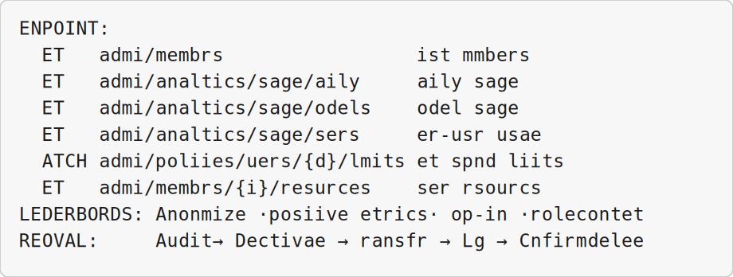

<!-- _class: lead -->

# Cursor Training Program

## AI-Assisted Development with Cursor

Springpeople · 2-day instructor-led course · Modules 1–10

<!--
Good morning, and welcome to the Cursor Training Program — AI-Assisted Development with Cursor. Thank you for being here. Over the next two days we will move from mental models to daily editor workflows, then into automation, Cloud Agents, and the Cursor APIs.

Springpeople · 2-day instructor-led course · Modules 1–10. Before we start, please confirm three things: Cursor is installed, you are signed in, and you have a Git repository you can experiment in — sample repos are fine if you do not want to use production code.

This course is roughly seventy percent hands-on and thirty percent concept and discussion. Questions are welcome during a slide if they are quick; save longer ones for breaks or module transitions.
-->

---


## Course Agenda

| Module | Title | Day | Duration |
|--------|-------|-----|----------|
| **1** | Mental Models for AI-Assisted Development | Day 1 | ~60 min |
| **2** | Cursor Editor Essentials | Day 1 | ~90 min |
| **3** | Agent Modes and Tools | Day 1 | ~60 min |
| **4** | Customizing Cursor for Your Team | Day 1 | ~60 min |
| **5** | Cursor CLI and Local Automation | Day 1 | ~60 min |
| **6** | Cloud Agents in the UI | Day 2 | ~90 min |
| **7** | Cursor API Foundations | Day 2 | ~60 min |
| **8** | Cloud Agents API and Webhooks | Day 2 | ~60 min |
| **9** | Admin and Analytics APIs | Day 2 | ~75 min |
| **10** | AI Code Tracking and Reporting | Day 2 | ~20 min |

**Total:** ~11.5 hours across 2 days (hands-on labs + demonstrations)

<!--
Here is the full two-day arc for our time together.

Day one builds editor fluency. Module one gives us shared mental models for how AI assistants actually work. Modules two through four are hands-on in the Cursor editor — understanding codebases, making safe changes, working with agent modes, and customizing rules and skills. Module five introduces the CLI for terminal and scripting workflows.

Day two shifts to automation and integration: Cloud Agents in the UI, API authentication and reliability, programmatic Cloud Agent launches and webhooks, admin and analytics reporting, and AI code tracking.

The total scheduled time is about eleven and a half hours across both days, plus breaks. If you have never opened Cursor before, let me know now so I can allow extra setup time in Module two.
-->

---


## Day 1 — Foundations & Editor Workflows

| Module | Title | Focus | Duration |
|--------|-------|-------|----------|
| **1** | Mental Models for AI-Assisted Development | Foundations | ~60 min |
| **2** | Cursor Editor Essentials | Hands-On | ~90 min |
| **3** | Agent Modes and Tools | Hands-On + Concept | ~60 min |
| **4** | Customizing Cursor for Your Team | Hands-On + Walkthrough | ~60 min |
| **5** | Cursor CLI and Local Automation | Hands-On | ~60 min |

Concept blocks, hands-on exercises, team customization, and CLI automation.

<!--
Day one is about editor confidence — mental models first, then hands-on Cursor through Module 5. We will not call external APIs until tomorrow.

Today's modules in one breath: Module 1 (Foundations), Module 2 (Hands-On), Module 3 (Hands-On + Concept), Module 4 (Hands-On + Walkthrough). Details are on the slide.
-->

---


## Day 2 — Cloud Agents, APIs & Analytics

| Module | Title | Focus | Duration |
|--------|-------|-------|----------|
| **6** | Cloud Agents in the UI | Hands-On + Demonstration | ~90 min |
| **7** | Cursor API Foundations | Concept + Hands-On | ~60 min |
| **8** | Cloud Agents API and Webhooks | Hands-On | ~60 min |
| **9** | Admin and Analytics APIs | Hands-On + Demonstrations | ~75 min |
| **10** | AI Code Tracking and Reporting | Hands-On + Take-Home | ~20 min |

Cloud agents, programmatic APIs, admin analytics, and AI code tracking.

<!--
Day two assumes yesterday's habits stuck — API keys ready, PowerShell working, and realistic expectations about agent autonomy.

Cloud Agents run where your laptop is closed — long tasks, CI handoffs, parallel work.

Trust boundary: they need repo access and clear task descriptions — same review discipline when the PR returns.

Today's modules in one breath: Module 6 (Hands-On + Demonstration), Module 7 (Concept + Hands-On), Module 8 (Hands-On), Module 9 (Hands-On + Demonstrations). Details are on the slide.
-->

---


<!-- _header: 'Module 1 — Mental Models for AI-Assisted Development' -->

<!-- _class: lead -->

# Mental Models for AI-Assisted Development

## Module 1 · Day 1 (Foundations)

Cursor Training Program · Concept block · ~60 min

<!--
Module 1 is deliberately conceptual — no Cursor setup required. We are building shared vocabulary so Module 2 hands-on work makes sense instead of feeling like magic.

If anyone feels impatient for 'real Cursor tips,' tell them the probabilistic mindset prevents the worst production mistakes later.

Timing on slide: Cursor Training Program · Concept block · ~60 min
-->

---


## Module Overview

| Aspect            | Details                                                                                                           |
| ----------------- | ----------------------------------------------------------------------------------------------------------------- |
| **Duration**      | ~60 minutes                                                                                                       |
| **Format**        | Concept block (foundational theory)                                                                               |
| **Prerequisites** | None – this is the starting point                                                                                 |
| **Module Goal**   | Build accurate mental models of how AI coding assistants work, their limitations, and how to use them effectively |

<!--
The module goal in plain language: Build accurate mental models of how AI coding assistants work, their limitations, and how to use them effectively

Glance at duration and prerequisites on screen — raise a hand if anything blocks you.
-->

---


## Learning Objectives

By the end of this module, participants will be able to:

- Explain why AI outputs are probabilistic, not deterministic
- Identify and mitigate hallucinations in coding contexts
- Understand token-based pricing and cost optimization
- Master context as the single most valuable AI skill
- Distinguish between tool calling, MCP, and autonomous agents
- Define the developer's evolving role with AI agents

<!--
These outcomes define success for Module 1 — not a reading list, but skills you will practice.

Highlight three that matter for your role: Explain why AI outputs are probabilistic, not deterministic; Identify and mitigate hallucinations in coding contexts; Understand token-based pricing and cost optimization; plus more on screen.

Next: learning objectives.

Ask who has seen the opposite problem in production — one story beats five bullets.
-->

---


<!-- _class: lead -->

# Lesson 1.1

## How AI Models Work

_Concept · 12 minutes_

<!--
Lesson 1.1: How AI Models Work. Concept · 12 minutes Participation: listen and take notes — you do not need to type along yet.

This lesson installs the engine-under-the-hood mental model — no Cursor shortcuts yet. Participants should leave understanding why the same prompt can produce different code.

Connect forward: Module 2 failures often trace back to treating the Agent like a deterministic compiler.
-->

---


## Why Outputs Are Probabilistic

> Unlike traditional software that gives the same output for the same input, AI models generate responses based on **probability distributions**.

At its simplest, an LLM is a **next-token prediction engine**.

Given a sequence of tokens, it predicts what comes next — then samples, appends, repeats.

<!--
Start with the line on screen: "Unlike traditional software that gives the same output for the same input, AI models generate responses based on probability distributions."

Expand in your own words — do not read the bullet text verbatim: At its simplest, an LLM is a next-token prediction engine. Given a sequence of tokens, it predicts what comes next — then samples, appends, repeats.

Next: Why Outputs Are Probabilistic.

Open with a concrete contrast: run the same unit test twice — same result every time. Run the same prompt twice in ChatGPT or Cursor — you may get different wording, structure, or even logic.

The mental model to install today: LLMs do not execute a stored program. They roll weighted dice for the next token, millions of times per answer. That is why we never ship the first output without review.

Ask the room: where has non-determinism already burned you — flaky tests, or flaky AI summaries?

Pause after the quote — let it land before you add examples.
-->

---


## Next-Token Prediction


<!--
This slide shows Next-token prediction probabilities.

The model reads the text so far, assigns a probability to each possible next token, samples one, appends it, and repeats. That loop is how an entire answer is generated.

Next: Next-Token Prediction.

Use the diagram to demystify the magic. Each step is not 'understanding' in the human sense — it is picking the most likely next piece of text given everything so far.

Analogy: autocomplete on your phone, extended for pages of code. The model does not re-read your intent; it extends the pattern.

If someone asks 'but it feels intelligent' — agree, then redirect: pattern completion at scale can look like reasoning, but the mechanism is still probabilistic completion.

On screen: Next-token prediction probabilities

Trace the diagram once with your finger or cursor — motion helps retention.
-->

---


## Traditional Code vs. AI Model

| Traditional Code                         | AI Model                                   |
| ---------------------------------------- | ------------------------------------------ |
| Deterministic (same input → same output) | Probabilistic (different outputs possible) |
| You control the logic                    | You influence, but don't control           |
| Errors are bugs                          | Errors are features of probability         |
| Predictable behavior                     | Needs management via parameters            |

<!--
Next: Traditional Code vs. AI Model.

Do not read the table row by row. Frame it as a mindset shift: yesterday you debugged logic; with AI you debug inputs — prompt, context, model, and parameters.

The row about errors being 'features of probability' lands hard — give an example: a confident wrong import is not a bug in your repo; it is the model filling a gap.

Pick one row that matches your audience's stack and go deep; skim the rest.

Slide reference (skim, do not read every cell): Deterministic (same input → same output): Probabilistic (different outputs possible). You control the logic: You influence, but don't control. Errors are bugs: Errors are features of probability. Predictable behavior: Needs management via parameters.
-->

---


## Traditional vs. AI — Implication

**Implication:** Never trust a single run as ground truth.

<!--
Next: Traditional vs. AI — Implication.

Never trust a single run as ground truth.
-->

---


## What Determines AI Output?


<!--
This slide shows Factors that shape AI output.

Your prompt, system instructions, attached files, model choice, and parameters such as temperature all feed into the same response. When quality shifts, one of these inputs usually changed.

Next: What Determines AI Output?.

When a participant says 'the model got worse today,' walk this diagram mentally: did the model change, or did the context shrink, the prompt get vaguer, or the temperature rise?

Practical tip: before blaming the model, diff your prompt and attached files against yesterday's session.

On screen: Factors that shape AI output

Trace the diagram once with your finger or cursor — motion helps retention.
-->

---


## Key Parameters You Control

| Parameter       | What It Does                                 | Best For                              |
| --------------- | -------------------------------------------- | ------------------------------------- |
| **Temperature** | Randomness (0 = deterministic, 1 = creative) | Bug fixes (low), brainstorming (high) |
| **Top-p**       | Nucleus sampling – limits token pool         | Balanced responses                    |
| **Max Tokens**  | Limits response length                       | Controlling cost                      |

<!--
Next: Key Parameters You Control.

Developers rarely tune these directly in Cursor day to day, but admins and API users do. Knowing they exist explains why two teammates get different styles from the 'same' prompt.

Rule of thumb for coding: lower temperature when fixing bugs; slightly higher when exploring design alternatives — then turn it back down before merging.

Pick one row that matches your audience's stack and go deep; skim the rest.

Slide reference (skim, do not read every cell): Temperature: Randomness (0 = deterministic, 1 = creative). Use this when Bug fixes (low), brainstorming (high). Top-p: Nucleus sampling – limits token pool. Use this when Balanced responses. Max Tokens: Limits response length. Use this when Controlling cost.
-->

---


## Key Parameters — Example Values

```python
temperature: 0.2   # focused
top_p: 0.9         # balanced
max_tokens: 4000   # cap length
```

<!--
Key Parameters — Example Values

These are sensible defaults for focused coding work: a low temperature around 0.2, top-p near 0.9 for balance, and a max token cap to control cost.

Next: Key Parameters — Example Values.
-->

---


## Temperature Impact

Same prompt: _"Write a function to reverse a string"_

```python
# Temperature 0.1 — very deterministic
def reverse_string(s):
    return s[::-1]

# Temperature 0.7 — balanced (adds edge cases)
def reverse_string(s):
    if not s: return s
    return s[::-1]

# Temperature 1.2 — creative, potentially unstable
def flip_the_text(text): ...
```

<!--
Same prompt: _"Write a function to reverse a string"_

These are sensible defaults for focused coding work: a low temperature around 0.2, top-p near 0.9 for balance, and a max token cap to control cost.

Next: Temperature Impact.

Run this verbally if you have time: same ask, three temperatures. Point out that high temperature did not get 'more creative' — it got less predictable, which is not always desirable in production code.
-->

---


## The Training Gap

Models are frozen at their training cutoff date. They don't know:

- Code written after their training date
- Your company's internal APIs
- Your specific architecture decisions
- Recent library updates (unless in context)

**Implication:** You must provide this information in the prompt or context.

<!--
There are 4 items on this slide. I'll emphasize the first two, then you can scan the rest.

First: Code written after their training date.

Second: Your company's internal APIs — this one usually matters most in practice.

Also on screen: Your specific architecture decisions, Recent library updates (unless in context).

Next: The Training Gap.

This slide prevents the most expensive misconception: 'the model should know our internal API.' It will not unless you put it in context — paste docs, open files, or add rules.

Story beat: a team once debugged for an hour because the model used a deprecated SDK — the fix was attaching the current internal README, not switching models.

Ask who has seen the opposite problem in production — one story beats five bullets.

Models are frozen at their training cutoff date. They don't know: - Code written after their training date
-->

---


<!-- _class: lead -->

# Lesson 1.2

## Hallucinations

_Concept · 10 minutes_

<!--
Lesson 1.2: Hallucinations. Concept · 10 minutes Participation: listen and take notes — you do not need to type along yet.
-->

---


## What Are Hallucinations?

> Confident-sounding outputs that are **factually wrong**, made up, or don't exist.

Most dangerous form: the model sounds **completely confident** while being **completely wrong**.

<!--
Start with the line on screen: "Confident-sounding outputs that are factually wrong, made up, or don't exist."

Expand in your own words — do not read the bullet text verbatim: Most dangerous form: the model sounds completely confident while being completely wrong.

Next: What Are Hallucinations?.

Emphasize confidence: the model's tone is not calibrated to truth. A wrong answer can sound like a senior engineer.

In code review, treat AI output like a junior's first PR — polite, thorough review required.

Pause after the quote — let it land before you add examples.
-->

---


## Hallucinations in Code

| Type                   | Example                        | How to Spot               |
| ---------------------- | ------------------------------ | ------------------------- |
| **Fake APIs**          | `import nonexistent_library`   | Check docs; import fails  |
| **Wrong parameters**   | Incorrect function signature   | Type checking             |
| **Invented methods**   | `list.reverse_in_place()`      | Know the standard library |
| **Confident nonsense** | "This is the standard way to…" | Cross-reference           |
| **Outdated syntax**    | Old Python 2 style             | Know version differences  |

<!--
Next: Hallucinations in Code.

Walk one row deeply — fake APIs are the most common in this room. Mention that Python's import error is your friend; TypeScript often catches invented methods faster than runtime.

Encourage a team norm: if the Agent cites a library method, one person verifies in official docs before merge.

Pick one row that matches your audience's stack and go deep; skim the rest.

Slide reference (skim, do not read every cell): Fake APIs: import nonexistent_library. Use this when Check docs; import fails. Wrong parameters: Incorrect function signature. Use this when Type checking. Invented methods: list.reverse_in_place(). Use this when Know the standard library. Confident nonsense: "This is the standar
-->

---


## Why Models Hallucinate


<!--
This slide shows Root causes of hallucination.

Hallucinations come from gaps in training data, missing context, overconfidence, and pressure to answer even when the model should say it does not know.

Next: Why Models Hallucinate.

Root causes of hallucination

Trace the diagram once with your finger or cursor — motion helps retention.
-->

---


## Example: Confident Wrong

```python
User: "How do I use requests for async calls?"

# Hallucinated (confident, wrong)
import requests.async as async_requests
response = await async_requests.get('https://api.example.com')

# Reality: requests does NOT have async support.
# Correct answer: Use httpx or aiohttp
```

<!--
Example: Confident Wrong

The top snippet looks plausible but invents an API that does not exist. The correct approach is to use httpx or aiohttp for async HTTP in Python.

Next: Example: Confident Wrong.
-->

---


## Hallucination Mitigation Strategies

| Strategy                 | How It Works                | Example                              |
| ------------------------ | --------------------------- | ------------------------------------ |
| **Grounding**            | Provide source material     | Paste library docs into context      |
| **Verification**         | Ask for citations           | "Which line of the docs shows this?" |
| **Constrained decoding** | Limit possible outputs      | JSON mode, regex patterns            |
| **Self-consistency**     | Ask multiple times, compare | Run same prompt 3×, take majority    |
| **Low temperature**      | Reduce randomness           | `temperature: 0.1`                   |
| **Tool use**             | Let model search/lookup     | Enable web search for docs           |

<!--
Next: Hallucination Mitigation Strategies.

Grounding and verification are the habits to take home. Rules and @mentions are how Cursor makes grounding automatic.

Ask: which strategy could your team adopt Monday — paste docs, require citations, or JSON-only outputs?

Pick one row that matches your audience's stack and go deep; skim the rest.

Slide reference (skim, do not read every cell): Grounding: Provide source material. Use this when Paste library docs into context. Verification: Ask for citations. Use this when "Which line of the docs shows this?". Constrained decoding: Limit possible outputs. Use this when JSON mode, regex patterns. Self-consistency: Ask mul
-->

---


## Hallucination Detection Checklist

Before accepting AI-generated code, verify:

- Do the imported libraries exist?
- Are function signatures correct?
- Does the syntax match my language version?
- Are there obvious logic errors?
- Would this code actually run?
- Does the model cite sources you can verify?

<!--
There are 6 items on this slide. I'll emphasize the first two, then you can scan the rest.

First: Do the imported libraries exist?.

Second: Are function signatures correct? — this one usually matters most in practice.

Also on screen: Does the syntax match my language version?, Are there obvious logic errors?….

Next: Hallucination Detection Checklist.

Ask who has seen the opposite problem in production — one story beats five bullets.

Before accepting AI-generated code, verify: - Do the imported libraries exist?
-->

---


## The Developer's Mindset

> _"Trust, but verify – especially when the AI sounds most confident."_

- Hallucinations decrease with better prompts and context
- They never fully disappear
- You are the human-in-the-loop responsible for verification
- Experience helps you "smell" potential hallucinations

<!--
Start with the line on screen: "_"Trust, but verify – especially when the AI sounds most confident."_"

Expand in your own words — do not read the bullet text verbatim: - Hallucinations decrease with better prompts and context - They never fully disappear

Next: The Developer's Mindset.

Pause after the quote — let it land before you add examples.
-->

---


<!-- _class: lead -->

# Lesson 1.3

## Tokens and Pricing

_Concept · 10 minutes_

<!--
Lesson 1.3: Tokens and Pricing. Concept · 10 minutes Participation: listen and take notes — you do not need to type along yet.

Tokens are how vendors meter and limit context — not characters, not lines. Rough guide: 100 tokens ≈ 75 words of English.

Why instructors cover this: without token awareness, people attach entire repos and wonder why answers degrade or bills spike.
-->

---


## What Is a Token?

| Language | Example                     | Token Count                  |
| -------- | --------------------------- | ---------------------------- |
| English  | "Hello world"               | 2 tokens (~0.75 words/token) |
| English  | "Congratulations"           | 1 token                      |
| Code     | `function calculateTotal()` | ~5 tokens (~2–4 chars/token) |
| Chinese  | "你好世界"                  | 4–8 tokens                   |

<!--
Next: What Is a Token?.

Tokens are how vendors meter and limit context — not characters, not lines. Rough guide: 100 tokens ≈ 75 words of English.

Why instructors cover this: without token awareness, people attach entire repos and wonder why answers degrade or bills spike.

Pick one row that matches your audience's stack and go deep; skim the rest.

Slide reference (skim, do not read every cell): Language: Example. Use this when Token Count. English: "Hello world". Use this when 2 tokens (~0.75 words/token). English: "Congratulations". Use this when 1 token. Code: function calculateTotal(). Use this when ~5 tokens (~2–4 chars/token). Chinese: "你好世界". Use this when 4–8 tok
-->

---


## Why Tokens Matter

A token is the atomic unit of processing for LLMs — not a word, not a character.

You pay per token · Context windows are measured in tokens · Token limits determine how much code the AI can "see"

<!--
Next: Why Tokens Matter.

A token is the atomic unit of processing for LLMs — not a word, not a character. You pay per token · Context windows are measured in tokens · Token limits determine how much code… (see slide)
-->

---


## Input vs. Output Pricing

**Input tokens** (prompt, code context, retrieved docs) cost **less** than **output tokens** (generated code and explanations).

Output is often **5–8× more expensive** — generation is more compute-intensive than reading.

<!--
Next: Input vs. Output Pricing.

Input tokens (prompt, code context, retrieved docs) cost less than output tokens (generated code and explanations). Output is often 5–8× more expensive — generation is more compute-intensive than reading.
-->

---


## Model Pricing Examples

| Model             | Input (per 1M) | Output (per 1M) | Output/Input |
| ----------------- | -------------: | --------------: | -----------: |
| GPT-5 Mini        |          $0.25 |           $2.00 |           8× |
| Claude 4.5 Haiku  |          $1.00 |           $5.00 |           5× |
| GPT-5.3 Codex     |          $1.75 |          $14.00 |           8× |
| Gemini 3.1 Pro    |          $2.00 |          $12.00 |           6× |
| Claude 4.6 Sonnet |          $3.00 |          $15.00 |           5× |
| Claude 4.7 Opus   |          $5.00 |          $25.00 |           5× |
| GPT-5.5           |          $5.00 |          $30.00 |           6× |

<!--
Next: Model Pricing Examples.

Pick one row that matches your audience's stack and go deep; skim the rest.

Slide reference (skim, do not read every cell): Model: Input (per 1M). Use this when Output (per 1M). GPT-5 Mini: $0.25. Use this when $2.00. Claude 4.5 Haiku: $1.00. Use this when $5.00. GPT-5.3 Codex: $1.75. Use this when $14.00. Gemini 3.1 Pro: $2.00. Use this when $12.00. Claude 4.6 Sonnet: $3.00. Use this when $15.00. Cla
-->

---


## What 1 Million Tokens Looks Like

| Content Type         | Approximate Amount            |
| -------------------- | ----------------------------- |
| Plain English text   | ~750,000 words (~1,500 pages) |
| Python code          | ~250,000–500,000 lines        |
| Average conversation | 5–10 sessions                 |
| Full codebase        | Small to medium project       |

<!--
Next: What 1 Million Tokens Looks Like.

Pick one row that matches your audience's stack and go deep; skim the rest.

Slide reference (skim, do not read every cell): Plain English text: ~750,000 words (~1,500 pages). Python code: ~250,000–500,000 lines. Average conversation: 5–10 sessions. Full codebase: Small to medium project.
-->

---


## Cost Calculation Example

```python
prompt_tokens = 5000    # instructions + context
output_tokens = 2000    # AI response

model = "claude-4.6-sonnet"
input_price  = 3.00     # per 1M tokens
output_price = 15.00    # per 1M tokens

input_cost  = (5000 / 1_000_000) * 3.00
output_cost = (2000 / 1_000_000) * 15.00
total_cost  = input_cost + output_cost   # ~$0.045 (4.5 cents)
```

<!--
Cost Calculation Example

Focus on the first few lines — for example: prompt_tokens = 5000    # instructions + context.

Next: Cost Calculation Example.

Connect to business reality: a daily standup prompt is cheap; an agent loop over 200 files is not.

Teach bounded tasks: narrow @mentions, clear stop conditions, and checkpoints before long agent runs.
-->

---


## Cost Optimization Strategies

| Strategy               | How It Works                | Impact             |
| ---------------------- | --------------------------- | ------------------ |
| **Use cheaper models** | Mini/Haiku for simple tasks | 5–20× reduction    |
| **Reduce context**     | Only send relevant code     | 2–5× reduction     |
| **Cache responses**    | Reuse common answers        | Variable           |
| **Batch operations**   | Combine multiple tasks      | 30–50% reduction   |
| **Monitor usage**      | Track spending per user     | Prevents surprises |
| **Set limits**         | Monthly spending caps       | Budget protection  |

<!--
Next: Cost Optimization Strategies.

Connect to business reality: a daily standup prompt is cheap; an agent loop over 200 files is not.

Teach bounded tasks: narrow @mentions, clear stop conditions, and checkpoints before long agent runs.

Pick one row that matches your audience's stack and go deep; skim the rest.

Slide reference (skim, do not read every cell): Use cheaper models: Mini/Haiku for simple tasks. Use this when 5–20× reduction. Reduce context: Only send relevant code. Use this when 2–5× reduction. Cache responses: Reuse common answers. Use this when Variable. Batch operations: Combine multiple tasks. Use this when 30–50% red
-->

---


## Real-World Cost Bounds

| Usage Level | Monthly Cost | What You Can Do                          |
| ----------- | ------------ | ---------------------------------------- |
| Light       | $10–20       | Occasional questions, small fixes        |
| Medium      | $50–100      | Daily coding, regular agent use          |
| Heavy       | $200–500     | Full-time AI assistance, multiple agents |
| Enterprise  | $1000+       | Team usage, automation, CI/CD            |

<!--
Next: Real-World Cost Bounds.

Pick one row that matches your audience's stack and go deep; skim the rest.

Slide reference (skim, do not read every cell): Usage Level: Monthly Cost. Use this when What You Can Do. Light: $10–20. Use this when Occasional questions, small fixes. Medium: $50–100. Use this when Daily coding, regular agent use. Heavy: $200–500. Use this when Full-time AI assistance, multiple agents. Enterprise: $1000+. U
-->

---


## The Cache Effect

Models can cache frequently used content:

- **Cache Write:** Cost to initially store
- **Cache Read:** **Much cheaper** than fresh input (80–95% savings)

```python
# First request  → pays full input price
# Second request → same context → pays cache read price
```

Context discipline = cost discipline.

<!--
Models can cache frequently used content: - Cache Write: Cost to initially store - Cache Read: Much cheaper than fresh input (80–95% savings)

The important lines are: .

Next: The Cache Effect.
-->

---


<!-- _class: lead -->

# Lesson 1.4

## Context

_Concept · 12 minutes · The single most valuable AI skill_

<!--
Lesson 1.4: Context. Concept · 12 minutes · The single most valuable AI skill Participation: listen and take notes — you do not need to type along yet.
-->

---


## What Is Context?

Context = all the information the model has access to when generating a response.


<!--
This slide shows What goes into context.

Context = all the information the model has access to when generating a response. 

Next: What Is Context?.

What goes into context

Trace the diagram once with your finger or cursor — motion helps retention.
-->

---


## The Context Window Limit

| Model                            | Context Window | Pages of Text | Lines of Code |
| -------------------------------- | -------------: | ------------: | ------------: |
| Claude 4 (Haiku / Sonnet / Opus) |           200k |          ~150 |       ~50,000 |
| GPT-5 Mini / GPT-5.3 Codex       |           272k |          ~200 |       ~70,000 |

<!--
Next: The Context Window Limit.

Pick one row that matches your audience's stack and go deep; skim the rest.

Slide reference (skim, do not read every cell): Model: Context Window. Use this when Pages of Text. Claude 4 (Haiku / Sonnet / Opus): 200k. Use this when ~150. GPT-5 Mini / GPT-5.3 Codex: 272k. Use this when ~200.
-->

---


## Context Window — What Happens When Full

**When you exceed context:** Oldest content gets truncated · Critical information may be dropped

**Context engineering** = knowing what to put in, what to leave out, and how to structure it.

<!--
Next: Context Window — What Happens When Full.

When you exceed context: Oldest content gets truncated · Critical information may be dropped Context engineering = knowing what to put in, what to leave out, and how to structure it.
-->

---


## Context Checklist

Before every AI interaction, ask:

- What problem am I trying to solve?
- What files/code does the model need to see?
- What would a human need to know to help me?
- What information can I safely leave out?
- Is my context under the token limit?
- Have I included relevant error messages?
- Have I specified constraints (libraries, version, style)?

<!--
There are 7 items on this slide. I'll emphasize the first two, then you can scan the rest.

First: What problem am I trying to solve?.

Second: What files/code does the model need to see? — this one usually matters most in practice.

Also on screen: What would a human need to know to help me?, What information can I safely leave out?….

Next: Context Checklist.

Ask who has seen the opposite problem in production — one story beats five bullets.

Before every AI interaction, ask: - What problem am I trying to solve?
-->

---


## Good vs. Bad Context — Bad Example

**BAD (vague):**

```
"Fix this bug: my code doesn't work"
```

<!--
BAD (vague):

The important lines are: "Fix this bug: my code doesn't work".

Next: Good vs. Bad Context — Bad Example.
-->

---


## Good vs. Bad Context — Good Example

**GOOD (specific):**

```
Python function sorts dicts by key but raises KeyError.
Code: def sort_by_key(data, key): ...
Input: [{'name': 'Alice'}, {'age': 30}]
Using Python 3.11. Expected: skip dicts without the key.
```

<!--
GOOD (specific):

The important lines are: Python function sorts dicts by key but raises KeyError.; Code: def sort_by_key(data, key): ...; Input: [{'name': 'Alice'}, {'age': 30}].

Next: Good vs. Bad Context — Good Example.
-->

---


## Context Prioritization Pyramid


<!--
This slide shows Context prioritization pyramid.

Not all context is equal. Recent messages, open files, rules, and repository structure compete for the same token budget — put the most important material where the model will actually use it.

Next: Context Prioritization Pyramid.

Use this when teaching @mentions in Module 2: pointing at three files beats pasting ten files 'just in case.'

The pyramid is a prioritization exercise — what must the model see versus what is nice to have?

On screen: Context prioritization pyramid

Trace the diagram once with your finger or cursor — motion helps retention.
-->

---


## Context Window Management

| Strategy                | How It Works                         | When to Use          |
| ----------------------- | ------------------------------------ | -------------------- |
| **Summarization**       | Compress earlier conversation        | Long sessions        |
| **Selective inclusion** | Only relevant files                  | Large codebases      |
| **Chunking**            | Split across multiple calls          | Exceeding limit      |
| **Hierarchical**        | Summaries + details on demand        | Complex projects     |
| **Vector retrieval**    | Semantic search for relevant context | Very large codebases |

<!--
Next: Context Window Management.

Pick one row that matches your audience's stack and go deep; skim the rest.

Slide reference (skim, do not read every cell): Summarization: Compress earlier conversation. Use this when Long sessions. Selective inclusion: Only relevant files. Use this when Large codebases. Chunking: Split across multiple calls. Use this when Exceeding limit. Hierarchical: Summaries + details on demand. Use this when Com
-->

---


## The "Lost in the Middle" Problem

Models pay **most attention to the beginning and end** of context, and **less to the middle**.


**Implication:** Put critical information at the beginning OR end, not the middle.

<!--
This slide shows Lost in the middle attention chart.

Models pay most attention to the beginning and end of context, and less to the middle.  Implication: Put critical information at the beginning OR end, not the middle.

Next: The "Lost in the Middle" Problem.

Research finding: models attend strongly to the start and end of context, weaker in the middle. Put critical constraints at the top of the prompt and repeat them after long pasted logs.

On screen: Lost in the middle attention chart

Trace the diagram once with your finger or cursor — motion helps retention.
-->

---


<!-- _class: lead -->

# Lesson 1.5

## Tool Calling and MCP

_Concept · 8 minutes_

<!--
Lesson 1.5: Tool Calling and MCP. Concept · 8 minutes Participation: listen and take notes — you do not need to type along yet.

Tool calling is how the model stops guessing and starts acting — read file, run terminal, fetch URL.

Contrast with plain chat: chat only produces text; tools close the loop with real environment feedback.

MCP is plumbing: one standard way to plug databases, browsers, and internal services into Cursor without custom hacks per vendor.

You will see MCP again in team customization — rules tell the model how to behave; MCP gives it new hands.
-->

---


## What Is Tool Calling?

Tool calling (function calling) lets the AI request execution of external functions.

The AI **doesn't execute code** — it outputs a structured request that **your system** executes.


<!--
This slide shows Tool calling flow.

The agent proposes an action, Cursor runs the tool, the result returns to the model, and the loop continues until the task is done or you stop it.

Next: What Is Tool Calling?.

Tool calling is how the model stops guessing and starts acting — read file, run terminal, fetch URL.

Contrast with plain chat: chat only produces text; tools close the loop with real environment feedback.

On screen: Tool calling flow

Trace the diagram once with your finger or cursor — motion helps retention.
-->

---


## Common Tool Types in Development

| Tool             | Purpose            | Example                          |
| ---------------- | ------------------ | -------------------------------- |
| **read_file**    | Read code files    | "Show me the auth module"        |
| **edit_file**    | Modify code        | "Add error handling to line 42"  |
| **search_code**  | Find patterns      | "Find all uses of this function" |
| **run_terminal** | Execute commands   | "Run the tests"                  |
| **web_search**   | Find documentation | "Look up pandas DataFrame API"   |
| **browser**      | Browse web pages   | "Open the PR and review it"      |
| **git**          | Version control    | "Create a branch and commit"     |

<!--
Next: Common Tool Types in Development.

Pick one row that matches your audience's stack and go deep; skim the rest.

Slide reference (skim, do not read every cell): Tool: Purpose. Use this when Example. read_file: Read code files. Use this when "Show me the auth module". edit_file: Modify code. Use this when "Add error handling to line 42". search_code: Find patterns. Use this when "Find all uses of this function". run_terminal: Execute comm
-->

---


## MCP (Model Context Protocol)

> _"USB-C for AI — one protocol that works across different tools."_

**Without MCP:** Each tool needs custom integration

**With MCP:** Tools advertise their capabilities; AI discovers them dynamically


<!--
This slide shows MCP architecture.

MCP connects Cursor to external systems through a standard protocol so tools stay outside the model but still appear in the agent loop.

Next: MCP (Model Context Protocol).

MCP is plumbing: one standard way to plug databases, browsers, and internal services into Cursor without custom hacks per vendor.

You will see MCP again in team customization — rules tell the model how to behave; MCP gives it new hands.

On screen: MCP architecture

Trace the diagram once with your finger or cursor — motion helps retention.
-->

---


## Why MCP Matters

| Benefit              | Explanation                                |
| -------------------- | ------------------------------------------ |
| **Interoperability** | Same tools work across different AI models |
| **Discoverability**  | AI can learn what tools are available      |
| **Standardization**  | One protocol, not dozens of custom APIs    |
| **Extensibility**    | Add new tools without changing AI logic    |

<!--
Next: Why MCP Matters.

MCP is plumbing: one standard way to plug databases, browsers, and internal services into Cursor without custom hacks per vendor.

You will see MCP again in team customization — rules tell the model how to behave; MCP gives it new hands.

Pick one row that matches your audience's stack and go deep; skim the rest.

Slide reference (skim, do not read every cell): Interoperability: Same tools work across different AI models. Discoverability: AI can learn what tools are available. Standardization: One protocol, not dozens of custom APIs. Extensibility: Add new tools without changing AI logic.
-->

---


## Tool Calling Best Practices

1. **Define clear tool schemas** — name, description, parameters
2. **Validate tool calls** before execution — allowlist + parameter checks
3. **Set timeouts** — e.g., 30 seconds max per tool
4. **Log all tool calls** — audit trail for debugging
5. **Require human approval** for destructive actions — never auto-run writes/deletes

<!--
Next: Tool Calling Best Practices.

Tool calling is how the model stops guessing and starts acting — read file, run terminal, fetch URL.

Contrast with plain chat: chat only produces text; tools close the loop with real environment feedback.

On screen: 1. Define clear tool schemas — name, description, parameters 2. Validate tool calls before execution — allowlist + parameter checks 3. Set timeouts — e.g., 30 seconds max per tool 4. Log all tool calls… (see slide)
-->

---


<!-- _class: lead -->

# Lesson 1.6

## Agents

_Concept · 8 minutes_

<!--
Lesson 1.6: Agents. Concept · 8 minutes Participation: listen and take notes — you do not need to type along yet.
-->

---


## Agent vs. Chatbot

| Aspect          | Chatbot                              | Agent                             |
| --------------- | ------------------------------------ | --------------------------------- |
| **Interaction** | Single turn or simple back-and-forth | Multi-step, goal-oriented         |
| **Control**     | User drives each step                | Agent plans and executes          |
| **Memory**      | Limited to conversation              | Can maintain state across steps   |
| **Actions**     | None (text only)                     | Can call tools, modify files      |
| **Autonomy**    | None                                 | Goal-directed autonomy            |
| **Example**     | "Explain this code"                  | "Fix all bugs in this repository" |

<!--
Next: Agent vs. Chatbot.

Chatbots answer questions; agents pursue outcomes across multiple steps. That difference drives cost, risk, and review burden.

Ask the room where they are today — mostly chat, or already letting the agent edit and run commands?

Pick one row that matches your audience's stack and go deep; skim the rest.

Slide reference (skim, do not read every cell): Interaction: Single turn or simple back-and-forth. Use this when Multi-step, goal-oriented. Control: User drives each step. Use this when Agent plans and executes. Memory: Limited to conversation. Use this when Can maintain state across steps. Actions: None (text only). Use this 
-->

---


## The Agent Loop

<!--
Next: The Agent Loop.
-->

---


## The Agent Loop — Diagram


<!--
This slide shows Agent loop diagram.

The agent proposes an action, Cursor runs the tool, the result returns to the model, and the loop continues until the task is done or you stop it.

Next: The Agent Loop — Diagram.

Narrate one full cycle slowly: user goal → model plans → tool runs → output returns → model continues.

Safety hook: each cycle is a chance to stop — checkpoints and diff review exist because loops can run far.

On screen: Agent loop diagram

Trace the diagram once with your finger or cursor — motion helps retention.
-->

---


## Levels of Agent Autonomy

| Level  | Name        | Description                            | Example                    |
| ------ | ----------- | -------------------------------------- | -------------------------- |
| **L1** | Assistant   | Responds, needs step-by-step guidance  | Basic chatbot              |
| **L2** | Tool-caller | Can request tools, human approves      | Cursor Agent with approval |
| **L3** | Planner     | Makes plans, executes with supervision | Auto-code review           |
| **L4** | Autonomous  | Self-directed, minimal supervision     | CI/CD agent                |
| **L5** | Full Agent  | Complete task ownership                | Enterprise automation      |

<!--
Next: Levels of Agent Autonomy.

Chatbots answer questions; agents pursue outcomes across multiple steps. That difference drives cost, risk, and review burden.

Ask the room where they are today — mostly chat, or already letting the agent edit and run commands?

Pick one row that matches your audience's stack and go deep; skim the rest.

Slide reference (skim, do not read every cell): Level: Name. Use this when Description. L1: Assistant. Use this when Responds, needs step-by-step guidance. L2: Tool-caller. Use this when Can request tools, human approves. L3: Planner. Use this when Makes plans, executes with supervision. L4: Autonomous. Use this when Self-dire
-->

---


## How Agents Change Your Role

**Traditional:**


**Agent-Assisted:**


<!--
This slide shows Traditional developer workflow.

Traditional:  Agent-Assisted: 

Next: How Agents Change Your Role.

Traditional developer workflow

Trace the diagram once with your finger or cursor — motion helps retention.
-->

---


## Developer Role Shift

| Old Role       | New Role           |
| -------------- | ------------------ |
| Code writer    | Intent specifier   |
| Debugger       | Quality reviewer   |
| Implementation | Orchestration      |
| Manual testing | Acceptance testing |
| Problem solver | Problem framer     |

<!--
Next: Developer Role Shift.

Pick one row that matches your audience's stack and go deep; skim the rest.

Slide reference (skim, do not read every cell): Code writer: Intent specifier. Debugger: Quality reviewer. Implementation: Orchestration. Manual testing: Acceptance testing. Problem solver: Problem framer.
-->

---


## When to Use Agents

**Good for agents:**

- Large, multi-step tasks · Repetitive patterns
- Well-defined with clear success criteria
- Low-risk changes · Documentation updates

**Bad for agents:**

- Security-critical systems · Unrecoverable actions
- Poorly defined goals · Real-time requirements
- High cost of failure

<!--
There are 6 items on this slide. I'll emphasize the first two, then you can scan the rest.

First: Large, multi-step tasks · Repetitive patterns.

Second: Well-defined with clear success criteria — this one usually matters most in practice.

Also on screen: Low-risk changes · Documentation updates, Security-critical systems · Unrecoverable actions….

Next: When to Use Agents.

Ask who has seen the opposite problem in production — one story beats five bullets.

Good for agents: - Large, multi-step tasks · Repetitive patterns
-->

---


## Module Summary

| Lesson | Topic              | Key Insight                                                |
| ------ | ------------------ | ---------------------------------------------------------- |
| 1.1    | How AI Models Work | Probabilistic, not deterministic – manage with temperature |
| 1.2    | Hallucinations     | Models invent confidently – always verify                  |
| 1.3    | Tokens and Pricing | Output costs more – optimize context, use cheaper models   |
| 1.4    | Context            | Single most valuable skill – quality in = quality out      |
| 1.5    | Tool Calling & MCP | AI requests actions, you control execution                 |
| 1.6    | Agents             | Goal-directed action – changes developer role              |

<!--
That completes Module 1. Lesson 1.1, How AI Models Work — key insight: Probabilistic, not deterministic – manage with temperature; Lesson 1.2, Hallucinations — key insight: Models invent confidently – always verify; Lesson 1.3, Tokens and Pricing — key insight: Output costs more – optimize context, use cheaper models; Lesson 1.4, Context — key insight: Single most valuable skill – quality in = quality out; Lesson 1.5, Tool Calling & MCP — key insight: AI requests actions, you control execution; Lesson 1.6, Agents — key insight: Goal-directed action – changes developer role

What will you do differently on Monday? I will take two or three answers before we break or move on.
-->

---


<!-- _header: 'Module 2 — Cursor Editor Essentials' -->

<!-- _class: lead -->

# Cursor Editor Essentials

## Module 2 · Day 1 (Hands-On)

Cursor Training Program · Hands-on exercise · ~90 min

<!--
Module 2 is the longest hands-on block today. Laptops open, repo loaded, Agent panel ready — Ctrl+I on Windows.

Success here is not memorizing shortcuts; it is comfort with orientation, safe diffs, and knowing when to stop the Agent.

Timing on slide: Cursor Training Program · Hands-on exercise · ~90 min
-->

---


## Module Overview

| Aspect | Details |
|--------|---------|
| **Duration** | ~90 minutes |
| **Format** | Hands-on exercise |
| **Prerequisites** | Module 1 completed, Cursor installed, Git repository access |
| **Module Goal** | Master the core workflows of AI-assisted coding in Cursor |

<!--
The module goal in plain language: Master the core workflows of AI-assisted coding in Cursor

Glance at duration and prerequisites on screen — raise a hand if anything blocks you.
-->

---


## Learning Objectives

By the end of this module, participants will be able to:

- Orient an AI agent to an unfamiliar codebase
- Get targeted explanations of specific files or symbols
- Make safe, reviewable changes using diff review
- Design complex changes with Plan Mode
- Compare models to choose the right one for each task
- Use @mentions for precise context control
- Navigate checkpoints as a safety net
- Let agents run terminal commands and react to output

<!--
These outcomes define success for Module 2 — not a reading list, but skills you will practice.

Highlight three that matter for your role: Orient an AI agent to an unfamiliar codebase; Get targeted explanations of specific files or symbols; Make safe, reviewable changes using diff review; plus more on screen.

Next: learning objectives.

Ask who has seen the opposite problem in production — one story beats five bullets.
-->

---


## Agenda

| Lesson | Topic | Time |
|--------|-------|------|
| 2.1 | Codebase Understanding | 20 min |
| 2.2 | Explaining Files/Symbols | 13 min |
| 2.3 | Safe Reviewable Changes | 13 min |
| 2.4 | Plan Mode | 13 min |
| 2.5 | Comparing Models | 13 min |
| 2.6 | @mentions | 13 min |
| 2.7 | Checkpoints | 8 min |
| 2.8 | Terminal Integration | 13 min |

<!--
Here is how we will spend our time: Lesson 2.1, Codebase Understanding, about 20 min; Lesson 2.2, Explaining Files/Symbols, about 13 min; Lesson 2.3, Safe Reviewable Changes, about 13 min; Lesson 2.4, Plan Mode, about 13 min; Lesson 2.5, Comparing Models, about 13 min; Lesson 2.6, @mentions, about 13 min; Lesson 2.7, Checkpoints, about 8 min; Lesson 2.8, Terminal Integration, about 13 min.
-->

---


<!-- _class: lead -->

# Lesson 2.1

## Codebase Understanding

*Concept · 8 min · Exercise · 12 min*

<!--
Lesson 2.1: Codebase Understanding. Participation: listen, participate, or follow along as indicated on the next slides.

Why this lesson exists: Use the Cursor Agent to orient yourself in an unfamiliar repository.

Lab reference: slide-exercises/module-02/exercise-2.1-codebase-understanding.md
-->

---


## The Problem & The Solution

**The Problem:** Opening a new codebase is overwhelming. Where do you start? What's the entry point?

**The Cursor Solution:** Ask the agent to explain the codebase. It reads files, traces connections, and returns a roadmap.

> *"Drop an agent into a codebase you've never seen and get a coherent explanation of how it works."*

<!--
Start with the line on screen: "Drop an agent into a codebase you've never seen and get a coherent explanation of how it works."

Expand in your own words — do not read the bullet text verbatim: The Problem: Opening a new codebase is overwhelming. Where do you start? What's the entry point? The Cursor Solution: Ask the agent to explain the codebase. It reads files, traces connections, and returns a roadmap.

Next: The Problem & The Solution.

This is the emotional hook for Module 2: onboarding panic is normal. The Agent is a tour guide, not a replacement for reading code.

Set expectation: the first answer will be imperfect — the skill is follow-up prompts that narrow and verify.

Pause after the quote — let it land before you add examples.
-->

---


## Exercise 2.1 — Steps 1–2

**Step 1:** Open an unfamiliar repository in Cursor

**Windows (PowerShell)** in Cursor's integrated terminal (``Ctrl+` `` → **PowerShell**):

```bash
git clone https://github.com/facebookresearch/detectron2
cd detectron2
cursor .
```

**Step 2:** Open the Agent panel — ``Ctrl+I``

<!--
Starting Exercise 2.1 — Codebase Understanding. 20 min scheduled.

Use the Cursor Agent to orient yourself in an unfamiliar repository.

The full lab guide with troubleshooting is in slide-exercises/module-02/exercise-2.1-codebase-understanding.md.

Windows setup: PowerShell terminal — Ctrl+backtick — Agent panel — Ctrl+I. Open the repo folder, not a single file.

For this exercise, any unfamiliar repo works — detectron2 is large on purpose; smaller repos are fine if time is tight.

Verify File → Open Folder, not a single file — the Agent needs the tree to orient.

Step 1: Open an unfamiliar repository in Cursor.

Step 2: Open the Agent panel — `Ctrl+I`.

Work for about two to four minutes — I'll answer questions when hands go up.
-->

---


## Exercise 2.1 — Step 3: Orientation Prompt

```
Explain this codebase to me as if I'm a new team member.

Specifically tell me:
1. What is the main purpose of this project?
2. What are the entry points (main scripts, CLI, API)?
3. What are the key modules and how do they relate?
4. What are the main dependencies?
5. What files should I read first to understand the architecture?
```

<!--
Next step — Step 3: Orientation Prompt.

Paste this into the Agent — constraints matter as much as the ask: "Explain this codebase to me as if I'm a new team member. Specifically tell me: 1. What is the main purpose of this project? 2. What are the entry points (main scripts, CLI, API)? 3. What are the key modules and how do they relate? 4. What are the main dependencies? 5. What files should I read first to understand the architecture?"

A strong answer names entry points and a reading order, not a file dump. If the Agent lists fifty files, follow up: 'Which three should I read first?'

Debrief question: what did the Agent get wrong about dependencies or architecture?

Pause here — most groups need a few minutes before the next step.
-->

---


## Exercise 2.1 — Step 4: Trace Data Flow

**Step 4:** Follow up — trace data flow:

```
Based on what you just told me, trace the flow of data from input
to output. What functions get called in order?
```

<!--
Next step — Step 4: Trace Data Flow.

Step 4: Follow up — trace data flow:.

Paste this into the Agent — constraints matter as much as the ask: "Based on what you just told me, trace the flow of data from input to output. What functions get called in order?"

Follow-up prompts are the skill — the first answer is a map; this step tests whether the Agent can chain calls logically.

If the trace is wrong, ask the Agent to cite file:line for each hop — cheap verification habit.

Pause here — most groups need a few minutes before the next step.
-->

---


## Exercise 2.1 — Step 5: Visual Overview

**Step 5:** Ask for a visual overview:

```
Create an ASCII diagram showing the module relationships in this codebase.
```

<!--
Next step — Step 5: Visual Overview.

Step 5: Ask for a visual overview:.

Paste this into the Agent — constraints matter as much as the ask: "Create an ASCII diagram showing the module relationships in this codebase."

ASCII diagrams are good enough for onboarding docs — the point is communicating structure, not pretty graphics.

Pause here — most groups need a few minutes before the next step.
-->

---


## Expected Agent Output (Sample)


<!--
This slide shows Expected Agent Output (Sample).


Next: Expected Agent Output (Sample).

Expected Agent Output (Sample)

Trace the diagram once with your finger or cursor — motion helps retention.
-->

---


## Pro Tip — Save the Overview

**Pro Tip:** Save the agent's explanation as a project note:

```
Save this explanation as .cursor/project-overview.md so future
team members can read it.
```

<!--
Pro Tip: Save the agent's explanation as a project note:

The important lines are: Save this explanation as .cursor/project-overview.md so future; team members can read it..

Next: Pro Tip — Save the Overview.
-->

---


## Exercise 2.1 — Success Criteria

**Success Criteria:**
- Agent described project purpose
- Agent identified entry points and key modules
- Agent suggested first files to read

<!--
Let's debrief Exercise 2.1 — Codebase Understanding.

Check off what you actually completed — not what the Agent claimed: Agent described project purpose; Agent identified entry points and key modules; Agent suggested first files to read.

Close by comparing two groups: who trusted the first answer blindly vs who verified one claim in the repo?

Ask two volunteers: what did the Agent get wrong, and what prompt change fixed it? That reflection is the learning outcome.
-->

---


<!-- _class: lead -->

# Lesson 2.2

## Explaining a Specific File or Symbol

*Concept · 5 min · Exercise · 8 min*

<!--
Lesson 2.2: Explaining a Specific File or Symbol. Participation: listen, participate, or follow along as indicated on the next slides.

Why this lesson exists: Get targeted explanations of one file or symbol without reading the whole repo.

Lab reference: slide-exercises/module-02/exercise-2.2-explaining-a-specific-file-or-symbol.md
-->

---


## Targeted Explanations

> *"Don't make the agent read the whole codebase when you just need to understand one function."*

Use **precise context** — select a function or class, then ask focused questions.

<!--
Start with the line on screen: "Don't make the agent read the whole codebase when you just need to understand one function."

Expand in your own words — do not read the bullet text verbatim: Use precise context — select a function or class, then ask focused questions.

Next: Targeted Explanations.

Pause after the quote — let it land before you add examples.
-->

---


## Exercise 2.2 — Steps 1–3

**Step 1:** Open a specific file in your project

**Step 2:** Select a function or class you want explained

**Step 3:** Use the Agent with precise context:

```
Explain the function I have selected. For each major section, tell me:
- What it does
- Why it's designed that way (trade-offs)
- Potential edge cases or bugs
- How it could be improved
```

<!--
Starting Exercise 2.2 — Explaining a Specific File or Symbol. 13 min scheduled.

Get targeted explanations of one file or symbol without reading the whole repo.

The full lab guide with troubleshooting is in slide-exercises/module-02/exercise-2.2-explaining-a-specific-file-or-symbol.md.

Windows setup: PowerShell terminal — Ctrl+backtick — Agent panel — Ctrl+I. Open the repo folder, not a single file.

Step 1: Open a specific file in your project.

Step 2: Select a function or class you want explained.

Step 3: Use the Agent with precise context:.

Paste this into the Agent — constraints matter as much as the ask: "Explain the function I have selected. For each major section, tell me: - What it does - Why it's designed that way (trade-offs) - Potential edge cases or bugs - How it could be improved"

Try it now; if you finish early, help a neighbor or refine your follow-up prompt.
-->

---


## Exercise 2.2 — Step 4: Example I/O

**Step 4:** Ask for a concrete example:

```
Give me a concrete example of inputs and outputs for this function.
Show me what happens in the normal case and one edge case.
```

<!--
Next step — Step 4: Example I/O.

Step 4: Ask for a concrete example:.

Paste this into the Agent — constraints matter as much as the ask: "Give me a concrete example of inputs and outputs for this function. Show me what happens in the normal case and one edge case."

Pause here — most groups need a few minutes before the next step.
-->

---


## Exercise 2.2 — Step 5: Dependencies

**Step 5:** Ask about dependencies:

```
What other functions does this call? What calls this function?
Trace the call chain two levels in each direction.
```

<!--
Next step — Step 5: Dependencies.

Step 5: Ask about dependencies:.

Paste this into the Agent — constraints matter as much as the ask: "What other functions does this call? What calls this function? Trace the call chain two levels in each direction."

Work for about two to four minutes — I'll answer questions when hands go up.
-->

---


## Inline Explanation Shortcut

```bash
# Select code, press Cmd+L (or Ctrl+L)
# The agent explains the selected code in the chat panel
```

**Success Criteria:**
- Selected specific code · Agent explained the selection
- Agent provided input/output examples · Agent traced call dependencies

<!--
Success Criteria: - Selected specific code · Agent explained the selection - Agent provided input/output examples · Agent traced call dependencies

The important lines are: .

Next: Inline Explanation Shortcut.
-->

---


<!-- _class: lead -->

# Lesson 2.3

## Making a Safe, Reviewable Change

*Concept · 5 min · Exercise · 8 min*

<!--
Lesson 2.3: Making a Safe, Reviewable Change. Participation: listen, participate, or follow along as indicated on the next slides.

Why this lesson exists: Let the Agent propose a small change and review the diff before accepting.

Lab reference: slide-exercises/module-02/exercise-2.3-making-a-safe-reviewable-change.md
-->

---


## The Diff Review Workflow

1. Ask agent to propose a change
2. Review the diff (what's added/removed)
3. Accept or reject changes
4. Test after acceptance

> *"Before AI changes your code, see exactly what will change and approve it."*

<!--
Start with the line on screen: "Before AI changes your code, see exactly what will change and approve it."

Expand in your own words — do not read the bullet text verbatim: 1. Ask agent to propose a change 2. Review the diff (what's added/removed)

Next: The Diff Review Workflow.

Pause after the quote — let it land before you add examples.
-->

---


## Exercise 2.3 — Steps 1–2

**Step 1:** Ask for a small, safe change:

```
Change the welcome message in index.html from "Hello World"
to "Welcome to My App"
```

**Step 2:** Watch the agent generate the diff:

```
📝 Changes to index.html:

  <h1>- Hello World</h1>
  <h1>+ Welcome to My App</h1>

Accept? [Yes] [No] [Edit]
```

<!--
Starting Exercise 2.3 — Making a Safe, Reviewable Change. 13 min scheduled.

Let the Agent propose a small change and review the diff before accepting.

The full lab guide with troubleshooting is in slide-exercises/module-02/exercise-2.3-making-a-safe-reviewable-change.md.

Windows setup: PowerShell terminal — Ctrl+backtick — Agent panel — Ctrl+I. Open the repo folder, not a single file.

This exercise trains review discipline — the change is tiny on purpose. If someone accepts without reading the diff, stop and redo the step.

Step 1: Ask for a small, safe change:.

Step 2: Watch the agent generate the diff:.

Paste this into the Agent — constraints matter as much as the ask: "Change the welcome message in index.html from "Hello World" to "Welcome to My App""

Paste this into the Agent — constraints matter as much as the ask: "📝 Changes to index.html: <h1>- Hello World</h1> <h1>+ Welcome to My App</h1> Accept? [Yes] [No] [Edit]"

Pause here — most groups need a few minutes before the next step.
-->

---


## Exercise 2.3 — Review Questions

Before accepting, ask yourself:

- Are the changes **only** what I asked for?
- Are there unexpected additions or deletions?
- Does the syntax look correct?
- Will this break anything else?

**Step 4:** Accept · **Step 5:** Test manually

<!--
Next step — Review Questions.

Step 4: Accept · Step 5: Test manually.

This exercise trains review discipline — the change is tiny on purpose. If someone accepts without reading the diff, stop and redo the step.

Work for about two to four minutes — I'll answer questions when hands go up.
-->

---


## Exercise 2.3 — Test After Accept

**Windows (PowerShell) — use these in the demo:**

```powershell
start index.html          # open HTML in default browser
python script.py          # run Python script
npm start                 # Node/React dev server
```

**Other platforms:** Mac — `open index.html` · same `python` / `npm` commands.

<!--
Next step — Test After Accept.

Paste this into the Agent — constraints matter as much as the ask: "start index.html # open HTML in default browser python script.py # run Python script npm start # Node/React dev server"

This exercise trains review discipline — the change is tiny on purpose. If someone accepts without reading the diff, stop and redo the step.

Try it now; if you finish early, help a neighbor or refine your follow-up prompt.
-->

---


## Exercise 2.3 — If Something Goes Wrong

```
That change didn't work. The button disappeared.
Please explain what happened and suggest a fix.
```

**Success Criteria:**
- Agent proposed a change · Reviewed diff before accepting
- Accepted only after verification · Tested the change

<!--
Next step — If Something Goes Wrong.

Paste this into the Agent — constraints matter as much as the ask: "That change didn't work. The button disappeared. Please explain what happened and suggest a fix."

This exercise trains review discipline — the change is tiny on purpose. If someone accepts without reading the diff, stop and redo the step.

Try it now; if you finish early, help a neighbor or refine your follow-up prompt.
-->

---


<!-- _class: lead -->

# Lesson 2.4

## Plan Mode

*Concept · 5 min · Exercise · 8 min*

<!--
Lesson 2.4: Plan Mode. Participation: listen, participate, or follow along as indicated on the next slides.

Why this lesson exists: Use Plan Mode to design a change before the Agent edits files.

Plan Mode buys review time before files change — use it for multi-file refactors and unfamiliar code.

Compare to jumping straight to Agent: plans are cheaper to throw away than bad diffs.

Lab reference: slide-exercises/module-02/exercise-2.4-plan-mode.md
-->

---


## Design Before You Code

Plan Mode makes the agent create a **detailed plan BEFORE writing any code**.

**When to use Plan Mode:**
- Changing multiple files · Adding a new feature
- Refactoring existing code
- You're not 100% sure of the best approach
- The change is risky or hard to undo

<!--
There are 4 items on this slide. I'll emphasize the first two, then you can scan the rest.

First: Changing multiple files · Adding a new feature.

Second: Refactoring existing code — this one usually matters most in practice.

Also on screen: You're not 100% sure of the best approach, The change is risky or hard to undo.

Next: Design Before You Code.

Ask who has seen the opposite problem in production — one story beats five bullets.

Plan Mode makes the agent create a detailed plan BEFORE writing any code. When to use Plan Mode:
-->

---


## Exercise 2.4 — Step 1: Enable Plan Mode

**Step 1:** Enable Plan Mode (Shift+Tab in the Agent input):

```bash
# Press Shift+Tab in the Agent input
# The input border changes color to indicate Plan Mode
```

<!--
Starting Exercise 2.4 — Plan Mode. 13 min scheduled.

Use Plan Mode to design a change before the Agent edits files.

The full lab guide with troubleshooting is in slide-exercises/module-02/exercise-2.4-plan-mode.md.

Windows setup: PowerShell terminal — Ctrl+backtick — Agent panel — Ctrl+I. Open the repo folder, not a single file.

Step 1: Enable Plan Mode (Shift+Tab in the Agent input):.

Paste this into the Agent — constraints matter as much as the ask: "# Press Shift+Tab in the Agent input # The input border changes color to indicate Plan Mode"

Work for about two to four minutes — I'll answer questions when hands go up.
-->

---


## Exercise 2.4 — Step 2: Describe Change

**Step 2:** Describe a complex change:

```
Add user authentication to this web app.

Requirements:
- Email/password login · Session management
- Protected routes (dashboard, settings)
- Logout functionality · "Remember me" option

Don't write code yet – just give me a plan.
```

<!--
Next step — Step 2: Describe Change.

Step 2: Describe a complex change:.

Paste this into the Agent — constraints matter as much as the ask: "Add user authentication to this web app. Requirements: - Email/password login · Session management - Protected routes (dashboard, settings) - Logout functionality · "Remember me" option Don't write code yet – just give me a plan."

Pause here — most groups need a few minutes before the next step.
-->

---


## Exercise 2.4 — Step 3: Review the Plan

**Step 3:** Review the agent's plan — a good plan includes:

```
📋 IMPLEMENTATION PLAN

Step 1: Create User Model — models/user.js
Step 2: Auth Routes — routes/auth.js (login, logout, register)
Step 3: Session Management — middleware/session.js
Step 4: Protected Route Middleware — middleware/auth.js
Step 5: Update Frontend — pages/login.html, dashboard.html
Step 6: Environment Variables — .env (SESSION_SECRET, REDIS_URL)

Questions for you:
1. JWT or server-side sessions?
2. Existing user database?
3. Include email verification?

Ready to proceed? [Yes] [No] [Modify Plan]
```

<!--
Next step — Step 3: Review the Plan.

Step 3: Review the agent's plan — a good plan includes:.

Paste this into the Agent — constraints matter as much as the ask: "📋 IMPLEMENTATION PLAN Step 1: Create User Model — models/user.js Step 2: Auth Routes — routes/auth.js (login, logout, register) Step 3: Session Management — middleware/session.js Step 4: Protected Route Middleware — middleware/auth.js Step 5: Update Frontend — pages/login.html, dashboard.html Step 6: Environment Variables — .env (SESSION_SECRET, REDIS_URL) Questions for you: 1. JWT or server-side sessions? 2. Existing user database? 3. Include email verification? Ready to proceed? [Yes] [No] [Modify Plan]"

Pause here — most groups need a few minutes before the next step.
-->

---


## Exercise 2.4 — Approve & Execute

**Step 4:** Answer questions and approve:

```
Use JWT for simplicity. No existing database yet – use SQLite for now.
Skip email verification for this version. Proceed.
```

**Step 5:** Watch the agent execute the plan step by step

<!--
Next step — Approve & Execute.

Step 4: Answer questions and approve:.

Step 5: Watch the agent execute the plan step by step.

Paste this into the Agent — constraints matter as much as the ask: "Use JWT for simplicity. No existing database yet – use SQLite for now. Skip email verification for this version. Proceed."

Pause here — most groups need a few minutes before the next step.
-->

---


## Exercise 2.4 — Success Criteria

**Success Criteria:**
- Enabled Plan Mode (Shift+Tab)
- Agent created structured plan
- Agent asked clarifying questions
- Approved plan before code was written

<!--
Let's debrief Exercise 2.4 — Plan Mode.

Check off what you actually completed — not what the Agent claimed: Enabled Plan Mode (Shift+Tab); Agent created structured plan; Agent asked clarifying questions; Approved plan before code was written.

Ask two volunteers: what did the Agent get wrong, and what prompt change fixed it? That reflection is the learning outcome.
-->

---


<!-- _class: lead -->

# Lesson 2.5

## Comparing Two Models

*Concept · 5 min · Exercise · 8 min*

<!--
Lesson 2.5: Comparing Two Models. Participation: listen, participate, or follow along as indicated on the next slides.

Why this lesson exists: Run the same prompt on two models and compare quality, speed, and cost.

Same prompt, two models — compare correctness first, speed second, cost third. Fancy answers that fail tests lose.

Encourage documenting 'default model per task' for the team after this exercise.

Lab reference: slide-exercises/module-02/exercise-2.5-comparing-two-models.md
-->

---


## Model Selection Guide

| Task Type | Recommended Model | Why |
|-----------|-------------------|-----|
| Typo fixes, simple edits | GPT-5 Mini | Cheap, fast, good enough |
| Daily coding, bug fixes | **Composer 2.5** or GPT-5.3 Codex | Best value in Cursor; built for agent tools |
| Complex logic, architecture | Claude Opus or GPT-5.5 | Smartest, but expensive |
| Frontend/visual work | Gemini 3.1 Pro | Can see images |
| Fast, simple questions | Claude Haiku | Fastest responses |

**Model reference:** [`docs-content-readmes/010-docs-models-cursor-composer-2-5.md`](../docs-content-readmes/010-docs-models-cursor-composer-2-5.md)

<!--
Next: Model Selection Guide.

Pick one row that matches your audience's stack and go deep; skim the rest.

Slide reference (skim, do not read every cell): Task Type: Recommended Model. Use this when Why. Typo fixes, simple edits: GPT-5 Mini. Use this when Cheap, fast, good enough. Daily coding, bug fixes: Composer 2.5 or GPT-5.3 Codex. Use this when Best value in Cursor; built for agent tools. Complex logic, architecture: Claude Op
-->

---


## Exercise 2.5 — Compare Two Models

**Step 1:** Set model to **Composer 2.5** (`/model composer-2.5`), ask:

```
Explain what a closure is in JavaScript with a practical example.
```

**Step 2:** Copy the response

**Step 3:** Switch to GPT-5 Mini — ask the **same question**

**Step 4:** Compare responses side by side

<!--
Starting Exercise 2.5 — Comparing Two Models. 13 min scheduled.

Run the same prompt on two models and compare quality, speed, and cost.

The full lab guide with troubleshooting is in slide-exercises/module-02/exercise-2.5-comparing-two-models.md.

Windows setup: PowerShell terminal — Ctrl+backtick — Agent panel — Ctrl+I. Open the repo folder, not a single file.

Step 1: Set model to Composer 2.5 (/model composer-2.5), ask:.

Step 2: Copy the response.

Step 3: Switch to GPT-5 Mini — ask the same question.

Step 4: Compare responses side by side.

Paste this into the Agent — constraints matter as much as the ask: "Explain what a closure is in JavaScript with a practical example."

Try it now; if you finish early, help a neighbor or refine your follow-up prompt.
-->

---


## Exercise 2.5 — Comparison Table

| Comparison Point | Composer 2.5 | GPT-5 Mini |
|-----------------|---------------|------------|
| Length | | |
| Code example quality | | |
| Explanation clarity | | |
| Speed | | |

<!--
Next step — Comparison Table.

Pause here — most groups need a few minutes before the next step.
-->

---


## Exercise 2.5 — Cost & Decision Matrix

**Step 5:** Check token usage at bottom of chat after each request

**Step 6:** Create a personal decision matrix:


<!--
Next step — Cost & Decision Matrix.

Step 5: Check token usage at bottom of chat after each request.

Step 6: Create a personal decision matrix:.

Pause here — most groups need a few minutes before the next step.
-->

---


## Exercise 2.5 — Success Criteria

**Success Criteria:**
- Same question to two models
- Compared quality and speed
- Created personal model-selection guide

<!--
Let's debrief Exercise 2.5 — Comparing Two Models.

Check off what you actually completed — not what the Agent claimed: Same question to two models; Compared quality and speed; Created personal model-selection guide.

Ask two volunteers: what did the Agent get wrong, and what prompt change fixed it? That reflection is the learning outcome.
-->

---


<!-- _class: lead -->

# Lesson 2.6

## Precise Context with @mentions

*Concept · 5 min · Exercise · 8 min*

<!--
Lesson 2.6: Precise Context with @mentions. Participation: listen, participate, or follow along as indicated on the next slides.

Why this lesson exists: Use @mentions to point the Agent at exact files, symbols, and context.

Lab reference: slide-exercises/module-02/exercise-2.6-precise-context-with-mentions.md
-->

---


## @mention Types

| @mention | What It Does | Example |
|----------|--------------|---------|
| `@filename` | Include specific file | `@auth.py` |
| `@symbol` | Include function/class | `@UserModel` |
| `@branch` | Reference git branch | `@main` |
| `@chat` | Reference past conversation | `@previous-chat` |
| `@folder` | Reference entire directory | `@/src/utils` |
| `@web` | Search the web | `@web pandas DataFrame` |

> *"Laser-targeting instead of spraying the whole codebase."*

<!--
Next: @mention Types.

Pick one row that matches your audience's stack and go deep; skim the rest.

Slide reference (skim, do not read every cell): @mention: What It Does. Use this when Example. @filename: Include specific file. Use this when @auth.py. @symbol: Include function/class. Use this when @UserModel. @branch: Reference git branch. Use this when @main. @chat: Reference past conversation. Use this when @previous-chat
-->

---


## Exercise 2.6 — Steps 1–2

**Step 1:** Use @filename to point at a specific file:

```
@database.py What are the security vulnerabilities in this database connection?
```

**Step 2:** Use @symbol to reference a specific function:

```
@calculate_total This function is returning NaN sometimes. Why?
```

<!--
Starting Exercise 2.6 — Precise Context with @mentions. 13 min scheduled.

Use @mentions to point the Agent at exact files, symbols, and context.

The full lab guide with troubleshooting is in slide-exercises/module-02/exercise-2.6-precise-context-with-mentions.md.

Windows setup: PowerShell terminal — Ctrl+backtick — Agent panel — Ctrl+I. Open the repo folder, not a single file.

Step 1: Use @filename to point at a specific file:.

Step 2: Use @symbol to reference a specific function:.

Paste this into the Agent — constraints matter as much as the ask: "@database.py What are the security vulnerabilities in this database connection?"

Paste this into the Agent — constraints matter as much as the ask: "@calculate_total This function is returning NaN sometimes. Why?"

Pause here — most groups need a few minutes before the next step.
-->

---


## Exercise 2.6 — Step 3: Multiple @mentions

**Step 3:** Combine multiple @mentions:

```
@auth.py @UserModel @login_handler Review the authentication flow.
Are there any race conditions or timing attacks?
```

<!--
Next step — Step 3: Multiple @mentions.

Step 3: Combine multiple @mentions:.

Paste this into the Agent — constraints matter as much as the ask: "@auth.py @UserModel @login_handler Review the authentication flow. Are there any race conditions or timing attacks?"

Try it now; if you finish early, help a neighbor or refine your follow-up prompt.
-->

---


## Exercise 2.6 — Step 4: @branch

**Step 4:** Use @branch to reference a different branch:

```
Compare @main and @feature/payment branches.
What are the key differences in the payment handling code?
```

<!--
Next step — Step 4: @branch.

Step 4: Use @branch to reference a different branch:.

Paste this into the Agent — constraints matter as much as the ask: "Compare @main and @feature/payment branches. What are the key differences in the payment handling code?"

Pause here — most groups need a few minutes before the next step.
-->

---


## Exercise 2.6 — Step 5: @chat

**Step 5:** Use @chat to refer to a previous conversation:

```
@chat(authentication-discussion) Based on that discussion,
implement the fix we agreed on.
```

<!--
Next step — Step 5: @chat.

Step 5: Use @chat to refer to a previous conversation:.

Paste this into the Agent — constraints matter as much as the ask: "@chat(authentication-discussion) Based on that discussion, implement the fix we agreed on."

Work for about two to four minutes — I'll answer questions when hands go up.
-->

---


## Exercise 2.6 — Steps 6–7: @folder & @web

**Step 6:** Use @folder for directory-level context:

```
@src/components Find all components that don't have loading states.
```

**Step 7:** Use @web for external documentation:

```
@web React 19 useTransition hook How do I use it?
```

<!--
Next step — Steps 6–7: @folder & @web.

Step 6: Use @folder for directory-level context:.

Step 7: Use @web for external documentation:.

Paste this into the Agent — constraints matter as much as the ask: "@src/components Find all components that don't have loading states."

Paste this into the Agent — constraints matter as much as the ask: "@web React 19 useTransition hook How do I use it?"

Work for about two to four minutes — I'll answer questions when hands go up.
-->

---


## @mention Pro Tips

- Start typing **@** — Cursor auto-suggests available mentions
- You can @mention **multiple items** in one message
- @mentions work in both **Agent** and **Chat** modes

<!--
Point 1: Start typing @ — Cursor auto-suggests available mentions.

Point 2: You can @mention multiple items in one message.

Point 3: @mentions work in both Agent and Chat modes.

Next: @mention Pro Tips.

Ask who has seen the opposite problem in production — one story beats five bullets.

- Start typing @ — Cursor auto-suggests available mentions - You can @mention multiple items in one message
-->

---


## Exercise 2.6 — Success Criteria

**Success Criteria:**
- Used @filename to target a specific file
- Used @symbol to target a function or class
- Used multiple @mentions together
- Used @web for external search

<!--
Let's debrief Exercise 2.6 — Precise Context with @mentions.

Check off what you actually completed — not what the Agent claimed: Used @filename to target a specific file; Used @symbol to target a function or class; Used multiple @mentions together; Used @web for external search.

Ask two volunteers: what did the Agent get wrong, and what prompt change fixed it? That reflection is the learning outcome.
-->

---


<!-- _class: lead -->

# Lesson 2.7

## Checkpoints

*Concept · 4 min · Exercise · 4 min*

<!--
Lesson 2.7: Checkpoints. Participation: listen, participate, or follow along as indicated on the next slides.

Why this lesson exists: Create and restore checkpoints before risky Agent experiments.

Checkpoints are undo for agent experiments — use before risky prompts or broad @folder mentions.

Analogy: git stash for conversation state when you want to explore without fear.

Lab reference: slide-exercises/module-02/exercise-2.7-checkpoints.md
-->

---


## A Safety Net for Experiments

**What Checkpoints Save:**
- Code changes made by the agent
- Conversation history · File states

**When to Create Checkpoints:**
- Before complex changes · At milestones (Step 2 of 5)
- Before risky experiments · Before terminal commands

<!--
There are 4 items on this slide. I'll emphasize the first two, then you can scan the rest.

First: Code changes made by the agent.

Second: Conversation history · File states — this one usually matters most in practice.

Also on screen: Before complex changes · At milestones (Step 2 of 5), Before risky experiments · Before terminal commands.

Next: A Safety Net for Experiments.

Ask who has seen the opposite problem in production — one story beats five bullets.

What Checkpoints Save: - Code changes made by the agent
-->

---


## Exercise 2.7 — Create & Restore

**Step 1:** Create a checkpoint before making a change

```bash
# Click checkpoint icon in Agent panel
# Windows: ``Ctrl+Shift+S`` (Mac: ``Cmd+Shift+S``)
```

<!--
Starting Exercise 2.7 — Checkpoints. 8 min scheduled.

Create and restore checkpoints before risky Agent experiments.

The full lab guide with troubleshooting is in slide-exercises/module-02/exercise-2.7-checkpoints.md.

Windows setup: PowerShell terminal — Ctrl+backtick — Agent panel — Ctrl+I. Open the repo folder, not a single file.

Step 1: Create a checkpoint before making a change.

Paste this into the Agent — constraints matter as much as the ask: "# Click checkpoint icon in Agent panel # Windows: ``Ctrl+Shift+S`` (Mac: ``Cmd+Shift+S``)"

Try it now; if you finish early, help a neighbor or refine your follow-up prompt.
-->

---


## Exercise 2.7 — Steps 2–3

**Step 2:** Name it descriptively: `"Before auth refactor - safe point"`

**Step 3:** Let the agent make changes:

```
Add input validation to all form handlers.
```

<!--
Next step — Steps 2–3.

Step 2: Name it descriptively: "Before auth refactor - safe point".

Step 3: Let the agent make changes:.

Paste this into the Agent — constraints matter as much as the ask: "Add input validation to all form handlers."

Work for about two to four minutes — I'll answer questions when hands go up.
-->

---


## Exercise 2.7 — Steps 4–5

**Step 4:** If something goes wrong → **Restore to checkpoint**

**Step 5:** View history via the clock icon in Agent panel

<!--
Next step — Steps 4–5.

Step 4: If something goes wrong → Restore to checkpoint.

Step 5: View history via the clock icon in Agent panel.

Work for about two to four minutes — I'll answer questions when hands go up.
-->

---


## Checkpoint Best Practices

- Create checkpoints every 5–10 minutes during complex work
- Use **descriptive names**, not "checkpoint1"
- Test the restored state before continuing
- Clean up old checkpoints periodically

**Success Criteria:**
- Created checkpoint · Made changes · Restored · Verified restoration

<!--
There are 5 items on this slide. I'll emphasize the first two, then you can scan the rest.

First: Create checkpoints every 5–10 minutes during complex work.

Second: Use descriptive names, not "checkpoint1" — this one usually matters most in practice.

Also on screen: Test the restored state before continuing, Clean up old checkpoints periodically….

Next: Checkpoint Best Practices.

Checkpoints are undo for agent experiments — use before risky prompts or broad @folder mentions.

Analogy: git stash for conversation state when you want to explore without fear.

Ask who has seen the opposite problem in production — one story beats five bullets.

- Create checkpoints every 5–10 minutes during complex work - Use descriptive names, not "checkpoint1"
-->

---


<!-- _class: lead -->

# Lesson 2.8

## Terminal Integration

*Concept · 5 min · Exercise · 8 min*

<!--
Lesson 2.8: Terminal Integration. Participation: listen, participate, or follow along as indicated on the next slides.

Why this lesson exists: Let the Agent run terminal commands and react to command output.

Lab reference: slide-exercises/module-02/exercise-2.8-terminal-integration.md
-->

---


## What the Agent Can Do

- Run shell commands · See stdout, stderr, exit codes
- React to command output · Install dependencies
- Run tests · Start/stop services

**Safety Features:**
- You approve each command before execution
- Commands appear in terminal for you to see
- You can reject dangerous commands

<!--
There are 6 items on this slide. I'll emphasize the first two, then you can scan the rest.

First: Run shell commands · See stdout, stderr, exit codes.

Second: React to command output · Install dependencies — this one usually matters most in practice.

Also on screen: Run tests · Start/stop services, You approve each command before execution….

Next: What the Agent Can Do.

Ask who has seen the opposite problem in production — one story beats five bullets.

- Run shell commands · See stdout, stderr, exit codes - React to command output · Install dependencies
-->

---


## Exercise 2.8 — Steps 1–3

**Demonstration (Windows):** **PowerShell** · Agent ``Ctrl+I``

**Step 1:** Check the environment:

```
Run `python --version` and `gcc --version` in PowerShell.
Tell me what versions we're using.
```

**Step 2:** Approve the command when prompted

**Step 3:** List project files:

```
Run `dir` and tell me which file looks like the main program.
```

<!--
Starting Exercise 2.8 — Terminal Integration. 13 min scheduled.

Let the Agent run terminal commands and react to command output.

The full lab guide with troubleshooting is in slide-exercises/module-02/exercise-2.8-terminal-integration.md.

Windows setup: PowerShell terminal — Ctrl+backtick — Agent panel — Ctrl+I. Open the repo folder, not a single file.

Step 1: Check the environment:.

Step 2: Approve the command when prompted.

Step 3: List project files:.

Paste this into the Agent — constraints matter as much as the ask: "Run `python --version` and `gcc --version` in PowerShell. Tell me what versions we're using."

Paste this into the Agent — constraints matter as much as the ask: "Run `dir` and tell me which file looks like the main program."

Try it now; if you finish early, help a neighbor or refine your follow-up prompt.
-->

---


## Exercise 2.8 — Agent Terminal Loop


<!--
Next step — Agent Terminal Loop.

Pause here — most groups need a few minutes before the next step.
-->

---


## Exercise 2.8 — Step 5: Install Dependency

**Step 5:** Install a dependency (Windows):

```
Install the requests library with pip if it's not already installed.
Use: py -m pip install requests
Show me the command output.
```

<!--
Next step — Step 5: Install Dependency.

Step 5: Install a dependency (Windows):.

Paste this into the Agent — constraints matter as much as the ask: "Install the requests library with pip if it's not already installed. Use: py -m pip install requests Show me the command output."

Work for about two to four minutes — I'll answer questions when hands go up.
-->

---


## Exercise 2.8 — Step 6: Multi-Step Workflow

**Step 6:** Multi-step workflow (Windows PowerShell):

```
Run these commands in order:
1. git status
2. git branch
3. dir

Summarize what you see after each command.
Confirm before each command that might affect the repo.
```

<!--
Next step — Step 6: Multi-Step Workflow.

Step 6: Multi-step workflow (Windows PowerShell):.

Paste this into the Agent — constraints matter as much as the ask: "Run these commands in order: 1. git status 2. git branch 3. dir Summarize what you see after each command. Confirm before each command that might affect the repo."

Try it now; if you finish early, help a neighbor or refine your follow-up prompt.
-->

---


## Terminal Command Safety Rules

| Category | Commands |
|----------|----------|
| **Always approve first** | `Remove-Item`, `sudo`, `git push --force`, production changes |
| **Review carefully** | `pip install`, `npm install`, git branch changes, docker |
| **Safe to auto-approve (Windows demo)** | `python --version`, `dir`, `Get-Location`, `Get-Content`, `pytest`, `npm test` |

**Success Criteria:**
- Ran version check · Ran tests and reacted to output
- Installed dependency · Executed multi-step workflow

<!--
Next: Terminal Command Safety Rules.

Pick one row that matches your audience's stack and go deep; skim the rest.

Slide reference (skim, do not read every cell): Always approve first: Remove-Item, sudo, git push --force, production changes. Review carefully: pip install, npm install, git branch changes, docker. Safe to auto-approve (Windows demo): python --version, dir, Get-Location, Get-Content, pytest, npm test.
-->

---


## Module Summary

| Lesson | Topic | Key Skill |
|--------|-------|-----------|
| 2.1 | Codebase Understanding | Orient to new repo |
| 2.2 | Explaining Files/Symbols | Targeted explanations |
| 2.3 | Safe Reviewable Changes | Diff review workflow |
| 2.4 | Plan Mode | Design before code |
| 2.5 | Comparing Models | Model selection |
| 2.6 | @mentions | Precise context |
| 2.7 | Checkpoints | Safety net |
| 2.8 | Terminal Integration | Command execution |

<!--
That completes Module 2. Lesson 2.1, Codebase Understanding — key insight: Orient to new repo; Lesson 2.2, Explaining Files/Symbols — key insight: Targeted explanations; Lesson 2.3, Safe Reviewable Changes — key insight: Diff review workflow; Lesson 2.4, Plan Mode — key insight: Design before code; Lesson 2.5, Comparing Models — key insight: Model selection; Lesson 2.6, @mentions — key insight: Precise context; Lesson 2.7, Checkpoints — key insight: Safety net; Lesson 2.8, Terminal Integration — key insight: Command execution

What will you do differently on Monday? I will take two or three answers before we break or move on.
-->

---


## Quick Reference Card


<!--
This quick reference slide is for you to keep after the course — screenshot it or copy the commands into your team wiki.

Quick Reference Card
-->

---


<!-- _header: 'Module 3 — Agent Modes and Tools' -->

<!-- _class: lead -->

# Agent Modes and Tools

## Module 3 · Day 1 (Hands-On + Concept)

Cursor Training Program · ~60 min

<!--
Module 3 connects modes and tools to the mental models from Module 1 — Ask vs Agent, browser, terminal, prompting craft.

Timing on slide: Cursor Training Program · ~60 min
-->

---


## Module Overview

| Aspect | Details |
|--------|---------|
| **Duration** | ~60 minutes |
| **Format** | Hands-on exercise + concept |
| **Prerequisites** | Module 2 completed, live web app available (or sample provided) |
| **Module Goal** | Master different agent modes and the core tools that make agents powerful |

<!--
The module goal in plain language: Master different agent modes and the core tools that make agents powerful

Glance at duration and prerequisites on screen — raise a hand if anything blocks you.
-->

---


## Learning Objectives

By the end of this module, participants will be able to:

- Choose between Ask Mode and Agent Mode based on task and safety needs
- Use the Browser Tool to inspect live pages and read console output
- Run terminal commands through the agent and diagnose failures
- Write effective, constrained prompts that avoid scope creep

<!--
These outcomes define success for Module 3 — not a reading list, but skills you will practice.

Highlight three that matter for your role: Choose between Ask Mode and Agent Mode based on task and safety needs; Use the Browser Tool to inspect live pages and read console output; Run terminal commands through the agent and diagnose failures; plus more on screen.

Next: learning objectives.

Ask who has seen the opposite problem in production — one story beats five bullets.
-->

---


## Agenda

| Lesson | Topic | Time |
|--------|-------|------|
| 3.1 | Ask Mode vs. Agent Mode | 18 min |
| 3.2 | Browser Tool | 18 min |
| 3.3 | Terminal Tool | 20 min |
| 3.4 | Effective Prompting in Practice | 22 min |

<!--
Here is how we will spend our time: Lesson 3.1, Ask Mode vs. Agent Mode, about 18 min; Lesson 3.2, Browser Tool, about 18 min; Lesson 3.3, Terminal Tool, about 20 min; Lesson 3.4, Effective Prompting in Practice, about 22 min.
-->

---


<!-- _class: lead -->

# Lesson 3.1

## Ask Mode vs. Agent Mode

*Concept · 10 min · Exercise · 8 min*

<!--
Lesson 3.1: Ask Mode vs. Agent Mode. Participation: listen, participate, or follow along as indicated on the next slides.

Why this lesson exists: Learn when Ask Mode is read-only and when Agent Mode can edit files.

Ask Mode is your safe inspection lane — architecture questions, code reading, no surprise diffs.

Demo the footer toggle live: same question in Ask vs Agent and show that only Agent proposes edits.

Lab reference: slide-exercises/module-03/exercise-3.1-ask-mode-vs-agent-mode.md
-->

---


## The Core Distinction

| Aspect | Ask Mode | Agent Mode |
|--------|----------|------------|
| **Can read files** | ✅ Yes (with @mentions) | ✅ Yes |
| **Can edit files** | ❌ No | ✅ Yes |
| **Can run terminal** | ❌ No | ✅ Yes |
| **Can browse web** | ❌ No (limited) | ✅ Yes (with tool) |
| **Can call tools** | ❌ No | ✅ Yes |
| **Safety level** | Very high (read-only) | Moderate (needs oversight) |
| **Best for** | Questions, learning, code review | Implementation, debugging, automation |

<!--
Next: The Core Distinction.

Pick one row that matches your audience's stack and go deep; skim the rest.

Slide reference (skim, do not read every cell): Can read files: ✅ Yes (with @mentions). Use this when ✅ Yes. Can edit files: ❌ No. Use this when ✅ Yes. Can run terminal: ❌ No. Use this when ✅ Yes. Can browse web: ❌ No (limited). Use this when ✅ Yes (with tool). Can call tools: ❌ No. Use this when ✅ Yes. Safety level: Very high
-->

---


## When to Use Each Mode

**USE ASK MODE when:**
- You have a question about code · Exploring a codebase
- You want a second opinion on design
- You're not ready to make changes · Production environment

**USE AGENT MODE when:**
- You want the AI to write/change code
- You need to run and react to commands
- Multi-step tasks · Development environment
- You're prepared to review changes

<!--
There are 7 items on this slide. I'll emphasize the first two, then you can scan the rest.

First: You have a question about code · Exploring a codebase.

Second: You want a second opinion on design — this one usually matters most in practice.

Also on screen: You're not ready to make changes · Production environment, You want the AI to write/change code….

Next: When to Use Each Mode.

Ask who has seen the opposite problem in production — one story beats five bullets.

USE ASK MODE when: - You have a question about code · Exploring a codebase
-->

---


## Safety Implications

| Risk | Ask Mode | Agent Mode |
|------|----------|------------|
| Unintended code changes | None | Moderate (requires review) |
| File deletion | None | Possible (needs approval) |
| Malicious commands | None | Possible (needs approval) |
| Data leakage | Low | Medium (can read files) |
| API cost | Low (no tool calls) | Higher (multiple tool calls) |

<!--
Next: Safety Implications.

Pick one row that matches your audience's stack and go deep; skim the rest.

Slide reference (skim, do not read every cell): Risk: Ask Mode. Use this when Agent Mode. Unintended code changes: None. Use this when Moderate (requires review). File deletion: None. Use this when Possible (needs approval). Malicious commands: None. Use this when Possible (needs approval). Data leakage: Low. Use this when Med
-->

---


## The Mode Continuum


> *"Not every AI interaction needs full agent capabilities."*

<!--
This slide shows The Mode Continuum.


Next: The Mode Continuum.

The Mode Continuum

Trace the diagram once with your finger or cursor — motion helps retention.
-->

---


## Windows Exercise Environment

All exercises in this module assume **Windows 10/11** with Cursor installed.

| Terminal | Use when | Open in Cursor |
|----------|----------|----------------|
| **PowerShell** | Default — Python, Git, `curl.exe`, npm, Cursor CLI (`agent`) | ``Ctrl+` `` → **PowerShell** |
| **Git Bash** | Bash syntax, `export VAR=...`, shell scripts ending in `.sh` | Terminal menu → **Git Bash** |
| **Command Prompt** | Legacy `.bat` files only | Terminal menu → **Command Prompt** |
| **Ubuntu (WSL)** | Linux-only tools or native bash without Git Bash | Terminal menu → **Ubuntu (WSL)** |

**Agent panel** (``Ctrl+I``) is for prompts and tool use · **Chat** (``Ctrl+L``) is read-only Q&A.

**Set default profile:** Settings → `terminal.integrated.defaultProfile.windows` → **PowerShell**

<!--
Let's pause for environment setup. Open PowerShell in Cursor's integrated terminal — Ctrl+backtick.

For API exercises, set your keys in the session, for example `$env:CURSOR_ADMIN_API_KEY` or `$env:CURSOR_USER_API_KEY`. Never commit keys to git.

On Windows, use `curl.exe` when a lab shows curl — not the PowerShell alias.

Once your test call succeeds, give me a thumbs-up and we will continue.
-->

---


## Exercise 3.1 — Steps 1–2

**Demonstration (Windows):** **PowerShell** terminal (``Ctrl+` ``) · Agent panel ``Ctrl+I`` · shortcuts use **Ctrl**


**Step 1:** Open Agent panel (`Cmd+I` / `Ctrl+I`) — note mode indicator at bottom
**Where:** **Agent panel** — ``Ctrl+I``

<!--
Starting Exercise 3.1 — Ask Mode vs. Agent Mode. 18 min scheduled.

Learn when Ask Mode is read-only and when Agent Mode can edit files.

The full lab guide with troubleshooting is in slide-exercises/module-03/exercise-3.1-ask-mode-vs-agent-mode.md.

Windows setup: PowerShell terminal — Ctrl+backtick — Agent panel — Ctrl+I. Open the repo folder, not a single file.

Step 1: Open Agent panel (Cmd+I / Ctrl+I) — note mode indicator at bottom.

Where: Agent panel — `Ctrl+I`.

Try it now; if you finish early, help a neighbor or refine your follow-up prompt.
-->

---


## Exercise 3.1 — Steps 1–2 (Part 2)

**Step 2:** Try to make a change in **Ask Mode**:
**Where:** **Agent panel** — ``Ctrl+I``

```
Change the variable name 'temp' to 'temperature' in the current file.
```

<!--
Next step — Steps 1–2 (Part 2).

Step 2: Try to make a change in Ask Mode:.

Where: Agent panel — `Ctrl+I`.

Paste this into the Agent — constraints matter as much as the ask: "Change the variable name 'temp' to 'temperature' in the current file."

Try it now; if you finish early, help a neighbor or refine your follow-up prompt.
-->

---


## Exercise 3.1 — Steps 3–5

**Demonstration (Windows):** **PowerShell** terminal (``Ctrl+` ``) · Agent panel ``Ctrl+I`` · shortcuts use **Ctrl**


**Step 3:** Ask a question Ask Mode handles well:
**Where:** **Agent panel** — ``Ctrl+I``

```
Explain the purpose of the main() function in this file.
What edge cases does it handle?
```

<!--
Next step — Steps 3–5.

Step 3: Ask a question Ask Mode handles well:.

Where: Agent panel — `Ctrl+I`.

Paste this into the Agent — constraints matter as much as the ask: "Explain the purpose of the main() function in this file. What edge cases does it handle?"

Try it now; if you finish early, help a neighbor or refine your follow-up prompt.
-->

---


## Exercise 3.1 — Steps 3–5 (Part 2)

**Step 4:** Switch to **Agent Mode** via the dropdown
**Where:** **Agent panel** — ``Ctrl+I``

**Step 5:** Repeat the rename request — agent shows diff for approval
**Where:** **Agent panel** — ``Ctrl+I``

<!--
Next step — Steps 3–5 (Part 2).

Step 4: Switch to Agent Mode via the dropdown.

Where: Agent panel — `Ctrl+I`.

Step 5: Repeat the rename request — agent shows diff for approval.

Where: Agent panel — `Ctrl+I`.

Try it now; if you finish early, help a neighbor or refine your follow-up prompt.
-->

---


## Exercise 3.1 — Step 6 & Success Criteria

**Demonstration (Windows):** **PowerShell** terminal (``Ctrl+` ``) · Agent panel ``Ctrl+I`` · shortcuts use **Ctrl**

**Step 6:** Practice mode-switching mid-conversation:
**Where:** **Agent panel** — ``Ctrl+I``

```
# Start in Ask Mode: What does this function return?
# Then: "Switch to Agent Mode and fix the off-by-one error"
```

**Success Criteria:**
- Used Ask Mode for questions · Observed Ask Mode cannot make changes
- Switched to Agent Mode · Made a change with diff review

<!--
Let's debrief Exercise 3.1 — Ask Mode vs. Agent Mode.

Check off what you actually completed — not what the Agent claimed: Used Ask Mode for questions · Observed Ask Mode cannot make changes; Switched to Agent Mode · Made a change with diff review.

Ask two volunteers: what did the Agent get wrong, and what prompt change fixed it? That reflection is the learning outcome.
-->

---


<!-- _class: lead -->

# Lesson 3.2

## Browser Tool

*Concept · 8 min · Exercise · 10 min*

<!--
Lesson 3.2: Browser Tool. Participation: listen, participate, or follow along as indicated on the next slides.

Why this lesson exists: Use the Browser tool so the Agent can inspect live web pages.

Frontend developers love this — CSS lies, the rendered page does not. The Agent can see what users see.

Caveat: dynamic SPAs may need wait instructions; mention that if the page looks empty in the demo.

Lab reference: slide-exercises/module-03/exercise-3.2-browser-tool.md
-->

---


## What the Browser Tool Can Do

- Navigate to URLs · Read page content and DOM structure
- See console logs and errors · Take screenshots (depending on model)
- Click elements and interact with pages
- Extract data from live pages

> *"See what your app actually looks like in a browser — not just the source code."*

<!--
Start with the line on screen: "See what your app actually looks like in a browser — not just the source code."

Expand in your own words — do not read the bullet text verbatim: - Navigate to URLs · Read page content and DOM structure - See console logs and errors · Take screenshots (depending on model)

Next: What the Browser Tool Can Do.

Frontend developers love this — CSS lies, the rendered page does not. The Agent can see what users see.

Caveat: dynamic SPAs may need wait instructions; mention that if the page looks empty in the demo.

Pause after the quote — let it land before you add examples.
-->

---


## Browser Tool: With vs. Without

| Scenario | Without Browser | With Browser |
|----------|----------------|--------------|
| "Why is the button not showing?" | Guesses from CSS | Sees the rendered page |
| "Is the API returning data?" | Checks code | Sees network tab |
| "What console errors?" | Asks you | Reads console directly |
| "Does responsive layout work?" | Trusts CSS | Views at different sizes |

<!--
Next: Browser Tool: With vs. Without.

Frontend developers love this — CSS lies, the rendered page does not. The Agent can see what users see.

Caveat: dynamic SPAs may need wait instructions; mention that if the page looks empty in the demo.

Pick one row that matches your audience's stack and go deep; skim the rest.

Slide reference (skim, do not read every cell): "Why is the button not showing?": Guesses from CSS. Use this when Sees the rendered page. "Is the API returning data?": Checks code. Use this when Sees network tab. "What console errors?": Asks you. Use this when Reads console directly. "Does responsive layout work?": Trusts CSS.
-->

---


## Exercise 3.2 — Steps 1–2

**Demonstration (Windows):** **PowerShell** terminal (``Ctrl+` ``) · Agent ``Ctrl+I``


**Step 1:** Start a local web app (or use a public test page)
**Terminal:** **PowerShell** — unless step notes Git Bash or WSL

```bash
python -m http.server 8000
# Or use a public test page
```

<!--
Starting Exercise 3.2 — Browser Tool. 18 min scheduled.

Use the Browser tool so the Agent can inspect live web pages.

The full lab guide with troubleshooting is in slide-exercises/module-03/exercise-3.2-browser-tool.md.

Windows setup: PowerShell terminal — Ctrl+backtick — Agent panel — Ctrl+I. Open the repo folder, not a single file.

Step 1: Start a local web app (or use a public test page).

Terminal: PowerShell — unless step notes Git Bash or WSL.

Paste this into the Agent — constraints matter as much as the ask: "python -m http.server 8000 # Or use a public test page"

Pause here — most groups need a few minutes before the next step.
-->

---


## Exercise 3.2 — Steps 1–2 (Part 2)

**Step 2:** In Agent Mode:
**Terminal:** **PowerShell** — ``Ctrl+` `` in Cursor

```
Use the browser tool to open http://localhost:8000
Tell me what you see on the page.
```

<!--
Next step — Steps 1–2 (Part 2).

Step 2: In Agent Mode:.

Terminal: PowerShell — `Ctrl+ `` in Cursor.

Paste this into the Agent — constraints matter as much as the ask: "Use the browser tool to open http://localhost:8000 Tell me what you see on the page."

Pause here — most groups need a few minutes before the next step.
-->

---


## Exercise 3.2 — Steps 3–4

**Demonstration (Windows):** Agent ``Ctrl+I`` · **PowerShell** · Browser for dashboards


**Step 3:** Find specific elements:
**Where:** **Agent panel** — ``Ctrl+I``

```
On that same page, find:
1. The main heading text
2. The number of buttons
3. Any error messages visible
```

<!--
Next step — Steps 3–4.

Step 3: Find specific elements:.

Where: Agent panel — `Ctrl+I`.

Paste this into the Agent — constraints matter as much as the ask: "On that same page, find: 1. The main heading text 2. The number of buttons 3. Any error messages visible"

Pause here — most groups need a few minutes before the next step.
-->

---


## Exercise 3.2 — Steps 3–4 (Part 2)

**Step 4:** Check the console:
**Where:** **Agent panel** — ``Ctrl+I``

```
Now open the browser developer console.
Are there any errors or warnings? If so, what are they?
```

<!--
Next step — Steps 3–4 (Part 2).

Step 4: Check the console:.

Where: Agent panel — `Ctrl+I`.

Paste this into the Agent — constraints matter as much as the ask: "Now open the browser developer console. Are there any errors or warnings? If so, what are they?"

Pause here — most groups need a few minutes before the next step.
-->

---


## Expected Agent Actions


<!--
This slide shows Expected Agent Actions.


Next: Expected Agent Actions.

Expected Agent Actions

Trace the diagram once with your finger or cursor — motion helps retention.
-->

---


## Exercise 3.2 — Steps 5–6

**Demonstration (Windows):** Agent ``Ctrl+I`` · **PowerShell** · Browser for dashboards


**Step 5:** Diagnose a layout issue:
**Where:** **Agent panel** — ``Ctrl+I``

```
The login button is partially hidden on mobile sizes.
Use the browser tool to check what's happening.
```

<!--
Next step — Steps 5–6.

Step 5: Diagnose a layout issue:.

Where: Agent panel — `Ctrl+I`.

Paste this into the Agent — constraints matter as much as the ask: "The login button is partially hidden on mobile sizes. Use the browser tool to check what's happening."

Pause here — most groups need a few minutes before the next step.
-->

---


## Exercise 3.2 — Steps 5–6 (Part 2)

**Step 6:** Extract data from a page:
**Where:** **Agent panel** — ``Ctrl+I``

```
Go to https://example.com/pricing
Extract all pricing plan names and their monthly costs into a table.
```

<!--
Next step — Steps 5–6 (Part 2).

Step 6: Extract data from a page:.

Where: Agent panel — `Ctrl+I`.

Paste this into the Agent — constraints matter as much as the ask: "Go to https://example.com/pricing Extract all pricing plan names and their monthly costs into a table."

Pause here — most groups need a few minutes before the next step.
-->

---


## Browser Tool Limitations

| Limitation | Workaround |
|------------|------------|
| Cannot log in to sites | Provide login instructions or session cookies |
| JavaScript-heavy sites may load slowly | Add wait instructions |
| Rate limits on some sites | Space out requests |
| Cannot upload files | Not supported yet |

**Success Criteria:** Opened URL · Read content · Checked console · Extracted data

<!--
Next: Browser Tool Limitations.

Frontend developers love this — CSS lies, the rendered page does not. The Agent can see what users see.

Caveat: dynamic SPAs may need wait instructions; mention that if the page looks empty in the demo.

Pick one row that matches your audience's stack and go deep; skim the rest.

Slide reference (skim, do not read every cell): Cannot log in to sites: Provide login instructions or session cookies. JavaScript-heavy sites may load slowly: Add wait instructions. Rate limits on some sites: Space out requests. Cannot upload files: Not supported yet.
-->

---


<!-- _class: lead -->

# Lesson 3.3

## Terminal Tool

*Concept · 8 min · Exercise · 12 min*

<!--
Lesson 3.3: Terminal Tool. Participation: listen, participate, or follow along as indicated on the next slides.

Why this lesson exists: Use the Terminal tool to run tests, read output, and fix failures.

This closes the loop: tests and builds become ground truth. The Agent should read stderr, not invent success.

Windows note: prefer `.
un_tests.bat` and `curl.exe` — say that once, not every slide.

Lab reference: slide-exercises/module-03/exercise-3.3-terminal-tool.md
-->

---


## What the Terminal Tool Can Do

- Run any shell command (with approval)
- See stdout, stderr, exit codes
- Read command output as context for next actions
- Chain commands based on previous results

<!--
There are 4 items on this slide. I'll emphasize the first two, then you can scan the rest.

First: Run any shell command (with approval).

Second: See stdout, stderr, exit codes — this one usually matters most in practice.

Also on screen: Read command output as context for next actions, Chain commands based on previous results.

Next: What the Terminal Tool Can Do.

This closes the loop: tests and builds become ground truth. The Agent should read stderr, not invent success.

Windows note: prefer `.
un_tests.bat` and `curl.exe` — say that once, not every slide.

Ask who has seen the opposite problem in production — one story beats five bullets.

- Run any shell command (with approval) - See stdout, stderr, exit codes
-->

---


## Terminal Tool Flow


<!--
This slide shows Terminal Tool Flow.


Next: Terminal Tool Flow.

This closes the loop: tests and builds become ground truth. The Agent should read stderr, not invent success.

Windows note: prefer `.
un_tests.bat` and `curl.exe` — say that once, not every slide.

On screen: Terminal Tool Flow

Trace the diagram once with your finger or cursor — motion helps retention.
-->

---


## Exercise 3.3 — Setup

**Before you start**

**Goal:** Use the terminal tool on the calculator test project in this repo.

**Do this first:**
1. **File → Open Folder** → `core-exercises/exercise-11/`
2. Open **Agent panel** — ``Ctrl+I``
3. Confirm **Agent Mode** (`/agent`)
4. Need **`gcc`** installed (compile C tests)

Files in folder: `test_calculator.c`, `run_tests.bat`, `run_tests.sh`

<!--
Starting Exercise 3.3 — Terminal Tool. 20 min scheduled.

Use the Terminal tool to run tests, read output, and fix failures.

The full lab guide with troubleshooting is in slide-exercises/module-03/exercise-3.3-terminal-tool.md.

Windows setup: PowerShell terminal — Ctrl+backtick — Agent panel — Ctrl+I. Open the repo folder, not a single file.

Break the test on purpose if the lab says so — the Agent should read failing output, not guess.

If tests pass immediately, ask what command the Agent ran and whether output matched stderr/stdout.

Goal for this step: Use the terminal tool on the calculator test project in this repo.

Pause here — most groups need a few minutes before the next step.
-->

---


## Exercise 3.3 — Step 1: Safe Command

**Step 1 — Read-only command**

**Goal:** Approve a low-risk terminal command.

**Where:** **Agent panel** — ``Ctrl+I``

```
Check whether gcc and git are available.

Run gcc --version and git --version.
Summarize the output. Do not modify any files.
```

**Look for:** Version strings in chat · no file edits

<!--
Next step — Step 1: Safe Command.

Goal for this step: Learn which commands usually need careful review.

Step 1 — Read-only command.

Where: Agent panel — `Ctrl+I`.

Paste this into the Agent — constraints matter as much as the ask: "Check whether gcc and git are available. Run gcc --version and git --version. Summarize the output. Do not modify any files."

Break the test on purpose if the lab says so — the Agent should read failing output, not guess.

If tests pass immediately, ask what command the Agent ran and whether output matched stderr/stdout.

Pause here — most groups need a few minutes before the next step.
-->

---


## Exercise 3.3 — Step 2: Run Passing Tests

**Step 2 — Run test suite**

**Goal:** Compile and run tests — all should pass first.

**Windows (demo — PowerShell):**
```
Run .\run_tests.bat in this folder.
Show full output: compilation OK? how many tests passed?
```

**Other platforms (optional):** Mac/Linux — `./run_tests.sh`

**Look for:** Four `PASS:` lines · `All tests passed!`

<!--
Next step — Step 2: Run Passing Tests.

Goal for this step: Compile and run tests — all should pass first.

A good result looks like: Four PASS: lines · All tests passed!

Step 2 — Run test suite.

Paste this into the Agent — constraints matter as much as the ask: "Run .\run_tests.bat in this folder. Show full output: compilation OK? how many tests passed?"

Break the test on purpose if the lab says so — the Agent should read failing output, not guess.

If tests pass immediately, ask what command the Agent ran and whether output matched stderr/stdout.

Try it now; if you finish early, help a neighbor or refine your follow-up prompt.
-->

---


## Exercise 3.3 — Step 3: Break a Test

**Step 3 — Introduce a failure (you edit)**

**Goal:** Create a known bug before debugging.

1. Open **`test_calculator.c`**
2. Change `assert(add(2, 3) == 5);` → **`== 6`**
3. Save — **do not ask Agent to edit yet**

**Look for:** File saved with wrong expected value

<!--
Next step — Step 3: Break a Test.

Goal for this step: Compile and run tests — all should pass first.

A good result looks like: Four PASS: lines · All tests passed!

Step 3 — Introduce a failure (you edit).

Break the test on purpose if the lab says so — the Agent should read failing output, not guess.

If tests pass immediately, ask what command the Agent ran and whether output matched stderr/stdout.

Pause here — most groups need a few minutes before the next step.
-->

---


## Exercise 3.3 — Step 4: Diagnose Failure

**Step 4 — Read terminal output**

**Goal:** Agent explains the failure without fixing yet.

```
@test_calculator.c

Run the test suite again.
Which test failed? What assertion failed?
Is the bug in the test or in add()? Explain only — do not fix yet.
```

**Look for:** Names `test_add` · expects 6, got 5 · test is wrong

<!--
Next step — Step 4: Diagnose Failure.

Goal for this step: Use the terminal tool on the calculator test project in this repo.

Step 4 — Read terminal output.

Paste this into the Agent — constraints matter as much as the ask: "@test_calculator.c Run the test suite again. Which test failed? What assertion failed? Is the bug in the test or in add()? Explain only — do not fix yet."

Keep @calculator.c in the prompt so the Agent cannot wander to other files.

Break the test on purpose if the lab says so — the Agent should read failing output, not guess.

If tests pass immediately, ask what command the Agent ran and whether output matched stderr/stdout.

Work for about two to four minutes — I'll answer questions when hands go up.
-->

---


## Exercise 3.3 — Step 5: Fix and Verify

**Step 5 — Debug workflow**

**Goal:** Run → fix → re-run until green.

```
@test_calculator.c

1. Run tests and confirm the failure
2. Fix the incorrect assertion in test_add() only
3. Re-run tests and confirm all pass
Show the diff before I accept changes.
```


**Look for:** Two test runs · one-line fix · all tests pass

<!--
Next step — Step 5: Fix and Verify.

Goal for this step: Use the terminal tool on the calculator test project in this repo.

Step 5 — Debug workflow.

Paste this into the Agent — constraints matter as much as the ask: "@test_calculator.c 1. Run tests and confirm the failure 2. Fix the incorrect assertion in test_add() only 3. Re-run tests and confirm all pass Show the diff before I accept changes."

Keep @calculator.c in the prompt so the Agent cannot wander to other files.

Break the test on purpose if the lab says so — the Agent should read failing output, not guess.

If tests pass immediately, ask what command the Agent ran and whether output matched stderr/stdout.

Try it now; if you finish early, help a neighbor or refine your follow-up prompt.
-->

---


## Exercise 3.3 — Step 6: Approval Rules

**Step 6 — Safe vs. risky commands**

**Goal:** Know what to review before approving.

**Optional prompt:**
```
Run git status. Summarize only — do not commit or push.
```

| Review carefully | Usually lower risk |
|------------------|-------------------|
| Deletes, `sudo`, `git push --force` | `gcc --version`, `git status`, `ls` |
| Global installs, servers | Project test scripts, local compile |

**Success Criteria:**
- Read-only command run · Tests run with output shown
- Failure introduced · Diagnosis from terminal output
- Fix verified by re-run · Approval rules understood

<!--
Next step — Step 6: Approval Rules.

Goal for this step: Use the terminal tool on the calculator test project in this repo.

Step 6 — Safe vs. risky commands.

Paste this into the Agent — constraints matter as much as the ask: "Run git status. Summarize only — do not commit or push."

Break the test on purpose if the lab says so — the Agent should read failing output, not guess.

If tests pass immediately, ask what command the Agent ran and whether output matched stderr/stdout.

Try it now; if you finish early, help a neighbor or refine your follow-up prompt.
-->

---


<!-- _class: lead -->

# Lesson 3.4

## Effective Prompting in Practice

*Concept · 10 min · Exercise · 12 min*

<!--
Lesson 3.4: Effective Prompting in Practice. Participation: listen, participate, or follow along as indicated on the next slides.

Why this lesson exists: Write constrained prompts and reusable templates for real tasks.

The through-line: vague prompts produce vague, wide diffs. Constraints — files, functions, output format — shrink the blast radius.

Exercise 3.4 on calculator.c is deliberately small so you can see how one vague sentence refactors half the file.

Lab reference: slide-exercises/module-03/exercise-3.4-effective-prompting-in-practice.md
-->

---


## Anatomy of an Effective Prompt

1. **ROLE / CONTEXT** — "You are a senior Python developer…"
2. **TASK** — "Fix the bug in calculate_total()…"
3. **CONSTRAINTS** — "Do not change the function signature…"
4. **OUTPUT FORMAT** — "Show me the diff and explain your change…"
5. **SUCCESS CRITERIA** — "Function should return 0 for empty input…"

<!--
Next: Anatomy of an Effective Prompt.

1. ROLE / CONTEXT — "You are a senior Python developer…" 2. TASK — "Fix the bug in calculate_total()…" 3. CONSTRAINTS — "Do not change the function signature…" 4. OUTPUT FORMAT — "Show me the… (see slide)
-->

---


## Bad Prompts vs. Good Prompts

| Bad Prompt | Good Prompt |
|------------|-------------|
| "Fix this code" | "Fix the IndexError in process_list() when list is empty. Do not change return type." |
| `@calculator.c Fix divide` | `@calculator.c Improve divide() for division by zero. Change ONLY divide(). Show diff + cause.` |
| "Add logging" | "Add INFO-level logging to calculate() using existing logger config." |
| "Make it faster" | "Optimize find_user() from O(n²) to O(n log n). Don't change signature." |
| "Review my code" | "Review auth.py for SQL injection, password handling, session issues. Ignore style." |

<!--
Next: Bad Prompts vs. Good Prompts.

Pick one row that matches your audience's stack and go deep; skim the rest.

Slide reference (skim, do not read every cell): "Fix this code": "Fix the IndexError in process_list() when list is empty. Do not change return type.". @calculator.c Fix divide: @calculator.c Improve divide() for division by zero. Change ONLY divide(). Show diff + cause.. "Add logging": "Add INFO-level logging to calculate() u
-->

---


## The "Boundaries" Technique

Always tell the agent what **NOT** to touch:

```
BOUNDARIES:
- Do NOT change: function signatures, return types, existing tests
- Do NOT touch: config files, database schemas, other modules
- Do NOT delete: comments, logging, error handling
- Do NOT add: new dependencies, external APIs, global state

Change ONLY: the function body of calculate_total()
```

<!--
Always tell the agent what NOT to touch:

Focus on the first few lines — for example: BOUNDARIES:.

Next: The "Boundaries" Technique.
-->

---


## Avoiding Scope Creep

**The problem:**
```
User: "Fix the login bug."
Agent: "Fixed login. Also refactored auth, added OAuth, reorganized codebase."
User: "Wait, I just wanted the login bug fixed!"
```

| Technique | Example |
|-----------|---------|
| **Explicit boundaries** | "Change ONLY login.js lines 42–56" |
| **One thing at a time** | "First, just identify the issue. Don't fix yet." |
| **Ask for plan first** | "Plan Mode: Show me what you'll change before doing it" |
| **Use checkpoints** | Create checkpoint before complex requests |
| **Prefer diffs** | "Show me the diff, don't replace the whole file" |

<!--
Next: Avoiding Scope Creep.

Pick one row that matches your audience's stack and go deep; skim the rest.

Slide reference (skim, do not read every cell): Explicit boundaries: "Change ONLY login.js lines 42–56". One thing at a time: "First, just identify the issue. Don't fix yet.". Ask for plan first: "Plan Mode: Show me what you'll change before doing it". Use checkpoints: Create checkpoint before complex requests. Prefer diffs: "
-->

---


## Exercise 3.4 — Setup

**Before you start**

**Goal:** Practice six prompting techniques on `calculator.c` from earlier exercises.

**Do this first:**
1. **File → Open Folder** → `core-exercises/exercise-3/`
2. Open **Agent panel** — ``Ctrl+I``
3. Confirm **Agent Mode** (footer shows Agent, or type `/agent`)

Use **`@calculator.c`** in every prompt below.

<!--
Starting Exercise 3.4 — Effective Prompting in Practice. 22 min scheduled.

Write constrained prompts and reusable templates for real tasks.

The full lab guide with troubleshooting is in slide-exercises/module-03/exercise-3.4-effective-prompting-in-practice.md.

Windows setup: PowerShell terminal — Ctrl+backtick — Agent panel — Ctrl+I. Open the repo folder, not a single file.

Step 2's vague prompt is the lesson — expect a wide diff. Step 1's constrained prompt should touch only divide().

Use @calculator.c every time; without it the Agent may edit the wrong file.

Goal for this step: Practice six prompting techniques on calculator.c from earlier exercises.

Work for about two to four minutes — I'll answer questions when hands go up.
-->

---


## Exercise 3.4 — Step 1: Constrained Prompt

**Step 1 — Constrained prompt**

**Goal:** Task + boundaries + output format + success criteria.

**Where:** **Agent panel** — ``Ctrl+I``

```
@calculator.c

Task: Improve divide() so it handles division by zero safely inside the function itself.

Constraints:
- Do NOT change any function signatures
- Do NOT add new #include lines
- Do NOT modify main() or other functions
- Change ONLY the divide() function body

Output format: Show the exact diff and explain the root cause in 2–3 sentences.

Success criteria: divide(10, 0) returns safely; divide(10, 2) still returns 5.
```

**Look for:** Diff limited to `divide()` — not a full refactor.

<!--
Next step — Step 1: Constrained Prompt.

Goal for this step: Task + boundaries + output format + success criteria.

A good result looks like: Diff limited to divide() — not a full refactor.

Step 1 — Constrained prompt.

Where: Agent panel — `Ctrl+I`.

Paste this into the Agent — constraints matter as much as the ask: "@calculator.c Task: Improve divide() so it handles division by zero safely inside the function itself. Constraints: - Do NOT change any function signatures - Do NOT add new #include lines - Do NOT modify main() or other functions - Change ONLY the divide() function body Output format: Show the exact diff and explain the root cause in 2–3 sentences. Success criteria: divide(10, 0) returns safely; divide(10, 2) still returns 5."

Keep @calculator.c in the prompt so the Agent cannot wander to other files.

Step 2's vague prompt is the lesson — expect a wide diff. Step 1's constrained prompt should touch only divide().

Use @calculator.c every time; without it the Agent may edit the wrong file.

Work for about two to four minutes — I'll answer questions when hands go up.
-->

---


## Exercise 3.4 — Step 2: Vague vs. Constrained

**Step 2 — Vague vs. constrained**

**Goal:** See why boundaries matter.

**Part A — vague** (new message or `/clear`):

```
@calculator.c Fix the divide function.
```

Note: Did the Agent change more than `divide()`?

**Part B — constrained:** Re-send the **Step 1** prompt.

**Look for:** Constrained prompt → smaller, reviewable diff.

<!--
Next step — Step 2: Vague vs. Constrained.

Goal for this step: Task + boundaries + output format + success criteria.

A good result looks like: Diff limited to divide() — not a full refactor.

Step 2 — Vague vs. constrained.

Paste this into the Agent — constraints matter as much as the ask: "@calculator.c Fix the divide function."

Keep @calculator.c in the prompt so the Agent cannot wander to other files.

Step 2's vague prompt is the lesson — expect a wide diff. Step 1's constrained prompt should touch only divide().

Use @calculator.c every time; without it the Agent may edit the wrong file.

Work for about two to four minutes — I'll answer questions when hands go up.
-->

---


## Exercise 3.4 — Step 3: Plan Before Editing

**Step 3 — Plan before editing**

**Goal:** Approve a plan before any file changes.

**Where:** Ask Mode (`/ask`) or Agent with *"do not edit yet"*

```
@calculator.c

Before making any changes, answer:
1. What is the smallest change needed for divide()?
2. Which lines would you change?
3. What could go wrong?
4. What will you NOT change?

Do not edit files yet — I will review first.
```

**Look for:** Written plan, **no diff** until you approve.

<!--
Next step — Step 3: Plan Before Editing.

Goal for this step: Approve a plan before any file changes.

A good result looks like: Written plan, no diff until you approve.

Step 3 — Plan before editing.

Where: Ask Mode (/ask) or Agent with "do not edit yet".

Paste this into the Agent — constraints matter as much as the ask: "@calculator.c Before making any changes, answer: 1. What is the smallest change needed for divide()? 2. Which lines would you change? 3. What could go wrong? 4. What will you NOT change? Do not edit files yet — I will review first."

Keep @calculator.c in the prompt so the Agent cannot wander to other files.

Step 2's vague prompt is the lesson — expect a wide diff. Step 1's constrained prompt should touch only divide().

Use @calculator.c every time; without it the Agent may edit the wrong file.

Try it now; if you finish early, help a neighbor or refine your follow-up prompt.
-->

---


## Exercise 3.4 — Step 4: DO NOT List

**Step 4 — DO NOT list**

**Goal:** Forbid scope creep explicitly.

```
@calculator.c

Add a one-line comment above divide() explaining it performs integer division.

DO NOT:
- Change any function bodies
- Rename functions
- Add new functions
- Modify main()
```

**Look for:** Comment only — no logic changes.

<!--
Next step — Step 4: DO NOT List.

Goal for this step: Forbid scope creep explicitly.

A good result looks like: Comment only — no logic changes.

Step 4 — DO NOT list.

Paste this into the Agent — constraints matter as much as the ask: "@calculator.c Add a one-line comment above divide() explaining it performs integer division. DO NOT: - Change any function bodies - Rename functions - Add new functions - Modify main()"

Keep @calculator.c in the prompt so the Agent cannot wander to other files.

Step 2's vague prompt is the lesson — expect a wide diff. Step 1's constrained prompt should touch only divide().

Use @calculator.c every time; without it the Agent may edit the wrong file.

Pause here — most groups need a few minutes before the next step.
-->

---


## Exercise 3.4 — Step 5: One Change at a Time

**Step 5 — One change at a time**

**Goal:** Two messages — propose, then apply.

**Message 1:**
```
@calculator.c

Show me the validation you would add inside divide() for division by zero.
Do not edit the file yet.
```

**Message 2** (after you review Message 1):
```
Now add only that validation to divide(). Show the diff before I accept.
Do not change main() or other functions.
```

**Look for:** Message 1 = no edit · Message 2 = small diff.

<!--
Next step — Step 5: One Change at a Time.

Goal for this step: Two messages — propose, then apply.

A good result looks like: Message 1 = no edit · Message 2 = small diff.

Step 5 — One change at a time.

Paste this into the Agent — constraints matter as much as the ask: "@calculator.c Show me the validation you would add inside divide() for division by zero. Do not edit the file yet."

Keep @calculator.c in the prompt so the Agent cannot wander to other files.

Paste this into the Agent — constraints matter as much as the ask: "Now add only that validation to divide(). Show the diff before I accept. Do not change main() or other functions."

Step 2's vague prompt is the lesson — expect a wide diff. Step 1's constrained prompt should touch only divide().

Use @calculator.c every time; without it the Agent may edit the wrong file.

Pause here — most groups need a few minutes before the next step.
-->

---


## Exercise 3.4 — Step 6: Prompt Templates

**Step 6 — Prompt templates**

**Goal:** Reusable prompts for real projects.

Create **`.cursor/prompt-templates.md`**:

```
## Bug Fix Template
@{{file}}
Task: [Describe bug]
Constraints: Do NOT change [signatures / other files]
Output: Show diff + root cause
Success: [How to verify]

## Plan-First Template
@{{file}}
Before editing: list files, risks, and what you will NOT touch.
Wait for my approval.

## Small Change Template
@{{file}}
Change ONLY: [function or lines]
DO NOT: [forbidden changes]
Show diff before applying.
```

**Success Criteria:**
- Constrained prompt sent · Vague vs. constrained compared
- Plan before edit · DO NOT list used · Two-message flow tried
- `.cursor/prompt-templates.md` created

<!--
Next step — Step 6: Prompt Templates.

Goal for this step: Create prompts you can copy on real projects.

Step 6 — Prompt templates.

Paste this into the Agent — constraints matter as much as the ask: "## Bug Fix Template @{{file}} Task: [Describe bug] Constraints: Do NOT change [signatures / other files] Output: Show diff + root cause Success: [How to verify] ## Plan-First Template @{{file}} Before editing: list files, risks, and what you will NOT touch. Wait for my approval. ## Small Change Template @{{file}} Change ONLY: [function or lines] DO NOT: [forbidden changes] Show diff before applying."

Step 2's vague prompt is the lesson — expect a wide diff. Step 1's constrained prompt should touch only divide().

Use @calculator.c every time; without it the Agent may edit the wrong file.

Try it now; if you finish early, help a neighbor or refine your follow-up prompt.
-->

---


## Module Summary

| Lesson | Topic | Key Takeaway |
|--------|-------|--------------|
| 3.1 | Ask vs Agent Mode | Use Ask for questions, Agent for action |
| 3.2 | Browser Tool | Agent can see live pages and console |
| 3.3 | Terminal Tool | Agent can run commands and react |
| 3.4 | Effective Prompting | Boundaries prevent scope creep |

<!--
That completes Module 3. Lesson 3.1, Ask vs Agent Mode — key insight: Use Ask for questions, Agent for action; Lesson 3.2, Browser Tool — key insight: Agent can see live pages and console; Lesson 3.3, Terminal Tool — key insight: Agent can run commands and react; Lesson 3.4, Effective Prompting — key insight: Boundaries prevent scope creep

What will you do differently on Monday? I will take two or three answers before we break or move on.
-->

---


## Quick Reference Card


<!--
This quick reference slide is for you to keep after the course — screenshot it or copy the commands into your team wiki.

Quick Reference Card
-->

---


<!-- _header: 'Module 4 — Customizing Cursor for Your Team' -->

<!-- _class: lead -->

# Customizing Cursor for Your Team

## Module 4 · Day 1 (Hands-On + Walkthrough)

Cursor Training Program · ~60 min

<!--
Module 4 is about scaling Cursor across a team — rules travel with the repo, skills encode repeat workflows.

Timing on slide: Cursor Training Program · ~60 min
-->

---


## Module Overview

| Aspect | Details |
|--------|---------|
| **Duration** | ~60 minutes |
| **Format** | Hands-on exercise + walkthrough |
| **Prerequisites** | Modules 1–3 completed, team repository access, Cursor installed |
| **Module Goal** | Customize Cursor for team workflows with rules, skills, MCP, and subagents |

<!--
The module goal in plain language: Customize Cursor for team workflows with rules, skills, MCP, and subagents

Glance at duration and prerequisites on screen — raise a hand if anything blocks you.
-->

---


## Learning Objectives

By the end of this module, participants will be able to:

- Create Rules that encode team conventions and guardrails
- Write Repository Instructions for lightweight project guidance
- Build and invoke reusable Skills for specialized workflows
- Connect external tools via MCP and create slash workflows
- Understand when and how to use Subagents for delegation

<!--
These outcomes define success for Module 4 — not a reading list, but skills you will practice.

Highlight three that matter for your role: Create Rules that encode team conventions and guardrails; Write Repository Instructions for lightweight project guidance; Build and invoke reusable Skills for specialized workflows; plus more on screen.

Next: learning objectives.

Ask who has seen the opposite problem in production — one story beats five bullets.
-->

---


## Agenda

| Lesson | Topic | Time |
|--------|-------|------|
| 4.1 | Creating a Rule | 20 min |
| 4.2 | Repository Instructions | 13 min |
| 4.3 | Creating and Invoking a Skill | 20 min |
| 4.4 | MCP, Hooks, and Slash Workflows | 10 min |
| 4.5 | Subagents | 6 min |

<!--
Here is how we will spend our time: Lesson 4.1, Creating a Rule, about 20 min; Lesson 4.2, Repository Instructions, about 13 min; Lesson 4.3, Creating and Invoking a Skill, about 20 min; Lesson 4.4, MCP, Hooks, and Slash Workflows, about 10 min; Lesson 4.5, Subagents, about 6 min.
-->

---


<!-- _class: lead -->

# Lesson 4.1

## Creating a Rule

*Concept · 8 min · Exercise · 12 min*

<!--
Lesson 4.1: Creating a Rule. Participation: listen, participate, or follow along as indicated on the next slides.

Why this lesson exists: Create Cursor rules that persist coding standards for your team.

Team leverage slide: rules and AGENTS.md scale your standards without repeating them in every prompt.

Who owns these on a real team? Usually tech lead or platform — not every developer inventing their own.

Lab reference: slide-exercises/module-04/exercise-4.1-creating-a-rule.md
-->

---


## What Are Rules?

Rules are Markdown files (`.cursor/rules/*.mdc`) with persistent instructions the agent automatically applies.

| Rule Type | Scope | When Applied | Example |
|-----------|-------|--------------|---------|
| **Global** | All projects | Always | "Use American English spelling" |
| **Project** | Specific repo | When opening that project | "Run `make test` before suggesting changes" |
| **File pattern** | Matching files | When editing those files | "For `*.py` files, use type hints" |
| **User** | Your account | Always across all projects | "Explain like I'm a junior developer" |

<!--
Next: What Are Rules?.

Pick one row that matches your audience's stack and go deep; skim the rest.

Slide reference (skim, do not read every cell): Rule Type: Scope. Use this when When Applied. Global: All projects. Use this when Always. Project: Specific repo. Use this when When opening that project. File pattern: Matching files. Use this when When editing those files. User: Your account. Use this when Always across all pro
-->

---


## Rule Structure

```markdown

<!--
Rule Structure

Next: Rule Structure.
-->

---


description: Brief description of what this rule does
globs: *.py, src/**/*.js
alwaysApply: true

<!--
Next: description: Brief description of what this rule does globs: .py, src//.js alway….

description: Brief description of what this rule does globs: .py, src//.js alwaysApply: true
-->

---


# Rule Title

## Instructions for the Agent
Write your instructions here in natural language.

## Examples
Good: ...  Bad: ...
```

<!--
Write your instructions here in natural language. Good: ...  Bad: ...

Next: Rule Title.
-->

---


## Windows Exercise Environment

All exercises in this module assume **Windows 10/11** with Cursor installed.

| Terminal | Use when | Open in Cursor |
|----------|----------|----------------|
| **PowerShell** | Default — Python, Git, `curl.exe`, npm, Cursor CLI (`agent`) | ``Ctrl+` `` → **PowerShell** |
| **Git Bash** | Bash syntax, `export VAR=...`, shell scripts ending in `.sh` | Terminal menu → **Git Bash** |
| **Command Prompt** | Legacy `.bat` files only | Terminal menu → **Command Prompt** |
| **Ubuntu (WSL)** | Linux-only tools or native bash without Git Bash | Terminal menu → **Ubuntu (WSL)** |

**Agent panel** (``Ctrl+I``) is for prompts and tool use · **Chat** (``Ctrl+L``) is read-only Q&A.

**Set default profile:** Settings → `terminal.integrated.defaultProfile.windows` → **PowerShell**

<!--
Let's pause for environment setup. Open PowerShell in Cursor's integrated terminal — Ctrl+backtick.

For API exercises, set your keys in the session, for example `$env:CURSOR_ADMIN_API_KEY` or `$env:CURSOR_USER_API_KEY`. Never commit keys to git.

On Windows, use `curl.exe` when a lab shows curl — not the PowerShell alias.

Once your test call succeeds, give me a thumbs-up and we will continue.
-->

---


## Exercise 4.1 — Step 1: Setup

**Platform:** Windows 10/11 · **PowerShell** ``Ctrl+` `` (Git Bash/WSL for `.sh` scripts)

```bash
mkdir -p .cursor/rules
```

Create **coding standards** rule at `.cursor/rules/coding-standards.mdc`:

```
globs: **/*.{js,ts,py}  |  alwaysApply: true

Python: type hints, Black (88 chars), Google docstrings
JS/TS: const over let, arrow functions, optional chaining
General: no commented-out code, no console.log in prod
```

<!--
Starting Exercise 4.1 — Creating a Rule. 20 min scheduled.

Create Cursor rules that persist coding standards for your team.

The full lab guide with troubleshooting is in slide-exercises/module-04/exercise-4.1-creating-a-rule.md.

Windows setup: PowerShell terminal — Ctrl+backtick — Agent panel — Ctrl+I. Open the repo folder, not a single file.

Paste this into the Agent — constraints matter as much as the ask: "mkdir -p .cursor/rules"

Paste this into the Agent — constraints matter as much as the ask: "globs: **/*.{js,ts,py} | alwaysApply: true Python: type hints, Black (88 chars), Google docstrings JS/TS: const over let, arrow functions, optional chaining General: no commented-out code, no console.log in prod"

Work for about two to four minutes — I'll answer questions when hands go up.
-->

---


## Exercise 4.1 — Build & Test Rule

**Demonstration (Windows):** **PowerShell** terminal (``Ctrl+` ``) · Agent panel ``Ctrl+I`` · shortcuts use **Ctrl**

Create `.cursor/rules/build-and-test.mdc`:

```
Before changes: git status, git diff
After changes:  make test / pytest / npm test → make lint
Do NOT suggest changes that break tests or need undocumented API keys
```

Create `.cursor/rules/security.mdc`:

```
Never: hardcoded secrets, eval() on user input, SQL concatenation
Always: input validation, rate limiting, HTTPS, safe error messages
Flag: exec/eval with user input, password/secret in variable names
```

<!--
Next step — Build & Test Rule.

Paste this into the Agent — constraints matter as much as the ask: "Before changes: git status, git diff After changes: make test / pytest / npm test → make lint Do NOT suggest changes that break tests or need undocumented API keys"

Paste this into the Agent — constraints matter as much as the ask: "Never: hardcoded secrets, eval() on user input, SQL concatenation Always: input validation, rate limiting, HTTPS, safe error messages Flag: exec/eval with user input, password/secret in variable names"

Try it now; if you finish early, help a neighbor or refine your follow-up prompt.
-->

---


## Exercise 4.1 — Test & File-Specific Rules

**Demonstration (Windows):** **PowerShell** terminal (``Ctrl+` ``) · Agent panel ``Ctrl+I`` · shortcuts use **Ctrl**


**Step 5:** Verify rules are applied:
**Where:** **Agent panel** — ``Ctrl+I``

```
Based on the project rules, what are the coding standards I should follow?
What are the security guardrails?
```

<!--
Next step — Test & File-Specific Rules.

Step 5: Verify rules are applied:.

Where: Agent panel — `Ctrl+I`.

Paste this into the Agent — constraints matter as much as the ask: "Based on the project rules, what are the coding standards I should follow? What are the security guardrails?"

Try it now; if you finish early, help a neighbor or refine your follow-up prompt.
-->

---


## Exercise 4.1 — Test & File-Specific Rules (Part 2)

**Step 6:** Create `.cursor/rules/react-components.mdc` for `**/*.jsx, **/*.tsx`:
**Where:** **Agent panel** — ``Ctrl+I``
- Component structure, naming (PascalCase, handleSubmit)
- Performance: React.memo, useCallback, useMemo
- Accessibility: keyboard nav, alt text, semantic HTML

**Success Criteria:** Created rules directory · coding, build, security rules · verified application

<!--
Next step — Test & File-Specific Rules (Part 2).

Step 6: Create .cursor/rules/react-components.mdc for */.jsx, */.tsx:.

Where: Agent panel — `Ctrl+I`.

Try it now; if you finish early, help a neighbor or refine your follow-up prompt.
-->

---


<!-- _class: lead -->

# Lesson 4.2

## Repository Instructions

*Concept · 5 min · Exercise · 8 min*

<!--
Lesson 4.2: Repository Instructions. Participation: listen, participate, or follow along as indicated on the next slides.

Why this lesson exists: Add repository instructions the Agent reads automatically.

Team leverage slide: rules and AGENTS.md scale your standards without repeating them in every prompt.

Who owns these on a real team? Usually tech lead or platform — not every developer inventing their own.

Lab reference: slide-exercises/module-04/exercise-4.2-repository-instructions.md
-->

---


## Rules vs. Repository Instructions

| Aspect | Rules | Repository Instructions |
|--------|-------|------------------------|
| **Location** | `.cursor/rules/*.mdc` | `.cursor/repository-instructions.md` |
| **Complexity** | Multiple files, scoped | Single file, global |
| **Granularity** | Per-file patterns | Entire repository |
| **Use case** | Detailed standards | High-level project overview |

<!--
Next: Rules vs. Repository Instructions.

Team leverage slide: rules and AGENTS.md scale your standards without repeating them in every prompt.

Who owns these on a real team? Usually tech lead or platform — not every developer inventing their own.

Pick one row that matches your audience's stack and go deep; skim the rest.

Slide reference (skim, do not read every cell): Location: .cursor/rules/*.mdc. Use this when .cursor/repository-instructions.md. Complexity: Multiple files, scoped. Use this when Single file, global. Granularity: Per-file patterns. Use this when Entire repository. Use case: Detailed standards. Use this when High-level project 
-->

---


## Repository Instructions Structure

```markdown
# Repository Instructions for [Project Name]

## Project Purpose
## Key Technologies
## Architecture Overview
## Important Conventions
## Common Tasks (make dev, make test, make build)
## External Dependencies
## Contact
```

<!--
Repository Instructions Structure

The important lines are: .

Next: Repository Instructions Structure.

Team leverage slide: rules and AGENTS.md scale your standards without repeating them in every prompt.

Who owns these on a real team? Usually tech lead or platform — not every developer inventing their own.
-->

---


## Exercise 4.2 — Create Instructions

**Demonstration (Windows):** **PowerShell** terminal (``Ctrl+` ``) · Agent panel ``Ctrl+I`` · shortcuts use **Ctrl**

Create `.cursor/repository-instructions.md`:


<!--
Starting Exercise 4.2 — Repository Instructions. 13 min scheduled.

Add repository instructions the Agent reads automatically.

The full lab guide with troubleshooting is in slide-exercises/module-04/exercise-4.2-repository-instructions.md.

Windows setup: PowerShell terminal — Ctrl+backtick — Agent panel — Ctrl+I. Open the repo folder, not a single file.

Try it now; if you finish early, help a neighbor or refine your follow-up prompt.
-->

---


## Exercise 4.2 — Verify & Maintain

**Demonstration (Windows):** **PowerShell** terminal (``Ctrl+` ``) · Agent panel ``Ctrl+I`` · shortcuts use **Ctrl**


**Step 2:** Ask the Agent:
**Where:** **Agent panel** — ``Ctrl+I``

```
What are the key technologies used in this project?
How do I run the tests?
```

<!--
Next step — Verify & Maintain.

Step 2: Ask the Agent:.

Where: Agent panel — `Ctrl+I`.

Paste this into the Agent — constraints matter as much as the ask: "What are the key technologies used in this project? How do I run the tests?"

Pause here — most groups need a few minutes before the next step.
-->

---


## Exercise 4.2 — Verify & Maintain (Part 2)

**Step 3:** Update instructions when:
**Where:** **Agent panel** — ``Ctrl+I``
- New team members join → add contact info
- Architecture changes → update structure
- New dependencies or common issues discovered

**Success Criteria:** Created instructions · included purpose, stack, commands · verified agent access

<!--
Next step — Verify & Maintain (Part 2).

Step 3: Update instructions when:.

Where: Agent panel — `Ctrl+I`.

Pause here — most groups need a few minutes before the next step.
-->

---


<!-- _class: lead -->

# Lesson 4.3

## Creating and Invoking a Skill

*Concept · 8 min · Exercise · 12 min*

<!--
Lesson 4.3: Creating and Invoking a Skill. Participation: listen, participate, or follow along as indicated on the next slides.

Why this lesson exists: Build and invoke reusable Agent skills for repeated workflows.

Team leverage slide: rules and AGENTS.md scale your standards without repeating them in every prompt.

Who owns these on a real team? Usually tech lead or platform — not every developer inventing their own.

Lab reference: slide-exercises/module-04/exercise-4.3-creating-and-invoking-a-skill.md
-->

---


## What Is a Skill?

A reusable, specialized workflow the agent loads and follows — a **"prompt template with memory."**


| Use Case | Example Skill |
|----------|---------------|
| Frequent task | "PR Review" |
| Complex workflow | "Onboarding" |
| Domain-specific | "Security Audit" |
| Documentation | "Generate API Docs" |

<!--
This slide shows What Is a Skill?.

A reusable, specialized workflow the agent loads and follows — a "prompt template with memory." 

Next: What Is a Skill?.

Team leverage slide: rules and AGENTS.md scale your standards without repeating them in every prompt.

Who owns these on a real team? Usually tech lead or platform — not every developer inventing their own.

On screen: What Is a Skill?

Trace the diagram once with your finger or cursor — motion helps retention.
-->

---


## Exercise 4.3 — PR Review Skill

**Demonstration (Windows):** **PowerShell** terminal (``Ctrl+` ``) · Agent panel ``Ctrl+I`` · shortcuts use **Ctrl**

Create `.cursor/skills/pr-review/SKILL.md`:

```
name: pr-review
description: Review a PR for code quality, security, and team standards

Step 1: Fetch diff (git fetch + git diff main...FETCH_HEAD)
Step 2: Review — code quality, security, testing, docs, style
Step 3: Output formatted review with Critical / Warning / Suggestion
Verdict: APPROVE / REQUEST CHANGES / COMMENT
```

<!--
Starting Exercise 4.3 — Creating and Invoking a Skill. 20 min scheduled.

Build and invoke reusable Agent skills for repeated workflows.

The full lab guide with troubleshooting is in slide-exercises/module-04/exercise-4.3-creating-and-invoking-a-skill.md.

Windows setup: PowerShell terminal — Ctrl+backtick — Agent panel — Ctrl+I. Open the repo folder, not a single file.

Paste this into the Agent — constraints matter as much as the ask: "name: pr-review description: Review a PR for code quality, security, and team standards Step 1: Fetch diff (git fetch + git diff main...FETCH_HEAD) Step 2: Review — code quality, security, testing, docs, style Step 3: Output formatted review with Critical / Warning / Suggestion Verdict: APPROVE / REQUEST CHANGES / COMMENT"

Try it now; if you finish early, help a neighbor or refine your follow-up prompt.
-->

---


## Exercise 4.3 — Security Audit Skill

**Demonstration (Windows):** **PowerShell** terminal (``Ctrl+` ``) · Agent panel ``Ctrl+I`` · shortcuts use **Ctrl**

Create `.cursor/skills/security-audit/SKILL.md`:

```
Scan for:
  Critical: hardcoded secrets, SQL injection, command injection, eval()
  Medium:   no input validation, weak crypto, missing CSRF
  Low:      debug endpoints, verbose errors, outdated deps

Output: report with line numbers, fix suggestions, overall risk rating
```

<!--
Next step — Security Audit Skill.

Paste this into the Agent — constraints matter as much as the ask: "Scan for: Critical: hardcoded secrets, SQL injection, command injection, eval() Medium: no input validation, weak crypto, missing CSRF Low: debug endpoints, verbose errors, outdated deps Output: report with line numbers, fix suggestions, overall risk rating"

Work for about two to four minutes — I'll answer questions when hands go up.
-->

---


## Exercise 4.3 — Invoke Skills

**Demonstration (Windows):** **PowerShell** terminal (``Ctrl+` ``) · Agent panel ``Ctrl+I`` · shortcuts use **Ctrl**


**Step 4:** Invoke via slash command:
**Where:** **Agent panel** — ``Ctrl+I``

```
/pr-review PR #42
/pr-review feature/payment-integration
```

<!--
Next step — Invoke Skills.

Step 4: Invoke via slash command:.

Where: Agent panel — `Ctrl+I`.

Paste this into the Agent — constraints matter as much as the ask: "/pr-review PR #42 /pr-review feature/payment-integration"

Pause here — most groups need a few minutes before the next step.
-->

---


## Exercise 4.3 — Invoke Skills (Part 2)

**Step 5:** List available skills:
**Where:** **Agent panel** — ``Ctrl+I``

```
What skills are available in this project?
```

<!--
Next step — Invoke Skills (Part 2).

Step 5: List available skills:.

Where: Agent panel — `Ctrl+I`.

Paste this into the Agent — constraints matter as much as the ask: "What skills are available in this project?"

Pause here — most groups need a few minutes before the next step.
-->

---


## Exercise 4.3 — Invoke Skills (Part 3)

**Step 6:** Create **Onboarding** skill — generates setup checklist from repo instructions
**Where:** **Agent panel** — ``Ctrl+I``

**Success Criteria:** Created skills · built PR Review + Security Audit · invoked via slash command

<!--
Next step — Invoke Skills (Part 3).

Step 6: Create Onboarding skill — generates setup checklist from repo instructions.

Where: Agent panel — `Ctrl+I`.

Pause here — most groups need a few minutes before the next step.
-->

---


<!-- _class: lead -->

# Lesson 4.4

## MCP, Hooks, and Slash Workflows

*Concept · 10 min · Walkthrough*

<!--
Lesson 4.4: MCP, Hooks, and Slash Workflows. Participation: listen, participate, or follow along as indicated on the next slides.

MCP is plumbing: one standard way to plug databases, browsers, and internal services into Cursor without custom hacks per vendor.

You will see MCP again in team customization — rules tell the model how to behave; MCP gives it new hands.
-->

---


## What Is MCP?

MCP standardizes how AI agents discover and use external tools — **"USB port for AI."**


| MCP Server | Capabilities |
|------------|--------------|
| **GitHub** | Create PRs, comment on issues, fetch reviews |
| **Slack** | Send messages, read channels |
| **Jira** | Create tickets, update status |
| **Database** | Query databases, run migrations |

<!--
This slide shows What Is MCP?.

MCP connects Cursor to external systems through a standard protocol so tools stay outside the model but still appear in the agent loop.

Next: What Is MCP?.

MCP is plumbing: one standard way to plug databases, browsers, and internal services into Cursor without custom hacks per vendor.

You will see MCP again in team customization — rules tell the model how to behave; MCP gives it new hands.

On screen: What Is MCP?

Trace the diagram once with your finger or cursor — motion helps retention.
-->

---


## Hooks & Slash Workflows

**Hooks** — scripts at specific agent workflow points:

| Hook | When It Runs | Use Case |
|------|--------------|----------|
| `pre-tool-use` | Before tool call | Validate permissions, log |
| `post-tool-use` | After tool returns | Transform results, audit |
| `pre-prompt` | Before sending to model | Inject context, redact secrets |
| `post-response` | After agent responds | Format output, log |

**Slash workflows** — team commands combining MCP, hooks, and prompts:

| Command | What It Does |
|---------|--------------|
| `/onboard @newdev` | Onboarding skill + GitHub issue + Slack message |
| `/deploy staging` | Tests → build → deploy → notify team |
| `/bug-report` | Analyze error → create issue → assign on-call |

<!--
Next: Hooks & Slash Workflows.

Pick one row that matches your audience's stack and go deep; skim the rest.

Slide reference (skim, do not read every cell): Hook: When It Runs. Use this when Use Case. pre-tool-use: Before tool call. Use this when Validate permissions, log. post-tool-use: After tool returns. Use this when Transform results, audit. pre-prompt: Before sending to model. Use this when Inject context, redact secrets. post-
-->

---


## Walkthrough: MCP Configuration

Create `~/.cursor/mcp.json`:

```json
{
  "mcpServers": {
    "github": {
      "command": "cursor-mcp-github",
      "args": ["--token", "${GITHUB_TOKEN}"]
    },
    "slack": {
      "command": "cursor-mcp-slack",
      "args": ["--token", "${SLACK_TOKEN}"]
    }
  }
}
```

```
Create a PR from feature/payment and request review from @alice
Send a message to #deploys: "Deployment starting"
```

<!--
In this walkthrough we will look at MCP Configuration. Create ~/.cursor/mcp.json: Watch where this lives in Cursor or in the repository — that location matters as much as the content.
-->

---


## Walkthrough: Slash Command Example

Create `.cursor/commands/deploy.md`:


Usage: `/deploy staging`

**Success Criteria:** Understood MCP, hooks, slash commands · saw configuration examples

<!--
In this walkthrough we will look at Slash Command Example. Create .cursor/commands/deploy.md:  Usage: /deploy staging Success Criteria: Understood MCP, hooks, slash commands · saw configuration examples Watch where this lives in Cursor or in the repository — that location matters as much as the content.
-->

---


<!-- _class: lead -->

# Lesson 4.5

## Subagents

*Concept · 6 min · Walkthrough*

<!--
Lesson 4.5: Subagents. Participation: listen, participate, or follow along as indicated on the next slides.
-->

---


## What Are Subagents?

Independent agent instances for specialized tasks — own context, tools, and instructions — then report back to the main agent.


<!--
This slide shows What Are Subagents?.

Independent agent instances for specialized tasks — own context, tools, and instructions — then report back to the main agent. 

Next: What Are Subagents?.

What Are Subagents?

Trace the diagram once with your finger or cursor — motion helps retention.
-->

---


## When to Use Subagents

| Scenario | Why Subagent | Example |
|----------|--------------|---------|
| **Parallel work** | Multiple tasks simultaneously | Scan security AND generate docs |
| **Isolation** | Separate context | Analyze large file independently |
| **Specialization** | Different instructions | Security expert vs. UI designer |
| **Sandboxing** | Limit tool access | Read-only subagent for unknown code |

<!--
Next: When to Use Subagents.

Pick one row that matches your audience's stack and go deep; skim the rest.

Slide reference (skim, do not read every cell): Parallel work: Multiple tasks simultaneously. Use this when Scan security AND generate docs. Isolation: Separate context. Use this when Analyze large file independently. Specialization: Different instructions. Use this when Security expert vs. UI designer. Sandboxing: Limit tool 
-->

---


## Subagent vs. Tool vs. Skill

| Concept | Best for |
|---------|----------|
| **Tool** | Single action (read file, run command) |
| **Skill** | Multi-step workflow, same context |
| **Subagent** | Parallel, isolated, specialized work |

<!--
Next: Subagent vs. Tool vs. Skill.

Team leverage slide: rules and AGENTS.md scale your standards without repeating them in every prompt.

Who owns these on a real team? Usually tech lead or platform — not every developer inventing their own.

Pick one row that matches your audience's stack and go deep; skim the rest.

Slide reference (skim, do not read every cell): Tool: Single action (read file, run command). Skill: Multi-step workflow, same context. Subagent: Parallel, isolated, specialized work.
-->

---


## Walkthrough: Subagents in Action

**Task:** "Review codebase for security issues and generate API documentation"

**Without subagents:** Mixed context, sequential, slower

**With subagents (parallel):**
```
→ Subagent 1 (Security): scan all files, read-only
→ Subagent 2 (Docs): generate OpenAPI spec, write to docs/

Main Agent combines: security report + openapi.yaml
```

**Invoke:**
```
Spawn a security subagent to audit src/auth/ independently.
Meanwhile, I'll work on the frontend.
```

**Success Criteria:** Understood concept · parallel execution · recognized templates

<!--
In this walkthrough we will look at Subagents in Action. Task: "Review codebase for security issues and generate API documentation" Without subagents: Mixed context, sequential, slower With subagents (parallel): Invoke: Success Criteria: Understood concept · parallel execution · recognized templates Watch where this lives in Cursor or in the repository — that location matters as much as the content.
-->

---


## Module Summary

| Lesson | Topic | Key Output |
|--------|-------|------------|
| 4.1 | Creating a Rule | `.cursor/rules/*.mdc` files |
| 4.2 | Repository Instructions | `.cursor/repository-instructions.md` |
| 4.3 | Creating Skills | `.cursor/skills/*/SKILL.md` |
| 4.4 | MCP & Slash Commands | MCP config, slash commands |
| 4.5 | Subagents | Understanding of delegation |

<!--
That completes Module 4. Lesson 4.1, Creating a Rule — key insight: .cursor/rules/*.mdc files; Lesson 4.2, Repository Instructions — key insight: .cursor/repository-instructions.md; Lesson 4.3, Creating Skills — key insight: .cursor/skills/*/SKILL.md; Lesson 4.4, MCP & Slash Commands — key insight: MCP config, slash commands; Lesson 4.5, Subagents — key insight: Understanding of delegation

What will you do differently on Monday? I will take two or three answers before we break or move on.
-->

---


## Quick Reference Card


<!--
This quick reference slide is for you to keep after the course — screenshot it or copy the commands into your team wiki.

Quick Reference Card
-->

---


<!-- _header: 'Module 5 — Cursor CLI and Local Automation' -->

<!-- _class: lead -->

# Cursor CLI and Local Automation

## Module 5 · Day 1 (Hands-On)

Cursor Training Program · ~60 min

<!--
Module 5 moves automation to the terminal — same agent brain, different interface for scripts and CI.

Timing on slide: Cursor Training Program · ~60 min
-->

---


## Module Overview

| Aspect | Details |
|--------|---------|
| **Duration** | ~60 minutes |
| **Format** | Hands-on exercise |
| **Prerequisites** | Cursor CLI installed, terminal access, Modules 1–4 completed |
| **Module Goal** | Master the Cursor CLI for terminal-based AI workflows and automation |

<!--
The module goal in plain language: Master the Cursor CLI for terminal-based AI workflows and automation

Glance at duration and prerequisites on screen — raise a hand if anything blocks you.
-->

---


## Learning Objectives

By the end of this module, participants will be able to:

- Use the Cursor CLI in interactive mode for real-time AI collaboration
- Run one-shot CLI commands for scripting and CI/CD integration
- Hand off local sessions to Cloud Agents for remote execution
- List, resume, and manage concurrent sessions effectively

<!--
These outcomes define success for Module 5 — not a reading list, but skills you will practice.

Highlight three that matter for your role: Use the Cursor CLI in interactive mode for real-time AI collaboration; Run one-shot CLI commands for scripting and CI/CD integration; Hand off local sessions to Cloud Agents for remote execution; plus more on screen.

Next: learning objectives.

Ask who has seen the opposite problem in production — one story beats five bullets.
-->

---


## Agenda

| Lesson | Topic | Time |
|--------|-------|------|
| 5.1 | Interactive CLI | 20 min |
| 5.2 | One-Shot CLI | 20 min |
| 5.3 | Cloud Handoff | 18 min |
| 5.4 | Listing and Resuming Sessions | 20 min |

<!--
Here is how we will spend our time: Lesson 5.1, Interactive CLI, about 20 min; Lesson 5.2, One-Shot CLI, about 20 min; Lesson 5.3, Cloud Handoff, about 18 min; Lesson 5.4, Listing and Resuming Sessions, about 20 min.
-->

---


<!-- _class: lead -->

# Lesson 5.1

## Interactive CLI

*Concept · 8 min · Exercise · 12 min*

<!--
Lesson 5.1: Interactive CLI. Participation: listen, participate, or follow along as indicated on the next slides.

Why this lesson exists: Start an interactive Cursor CLI session from the terminal.

Lab reference: slide-exercises/module-05/exercise-5.1-interactive-cli.md
-->

---


## What Is the Cursor CLI?

The Cursor CLI brings AI-powered coding directly to your command line.

- Start AI sessions from your terminal
- Get code assistance without leaving your workflow
- Automate coding tasks with scripts
- Integrate AI into existing CLI tools

**Primary command:** `agent` (main entry point)

<!--
There are 4 items on this slide. I'll emphasize the first two, then you can scan the rest.

First: Start AI sessions from your terminal.

Second: Get code assistance without leaving your workflow — this one usually matters most in practice.

Also on screen: Automate coding tasks with scripts, Integrate AI into existing CLI tools.

Next: What Is the Cursor CLI?.

Ask who has seen the opposite problem in production — one story beats five bullets.

The Cursor CLI brings AI-powered coding directly to your command line. - Start AI sessions from your terminal
-->

---


## Interactive Mode Commands

| Command | Purpose |
|---------|---------|
| `/model` | Switch between AI models interactively |
| `/compress` | Summarize conversation, free up context window |
| `/rules` | Create and edit rules directly from CLI |
| `/commands` | Create and modify custom commands |
| `/mcp enable/disable` | Manage MCP servers |
| `/usage` | View Cursor usage stats |
| `/about` | View environment and CLI configuration |
| `/resume` | View and resume previous sessions |

<!--
Next: Interactive Mode Commands.

Pick one row that matches your audience's stack and go deep; skim the rest.

Slide reference (skim, do not read every cell): /model: Switch between AI models interactively. /compress: Summarize conversation, free up context window. /rules: Create and edit rules directly from CLI. /commands: Create and modify custom commands. /mcp enable/disable: Manage MCP servers. /usage: View Cursor usage stats. /abo
-->

---


## Windows Exercise Environment

All exercises in this module assume **Windows 10/11** with Cursor installed.

| Terminal | Use when | Open in Cursor |
|----------|----------|----------------|
| **PowerShell** | Default — Python, Git, `curl.exe`, npm, Cursor CLI (`agent`) | ``Ctrl+` `` → **PowerShell** |
| **Git Bash** | Bash syntax, `export VAR=...`, shell scripts ending in `.sh` | Terminal menu → **Git Bash** |
| **Command Prompt** | Legacy `.bat` files only | Terminal menu → **Command Prompt** |
| **Ubuntu (WSL)** | Linux-only tools or native bash without Git Bash | Terminal menu → **Ubuntu (WSL)** |

**Agent panel** (``Ctrl+I``) is for prompts and tool use · **Chat** (``Ctrl+L``) is read-only Q&A.

**Set default profile:** Settings → `terminal.integrated.defaultProfile.windows` → **PowerShell**

<!--
Let's pause for environment setup. Open PowerShell in Cursor's integrated terminal — Ctrl+backtick.

For API exercises, set your keys in the session, for example `$env:CURSOR_ADMIN_API_KEY` or `$env:CURSOR_USER_API_KEY`. Never commit keys to git.

On Windows, use `curl.exe` when a lab shows curl — not the PowerShell alias.

Once your test call succeeds, give me a thumbs-up and we will continue.
-->

---


## Exercise 5.1 — Steps 1–2

**Platform:** Windows 10/11 · **PowerShell** ``Ctrl+` `` (Git Bash/WSL for `.sh` scripts)


**Step 1:** Start an interactive session
**Terminal:** **PowerShell** — unless step notes Git Bash or WSL

```bash
agent
agent "Help me understand the current codebase structure"
```

<!--
Starting Exercise 5.1 — Interactive CLI. 20 min scheduled.

Start an interactive Cursor CLI session from the terminal.

The full lab guide with troubleshooting is in slide-exercises/module-05/exercise-5.1-interactive-cli.md.

Windows setup: PowerShell terminal — Ctrl+backtick — Agent panel — Ctrl+I. Open the repo folder, not a single file.

Step 1: Start an interactive session.

Terminal: PowerShell — unless step notes Git Bash or WSL.

Paste this into the Agent — constraints matter as much as the ask: "agent agent "Help me understand the current codebase structure""

Work for about two to four minutes — I'll answer questions when hands go up.
-->

---


## Exercise 5.1 — Steps 1–2 (Part 2)

**Step 2:** Navigate the session (inside the running `agent` session — same terminal window) — unless step notes Git Bash or WSL
- Type prompts naturally
- `Shift+Enter` — new line without submitting
- `Enter` — submit prompt
- `Ctrl+D` twice — exit

<!--
Next step — Steps 1–2 (Part 2).

Step 2: Navigate the session (inside the running agent session — same terminal window) — unless step notes Git Bash or WSL.

Work for about two to four minutes — I'll answer questions when hands go up.
-->

---


## Exercise 5.1 — Steps 3–5

**Platform:** Windows 10/11 · **PowerShell** ``Ctrl+` `` (Git Bash/WSL for `.sh` scripts)


**Step 3:** Switch models:
**Terminal:** **PowerShell** — unless step notes Git Bash or WSL

```
/model
# Or list models outside session:
agent --list-models
```

<!--
Next step — Steps 3–5.

Step 3: Switch models:.

Terminal: PowerShell — unless step notes Git Bash or WSL.

Paste this into the Agent — constraints matter as much as the ask: "/model # Or list models outside session: agent --list-models"

Work for about two to four minutes — I'll answer questions when hands go up.
-->

---


## Exercise 5.1 — Steps 3–5 (Part 2)

**Step 4:** Ask Mode (read-only):
**Where:** **Agent panel** — ``Ctrl+I``

```bash
agent --mode=ask "What does this project's main function do?"
# Or inside session: /ask
```

<!--
Next step — Steps 3–5 (Part 2).

Step 4: Ask Mode (read-only):.

Where: Agent panel — `Ctrl+I`.

Paste this into the Agent — constraints matter as much as the ask: "agent --mode=ask "What does this project's main function do?" # Or inside session: /ask"

Work for about two to four minutes — I'll answer questions when hands go up.
-->

---


## Exercise 5.1 — Steps 3–5 (Part 3)

**Step 5:** Plan Mode:
**Where:** **Agent panel** — ``Ctrl+I``

```bash
agent --mode=plan "Add user authentication to this API"
```

<!--
Next step — Steps 3–5 (Part 3).

Step 5: Plan Mode:.

Where: Agent panel — `Ctrl+I`.

Paste this into the Agent — constraints matter as much as the ask: "agent --mode=plan "Add user authentication to this API""

Work for about two to four minutes — I'll answer questions when hands go up.
-->

---


## Exercise 5.1 — Steps 6–7

**Platform:** Windows 10/11 · **PowerShell** ``Ctrl+` `` (Git Bash/WSL for `.sh` scripts)


**Step 6:** Configure status line:
**Terminal:** **PowerShell** — unless step notes Git Bash or WSL

```bash
npx -y cursor-statusline
# Shows: [model: claude-4.5-sonnet] [~/project] [main] [ctx: 45k/200k]
```

<!--
Next step — Steps 6–7.

Step 6: Configure status line:.

Terminal: PowerShell — unless step notes Git Bash or WSL.

Paste this into the Agent — constraints matter as much as the ask: "npx -y cursor-statusline # Shows: [model: claude-4.5-sonnet] [~/project] [main] [ctx: 45k/200k]"

Work for about two to four minutes — I'll answer questions when hands go up.
-->

---


## Exercise 5.1 — Steps 6–7 (Part 2)

**Step 7:** Terminal key bindings:
**Terminal:** **PowerShell** — unless step notes Git Bash or WSL

```bash
agent /setup-terminal
```

<!--
Next step — Steps 6–7 (Part 2).

Step 7: Terminal key bindings:.

Terminal: PowerShell — unless step notes Git Bash or WSL.

Paste this into the Agent — constraints matter as much as the ask: "agent /setup-terminal"

Work for about two to four minutes — I'll answer questions when hands go up.
-->

---


<!-- _class: lead -->

# Lesson 5.2

## One-Shot CLI

*Concept · 8 min · Exercise · 12 min*

<!--
Lesson 5.2: One-Shot CLI. Participation: listen, participate, or follow along as indicated on the next slides.

Why this lesson exists: Run single-shot Agent commands from scripts and CI.

Lab reference: slide-exercises/module-05/exercise-5.2-one-shot-cli.md
-->

---


## One-Shot Command Structure

```bash
agent "your prompt here"                    # Basic one-shot
agent --mode=ask "question about code"      # Read-only
agent --model claude-4.5-sonnet "task"      # Specific model
agent --non-interactive "run this task"     # No prompts, just output
```

> *"Perfect for automation, CI/CD pipelines, and batch operations."*

<!--
Start with the line on screen: "Perfect for automation, CI/CD pipelines, and batch operations."

Next: One-Shot Command Structure.

Pause after the quote — let it land before you add examples.
-->

---


## Use Cases for One-Shot CLI

| Use Case | Example |
|----------|---------|
| **Code generation** | `agent "Create a React component for a login form"` |
| **Documentation** | `agent "Generate JSDoc comments for src/api.js"` |
| **CI/CD tasks** | `agent "Review this PR diff for security issues"` |
| **Batch processing** | Loop through files with `agent` commands |
| **Pre-commit hooks** | `agent --mode=ask "Check for console.log statements"` |

<!--
Next: Use Cases for One-Shot CLI.

Pick one row that matches your audience's stack and go deep; skim the rest.

Slide reference (skim, do not read every cell): Code generation: agent "Create a React component for a login form". Documentation: agent "Generate JSDoc comments for src/api.js". CI/CD tasks: agent "Review this PR diff for security issues". Batch processing: Loop through files with agent commands. Pre-commit hooks: agent --mod
-->

---


## Exercise 5.2 — Steps 1–2

**Platform:** Windows 10/11 · **PowerShell** ``Ctrl+` `` (Git Bash/WSL for `.sh` scripts)


**Step 1:** Basic one-shot commands:
**Terminal:** **PowerShell** — unless step notes Git Bash or WSL

```bash
agent "What is the difference between let and const in JavaScript?"
agent "Write a bash function that checks if a port is in use"
agent --mode=ask "Explain the git rebase command with examples"
```

<!--
Starting Exercise 5.2 — One-Shot CLI. 20 min scheduled.

Run single-shot Agent commands from scripts and CI.

The full lab guide with troubleshooting is in slide-exercises/module-05/exercise-5.2-one-shot-cli.md.

Windows setup: PowerShell terminal — Ctrl+backtick — Agent panel — Ctrl+I. Open the repo folder, not a single file.

Step 1: Basic one-shot commands:.

Terminal: PowerShell — unless step notes Git Bash or WSL.

Paste this into the Agent — constraints matter as much as the ask: "agent "What is the difference between let and const in JavaScript?" agent "Write a bash function that checks if a port is in use" agent --mode=ask "Explain the git rebase command with examples""

Try it now; if you finish early, help a neighbor or refine your follow-up prompt.
-->

---


## Exercise 5.2 — Steps 1–2 (Part 2)

**Step 2:** Specify models:
**Terminal:** **PowerShell** — unless step notes Git Bash or WSL

```bash
agent --model gpt-5-mini "What does this command do: ls -la | grep .txt"
agent --model claude-4.5-opus "Design a database schema for a task management system"
```

<!--
Next step — Steps 1–2 (Part 2).

Step 2: Specify models:.

Terminal: PowerShell — unless step notes Git Bash or WSL.

Paste this into the Agent — constraints matter as much as the ask: "agent --model gpt-5-mini "What does this command do: ls -la | grep .txt" agent --model claude-4.5-opus "Design a database schema for a task management system""

Try it now; if you finish early, help a neighbor or refine your follow-up prompt.
-->

---


## Exercise 5.2 — Scriptable Code Reviewer

**Platform:** Windows 10/11 · **PowerShell** for API · `$env:VAR` · `curl.exe`

Create `bin/ai-review.sh`:

```bash
#!/bin/bash
STAGED_FILES=$(git diff --cached --name-only | tr '\n' ', ')

agent --mode=ask "Review these staged files for common issues:
Files: $STAGED_FILES
Check for: debugging statements, unused imports,
security issues, missing error handling. Be concise."
```

**PowerShell (Windows):** Same steps in **PowerShell** — use `$env:NAME = "value"` instead of `export`, and `curl.exe` instead of `curl`.

<!--
Next step — Scriptable Code Reviewer.

Paste this into the Agent — constraints matter as much as the ask: "#!/bin/bash STAGED_FILES=$(git diff --cached --name-only | tr '\n' ', ') agent --mode=ask "Review these staged files for common issues: Files: $STAGED_FILES Check for: debugging statements, unused imports, security issues, missing error handling. Be concise.""

Try it now; if you finish early, help a neighbor or refine your follow-up prompt.
-->

---


## Exercise 5.2 — Batch & Git Hooks

**Platform:** Windows 10/11 · **PowerShell** for API · `$env:VAR` · `curl.exe`


**Step 4:** Batch process files:
**Terminal:** **PowerShell** — unless step notes Git Bash or WSL

```bash
for file in src/**/*.py; do
    agent --mode=ask --non-interactive \
      "Summarize this Python file in one sentence: $(head -50 $file)"
done
```

<!--
Next step — Batch & Git Hooks.

Step 4: Batch process files:.

Terminal: PowerShell — unless step notes Git Bash or WSL.

Paste this into the Agent — constraints matter as much as the ask: "for file in src/**/*.py; do agent --mode=ask --non-interactive \ "Summarize this Python file in one sentence: $(head -50 $file)" done"

Work for about two to four minutes — I'll answer questions when hands go up.
-->

---


## Exercise 5.2 — Batch & Git Hooks (Part 2)

**Step 5:** Pre-commit hook — review staged diff for secrets, debug statements, merge markers
**Where:** **Agent panel** — ``Ctrl+I``

**Step 6:** CI/CD — analyze test output and suggest fixes for failures
**Terminal:** **PowerShell** — clone/open repo, then continue in Agent panel

**Success Criteria:** Ran one-shots · specified models · created reviewer script · understood CI/CD use

<!--
Next step — Batch & Git Hooks (Part 2).

Step 5: Pre-commit hook — review staged diff for secrets, debug statements, merge markers.

Where: Agent panel — `Ctrl+I`.

Step 6: CI/CD — analyze test output and suggest fixes for failures.

Terminal: PowerShell — clone/open repo, then continue in Agent panel.

Work for about two to four minutes — I'll answer questions when hands go up.
-->

---


<!-- _class: lead -->

# Lesson 5.3

## Cloud Handoff

*Concept · 8 min · Exercise · 10 min*

<!--
Lesson 5.3: Cloud Handoff. Participation: listen, participate, or follow along as indicated on the next slides.

Why this lesson exists: Hand off a local CLI task to a Cloud Agent with &.

Cloud Agents run where your laptop is closed — long tasks, CI handoffs, parallel work.

Trust boundary: they need repo access and clear task descriptions — same review discipline when the PR returns.

Lab reference: slide-exercises/module-05/exercise-5.3-cloud-handoff.md
-->

---


## What Is Cloud Handoff?

Send a local conversation to a Cloud Agent:

- Continue from web or mobile (`cursor.com/agents`)
- Let the agent run long tasks while you're away
- Resume the session later from any device

**The `&` prefix:** Prepend any message with `&` to send it to the cloud.

<!--
Point 1: Continue from web or mobile (cursor.com/agents).

Point 2: Let the agent run long tasks while you're away.

Point 3: Resume the session later from any device.

Next: What Is Cloud Handoff?.

Cloud Agents run where your laptop is closed — long tasks, CI handoffs, parallel work.

Trust boundary: they need repo access and clear task descriptions — same review discipline when the PR returns.

Ask who has seen the opposite problem in production — one story beats five bullets.

Send a local conversation to a Cloud Agent: - Continue from web or mobile (cursor.com/agents)
-->

---


## Cloud Handoff Flow


<!--
This slide shows Cloud Handoff Flow.


Next: Cloud Handoff Flow.

Cloud Agents run where your laptop is closed — long tasks, CI handoffs, parallel work.

Trust boundary: they need repo access and clear task descriptions — same review discipline when the PR returns.

On screen: Cloud Handoff Flow

Trace the diagram once with your finger or cursor — motion helps retention.
-->

---


## Exercise 5.3 — Steps 1–3

**Platform:** Windows 10/11 · **PowerShell** ``Ctrl+` `` (Git Bash/WSL for `.sh` scripts)


**Step 1:** Start local session and hand off:
**Terminal:** **PowerShell** — unless step notes Git Bash or WSL

```bash
agent
& "Analyze the entire codebase and create a dependency graph."
```

<!--
Starting Exercise 5.3 — Cloud Handoff. 18 min scheduled.

Hand off a local CLI task to a Cloud Agent with &.

The full lab guide with troubleshooting is in slide-exercises/module-05/exercise-5.3-cloud-handoff.md.

Windows setup: PowerShell terminal — Ctrl+backtick — Agent panel — Ctrl+I. Open the repo folder, not a single file.

Step 1: Start local session and hand off:.

Terminal: PowerShell — unless step notes Git Bash or WSL.

Paste this into the Agent — constraints matter as much as the ask: "agent & "Analyze the entire codebase and create a dependency graph.""

Pause here — most groups need a few minutes before the next step.
-->

---


## Exercise 5.3 — Steps 1–3 (Part 2)

**Step 2:** Verify handoff:
**Terminal:** **PowerShell** — unless step notes Git Bash or WSL

```
🚀 Handing off to Cloud Agent...
✅ Session running at: https://cursor.com/agents/[agent-id]
```

<!--
Next step — Steps 1–3 (Part 2).

Step 2: Verify handoff:.

Terminal: PowerShell — unless step notes Git Bash or WSL.

Paste this into the Agent — constraints matter as much as the ask: "🚀 Handing off to Cloud Agent... ✅ Session running at: https://cursor.com/agents/[agent-id]"

Pause here — most groups need a few minutes before the next step.
-->

---


## Exercise 5.3 — Steps 1–3 (Part 3)

**Step 3:** Check status via browser or CLI
**Where:** **Web browser** — Edge or Chrome

<!--
Next step — Steps 1–3 (Part 3).

Step 3: Check status via browser or CLI.

Where: Web browser — Edge or Chrome.

Pause here — most groups need a few minutes before the next step.
-->

---


## Exercise 5.3 — Steps 4–6

**Platform:** Windows 10/11 · **PowerShell** ``Ctrl+` `` (Git Bash/WSL for `.sh` scripts)


**Step 4:** Push existing conversation:
**Terminal:** **PowerShell** — unless step notes Git Bash or WSL

```
& "Continue this conversation in the cloud. I need to log off."
```

<!--
Next step — Steps 4–6.

Step 4: Push existing conversation:.

Terminal: PowerShell — unless step notes Git Bash or WSL.

Paste this into the Agent — constraints matter as much as the ask: "& "Continue this conversation in the cloud. I need to log off.""

Pause here — most groups need a few minutes before the next step.
-->

---


## Exercise 5.3 — Steps 4–6 (Part 2)

**Step 5:** Long-running task:
**Terminal:** **PowerShell** — unless step notes Git Bash or WSL

```bash
agent "& Refactor the auth module to use JWT. Update all tests and docs."
```

<!--
Next step — Steps 4–6 (Part 2).

Step 5: Long-running task:.

Terminal: PowerShell — unless step notes Git Bash or WSL.

Paste this into the Agent — constraints matter as much as the ask: "agent "& Refactor the auth module to use JWT. Update all tests and docs.""

Pause here — most groups need a few minutes before the next step.
-->

---


## Exercise 5.3 — Steps 4–6 (Part 3)

**Step 6:** Resume later:
**Terminal:** **PowerShell** — unless step notes Git Bash or WSL

```bash
agent --resume [agent-id-from-cloud]
```

<!--
Next step — Steps 4–6 (Part 3).

Step 6: Resume later:.

Terminal: PowerShell — unless step notes Git Bash or WSL.

Paste this into the Agent — constraints matter as much as the ask: "agent --resume [agent-id-from-cloud]"

Pause here — most groups need a few minutes before the next step.
-->

---


## Cloud Handoff Best Practices

| When to Use | When Not to Use |
|-------------|-----------------|
| Long-running tasks (>5 min) | Quick questions |
| When you need to close laptop | Interactive debugging |
| Overnight batch processing | Tasks needing terminal access |
| Parallel work streams | Security-sensitive code (local only) |

**Success Criteria:** Sent `&` message · verified cloud agent · accessed via web

<!--
Next: Cloud Handoff Best Practices.

Cloud Agents run where your laptop is closed — long tasks, CI handoffs, parallel work.

Trust boundary: they need repo access and clear task descriptions — same review discipline when the PR returns.

Pick one row that matches your audience's stack and go deep; skim the rest.

Slide reference (skim, do not read every cell): Long-running tasks (>5 min): Quick questions. When you need to close laptop: Interactive debugging. Overnight batch processing: Tasks needing terminal access. Parallel work streams: Security-sensitive code (local only).
-->

---


<!-- _class: lead -->

# Lesson 5.4

## Listing and Resuming Sessions

*Concept · 8 min · Exercise · 12 min*

<!--
Lesson 5.4: Listing and Resuming Sessions. Participation: listen, participate, or follow along as indicated on the next slides.

Why this lesson exists: List, name, resume, and compress CLI Agent sessions.

Lab reference: slide-exercises/module-05/exercise-5.4-listing-and-resuming-sessions.md
-->

---


## Session Management Commands

| Command | Purpose |
|---------|---------|
| `/resume` | List all previous sessions and resume one |
| `agent --resume [id]` | Resume a specific session by ID |
| `agent --list` | List available sessions (alternative) |

**Tip:** Name sessions with the first message:

```bash
agent "Just say one word: auth-refactor"
# Session named "auth-refactor Agent"
```

<!--
Next: Session Management Commands.

Pick one row that matches your audience's stack and go deep; skim the rest.

Slide reference (skim, do not read every cell): /resume: List all previous sessions and resume one. agent --resume [id]: Resume a specific session by ID. agent --list: List available sessions (alternative).
-->

---


## Exercise 5.4 — Steps 1–2

**Platform:** Windows 10/11 · **PowerShell** ``Ctrl+` `` (Git Bash/WSL for `.sh` scripts)


**Step 1:** Create multiple named sessions:
**Terminal:** **PowerShell** — unless step notes Git Bash or WSL

```bash
agent "Just say one word: frontend-cleanup"   # do work, exit
agent "Just say one word: db-optimization"  # do work, exit
agent "Just say one word: docs-update"
```

<!--
Starting Exercise 5.4 — Listing and Resuming Sessions. 20 min scheduled.

List, name, resume, and compress CLI Agent sessions.

The full lab guide with troubleshooting is in slide-exercises/module-05/exercise-5.4-listing-and-resuming-sessions.md.

Windows setup: PowerShell terminal — Ctrl+backtick — Agent panel — Ctrl+I. Open the repo folder, not a single file.

Step 1: Create multiple named sessions:.

Terminal: PowerShell — unless step notes Git Bash or WSL.

Paste this into the Agent — constraints matter as much as the ask: "agent "Just say one word: frontend-cleanup" # do work, exit agent "Just say one word: db-optimization" # do work, exit agent "Just say one word: docs-update""

Work for about two to four minutes — I'll answer questions when hands go up.
-->

---


## Exercise 5.4 — Steps 1–2 (Part 2)

**Step 2:** List all sessions:
**Terminal:** **PowerShell** — unless step notes Git Bash or WSL

```
/resume
# 1. frontend-cleanup Agent (2 hours ago)
# 2. db-optimization Agent (1 hour ago)
# 3. docs-update Agent (30 minutes ago)
```

<!--
Next step — Steps 1–2 (Part 2).

Step 2: List all sessions:.

Terminal: PowerShell — unless step notes Git Bash or WSL.

Paste this into the Agent — constraints matter as much as the ask: "/resume # 1. frontend-cleanup Agent (2 hours ago) # 2. db-optimization Agent (1 hour ago) # 3. docs-update Agent (30 minutes ago)"

Work for about two to four minutes — I'll answer questions when hands go up.
-->

---


## Exercise 5.4 — Steps 3–5

**Platform:** Windows 10/11 · **PowerShell** ``Ctrl+` `` (Git Bash/WSL for `.sh` scripts)


**Step 3:** Resume by ID:
**Terminal:** **PowerShell** — unless step notes Git Bash or WSL

```bash
agent --resume abc123-def456-ghi789
```

<!--
Next step — Steps 3–5.

Step 3: Resume by ID:.

Terminal: PowerShell — unless step notes Git Bash or WSL.

Paste this into the Agent — constraints matter as much as the ask: "agent --resume abc123-def456-ghi789"

Work for about two to four minutes — I'll answer questions when hands go up.
-->

---


## Exercise 5.4 — Steps 3–5 (Part 2)

**Step 4:** Concurrent sessions in different terminals:
**Where:** **Agent panel** — ``Ctrl+I``

```bash
# Terminal 1: agent --resume frontend-cleanup
# Terminal 2: agent --resume db-optimization
```

<!--
Next step — Steps 3–5 (Part 2).

Step 4: Concurrent sessions in different terminals:.

Where: Agent panel — `Ctrl+I`.

Paste this into the Agent — constraints matter as much as the ask: "# Terminal 1: agent --resume frontend-cleanup # Terminal 2: agent --resume db-optimization"

Work for about two to four minutes — I'll answer questions when hands go up.
-->

---


## Exercise 5.4 — Steps 3–5 (Part 3)

**Step 5:** Context management:
**Terminal:** **PowerShell** — unless step notes Git Bash or WSL

```
/compress   # Summarize conversation, free context window
```

<!--
Next step — Steps 3–5 (Part 3).

Step 5: Context management:.

Terminal: PowerShell — unless step notes Git Bash or WSL.

Paste this into the Agent — constraints matter as much as the ask: "/compress # Summarize conversation, free context window"

Work for about two to four minutes — I'll answer questions when hands go up.
-->

---


## Exercise 5.4 — Steps 6–7 & Best Practices

**Demonstration (Windows):** **PowerShell** terminal (``Ctrl+` ``) · Agent panel ``Ctrl+I`` · shortcuts use **Ctrl**

**Step 6:** Export session summary as markdown
**Where:** **Agent panel** — ``Ctrl+I``

**Step 7:** Create `bin/cursor-sessions.sh` to list and manage sessions
**Where:** **Agent panel** — ``Ctrl+I``

**Naming:** Use `[area]-[task]` format (e.g., `api-auth-fix`)

**Context:** Use `/compress` on long sessions · cloud handoff for very long tasks

**Cleanup:** Sessions persist indefinitely — manually complete or discard finished ones

**Success Criteria:** Created named sessions · listed with `/resume` · resumed · used `/compress`

<!--
Next step — Steps 6–7 & Best Practices.

Step 6: Export session summary as markdown.

Where: Agent panel — `Ctrl+I`.

Step 7: Create bin/cursor-sessions.sh to list and manage sessions.

Where: Agent panel — `Ctrl+I`.

Pause here — most groups need a few minutes before the next step.
-->

---


## Module Summary

| Lesson | Topic | Key Skill |
|--------|-------|-----------|
| 5.1 | Interactive CLI | Real-time terminal AI |
| 5.2 | One-Shot CLI | Scripting & automation |
| 5.3 | Cloud Handoff | Remote/long-running tasks |
| 5.4 | Session Management | Concurrent work handling |

<!--
That completes Module 5. Lesson 5.1, Interactive CLI — key insight: Real-time terminal AI; Lesson 5.2, One-Shot CLI — key insight: Scripting & automation; Lesson 5.3, Cloud Handoff — key insight: Remote/long-running tasks; Lesson 5.4, Session Management — key insight: Concurrent work handling

What will you do differently on Monday? I will take two or three answers before we break or move on.
-->

---


## Quick Reference Card

```
BASIC:
  agent                  Start interactive session
  agent "prompt"         One-shot command
  agent --mode=ask       Read-only mode
  agent --mode=plan      Plan before code
  agent --model <name>   Specify model

IN SESSION:  /model  /compress  /rules  /commands  /resume  /usage

CLOUD:  & "message"  →  cursor.com/agents

KEYS:  Shift+Enter (new line)  |  Ctrl+D twice (exit)
```

<!--
This quick reference slide is for you to keep after the course — screenshot it or copy the commands into your team wiki.

Quick Reference Card
-->

---


<!-- _class: lead -->

# Day 2

## Cloud Agents, APIs & Analytics

Cursor Training Program · Complete Course

<!--
Welcome back — Day 2.

Yesterday we established how AI models behave and how to use Cursor safely in real repositories. Today we extend that work outside the IDE: the CLI, Cloud Agents, and production-grade API integration.

Before we continue, make sure API keys are available where needed and that you can open PowerShell and reach api.cursor.com from this network. We will store every key in environment variables — never paste secrets on screen or into chat logs.
-->

---


<!-- _header: 'Module 6 — Cloud Agents in the UI' -->

<!-- _class: lead -->

# Cloud Agents in the UI

## Module 6 · Day 2 (Hands-On + Demonstration)

Cursor Training Program · ~90 min

<!--
Module 6 introduces Cloud Agents in the product UI — watch runs, artifacts, and handoffs from local work.

Cloud Agents run where your laptop is closed — long tasks, CI handoffs, parallel work.

Trust boundary: they need repo access and clear task descriptions — same review discipline when the PR returns.

Timing on slide: Cursor Training Program · ~90 min
-->

---


## Module Overview

| Aspect | Details |
|--------|---------|
| **Duration** | ~90 minutes |
| **Format** | Hands-on exercise + demonstration |
| **Prerequisites** | Cursor account, GitHub repository access, Modules 1–5 completed |
| **Module Goal** | Master Cloud Agents UI for remote execution, artifact collection, and messaging integrations |

<!--
The module goal in plain language: Master Cloud Agents UI for remote execution, artifact collection, and messaging integrations

Glance at duration and prerequisites on screen — raise a hand if anything blocks you.
-->

---


## Learning Objectives

By the end of this module, participants will be able to:

- Launch and monitor Cloud Agents from the Cursor UI
- Collect and download artifacts from completed cloud runs
- Trigger Cloud Agents from messaging platforms (Slack, Microsoft Teams, Discord) and project tools (Jira)
- Manage cloud agent history and settings

<!--
These outcomes define success for Module 6 — not a reading list, but skills you will practice.

Highlight three that matter for your role: Launch and monitor Cloud Agents from the Cursor UI; Collect and download artifacts from completed cloud runs; Trigger Cloud Agents from messaging platforms (Slack, Microsoft Teams, Discord) and project tools (Jira); plus more on screen.

Next: learning objectives.

Ask who has seen the opposite problem in production — one story beats five bullets.
-->

---


## Agenda

| Lesson | Topic | Time |
|--------|-------|------|
| 6.1 | Launching a Cloud Agent | 25 min |
| 6.2 | Cloud Agent Artifacts | 23 min |
| 6.3 | Cloud Agents from Messaging Platforms | 20 min |

<!--
Here is how we will spend our time: Lesson 6.1, Launching a Cloud Agent, about 25 min; Lesson 6.2, Cloud Agent Artifacts, about 23 min; Lesson 6.3, Cloud Agents from Messaging Platforms, about 20 min.
-->

---


<!-- _class: lead -->

# Lesson 6.1

## Launching a Cloud Agent

*Concept · 10 min · Exercise · 15 min*

<!--
Lesson 6.1: Launching a Cloud Agent. Participation: listen, participate, or follow along as indicated on the next slides.

Why this lesson exists: Launch a Cloud Agent from the Cursor UI and track its run.

Cloud Agents run where your laptop is closed — long tasks, CI handoffs, parallel work.

Trust boundary: they need repo access and clear task descriptions — same review discipline when the PR returns.

Lab reference: slide-exercises/module-06/exercise-6.1-launching-a-cloud-agent.md
-->

---


## Cloud Agents vs. Local Agent

| Aspect | Local Agent | Cloud Agent |
|--------|-------------|-------------|
| **Runs on** | Your machine | Cursor's infrastructure |
| **Persistence** | Ends when you quit | Continues indefinitely |
| **Access** | Local only | Web, mobile, API |
| **Terminal access** | Your terminal | Simulated/scripted |
| **File access** | Local files | GitHub repos only |
| **Best for** | Interactive work | Batch, scheduled, hands-off |

<!--
Next: Cloud Agents vs. Local Agent.

Cloud Agents run where your laptop is closed — long tasks, CI handoffs, parallel work.

Trust boundary: they need repo access and clear task descriptions — same review discipline when the PR returns.

Pick one row that matches your audience's stack and go deep; skim the rest.

Slide reference (skim, do not read every cell): Runs on: Your machine. Use this when Cursor's infrastructure. Persistence: Ends when you quit. Use this when Continues indefinitely. Access: Local only. Use this when Web, mobile, API. Terminal access: Your terminal. Use this when Simulated/scripted. File access: Local files. Use
-->

---


## When to Use Cloud Agents

**Good for:**
- Long-running tasks (>10 min) · Scheduled jobs
- Tasks while offline · Parallel execution
- Team-accessible results (share agent URL)

**Bad for:**
- Interactive debugging · Local-only files
- Security-sensitive code · Quick questions

<!--
There are 5 items on this slide. I'll emphasize the first two, then you can scan the rest.

First: Long-running tasks (>10 min) · Scheduled jobs.

Second: Tasks while offline · Parallel execution — this one usually matters most in practice.

Also on screen: Team-accessible results (share agent URL), Interactive debugging · Local-only files….

Next: When to Use Cloud Agents.

Cloud Agents run where your laptop is closed — long tasks, CI handoffs, parallel work.

Trust boundary: they need repo access and clear task descriptions — same review discipline when the PR returns.

Ask who has seen the opposite problem in production — one story beats five bullets.

Good for: - Long-running tasks (>10 min) · Scheduled jobs
-->

---


## Accessing Cloud Agents UI

| Method | Steps |
|--------|-------|
| **From Cursor Editor** | View → Cloud Agents (or cloud icon in sidebar) |
| **From Web** | https://cursor.com/agents |
| **From Mobile** | cursor.com/agents (responsive web) |

<!--
Next: Accessing Cloud Agents UI.

Cloud Agents run where your laptop is closed — long tasks, CI handoffs, parallel work.

Trust boundary: they need repo access and clear task descriptions — same review discipline when the PR returns.

Pick one row that matches your audience's stack and go deep; skim the rest.

Slide reference (skim, do not read every cell): From Cursor Editor: View → Cloud Agents (or cloud icon in sidebar). From Web: https://cursor.com/agents. From Mobile: cursor.com/agents (responsive web).
-->

---


## Cloud Agent Dashboard

```
Active (2)
  🔄 security-audit-2024    running • 12 min elapsed
  🔄 doc-generator           running • 3 min elapsed

Completed (4)
  ✅ pr-review-42            FINISHED • 2 artifacts
  ✅ test-suite              FINISHED • 1 artifact

Failed (1)
  ❌ deploy-staging          ERROR • Auth token expired
```

<!--
Cloud Agent Dashboard

Focus on the first few lines — for example: Active (2).

Next: Cloud Agent Dashboard.

Cloud Agents run where your laptop is closed — long tasks, CI handoffs, parallel work.

Trust boundary: they need repo access and clear task descriptions — same review discipline when the PR returns.
-->

---


## Windows Exercise Environment

All exercises in this module assume **Windows 10/11** with Cursor installed.

| Terminal | Use when | Open in Cursor |
|----------|----------|----------------|
| **PowerShell** | Default — Python, Git, `curl.exe`, npm, Cursor CLI (`agent`) | ``Ctrl+` `` → **PowerShell** |
| **Git Bash** | Bash syntax, `export VAR=...`, shell scripts ending in `.sh` | Terminal menu → **Git Bash** |
| **Command Prompt** | Legacy `.bat` files only | Terminal menu → **Command Prompt** |
| **Ubuntu (WSL)** | Linux-only tools or native bash without Git Bash | Terminal menu → **Ubuntu (WSL)** |

**Agent panel** (``Ctrl+I``) is for prompts and tool use · **Chat** (``Ctrl+L``) is read-only Q&A.

**Set default profile:** Settings → `terminal.integrated.defaultProfile.windows` → **PowerShell**

<!--
Let's pause for environment setup. Open PowerShell in Cursor's integrated terminal — Ctrl+backtick.

For API exercises, set your keys in the session, for example `$env:CURSOR_ADMIN_API_KEY` or `$env:CURSOR_USER_API_KEY`. Never commit keys to git.

On Windows, use `curl.exe` when a lab shows curl — not the PowerShell alias.

Once your test call succeeds, give me a thumbs-up and we will continue.
-->

---


## Exercise 6.1 — Steps 1–2

**Platform:** Windows 10/11 · **PowerShell** ``Ctrl+` `` (Git Bash/WSL for `.sh` scripts)


**Step 1:** Navigate to Cloud Agents
**Terminal:** **PowerShell** — ``Ctrl+` `` in Cursor

```bash
# Cursor Editor: cloud icon or View → Cloud Agents
open https://cursor.com/agents
```

<!--
Starting Exercise 6.1 — Launching a Cloud Agent. 25 min scheduled.

Launch a Cloud Agent from the Cursor UI and track its run.

The full lab guide with troubleshooting is in slide-exercises/module-06/exercise-6.1-launching-a-cloud-agent.md.

Windows setup: PowerShell terminal — Ctrl+backtick — Agent panel — Ctrl+I. Open the repo folder, not a single file.

Step 1: Navigate to Cloud Agents.

Terminal: PowerShell — `Ctrl+ `` in Cursor.

Paste this into the Agent — constraints matter as much as the ask: "# Cursor Editor: cloud icon or View → Cloud Agents open https://cursor.com/agents"

Try it now; if you finish early, help a neighbor or refine your follow-up prompt.
-->

---


## Exercise 6.1 — Steps 1–2 (Part 2)

**Step 2:** Click **"+ New"** and fill out:
**Terminal:** **PowerShell** — unless step notes Git Bash or WSL

```
Repository: https://github.com/YOUR_ORG/YOUR_REPO
Branch: main
Prompt: Read README and main source files. Summarize:
  - What this project does
  - Key dependencies · How to run locally · Common issues
Model: claude-4.6-sonnet
Auto-create PR: ☐
```

<!--
Next step — Steps 1–2 (Part 2).

Step 2: Click "+ New" and fill out:.

Terminal: PowerShell — unless step notes Git Bash or WSL.

Paste this into the Agent — constraints matter as much as the ask: "Repository: https://github.com/YOUR_ORG/YOUR_REPO Branch: main Prompt: Read README and main source files. Summarize: - What this project does - Key dependencies · How to run locally · Common issues Model: claude-4.6-sonnet Auto-create PR: ☐"

Try it now; if you finish early, help a neighbor or refine your follow-up prompt.
-->

---


## Exercise 6.1 — Steps 3–4

**Demonstration (Windows):** **PowerShell** terminal (``Ctrl+` ``) · Agent panel ``Ctrl+I`` · shortcuts use **Ctrl**


**Step 3:** Monitor live log in real time:
**Where:** **Agent panel** — ``Ctrl+I``

```
[10:45:01] Agent starting...
[10:45:02] Cloning repository...
[10:45:15] Repository cloned
[10:45:16] Reading README.md
[10:45:40] Generating summary...
```

<!--
Next step — Steps 3–4.

Step 3: Monitor live log in real time:.

Where: Agent panel — `Ctrl+I`.

Paste this into the Agent — constraints matter as much as the ask: "[10:45:01] Agent starting... [10:45:02] Cloning repository... [10:45:15] Repository cloned [10:45:16] Reading README.md [10:45:40] Generating summary..."

Try it now; if you finish early, help a neighbor or refine your follow-up prompt.
-->

---


## Exercise 6.1 — Steps 3–4 (Part 2)

**Step 4:** Configure settings (gear icon):
**Where:** **Agent panel** — ``Ctrl+I``

| Setting | Purpose |
|---------|---------|
| Default Model | Preferred model for new agents |
| Auto-create PR | Create PRs on completion |
| Notification Email | Completion notifications |
| Webhook URL | POST completion events |
| Max Run Time | 5 min – 24 hrs |

<!--
Next step — Steps 3–4 (Part 2).

Step 4: Configure settings (gear icon):.

Where: Agent panel — `Ctrl+I`.

Try it now; if you finish early, help a neighbor or refine your follow-up prompt.
-->

---


## Exercise 6.1 — Steps 5–6

**Demonstration (Windows):** **PowerShell** terminal (``Ctrl+` ``) · Agent panel ``Ctrl+I`` · shortcuts use **Ctrl**


**Step 5:** Launch with PR creation:
**Where:** **Agent panel** — ``Ctrl+I``

```
Prompt: Add CONTRIBUTING.md with dev setup, tests, PR process, code style
Auto-create PR: ✅ Yes
Branch prefix: docs/contributing
```

<!--
Next step — Steps 5–6.

Step 5: Launch with PR creation:.

Where: Agent panel — `Ctrl+I`.

Paste this into the Agent — constraints matter as much as the ask: "Prompt: Add CONTRIBUTING.md with dev setup, tests, PR process, code style Auto-create PR: ✅ Yes Branch prefix: docs/contributing"

Try it now; if you finish early, help a neighbor or refine your follow-up prompt.
-->

---


## Exercise 6.1 — Steps 5–6 (Part 2)

**Step 6:** Share agent URL with team:
**Where:** **Agent panel** — ``Ctrl+I``

```
https://cursor.com/agents/agt_abc123def456
```

<!--
Next step — Steps 5–6 (Part 2).

Step 6: Share agent URL with team:.

Where: Agent panel — `Ctrl+I`.

Paste this into the Agent — constraints matter as much as the ask: "https://cursor.com/agents/agt_abc123def456"

Try it now; if you finish early, help a neighbor or refine your follow-up prompt.
-->

---


<!-- _class: lead -->

# Lesson 6.2

## Cloud Agent Artifacts

*Concept · 8 min · Exercise · 15 min*

<!--
Lesson 6.2: Cloud Agent Artifacts. Participation: listen, participate, or follow along as indicated on the next slides.

Why this lesson exists: Collect and download artifacts produced by Cloud Agents.

Cloud Agents run where your laptop is closed — long tasks, CI handoffs, parallel work.

Trust boundary: they need repo access and clear task descriptions — same review discipline when the PR returns.

Lab reference: slide-exercises/module-06/exercise-6.2-cloud-agent-artifacts.md
-->

---


## Types of Artifacts

| Artifact Type | Examples |
|---------------|----------|
| **Log files** | `agent.log`, `debug.log` |
| **Code files** | `*.py`, `*.js`, `*.html` |
| **Documents** | `*.md`, `*.txt`, `*.json` |
| **Images** | `*.png`, `*.jpg`, `*.svg` |
| **Archives** | `*.zip`, `*.tar.gz` |
| **Test results** | `junit.xml`, `coverage.json` |

> *"Files produced by the agent that you can download or view in the UI."*

<!--
Next: Types of Artifacts.

Pick one row that matches your audience's stack and go deep; skim the rest.

Slide reference (skim, do not read every cell): Artifact Type: Examples. Log files: agent.log, debug.log. Code files: .py, .js, *.html. Documents: .md, .txt, *.json. Images: .png, .jpg, *.svg. Archives: .zip, .tar.gz. Test results: junit.xml, coverage.json.
-->

---


## Artifact Storage

- Stored for **30 days**
- Multiple artifacts per agent
- Download URLs expire after **15 minutes**
- Max **100MB** per file · **1GB** total per agent

<!--
There are 4 items on this slide. I'll emphasize the first two, then you can scan the rest.

First: Stored for 30 days.

Second: Multiple artifacts per agent — this one usually matters most in practice.

Also on screen: Download URLs expire after 15 minutes, Max 100MB per file · 1GB total per agent.

Next: Artifact Storage.

Ask who has seen the opposite problem in production — one story beats five bullets.

- Stored for 30 days - Multiple artifacts per agent
-->

---


## Exercise 6.2 — Steps 1–2

**Demonstration (Windows):** **PowerShell** terminal (``Ctrl+` ``) · Agent panel ``Ctrl+I`` · shortcuts use **Ctrl**


**Step 1:** Launch agent that generates artifacts:
**Where:** **Agent panel** — ``Ctrl+I``

```
Generate:
1. api_documentation.md — OpenAPI-style docs for all endpoints
2. test_report.json — test suite summary
3. screenshot.png — main UI screenshot (if applicable)
4. dependencies.txt — all packages and versions

Place all in artifacts/ directory.
```

<!--
Starting Exercise 6.2 — Cloud Agent Artifacts. 25 min scheduled.

Collect and download artifacts produced by Cloud Agents.

The full lab guide with troubleshooting is in slide-exercises/module-06/exercise-6.2-cloud-agent-artifacts.md.

Windows setup: PowerShell terminal — Ctrl+backtick — Agent panel — Ctrl+I. Open the repo folder, not a single file.

Step 1: Launch agent that generates artifacts:.

Where: Agent panel — `Ctrl+I`.

Paste this into the Agent — constraints matter as much as the ask: "Generate: 1. api_documentation.md — OpenAPI-style docs for all endpoints 2. test_report.json — test suite summary 3. screenshot.png — main UI screenshot (if applicable) 4. dependencies.txt — all packages and versions Place all in artifacts/ directory."

Pause here — most groups need a few minutes before the next step.
-->

---


## Exercise 6.2 — Steps 1–2 (Part 2)

**Step 2:** After completion, view artifact list in UI with Download buttons and **Download All (zip)**
**Where:** **Agent panel** — ``Ctrl+I``

<!--
Next step — Steps 1–2 (Part 2).

Step 2: After completion, view artifact list in UI with Download buttons and Download All (zip).

Where: Agent panel — `Ctrl+I`.

Pause here — most groups need a few minutes before the next step.
-->

---


## Exercise 6.2 — Steps 3–5

**Demonstration (Windows):** Agent ``Ctrl+I`` · **PowerShell** · Browser for dashboards


**Step 3:** Download individual artifacts
**Where:** **Agent panel** — ``Ctrl+I``

**Step 4:** Download all as zip
**Where:** **Agent panel** — ``Ctrl+I``

<!--
Next step — Steps 3–5.

Step 3: Download individual artifacts.

Where: Agent panel — `Ctrl+I`.

Step 4: Download all as zip.

Where: Agent panel — `Ctrl+I`.

Pause here — most groups need a few minutes before the next step.
-->

---


## Exercise 6.2 — Steps 3–5 (Part 2)

**Step 5:** Preview in browser:
**Where:** **Web browser** — Edge or Chrome
- Markdown → rendered HTML
- Images → inline preview
- JSON → formatted tree view

<!--
Next step — Steps 3–5 (Part 2).

Step 5: Preview in browser:.

Where: Web browser — Edge or Chrome.

Pause here — most groups need a few minutes before the next step.
-->

---


## Exercise 6.2 — API Access

**Platform:** Windows 10/11 · **PowerShell** for API · `$env:VAR` · `curl.exe`

```bash
# List artifacts
curl -s -u "$CURSOR_USER_API_KEY:" \
  "https://api.cursor.com/v1/agents/$AGENT_ID/artifacts" | jq '.'

# Download specific artifact
DOWNLOAD_URL=$(curl -s -u "$CURSOR_USER_API_KEY:" \
  ".../artifacts/download?path=artifacts/report.md" | jq -r '.url')
curl -L -o report.md "$DOWNLOAD_URL"
```

**PowerShell (Windows):** Same steps in **PowerShell** — use `$env:NAME = "value"` instead of `export`, and `curl.exe` instead of `curl`.

Create `bin/process-artifacts.sh` to batch-download all artifacts for an agent ID.

<!--
Next step — API Access.

Work for about two to four minutes — I'll answer questions when hands go up.
-->

---


## Exercise 6.2 — CI/CD Integration

**Platform:** Windows 10/11 · **PowerShell** for API · `$env:VAR` · `curl.exe`

```yaml
# GitHub Actions — download test results from completed agent
- name: Download Cloud Agent artifacts
  run: |
    curl -s -u "${{ secrets.CURSOR_API_KEY }}:" \
      ".../artifacts/download?path=test_results.xml" > test_results.xml
```

**Success Criteria:** Generated artifacts · downloaded single + zip · accessed via API

<!--
Next step — CI/CD Integration.

Try it now; if you finish early, help a neighbor or refine your follow-up prompt.
-->

---


<!-- _class: lead -->

# Lesson 6.3

## Cloud Agents from Messaging Platforms

*Concept · 10 min · Demonstration*

<!--
Lesson 6.3: Cloud Agents from Messaging Platforms. Participation: listen, participate, or follow along as indicated on the next slides.

Cloud Agents run where your laptop is closed — long tasks, CI handoffs, parallel work.

Trust boundary: they need repo access and clear task descriptions — same review discipline when the PR returns.
-->

---


## Supported Integrations

| Platform | Capabilities | Setup |
|----------|--------------|-------|
| **Slack** | `@Cursor` mentions, command triggering, notifications | Medium (Slack app) |
| **Microsoft Teams** | `@Cursor` in channels, delegate tasks to cloud agents | Medium (Teams integration) |
| **Jira** | Assign issues to Cursor, `@Cursor` in comments, PR updates in Jira | Medium (requires Rovo) |
| **Discord** | Command triggering, webhook responses | Medium (Bot token) |
| **Generic Webhook** | POST-triggered agents | Low (any platform) |

<!--
Next: Supported Integrations.

Pick one row that matches your audience's stack and go deep; skim the rest.

Slide reference (skim, do not read every cell): Platform: Capabilities. Use this when Setup. Slack: @Cursor mentions, command triggering, notifications. Use this when Medium (Slack app). Microsoft Teams: @Cursor in channels, delegate tasks to cloud agents. Use this when Medium (Teams integration). Jira: Assign issues to Cursor
-->

---


## Messaging Integration Architecture


<!--
This slide shows Messaging Integration Architecture.


Next: Messaging Integration Architecture.

Messaging Integration Architecture

Trace the diagram once with your finger or cursor — motion helps retention.
-->

---


## Demo: Slack Integration

**Step 1:** Create Slack App at api.slack.com

**Step 2:** Configure slash command:

```
Command: /cursor
Request URL: https://your-server.com/webhook/slack-cursor
Usage Hint: [prompt or command]
```

**Step 3:** Deploy webhook receiver (Flask/Python) that:
- Parses Slack command → launches Cloud Agent via API
- Acknowledges immediately with agent URL
- Posts completion summary when webhook fires

<!--
I am going to demonstrate Slack Integration live on my machine. Step 1: Create Slack App at api.slack.com Step 2: Configure slash command: Step 3: Deploy webhook receiver (Flask/Python) that: - Parses Slack command → launches Cloud Agent via API - Acknowledges immediately with agent URL - Posts completion summary when webhook fires I will narrate each click and keystroke as I go.

When the demo finishes, we will discuss when slack integration belongs in production workflow and when a lighter-weight approach is enough.
-->

---


## Demo: Slack Usage

In Slack:

```
/cursor Review the recent commits and summarize what changed
```

**Response:**

```
🤖 Launching Cloud Agent `agt_abc123`
Watch progress: https://cursor.com/agents/agt_abc123

✅ Cloud Agent Complete!
Summary: 3 commits — fixed login bug, added tests, updated README.
PR: https://github.com/your-org/your-repo/pull/43
```

<!--
I am going to demonstrate Slack Usage live on my machine. In Slack: Response: I will narrate each click and keystroke as I go.

When the demo finishes, we will discuss when slack usage belongs in production workflow and when a lighter-weight approach is enough.
-->

---


## Demo: Jira Integration

**Step 1:** Install the Jira integration from the Cursor dashboard (requires Cursor admin access).

**Step 2:** Ensure Jira Commercial Cloud has **Rovo** enabled.

**Step 3:** Assign a work item to **Cursor** or mention `@Cursor` in a comment:

```
@Cursor Add input validation to the signup form and update tests.
```

**What happens:**
- Agent reads the issue title, description, comments, and repository settings
- Agent implements the fix and opens a pull request
- Jira receives a completion update with a link to the PR

<!--
I am going to demonstrate Jira Integration live on my machine. Step 1: Install the Jira integration from the Cursor dashboard (requires Cursor admin access). Step 2: Ensure Jira Commercial Cloud has Rovo enabled. Step 3: Assign a work item to Cursor or mention @Cursor in a comment: What happens: - Agent reads the issue title, description, comments, and repository settings - Agent implements the fix and opens a pull request - Jira receives a completion update with a link to the PR I will narrate each click and keystroke as I go.

When the demo finishes, we will discuss when jira integration belongs in production workflow and when a lighter-weight approach is enough.
-->

---


## Demo: Discord Integration

```python
@bot.command(name='cursor')
async def cursor_command(ctx, *, prompt):
    response = requests.post("https://api.cursor.com/v1/agents", ...)
    await ctx.send(f"✅ Agent launched: https://cursor.com/agents/{agent_id}")
```

Usage: `!cursor Add error handling to all API endpoints`

<!--
I am going to demonstrate Discord Integration live on my machine. Usage: !cursor Add error handling to all API endpoints I will narrate each click and keystroke as I go.

When the demo finishes, we will discuss when discord integration belongs in production workflow and when a lighter-weight approach is enough.
-->

---


## Generic Webhook & Notifications

**Any HTTP POST can trigger agents:**

```bash
curl -X POST https://your-server.com/trigger-agent \
  -H "Content-Type: application/json" \
  -d '{"prompt": "Run the weekly security scan", "repo": "..."}'
```

**Use cases:** GitHub webhook on PR · Cron jobs · CI/CD post-deploy · Internal dashboard

**Status notifications:** configure `notifyOnStart`, `notifyOnComplete`, `notifyOnError`

**Success Criteria:** Understood architecture · saw Slack/Jira/Discord demos · webhook triggering

<!--
Any HTTP POST can trigger agents: Use cases: GitHub webhook on PR · Cron jobs · CI/CD post-deploy · Internal dashboard Status notifications: configure notifyOnStart, notifyOnComplete, notifyOnError

Run this from PowerShell with your key in an environment variable. Never paste live credentials into chat or commit them to git.

Next: Generic Webhook & Notifications.

Production API work is boring on purpose: auth, retries, caching, verified signatures.

Windows labs use `$env:VAR` and `curl.exe` — if a command fails, check quoting before re-generating the key.
-->

---


## Module Summary

| Lesson | Topic | Key Skill |
|--------|-------|-----------|
| 6.1 | Launching Cloud Agents | Remote execution |
| 6.2 | Cloud Agent Artifacts | Output collection |
| 6.3 | Messaging Integrations | Chat-triggered agents |

<!--
That completes Module 6. Lesson 6.1, Launching Cloud Agents — key insight: Remote execution; Lesson 6.2, Cloud Agent Artifacts — key insight: Output collection; Lesson 6.3, Messaging Integrations — key insight: Chat-triggered agents

What will you do differently on Monday? I will take two or three answers before we break or move on.
-->

---


## Quick Reference Card


<!--
This quick reference slide is for you to keep after the course — screenshot it or copy the commands into your team wiki.

Quick Reference Card
-->

---


<!-- _header: 'Module 7 — Cursor API Foundations' -->

<!-- _class: lead -->

# Cursor API Foundations

## Module 7 · Day 2 (Concept + Hands-On)

Cursor Training Program · ~60 min

<!--
Module 7 is API foundations — keys, errors, caching. Boring infrastructure that keeps integrations alive in production.

Timing on slide: Cursor Training Program · ~60 min
-->

---


## Module Overview

| Aspect | Details |
|--------|---------|
| **Duration** | ~60 minutes |
| **Format** | Concept + hands-on exercise |
| **Prerequisites** | Cursor account, basic API familiarity, Python 3.8+ installed |
| **Module Goal** | Understand the Cursor API ecosystem, authenticate securely, handle errors, and optimize requests |

<!--
The module goal in plain language: Understand the Cursor API ecosystem, authenticate securely, handle errors, and optimize requests

Glance at duration and prerequisites on screen — raise a hand if anything blocks you.
-->

---


## Learning Objectives

By the end of this module, participants will be able to:

- Identify the five Cursor APIs and their use cases
- Generate and securely manage API keys
- Implement rate limit handling and error recovery
- Use ETag caching for efficient repeat queries
- Test authentication by listing available models

<!--
These outcomes define success for Module 7 — not a reading list, but skills you will practice.

Highlight three that matter for your role: Identify the five Cursor APIs and their use cases; Generate and securely manage API keys; Implement rate limit handling and error recovery; plus more on screen.

Next: learning objectives.

Ask who has seen the opposite problem in production — one story beats five bullets.
-->

---


## Agenda

| Lesson | Topic | Time |
|--------|-------|------|
| 7.1 | The Cursor API Landscape | 10 min |
| 7.2 | Authentication | 20 min |
| 7.3 | Rate Limits and Error Handling | 20 min |
| 7.4 | ETag Caching | 18 min |
| 7.5 | Listing Available Models | 10 min |

<!--
Here is how we will spend our time: Lesson 7.1, The Cursor API Landscape, about 10 min; Lesson 7.2, Authentication, about 20 min; Lesson 7.3, Rate Limits and Error Handling, about 20 min; Lesson 7.4, ETag Caching, about 18 min; Lesson 7.5, Listing Available Models, about 10 min.
-->

---


<!-- _class: lead -->

# Lesson 7.1

## The Cursor API Landscape

*Concept · 10 min*

<!--
Lesson 7.1: The Cursor API Landscape. Participation: listen, participate, or follow along as indicated on the next slides.
-->

---


## The Five APIs

| API | Endpoint | Purpose |
|-----|----------|---------|
| **Chat Completions** | `/v1/chat/completions` | OpenAI-compatible chat interface |
| **Agents** | `/v1/agents` | Create and manage Cloud Agents |
| **Files** | `/v1/files` | Upload/download files for agents |
| **Admin** | `/v1/admin/*` | Team management, analytics, policies |
| **Webhooks** | `/v1/webhooks` | Register and manage webhook endpoints |

<!--
Next: The Five APIs.

Pick one row that matches your audience's stack and go deep; skim the rest.

Slide reference (skim, do not read every cell): API: Endpoint. Use this when Purpose. Chat Completions: /v1/chat/completions. Use this when OpenAI-compatible chat interface. Agents: /v1/agents. Use this when Create and manage Cloud Agents. Files: /v1/files. Use this when Upload/download files for agents. Admin: /v1/admin/*. Us
-->

---


## API Comparison Matrix

| API | Auth Type | Rate Limit | Cost | Primary Use |
|-----|-----------|------------|------|-------------|
| **Chat Completions** | User or API key | Per-minute token | Pay-per-token | Direct model access |
| **Agents** | User API key | Per-minute requests | Per-run | Long-running tasks |
| **Files** | User API key | Per-minute | Storage | Context upload |
| **Admin** | Admin API key | Higher limits | Included in plan | Team management |
| **Webhooks** | User API key | Per-minute | Free | Notifications |

<!--
Next: API Comparison Matrix.

Pick one row that matches your audience's stack and go deep; skim the rest.

Slide reference (skim, do not read every cell): API: Auth Type. Use this when Rate Limit. Chat Completions: User or API key. Use this when Per-minute token. Agents: User API key. Use this when Per-minute requests. Files: User API key. Use this when Per-minute. Admin: Admin API key. Use this when Higher limits. Webhooks: User A
-->

---


## When to Use Which API

- **Call a model directly** → Chat Completions API (OpenAI-compatible)
- **Run a long task that writes code** → Agents API
- **Manage team usage and limits** → Admin API
- **Be notified when agents complete** → Webhooks API

<!--
There are 4 items on this slide. I'll emphasize the first two, then you can scan the rest.

First: Call a model directly → Chat Completions API (OpenAI-compatible).

Second: Run a long task that writes code → Agents API — this one usually matters most in practice.

Also on screen: Manage team usage and limits → Admin API, Be notified when agents complete → Webhooks API.

Next: When to Use Which API.

Ask who has seen the opposite problem in production — one story beats five bullets.

- Call a model directly → Chat Completions API (OpenAI-compatible) - Run a long task that writes code → Agents API
-->

---


## OpenAI Compatibility

```python
from openai import OpenAI

client = OpenAI(
    base_url="https://api.cursor.com/v1",
    api_key="your-cursor-api-key"
)

response = client.chat.completions.create(
    model="claude-4.6-sonnet",
    messages=[{"role": "user", "content": "Hello!"}]
)
```

**Success Criteria:** Understand five APIs · select correct API · understand OpenAI compatibility

<!--
Success Criteria: Understand five APIs · select correct API · understand OpenAI compatibility

Run this from PowerShell with your key in an environment variable. Never paste live credentials into chat or commit them to git.

Next: OpenAI Compatibility.
-->

---


<!-- _class: lead -->

# Lesson 7.2

## Authentication

*Concept · 8 min · Exercise · 12 min*

<!--
Lesson 7.2: Authentication. Participation: listen, participate, or follow along as indicated on the next slides.

Why this lesson exists: Create Admin and User API keys and verify authentication.

Lab reference: slide-exercises/module-07/exercise-7.2-generate-and-test-api-keys.md
-->

---


## Authentication Methods

| Method | Format | When to Use |
|--------|--------|-------------|
| **HTTP Basic** | `-u "api_key:"` | CLI, curl, most SDKs |
| **Bearer Token** | `Authorization: Bearer <key>` | OAuth-style clients |
| **User API Key** | Regular key | Agents, Chat, Files APIs |
| **Admin API Key** | `admin_` prefixed | Admin API only |

<!--
Next: Authentication Methods.

Pick one row that matches your audience's stack and go deep; skim the rest.

Slide reference (skim, do not read every cell): Method: Format. Use this when When to Use. HTTP Basic: -u "api_key:". Use this when CLI, curl, most SDKs. Bearer Token: Authorization: Bearer <key>. Use this when OAuth-style clients. User API Key: Regular key. Use this when Agents, Chat, Files APIs. Admin API Key: admin_ prefixe
-->

---


## API Key Types

**User API Key**
- Generated in: Cursor Settings → API Keys
- Format: `cursor_xxxxxxxxxxxx`
- Can access: Agents, Chat, Files, Webhooks

**Admin API Key**
- Generated in: Organization Settings → API Keys
- Format: `cursor_admin_xxxxxxxxxxxx`
- Can access: Admin API + everything User can

<!--
There are 6 items on this slide. I'll emphasize the first two, then you can scan the rest.

First: Generated in: Cursor Settings → API Keys.

Second: Format: cursor_xxxxxxxxxxxx — this one usually matters most in practice.

Also on screen: Can access: Agents, Chat, Files, Webhooks, Generated in: Organization Settings → API Keys….

Next: API Key Types.

Production API work is boring on purpose: auth, retries, caching, verified signatures.

Windows labs use `$env:VAR` and `curl.exe` — if a command fails, check quoting before re-generating the key.

Ask who has seen the opposite problem in production — one story beats five bullets.

User API Key - Generated in: Cursor Settings → API Keys
-->

---


## Security Best Practices

- Never commit API keys to git
- Use environment variables or secret managers
- Rotate keys periodically (every 90 days)
- Use different keys for dev and production
- Revoke unused keys immediately
- Use Admin API keys only when necessary
- Monitor key usage in dashboard

<!--
There are 7 items on this slide. I'll emphasize the first two, then you can scan the rest.

First: Never commit API keys to git.

Second: Use environment variables or secret managers — this one usually matters most in practice.

Also on screen: Rotate keys periodically (every 90 days), Use different keys for dev and production….

Next: Security Best Practices.

Ask who has seen the opposite problem in production — one story beats five bullets.

- Never commit API keys to git - Use environment variables or secret managers
-->

---


## Windows Exercise Environment

All exercises in this module assume **Windows 10/11** with Cursor installed.

| Terminal | Use when | Open in Cursor |
|----------|----------|----------------|
| **PowerShell** | Default — Python, Git, `curl.exe`, npm, Cursor CLI (`agent`) | ``Ctrl+` `` → **PowerShell** |
| **Git Bash** | Bash syntax, `export VAR=...`, shell scripts ending in `.sh` | Terminal menu → **Git Bash** |
| **Command Prompt** | Legacy `.bat` files only | Terminal menu → **Command Prompt** |
| **Ubuntu (WSL)** | Linux-only tools or native bash without Git Bash | Terminal menu → **Ubuntu (WSL)** |

**Agent panel** (``Ctrl+I``) is for prompts and tool use · **Chat** (``Ctrl+L``) is read-only Q&A.

**Set default profile:** Settings → `terminal.integrated.defaultProfile.windows` → **PowerShell**

<!--
Let's pause for environment setup. Open PowerShell in Cursor's integrated terminal — Ctrl+backtick.

For API exercises, set your keys in the session, for example `$env:CURSOR_ADMIN_API_KEY` or `$env:CURSOR_USER_API_KEY`. Never commit keys to git.

On Windows, use `curl.exe` when a lab shows curl — not the PowerShell alias.

Once your test call succeeds, give me a thumbs-up and we will continue.
-->

---


## Exercise 7.2 — Steps 1–3

**Platform:** Windows 10/11 · **PowerShell** for API · `$env:VAR` · `curl.exe`


**Step 1:** Generate User API Key — **Where:** **Cursor app** → **Settings** → **API Keys** → **Generate New Key** (copy the key; you will not see it again)

<!--
Starting Exercise 7.2 — Generate and Test API Keys. 15 min scheduled.

Create Admin and User API keys and verify authentication.

The full lab guide with troubleshooting is in slide-exercises/module-07/exercise-7.2-generate-and-test-api-keys.md.

Windows setup: PowerShell terminal — Ctrl+backtick — Agent panel — Ctrl+I. Open the repo folder, not a single file.

Admin keys and User keys are not interchangeable — 401 often means wrong key type, not a bad copy-paste.

First success is a 200 with expected JSON — celebrate that before moving to harder exercises.

Step 1: Generate User API Key — Where: Cursor app → Settings → API Keys → Generate New Key (copy the key; you will not see it again).

Work for about two to four minutes — I'll answer questions when hands go up.
-->

---


## Exercise 7.2 — Steps 1–3 (Part 2)

**Step 2:** Set environment variable — **Terminal:** **PowerShell** (``Ctrl+` ``)

```powershell
$env:CURSOR_USER_API_KEY = "cursor_xxxxxxxxxxxx"
$env:CURSOR_USER_API_KEY
```

<!--
Next step — Steps 1–3 (Part 2).

Step 2: Set environment variable — Terminal: PowerShell (`Ctrl+ ``).

Paste this into the Agent — constraints matter as much as the ask: "$env:CURSOR_USER_API_KEY = "cursor_xxxxxxxxxxxx" $env:CURSOR_USER_API_KEY"

Admin keys and User keys are not interchangeable — 401 often means wrong key type, not a bad copy-paste.

First success is a 200 with expected JSON — celebrate that before moving to harder exercises.

Work for about two to four minutes — I'll answer questions when hands go up.
-->

---


## Exercise 7.2 — Steps 1–3 (Part 3)

**Step 3:** Test with curl — **Terminal:** **PowerShell**

```powershell
curl.exe -s -u "$($env:CURSOR_USER_API_KEY):" `
  https://api.cursor.com/v1/models | Select-Object -First 20
```

<!--
Next step — Steps 1–3 (Part 3).

Step 3: Test with curl — Terminal: PowerShell.

Admin keys and User keys are not interchangeable — 401 often means wrong key type, not a bad copy-paste.

First success is a 200 with expected JSON — celebrate that before moving to harder exercises.

Work for about two to four minutes — I'll answer questions when hands go up.
-->

---


## Exercise 7.2 — Steps 4–5

**Platform:** Windows 10/11 · **PowerShell** for API · `$env:VAR` · `curl.exe`


**Step 4:** Test with Python requests:
**Terminal:** **PowerShell** — save as `test_models.py`, then `python test_models.py` — ``Ctrl+L``

```python
response = requests.get(
    "https://api.cursor.com/v1/models",
    auth=(API_KEY, "")  # Empty password
)
```

<!--
Next step — Steps 4–5.

Step 4: Test with Python requests:.

Terminal: PowerShell — save as test_models.py, then python test_models.py — `Ctrl+L`.

Paste this into the Agent — constraints matter as much as the ask: "response = requests.get( "https://api.cursor.com/v1/models", auth=(API_KEY, "") # Empty password )"

Admin keys and User keys are not interchangeable — 401 often means wrong key type, not a bad copy-paste.

First success is a 200 with expected JSON — celebrate that before moving to harder exercises.

Work for about two to four minutes — I'll answer questions when hands go up.
-->

---


## Exercise 7.2 — Steps 4–5 (Part 2)

**Step 5:** Test with OpenAI SDK:
**Terminal:** **PowerShell** — `python test_openai_sdk.py` — ``Ctrl+L``

```python
client = OpenAI(base_url="https://api.cursor.com/v1", api_key=API_KEY)
response = client.chat.completions.create(
    model="gpt-5-mini",
    messages=[{"role": "user", "content": "Say 'API works!'"}],
    max_tokens=10
)
```

<!--
Next step — Steps 4–5 (Part 2).

Step 5: Test with OpenAI SDK:.

Terminal: PowerShell — python test_openai_sdk.py — `Ctrl+L`.

Paste this into the Agent — constraints matter as much as the ask: "client = OpenAI(base_url="https://api.cursor.com/v1", api_key=API_KEY) response = client.chat.completions.create( model="gpt-5-mini", messages=[{"role": "user", "content": "Say 'API works!'"}], max_tokens=10 )"

Admin keys and User keys are not interchangeable — 401 often means wrong key type, not a bad copy-paste.

First success is a 200 with expected JSON — celebrate that before moving to harder exercises.

Work for about two to four minutes — I'll answer questions when hands go up.
-->

---


## Exercise 7.2 — Steps 6–7

**Platform:** Windows 10/11 · **PowerShell** for API · `$env:VAR` · `curl.exe`


**Step 6:** Generate and test Admin API Key:
**Terminal:** **PowerShell** — unless step notes Git Bash or WSL

```bash
export CURSOR_ADMIN_API_KEY="cursor_admin_xxxxxxxxxxxx"
curl -s -u "$CURSOR_ADMIN_API_KEY:" \
  https://api.cursor.com/v1/admin/organization | jq '.'
```

<!--
Next step — Steps 6–7.

Step 6: Generate and test Admin API Key:.

Terminal: PowerShell — unless step notes Git Bash or WSL.

Admin keys and User keys are not interchangeable — 401 often means wrong key type, not a bad copy-paste.

First success is a 200 with expected JSON — celebrate that before moving to harder exercises.

Work for about two to four minutes — I'll answer questions when hands go up.
-->

---


## Exercise 7.2 — Steps 6–7 (Part 2)

**Step 7:** Revoke compromised keys via API or Settings → API Keys → Revoke
**Terminal:** **PowerShell** — unless step notes Git Bash or WSL

**Success Criteria:** Generated keys · tested curl, Python, OpenAI SDK · tested Admin key

<!--
Next step — Steps 6–7 (Part 2).

Step 7: Revoke compromised keys via API or Settings → API Keys → Revoke.

Terminal: PowerShell — unless step notes Git Bash or WSL.

Admin keys and User keys are not interchangeable — 401 often means wrong key type, not a bad copy-paste.

First success is a 200 with expected JSON — celebrate that before moving to harder exercises.

Work for about two to four minutes — I'll answer questions when hands go up.
-->

---


<!-- _class: lead -->

# Lesson 7.3

## Rate Limits and Error Handling

*Concept · 10 min · Exercise · 10 min*

<!--
Lesson 7.3: Rate Limits and Error Handling. Participation: listen, participate, or follow along as indicated on the next slides.

Why this lesson exists: Handle 429 responses with backoff and rate-limit headers.

Production API work is boring on purpose: auth, retries, caching, verified signatures.

Windows labs use `$env:VAR` and `curl.exe` — if a command fails, check quoting before re-generating the key.

Lab reference: slide-exercises/module-07/exercise-7.3-rate-limits-and-error-handling.md
-->

---


## Rate Limits by API

| API | Limit | Window |
|-----|-------|--------|
| Chat Completions | 1000 requests | per minute |
| Chat Completions (tokens) | 500k tokens | per minute |
| Agents (create) | 100 requests | per minute |
| Admin API | 500 requests | per minute |
| Webhooks | 2000 requests | per minute |

<!--
Next: Rate Limits by API.

Production API work is boring on purpose: auth, retries, caching, verified signatures.

Windows labs use `$env:VAR` and `curl.exe` — if a command fails, check quoting before re-generating the key.

Pick one row that matches your audience's stack and go deep; skim the rest.

Slide reference (skim, do not read every cell): API: Limit. Use this when Window. Chat Completions: 1000 requests. Use this when per minute. Chat Completions (tokens): 500k tokens. Use this when per minute. Agents (create): 100 requests. Use this when per minute. Admin API: 500 requests. Use this when per minute. Webhooks: 200
-->

---


## HTTP Status Codes to Handle

| Code | Meaning | Action |
|------|---------|--------|
| **200** | Success | Process response |
| **400** | Bad Request | Fix request parameters |
| **401** | Unauthorized | Check API key |
| **403** | Forbidden | Check permissions |
| **429** | Too Many Requests | Implement backoff |
| **500/503** | Server Error | Retry with backoff |

<!--
Next: HTTP Status Codes to Handle.

Pick one row that matches your audience's stack and go deep; skim the rest.

Slide reference (skim, do not read every cell): Code: Meaning. Use this when Action. 200: Success. Use this when Process response. 400: Bad Request. Use this when Fix request parameters. 401: Unauthorized. Use this when Check API key. 403: Forbidden. Use this when Check permissions. 429: Too Many Requests. Use this when Implem
-->

---


## Rate Limit Headers

| Header | Description | Example |
|--------|-------------|---------|
| `X-RateLimit-Limit` | Max requests per window | `1000` |
| `X-RateLimit-Remaining` | Requests left | `942` |
| `X-RateLimit-Reset` | Window reset (Unix timestamp) | `1700000000` |
| `Retry-After` | Seconds to wait (on 429) | `60` |

<!--
Next: Rate Limit Headers.

Production API work is boring on purpose: auth, retries, caching, verified signatures.

Windows labs use `$env:VAR` and `curl.exe` — if a command fails, check quoting before re-generating the key.

Pick one row that matches your audience's stack and go deep; skim the rest.

Slide reference (skim, do not read every cell): Header: Description. Use this when Example. X-RateLimit-Limit: Max requests per window. Use this when 1000. X-RateLimit-Remaining: Requests left. Use this when 942. X-RateLimit-Reset: Window reset (Unix timestamp). Use this when 1700000000. Retry-After: Seconds to wait (on 429). 
-->

---


## Exercise 7.3 — Exponential Backoff

**Platform:** Windows 10/11 · **PowerShell** for API · `$env:VAR` · `curl.exe`

```python
def call_with_retry(url, max_retries=5, base_delay=1.0):
    for attempt in range(max_retries):
        response = requests.get(url, auth=AUTH)
        if response.status_code == 200:
            return response.json()
        if 400 <= response.status_code < 500:
            return None  # Don't retry client errors
        if response.status_code in [429, 500, 502, 503, 504]:
            delay = int(response.headers.get('Retry-After',
                      min(base_delay * (2 ** attempt), 60)))
            time.sleep(delay)
    return None
```

<!--
Starting Exercise 7.3 — Rate Limits and Error Handling. 15 min scheduled.

Handle 429 responses with backoff and rate-limit headers.

The full lab guide with troubleshooting is in slide-exercises/module-07/exercise-7.3-rate-limits-and-error-handling.md.

Windows setup: PowerShell terminal — Ctrl+backtick — Agent panel — Ctrl+I. Open the repo folder, not a single file.

Pause here — most groups need a few minutes before the next step.
-->

---


## Exercise 7.3 — Rate Limiter & Client

**Demonstration (Windows):** **PowerShell** terminal (``Ctrl+` ``) · Agent panel ``Ctrl+I`` · shortcuts use **Ctrl**

**Monitor headers:** warn when `X-RateLimit-Remaining` < 10% of limit

**Token bucket rate limiter:** space requests evenly across the minute window

**CursorAPIClient:** combines rate limiting, retries on 429/5xx, timeout handling, and typed methods like `get_models()` and `create_agent()`

**Success Criteria:** Backoff · header monitoring · rate limiter · robust client class

<!--
Next step — Rate Limiter & Client.

Try it now; if you finish early, help a neighbor or refine your follow-up prompt.
-->

---


<!-- _class: lead -->

# Lesson 7.4

## ETag Caching

*Concept · 8 min · Exercise · 10 min*

<!--
Lesson 7.4: ETag Caching. Participation: listen, participate, or follow along as indicated on the next slides.

Why this lesson exists: Use ETags to avoid re-downloading unchanged API data.

Production API work is boring on purpose: auth, retries, caching, verified signatures.

Windows labs use `$env:VAR` and `curl.exe` — if a command fails, check quoting before re-generating the key.

Lab reference: slide-exercises/module-07/exercise-7.4-etag-caching.md
-->

---


## What Are ETags?

ETags are unique identifiers for API response versions.

1. Send `If-None-Match` header with previous ETag
2. Server returns `304 Not Modified` if unchanged
3. No data transfer, no rate limit consumption

<!--
Next: What Are ETags?.

Production API work is boring on purpose: auth, retries, caching, verified signatures.

Windows labs use `$env:VAR` and `curl.exe` — if a command fails, check quoting before re-generating the key.

On screen: ETags are unique identifiers for API response versions. 1. Send If-None-Match header with previous ETag 2. Server returns 304 Not Modified if unchanged 3. No data transfer, no rate limit consumption
-->

---


## ETag Flow


<!--
This slide shows ETag Flow.


Next: ETag Flow.

Production API work is boring on purpose: auth, retries, caching, verified signatures.

Windows labs use `$env:VAR` and `curl.exe` — if a command fails, check quoting before re-generating the key.

On screen: ETag Flow

Trace the diagram once with your finger or cursor — motion helps retention.
-->

---


## Endpoints Supporting ETags

| Endpoint | ETag Support | Cache Freshness |
|----------|--------------|-----------------|
| `/v1/models` | ✅ Yes | Changes rarely |
| `/v1/admin/members` | ✅ Yes | Changes occasionally |
| `/v1/agents/{id}` | ✅ Yes | Changes during run |
| `/v1/analytics/usage` | ✅ Yes | Daily changes |
| `/v1/agents` (list) | ⚠️ Partial | Changes frequently |

<!--
Next: Endpoints Supporting ETags.

Production API work is boring on purpose: auth, retries, caching, verified signatures.

Windows labs use `$env:VAR` and `curl.exe` — if a command fails, check quoting before re-generating the key.

Pick one row that matches your audience's stack and go deep; skim the rest.

Slide reference (skim, do not read every cell): Endpoint: ETag Support. Use this when Cache Freshness. /v1/models: ✅ Yes. Use this when Changes rarely. /v1/admin/members: ✅ Yes. Use this when Changes occasionally. /v1/agents/{id}: ✅ Yes. Use this when Changes during run. /v1/analytics/usage: ✅ Yes. Use this when Daily changes.
-->

---


## Exercise 7.4 — Basic ETag Usage

**Platform:** Windows 10/11 · **PowerShell** for API · `$env:VAR` · `curl.exe`

```python
def get_with_etag(url, previous_etag=None):
    headers = {'If-None-Match': previous_etag} if previous_etag else {}
    response = requests.get(url, auth=AUTH, headers=headers)

    if response.status_code == 304:
        return None, response.headers.get('ETag')  # Use cached data
    if response.status_code == 200:
        return response.json(), response.headers.get('ETag')
```

<!--
Starting Exercise 7.4 — ETag Caching. 15 min scheduled.

Use ETags to avoid re-downloading unchanged API data.

The full lab guide with troubleshooting is in slide-exercises/module-07/exercise-7.4-etag-caching.md.

Windows setup: PowerShell terminal — Ctrl+backtick — Agent panel — Ctrl+I. Open the repo folder, not a single file.

Work for about two to four minutes — I'll answer questions when hands go up.
-->

---


## Exercise 7.4 — ETagCache & CachedClient

**Demonstration (Windows):** **PowerShell** terminal (``Ctrl+` ``) · Agent panel ``Ctrl+I`` · shortcuts use **Ctrl**

**ETagCache:** persistent pickle-based cache keyed by URL hash

**CachedCursorClient:**
- Check local cache → send `If-None-Match`
- On 304 → return cached data (Cache HIT)
- On 200 → update cache (Cache MISS)

**Batch analytics:** fetch 30 days of usage — unchanged days return 304 instantly

**Success Criteria:** Basic ETag request · persistent cache · analytics workload caching

<!--
Next step — ETagCache & CachedClient.

Pause here — most groups need a few minutes before the next step.
-->

---


<!-- _class: lead -->

# Lesson 7.5

## Listing Available Models

*Concept · 4 min · Exercise · 6 min*

<!--
Lesson 7.5: Listing Available Models. Participation: listen, participate, or follow along as indicated on the next slides.

Why this lesson exists: Query available models and pick the right one programmatically.

Lab reference: slide-exercises/module-07/exercise-7.5-list-available-models.md
-->

---


## The Models Endpoint

```bash
GET /v1/models
```

**Response includes:**
- Model ID · Display name · Context window size
- Pricing (input/output per 1M tokens)
- Capabilities (vision, tool calling, etc.)

> *"Simplest API call — perfect for verifying your API key works."*

<!--
Start with the line on screen: "Simplest API call — perfect for verifying your API key works."

Expand in your own words — do not read the bullet text verbatim: Response includes: - Model ID · Display name · Context window size

Next: The Models Endpoint.

Pause after the quote — let it land before you add examples.
-->

---


## Exercise 7.5 — Steps 1–2

**Platform:** Windows 10/11 · **PowerShell** for API · `$env:VAR` · `curl.exe`


**Step 1:** List with curl:
**Terminal:** **PowerShell** — ``Ctrl+` `` in Cursor

```bash
curl -s -u "$CURSOR_USER_API_KEY:" \
  https://api.cursor.com/v1/models \
  | jq '.data[] | {id: .id, context: .context_window, input_price: .pricing.input}'
```

<!--
Starting Exercise 7.5 — List Available Models. 10 min scheduled.

Query available models and pick the right one programmatically.

The full lab guide with troubleshooting is in slide-exercises/module-07/exercise-7.5-list-available-models.md.

Windows setup: PowerShell terminal — Ctrl+backtick — Agent panel — Ctrl+I. Open the repo folder, not a single file.

Step 1: List with curl:.

Terminal: PowerShell — `Ctrl+ `` in Cursor.

Work for about two to four minutes — I'll answer questions when hands go up.
-->

---


## Exercise 7.5 — Steps 1–2 (Part 2)

**Step 2:** Format with Python tabulate — Model ID, Context, Input/Output Price, Vision support
**Terminal:** **PowerShell** — `python script.py`

<!--
Next step — Steps 1–2 (Part 2).

Step 2: Format with Python tabulate — Model ID, Context, Input/Output Price, Vision support.

Terminal: PowerShell — python script.py.

Work for about two to four minutes — I'll answer questions when hands go up.
-->

---


## Exercise 7.5 — Steps 3–4

**Platform:** Windows 10/11 · **PowerShell** for API · `$env:VAR` · `curl.exe`


**Step 3:** Filter models:
**Terminal:** **PowerShell** — unless step notes Git Bash or WSL

```python
# Models with 100k+ context
large_context = [m for m in models if m.get('context_window', 0) >= 100000]

# Cheapest by input price
cheapest = sorted(models, key=lambda x: x['pricing']['input'])[:5]
```

<!--
Next step — Steps 3–4.

Step 3: Filter models:.

Terminal: PowerShell — unless step notes Git Bash or WSL.

Paste this into the Agent — constraints matter as much as the ask: "# Models with 100k+ context large_context = [m for m in models if m.get('context_window', 0) >= 100000] # Cheapest by input price cheapest = sorted(models, key=lambda x: x['pricing']['input'])[:5]"

Work for about two to four minutes — I'll answer questions when hands go up.
-->

---


## Exercise 7.5 — Steps 3–4 (Part 2)

**Step 4:** Model selection helper:
**Terminal:** **PowerShell** — unless step notes Git Bash or WSL

```python
select_model("code_review", "balanced")  # → claude-4.6-sonnet
select_model("simple_fix", "low")        # → gpt-5-mini
select_model("frontend_ui", "high")      # → gemini-3.1-pro
```

<!--
Next step — Steps 3–4 (Part 2).

Step 4: Model selection helper:.

Terminal: PowerShell — unless step notes Git Bash or WSL.

Paste this into the Agent — constraints matter as much as the ask: "select_model("code_review", "balanced") # → claude-4.6-sonnet select_model("simple_fix", "low") # → gpt-5-mini select_model("frontend_ui", "high") # → gemini-3.1-pro"

Work for about two to four minutes — I'll answer questions when hands go up.
-->

---


## Module Summary

| Lesson | Topic | Key Skill |
|--------|-------|-----------|
| 7.1 | API Landscape | API selection |
| 7.2 | Authentication | Key management |
| 7.3 | Rate Limits & Errors | Robust clients |
| 7.4 | ETag Caching | Efficient queries |
| 7.5 | Listing Models | Auth smoke-test |

<!--
That completes Module 7. Lesson 7.1, API Landscape — key insight: API selection; Lesson 7.2, Authentication — key insight: Key management; Lesson 7.3, Rate Limits & Errors — key insight: Robust clients; Lesson 7.4, ETag Caching — key insight: Efficient queries; Lesson 7.5, Listing Models — key insight: Auth smoke-test

What will you do differently on Monday? I will take two or three answers before we break or move on.
-->

---


## Quick Reference Card


<!--
This quick reference slide is for you to keep after the course — screenshot it or copy the commands into your team wiki.

Quick Reference Card
-->

---


<!-- _header: 'Module 8 — Cloud Agents API and Webhooks' -->

<!-- _class: lead -->

# Cloud Agents API and Webhooks

## Module 8 · Day 2 (Hands-On)

Cursor Training Program · ~60 min

<!--
Module 8 wires Cloud Agents programmatically — create runs, stream events, verify webhooks.

Cloud Agents run where your laptop is closed — long tasks, CI handoffs, parallel work.

Trust boundary: they need repo access and clear task descriptions — same review discipline when the PR returns.

Production API work is boring on purpose: auth, retries, caching, verified signatures.

Timing on slide: Cursor Training Program · ~60 min
-->

---


## Module Overview

| Aspect | Details |
|--------|---------|
| **Duration** | ~60 minutes |
| **Format** | Hands-on exercise |
| **Prerequisites** | User API key (Module 7), Python 3.8+, ngrok installed, GitHub repository |
| **Module Goal** | Programmatically create, stream, and manage Cloud Agents, and set up webhook notifications |

<!--
The module goal in plain language: Programmatically create, stream, and manage Cloud Agents, and set up webhook notifications

Glance at duration and prerequisites on screen — raise a hand if anything blocks you.
-->

---


## Learning Objectives

By the end of this module, participants will be able to:

- Create a Cloud Agent programmatically using the API
- Stream agent responses in real-time using SSE with resume support
- List and download artifacts from a completed agent
- Create a webhook endpoint with HMAC verification
- Test webhooks locally using ngrok
- Build an end-to-end automated agent workflow

<!--
These outcomes define success for Module 8 — not a reading list, but skills you will practice.

Highlight three that matter for your role: Create a Cloud Agent programmatically using the API; Stream agent responses in real-time using SSE with resume support; List and download artifacts from a completed agent; plus more on screen.

Next: learning objectives.

Ask who has seen the opposite problem in production — one story beats five bullets.
-->

---


## Agenda

| Lesson | Topic | Time |
|--------|-------|------|
| 8.1 | Creating a Cloud Agent Programmatically | 15 min |
| 8.2 | Streaming Agent Responses (SSE) | 15 min |
| 8.3 | Listing and Downloading Artifacts | 15 min |
| 8.4 | Creating a Webhook Endpoint | 15 min |
| 8.5 | Testing Webhooks Locally with ngrok | 13 min |
| 8.6 | End-to-End Automated Agent Workflow | 17 min |

<!--
Here is how we will spend our time: Lesson 8.1, Creating a Cloud Agent Programmatically, about 15 min; Lesson 8.2, Streaming Agent Responses (SSE), about 15 min; Lesson 8.3, Listing and Downloading Artifacts, about 15 min; Lesson 8.4, Creating a Webhook Endpoint, about 15 min; Lesson 8.5, Testing Webhooks Locally with ngrok, about 13 min; Lesson 8.6, End-to-End Automated Agent Workflow, about 17 min.
-->

---


<!-- _class: lead -->

# Lesson 8.1

## Creating a Cloud Agent Programmatically

*Concept · 5 min · Exercise · 10 min*

<!--
Lesson 8.1: Creating a Cloud Agent Programmatically. Participation: listen, participate, or follow along as indicated on the next slides.

Why this lesson exists: Create a Cloud Agent run using curl or Python.

Cloud Agents run where your laptop is closed — long tasks, CI handoffs, parallel work.

Trust boundary: they need repo access and clear task descriptions — same review discipline when the PR returns.

Lab reference: slide-exercises/module-08/exercise-8.1-create-a-cloud-agent-via-api.md
-->

---


## Agent + Runs

| Concept | Description |
|---------|-------------|
| **Agent** | Durable entity with conversation history and workspace state |
| **Run** | Single execution (one prompt/response cycle) |

**Key endpoint:** `POST /v1/agents`

<!--
Next: Agent + Runs.

Pick one row that matches your audience's stack and go deep; skim the rest.

Slide reference (skim, do not read every cell): Agent: Durable entity with conversation history and workspace state. Run: Single execution (one prompt/response cycle).
-->

---


## Request Fields

**Required:**

| Field | Example |
|-------|---------|
| `prompt.text` | "Add a README.md file" |
| `repos[].url` | "https://github.com/org/repo" |

**Optional:** `autoCreatePR` · `model.id` · `webhookUrl` · `webhookSecret`

<!--
Next: Request Fields.

Pick one row that matches your audience's stack and go deep; skim the rest.

Slide reference (skim, do not read every cell): prompt.text: "Add a README.md file". repos[].url: "https://github.com/org/repo".
-->

---


## Windows Exercise Environment

All exercises in this module assume **Windows 10/11** with Cursor installed.

| Terminal | Use when | Open in Cursor |
|----------|----------|----------------|
| **PowerShell** | Default — Python, Git, `curl.exe`, npm, Cursor CLI (`agent`) | ``Ctrl+` `` → **PowerShell** |
| **Git Bash** | Bash syntax, `export VAR=...`, shell scripts ending in `.sh` | Terminal menu → **Git Bash** |
| **Command Prompt** | Legacy `.bat` files only | Terminal menu → **Command Prompt** |
| **Ubuntu (WSL)** | Linux-only tools or native bash without Git Bash | Terminal menu → **Ubuntu (WSL)** |

**Agent panel** (``Ctrl+I``) is for prompts and tool use · **Chat** (``Ctrl+L``) is read-only Q&A.

**Set default profile:** Settings → `terminal.integrated.defaultProfile.windows` → **PowerShell**

<!--
Let's pause for environment setup. Open PowerShell in Cursor's integrated terminal — Ctrl+backtick.

For API exercises, set your keys in the session, for example `$env:CURSOR_ADMIN_API_KEY` or `$env:CURSOR_USER_API_KEY`. Never commit keys to git.

On Windows, use `curl.exe` when a lab shows curl — not the PowerShell alias.

Once your test call succeeds, give me a thumbs-up and we will continue.
-->

---


## Exercise 8.1 — Create with curl

**Platform:** Windows 10/11 · **PowerShell** for API · `$env:VAR` · `curl.exe`

**Step 1 — set API key · Terminal:** **PowerShell**

```powershell
$env:CURSOR_USER_API_KEY = "cursor_xxxxxxxxxxxx"
```

**Step 2 — create agent · Terminal:** **PowerShell**

```powershell
curl.exe -X POST https://api.cursor.com/v1/agents `
  -u "$($env:CURSOR_USER_API_KEY):" `
  -H "Content-Type: application/json" `
  -d '{"prompt":{"text":"Add a README.md file with setup instructions"},"repos":[{"url":"https://github.com/YOUR_ORG/YOUR_REPO","startingRef":"main"}],"autoCreatePR":true}' `
  | ConvertFrom-Json
```

**Terminal (alternative):** **Git Bash** / **WSL** — bash block below.

```bash
export CURSOR_USER_API_KEY="cursor_xxxxxxxxxxxx"
curl -X POST https://api.cursor.com/v1/agents   -u "$CURSOR_USER_API_KEY:"   -H "Content-Type: application/json"   -d '{"prompt":{"text":"Add a README.md file with setup instructions"},"repos":[{"url":"https://github.com/YOUR_ORG/YOUR_REPO","startingRef":"main"}],"autoCreatePR":true}' | jq '.'
```

<!--
Starting Exercise 8.1 — Create a Cloud Agent via API. 15 min scheduled.

Create a Cloud Agent run using curl or Python.

The full lab guide with troubleshooting is in slide-exercises/module-08/exercise-8.1-create-a-cloud-agent-via-api.md.

Windows setup: PowerShell terminal — Ctrl+backtick — Agent panel — Ctrl+I. Open the repo folder, not a single file.

Step 1 — set API key · Terminal: PowerShell.

Step 2 — create agent · Terminal: PowerShell.

Paste this into the Agent — constraints matter as much as the ask: "$env:CURSOR_USER_API_KEY = "cursor_xxxxxxxxxxxx""

Try it now; if you finish early, help a neighbor or refine your follow-up prompt.
-->

---


## Exercise 8.1 — Capture IDs

**Platform:** Windows 10/11 · **PowerShell** for API · `$env:VAR` · `curl.exe`


**Step 1:** Save the JSON from the create-agent call — **Terminal:** **PowerShell**

```powershell
$response = curl.exe ... | ConvertFrom-Json   # reuse create-agent command
$env:AGENT_ID = $response.agent.id
$env:RUN_ID = $response.run.id
Write-Host "Agent ID: $($env:AGENT_ID)"
Write-Host "Dashboard: https://cursor.com/agents/$($env:AGENT_ID)"
```

<!--
Next step — Capture IDs.

Step 1: Save the JSON from the create-agent call — Terminal: PowerShell.

Pause here — most groups need a few minutes before the next step.
-->

---


## Exercise 8.1 — Capture IDs (Part 2)

**Step 2:** Optional model override in create payload — **Where:** edit JSON before POST (any terminal)

Create with specific model: `"model": {"id": "claude-4.7-opus"}`

<!--
Next step — Capture IDs (Part 2).

Step 2: Optional model override in create payload — Where: edit JSON before POST (any terminal).

Pause here — most groups need a few minutes before the next step.
-->

---


## Exercise 8.1 — Python Helper

**Platform:** Windows 10/11 · **PowerShell** for API · `$env:VAR` · `curl.exe`

```python
def create_agent(prompt, repo_url, auto_create_pr=False, model=None):
    payload = {
        "prompt": {"text": prompt},
        "repos": [{"url": repo_url}],
        "autoCreatePR": auto_create_pr
    }
    if model:
        payload["model"] = {"id": model}
    response = requests.post(f"{BASE_URL}/agents", auth=AUTH, json=payload)
    data = response.json()
    return data["agent"]["id"], data["run"]["id"]
```

**Success Criteria:** Agent created · IDs captured · appears in dashboard · Python function works

<!--
Next step — Python Helper.

Try it now; if you finish early, help a neighbor or refine your follow-up prompt.
-->

---


<!-- _class: lead -->

# Lesson 8.2

## Streaming Agent Responses (SSE)

*Concept · 5 min · Exercise · 10 min*

<!--
Lesson 8.2: Streaming Agent Responses (SSE). Participation: listen, participate, or follow along as indicated on the next slides.

Why this lesson exists: Stream Cloud Agent events with Server-Sent Events.

Lab reference: slide-exercises/module-08/exercise-8.2-stream-agent-responses-sse.md
-->

---


## SSE Event Types

| Event | When It Happens | Data Example |
|-------|-----------------|--------------|
| `status` | Run status changes | `{"status":"RUNNING"}` |
| `assistant` | Agent speaks | `{"text":"I'll read the file..."}` |
| `thinking` | Agent is reasoning | `{"text":"Let me consider..."}` |
| `tool_call` | Agent uses a tool | `{"name":"read_file","status":"started"}` |
| `result` | Run completes | `{"status":"FINISHED"}` |
| `error` | Something went wrong | `{"message":"..."}` |
| `done` | Stream ends | `{}` |

<!--
Next: SSE Event Types.

Pick one row that matches your audience's stack and go deep; skim the rest.

Slide reference (skim, do not read every cell): Event: When It Happens. Use this when Data Example. status: Run status changes. Use this when {"status":"RUNNING"}. assistant: Agent speaks. Use this when {"text":"I'll read the file..."}. thinking: Agent is reasoning. Use this when {"text":"Let me consider..."}. tool_call: Agent
-->

---


## Resume Support

SSE streams support the **`Last-Event-ID`** header — if your connection drops, resume from the last received event.

<!--
Next: Resume Support.

SSE streams support the Last-Event-ID header — if your connection drops, resume from the last received event.
-->

---


## Exercise 8.2 — Stream with curl

**Platform:** Windows 10/11 · **PowerShell** for API · `$env:VAR` · `curl.exe`

**Terminal:** **PowerShell**

```powershell
curl.exe -N -u "$($env:CURSOR_USER_API_KEY):" `
  -H "Accept: text/event-stream" `
  "https://api.cursor.com/v1/agents/$env:AGENT_ID/runs/$env:RUN_ID/stream"
```

Set IDs first: `$env:AGENT_ID = "..."` · `$env:RUN_ID = "..."`

**Terminal (alternative):** **Git Bash** / **WSL** — bash `curl -N` block above.

Parse lines starting with `event:` and `data:` — print assistant text, tool calls, and result status.

<!--
Starting Exercise 8.2 — Stream Agent Responses (SSE). 15 min scheduled.

Stream Cloud Agent events with Server-Sent Events.

The full lab guide with troubleshooting is in slide-exercises/module-08/exercise-8.2-stream-agent-responses-sse.md.

Windows setup: PowerShell terminal — Ctrl+backtick — Agent panel — Ctrl+I. Open the repo folder, not a single file.

Terminal: PowerShell.

Pause here — most groups need a few minutes before the next step.
-->

---


## Exercise 8.2 — Python SSE Client

**Platform:** Windows 10/11 · **PowerShell** for API · `$env:VAR` · `curl.exe`

```python
def stream_agent_response(agent_id, run_id, on_event=None):
    url = f"{BASE_URL}/agents/{agent_id}/runs/{run_id}/stream"
    response = requests.get(url, auth=AUTH, stream=True)
    for line in response.iter_lines():
        if line.startswith(b'event:'):
            current_event = line[6:].strip().decode()
        elif line.startswith(b'data:'):
            data = json.loads(line[5:].strip())
            if on_event:
                on_event(current_event, data)
```

<!--
Next step — Python SSE Client.

Work for about two to four minutes — I'll answer questions when hands go up.
-->

---


## Exercise 8.2 — ResumableSSEClient

**Demonstration (Windows):** **PowerShell** terminal (``Ctrl+` ``) · Agent panel ``Ctrl+I`` · shortcuts use **Ctrl**

Track `last_event_id` from `id:` lines → send as `Last-Event-ID` header on reconnect

**Also:** `stream_to_file()` saves full SSE log for later review

**Success Criteria:** Stream connected · received events · Python client works · resume implemented

<!--
Next step — ResumableSSEClient.

Try it now; if you finish early, help a neighbor or refine your follow-up prompt.
-->

---


<!-- _class: lead -->

# Lesson 8.3

## Listing and Downloading Artifacts

*Concept · 5 min · Exercise · 10 min*

<!--
Lesson 8.3: Listing and Downloading Artifacts. Participation: listen, participate, or follow along as indicated on the next slides.

Why this lesson exists: Wait for completion, list artifacts, and download outputs.

Lab reference: slide-exercises/module-08/exercise-8.3-list-and-download-artifacts.md
-->

---


## Key Endpoints

| Endpoint | Method | Purpose |
|----------|--------|---------|
| `/v1/agents/{id}/artifacts` | GET | List all artifacts |
| `/v1/agents/{id}/artifacts/download` | GET | Get presigned URL for download |

**Important:** Download URLs expire after **15 minutes**.

<!--
Next: Key Endpoints.

Pick one row that matches your audience's stack and go deep; skim the rest.

Slide reference (skim, do not read every cell): Endpoint: Method. Use this when Purpose. /v1/agents/{id}/artifacts: GET. Use this when List all artifacts. /v1/agents/{id}/artifacts/download: GET. Use this when Get presigned URL for download.
-->

---


## Exercise 8.3 — Wait & List

**Platform:** Windows 10/11 · **PowerShell** for API · `$env:VAR` · `curl.exe`

```python
def wait_for_completion(agent_id, timeout=300, poll_interval=5):
    while time.time() - start < timeout:
        status = get_agent_status(agent_id).get('status')
        if status == 'FINISHED': return True
        elif status == 'ERROR': return False
        time.sleep(poll_interval)

def list_artifacts(agent_id):
    response = requests.get(f"{BASE_URL}/agents/{agent_id}/artifacts", auth=AUTH)
    return response.json().get('items', [])
```

<!--
Starting Exercise 8.3 — List and Download Artifacts. 15 min scheduled.

Wait for completion, list artifacts, and download outputs.

The full lab guide with troubleshooting is in slide-exercises/module-08/exercise-8.3-list-and-download-artifacts.md.

Windows setup: PowerShell terminal — Ctrl+backtick — Agent panel — Ctrl+I. Open the repo folder, not a single file.

Try it now; if you finish early, help a neighbor or refine your follow-up prompt.
-->

---


## Exercise 8.3 — Download

**Platform:** Windows 10/11 · **PowerShell** for API · `$env:VAR` · `curl.exe`

**Single artifact:**

```python
response = requests.get(
    f"{BASE_URL}/agents/{agent_id}/artifacts/download",
    auth=AUTH, params={"path": artifact_path}
)
download_url = response.json().get('url')
# curl download_url → save to disk
```

**All artifacts:** loop items, create subdirs, download each via presigned URL

<!--
Next step — Download.

Try it now; if you finish early, help a neighbor or refine your follow-up prompt.
-->

---


## Exercise 8.3 — CI Integration

**Platform:** Windows 10/11 · **PowerShell** for API · `$env:VAR` · `curl.exe`

```python
def process_test_results(agent_id):
    wait_for_completion(agent_id, timeout=600)
    download_artifact(agent_id, "artifacts/junit.xml", "test_results.xml")
    # Parse XML → exit 1 if failures/errors, else exit 0
```

**Success Criteria:** Listed artifacts · downloaded single + all · CI workflow integration

<!--
Next step — CI Integration.

Try it now; if you finish early, help a neighbor or refine your follow-up prompt.
-->

---


<!-- _class: lead -->

# Lesson 8.4

## Creating a Webhook Endpoint

*Concept · 5 min · Exercise · 10 min*

<!--
Lesson 8.4: Creating a Webhook Endpoint. Participation: listen, participate, or follow along as indicated on the next slides.

Why this lesson exists: Receive webhooks and verify HMAC signatures.

Production API work is boring on purpose: auth, retries, caching, verified signatures.

Windows labs use `$env:VAR` and `curl.exe` — if a command fails, check quoting before re-generating the key.

Lab reference: slide-exercises/module-08/exercise-8.4-webhooks-and-hmac-verification.md
-->

---


## Webhook Headers

| Header | Description |
|--------|-------------|
| `X-Webhook-Signature` | HMAC-SHA256 signature for verification |
| `X-Webhook-ID` | Unique delivery ID |
| `X-Webhook-Event` | Event type (`statusChange`) |

<!--
Next: Webhook Headers.

Production API work is boring on purpose: auth, retries, caching, verified signatures.

Windows labs use `$env:VAR` and `curl.exe` — if a command fails, check quoting before re-generating the key.

Pick one row that matches your audience's stack and go deep; skim the rest.

Slide reference (skim, do not read every cell): X-Webhook-Signature: HMAC-SHA256 signature for verification. X-Webhook-ID: Unique delivery ID. X-Webhook-Event: Event type (statusChange).
-->

---


## Webhook Payload

```json
{
  "event": "statusChange",
  "id": "agent_abc123",
  "status": "FINISHED",
  "source": {"repository": "https://github.com/your-org/your-repo"},
  "target": {"url": "...", "prUrl": "https://github.com/.../pull/123"},
  "summary": "Added README.md and fixed tests"
}
```

<!--
Webhook Payload

Focus on the first few lines — for example: {.

Next: Webhook Payload.

Production API work is boring on purpose: auth, retries, caching, verified signatures.

Windows labs use `$env:VAR` and `curl.exe` — if a command fails, check quoting before re-generating the key.
-->

---


## Exercise 8.4 — HMAC Verification

**Platform:** Windows 10/11 · **PowerShell** for API · `$env:VAR` · `curl.exe`

```python
def verify_signature(raw_body, signature_header):
    received = signature_header[7:]  # strip "sha256="
    expected = hmac.new(
        WEBHOOK_SECRET.encode(), raw_body, hashlib.sha256
    ).hexdigest()
    return hmac.compare_digest(expected, received)
```

Flask route: verify signature → parse payload → handle FINISHED/ERROR

<!--
Starting Exercise 8.4 — Webhooks and HMAC Verification. 15 min scheduled.

Receive webhooks and verify HMAC signatures.

The full lab guide with troubleshooting is in slide-exercises/module-08/exercise-8.4-webhooks-and-hmac-verification.md.

Windows setup: PowerShell terminal — Ctrl+backtick — Agent panel — Ctrl+I. Open the repo folder, not a single file.

Pause here — most groups need a few minutes before the next step.
-->

---


## Exercise 8.4 — Configure Agent

**Platform:** Windows 10/11 · **PowerShell** for API · `$env:VAR` · `curl.exe`

```bash
curl -X POST https://api.cursor.com/v1/agents \
  -u "$CURSOR_USER_API_KEY:" \
  -H "Content-Type: application/json" \
  -d '{
    "prompt": {"text": "Add a CONTRIBUTING.md file"},
    "repos": [{"url": "https://github.com/YOUR_ORG/YOUR_REPO"}],
    "webhookUrl": "https://your-domain.com/webhook/cursor",
    "webhookSecret": "your-secret-here",
    "autoCreatePR": true
  }'
```

**PowerShell (Windows):** Same steps in **PowerShell** — use `$env:NAME = "value"` instead of `export`, and `curl.exe` instead of `curl`.

**Success Criteria:** Server running · signature verified · payload parsed · agent configured

<!--
Next step — Configure Agent.

Work for about two to four minutes — I'll answer questions when hands go up.
-->

---


<!-- _class: lead -->

# Lesson 8.5

## Testing Webhooks Locally with ngrok

*Concept · 5 min · Exercise · 8 min*

<!--
Lesson 8.5: Testing Webhooks Locally with ngrok. Participation: listen, participate, or follow along as indicated on the next slides.

Why this lesson exists: Expose a local server with ngrok and inspect webhook payloads.

Production API work is boring on purpose: auth, retries, caching, verified signatures.

Windows labs use `$env:VAR` and `curl.exe` — if a command fails, check quoting before re-generating the key.

Lab reference: slide-exercises/module-08/exercise-8.5-test-webhooks-with-ngrok.md
-->

---


## What Is ngrok?

Creates a secure tunnel from a public URL to your local server.

- Test webhooks without deploying
- Debug locally · Demo to stakeholders

<!--
Point 1: Test webhooks without deploying.

Point 2: Debug locally · Demo to stakeholders.

Next: What Is ngrok?.

Ask who has seen the opposite problem in production — one story beats five bullets.

Creates a secure tunnel from a public URL to your local server. - Test webhooks without deploying
-->

---


## Exercise 8.5 — Steps 1–3

**Platform:** Windows 10/11 · **PowerShell** for API · `$env:VAR` · `curl.exe`


**Step 1:** Start tunnel:
**Terminal:** **PowerShell** — unless step notes Git Bash or WSL

```bash
ngrok http 5000
# Forwarding: https://abc123.ngrok.io -> http://localhost:5000
```

<!--
Starting Exercise 8.5 — Test Webhooks with ngrok. 15 min scheduled.

Expose a local server with ngrok and inspect webhook payloads.

The full lab guide with troubleshooting is in slide-exercises/module-08/exercise-8.5-test-webhooks-with-ngrok.md.

Windows setup: PowerShell terminal — Ctrl+backtick — Agent panel — Ctrl+I. Open the repo folder, not a single file.

Step 1: Start tunnel:.

Terminal: PowerShell — unless step notes Git Bash or WSL.

Paste this into the Agent — constraints matter as much as the ask: "ngrok http 5000 # Forwarding: https://abc123.ngrok.io -> http://localhost:5000"

Try it now; if you finish early, help a neighbor or refine your follow-up prompt.
-->

---


## Exercise 8.5 — Steps 1–3 (Part 2)

**Step 2:** Copy HTTPS URL
**Terminal:** **PowerShell** — unless step notes Git Bash or WSL

<!--
Next step — Steps 1–3 (Part 2).

Step 2: Copy HTTPS URL.

Terminal: PowerShell — unless step notes Git Bash or WSL.

Try it now; if you finish early, help a neighbor or refine your follow-up prompt.
-->

---


## Exercise 8.5 — Steps 1–3 (Part 3)

**Step 3:** Create agent with ngrok URL:
**Terminal:** **PowerShell** — ``Ctrl+` `` in Cursor

```bash
curl -X POST https://api.cursor.com/v1/agents ... \
  -d '{"webhookUrl": "https://abc123.ngrok.io/webhook/cursor", ...}'
```

<!--
Next step — Steps 1–3 (Part 3).

Step 3: Create agent with ngrok URL:.

Terminal: PowerShell — `Ctrl+ `` in Cursor.

Try it now; if you finish early, help a neighbor or refine your follow-up prompt.
-->

---


## Exercise 8.5 — Inspect & Replay

**Demonstration (Windows):** Agent ``Ctrl+I`` · **PowerShell** · Browser for dashboards

**Step 4:** Inspect requests at `http://127.0.0.1:4040`
**Terminal:** **PowerShell** — unless step notes Git Bash or WSL

**Step 5:** Replay failed webhooks (ngrok premium) — inspect raw body and headers
**Terminal:** **Git Bash** or **Ubuntu (WSL)** — bash syntax required

**Success Criteria:** Tunnel established · webhook received · signature verified · inspected in ngrok UI

<!--
Next step — Inspect & Replay.

Step 4: Inspect requests at http://127.0.0.1:4040.

Terminal: PowerShell — unless step notes Git Bash or WSL.

Step 5: Replay failed webhooks (ngrok premium) — inspect raw body and headers.

Terminal: Git Bash or Ubuntu (WSL) — bash syntax required.

Pause here — most groups need a few minutes before the next step.
-->

---


<!-- _class: lead -->

# Lesson 8.6

## End-to-End Automated Agent Workflow

*Concept · 5 min · Exercise · 12 min*

<!--
Lesson 8.6: End-to-End Automated Agent Workflow. Participation: listen, participate, or follow along as indicated on the next slides.
-->

---


## The Capstone Integration

Combine everything into `automated_workflow.py`:

1. **Create agent** (with optional webhook URL)
2. **Wait for completion** (webhook or polling)
3. **Download artifacts**
4. **Process results** (CI exit codes, notifications)

<!--
Next: The Capstone Integration.

Combine everything into automated_workflow.py: 1. Create agent (with optional webhook URL) 2. Wait for completion (webhook or polling) 3. Download artifacts 4. Process results (CI exit codes, notifications)
-->

---


## Workflow Architecture


<!--
This slide shows Workflow Architecture.


Next: Workflow Architecture.

Workflow Architecture

Trace the diagram once with your finger or cursor — motion helps retention.
-->

---


## Run the Workflow

```bash
export CURSOR_USER_API_KEY="cursor_xxxxxxxxxxxx"

python automated_workflow.py \
  --repo "https://github.com/YOUR_ORG/YOUR_REPO" \
  --prompt "Add a comprehensive README.md with setup and API docs" \
  --output "./outputs"

# Polling only (no webhook):
python automated_workflow.py --repo "..." --prompt "..." --no-webhook
```

<!--
Run the Workflow

Focus on the first few lines — for example: export CURSOR_USER_API_KEY="cursor_xxxxxxxxxxxx".

Next: Run the Workflow.
-->

---


## Workflow Output

```
🚀 CLOUD AGENT AUTOMATED WORKFLOW
📝 Creating agent... Agent ID: agt_abc123
⏳ Waiting for completion...
✅ Webhook received: Agent agt_abc123 completed
📎 Downloaded 3 artifacts to agent_outputs/
✅ WORKFLOW COMPLETE
```

**Success Criteria:** Creates agent · waits (webhook/polling) · downloads artifacts · end-to-end run

<!--
Success Criteria: Creates agent · waits (webhook/polling) · downloads artifacts · end-to-end run

Focus on the first few lines — for example: 🚀 CLOUD AGENT AUTOMATED WORKFLOW.

Next: Workflow Output.
-->

---


## Module Summary

| Lesson | Topic | Key Skill |
|--------|-------|-----------|
| 8.1 | Creating a Cloud Agent | Programmatic agent launch |
| 8.2 | Streaming Agent Responses | SSE with resume support |
| 8.3 | Listing and Downloading Artifacts | CI pipeline integration |
| 8.4 | Creating a Webhook Endpoint | HMAC verification |
| 8.5 | Testing Webhooks with ngrok | Local tunnel debugging |
| 8.6 | End-to-End Workflow | Complete automation |

<!--
That completes Module 8. Lesson 8.1, Creating a Cloud Agent — key insight: Programmatic agent launch; Lesson 8.2, Streaming Agent Responses — key insight: SSE with resume support; Lesson 8.3, Listing and Downloading Artifacts — key insight: CI pipeline integration; Lesson 8.4, Creating a Webhook Endpoint — key insight: HMAC verification; Lesson 8.5, Testing Webhooks with ngrok — key insight: Local tunnel debugging; Lesson 8.6, End-to-End Workflow — key insight: Complete automation

What will you do differently on Monday? I will take two or three answers before we break or move on.
-->

---


## Quick Reference Card

```
ENDPOINTS:
  POST /v1/agents                         Create agent
  GET  /v1/agents/{id}                    Get status
  GET  /v1/agents/{id}/runs/{id}/stream   SSE stream
  GET  /v1/agents/{id}/artifacts          List artifacts
  GET  /v1/agents/{id}/artifacts/download Download

WEBHOOK:  X-Webhook-Signature (HMAC-SHA256)  |  X-Webhook-Event

SSE:  status · assistant · thinking · tool_call · result · error · done

NGROK:  ngrok http 5000  |  inspect at http://127.0.0.1:4040
```

<!--
This quick reference slide is for you to keep after the course — screenshot it or copy the commands into your team wiki.

Quick Reference Card
-->

---


<!-- _header: 'Module 9 — Admin and Analytics APIs' -->

<!-- _class: lead -->

# Admin and Analytics APIs

## Module 9 · Day 2 (Hands-On + Demonstrations)

Cursor Training Program · ~75 min

<!--
Module 9 is admin analytics — who uses Cursor, spend, models. Enterprise audience; pair if someone lacks admin keys.

Timing on slide: Cursor Training Program · ~75 min
-->

---


## Module Overview

| Aspect | Details |
|--------|---------|
| **Duration** | ~75 minutes |
| **Format** | Hands-on exercise + demonstrations |
| **Prerequisites** | Admin API key (not User key), Python 3.8+, Modules 7–8 completed |
| **Module Goal** | Master team management, usage analytics, cost governance, and safe admin operations |

<!--
The module goal in plain language: Master team management, usage analytics, cost governance, and safe admin operations

Glance at duration and prerequisites on screen — raise a hand if anything blocks you.
-->

---


## Learning Objectives

By the end of this module, participants will be able to:

- List and manage team members programmatically
- Retrieve daily usage data for cost tracking and reporting
- Set user spend limits for budget governance
- Analyze model usage for cost optimization insights
- Track daily active users for leadership reporting
- Build responsible leaderboards without privacy violations
- Analyze conversation intent and complexity (demonstration)
- Safely remove team members with proper patterns (demonstration)

<!--
These outcomes define success for Module 9 — not a reading list, but skills you will practice.

Highlight three that matter for your role: List and manage team members programmatically; Retrieve daily usage data for cost tracking and reporting; Set user spend limits for budget governance; plus more on screen.

Next: learning objectives.

Ask who has seen the opposite problem in production — one story beats five bullets.
-->

---


## Agenda

| Lesson | Topic | Time | Type |
|--------|-------|------|------|
| 9.1 | Listing Team Members | 8 min | Exercise |
| 9.2 | Daily Usage Data | 10 min | Exercise |
| 9.3 | Setting User Spend Limits | 8 min | Exercise |
| 9.4 | Model Usage Analytics | 8 min | Exercise |
| 9.5 | Daily Active Users | 6 min | Exercise |
| 9.6 | Leaderboards | 6 min | Exercise |
| 9.7 | Conversation Insights | 6 min | Demo |
| 9.8 | Destructive Admin Operations | 6 min | Demo |

<!--
Here is how we will spend our time: Lesson 9.1, Listing Team Members, about 8 min; Lesson 9.2, Daily Usage Data, about 10 min; Lesson 9.3, Setting User Spend Limits, about 8 min; Lesson 9.4, Model Usage Analytics, about 8 min; Lesson 9.5, Daily Active Users, about 6 min; Lesson 9.6, Leaderboards, about 6 min; Lesson 9.7, Conversation Insights, about 6 min; Lesson 9.8, Destructive Admin Operations, about 6 min.
-->

---


<!-- _class: lead -->

# Lesson 9.1

## Listing Team Members

*Concept · 5 min · Exercise · 8 min*

<!--
Lesson 9.1: Listing Team Members. Participation: listen, participate, or follow along as indicated on the next slides.

Why this lesson exists: List team members with pagination and export to CSV.

Lab reference: slide-exercises/module-09/exercise-9.1-list-team-members.md
-->

---


## User vs. Admin API Key

| Aspect | User API Key | Admin API Key |
|--------|--------------|---------------|
| **Scope** | Your user only | Entire organization |
| **Can list members** | ❌ No | ✅ Yes |
| **Can view others' usage** | ❌ No | ✅ Yes |
| **Can modify policies** | ❌ No | ✅ Yes |
| **Format** | `cursor_xxx...` | `cursor_admin_xxx...` |

**Key endpoint:** `GET /v1/admin/members`

<!--
Next: User vs. Admin API Key.

Production API work is boring on purpose: auth, retries, caching, verified signatures.

Windows labs use `$env:VAR` and `curl.exe` — if a command fails, check quoting before re-generating the key.

Pick one row that matches your audience's stack and go deep; skim the rest.

Slide reference (skim, do not read every cell): Scope: Your user only. Use this when Entire organization. Can list members: ❌ No. Use this when ✅ Yes. Can view others' usage: ❌ No. Use this when ✅ Yes. Can modify policies: ❌ No. Use this when ✅ Yes. Format: cursor_xxx.... Use this when cursor_admin_xxx....
-->

---


## Windows Exercise Environment

All exercises in this module assume **Windows 10/11** with Cursor installed.

| Terminal | Use when | Open in Cursor |
|----------|----------|----------------|
| **PowerShell** | Default — Python, Git, `curl.exe`, npm, Cursor CLI (`agent`) | ``Ctrl+` `` → **PowerShell** |
| **Git Bash** | Bash syntax, `export VAR=...`, shell scripts ending in `.sh` | Terminal menu → **Git Bash** |
| **Command Prompt** | Legacy `.bat` files only | Terminal menu → **Command Prompt** |
| **Ubuntu (WSL)** | Linux-only tools or native bash without Git Bash | Terminal menu → **Ubuntu (WSL)** |

**Agent panel** (``Ctrl+I``) is for prompts and tool use · **Chat** (``Ctrl+L``) is read-only Q&A.

**Set default profile:** Settings → `terminal.integrated.defaultProfile.windows` → **PowerShell**

<!--
Let's pause for environment setup. Open PowerShell in Cursor's integrated terminal — Ctrl+backtick.

For API exercises, set your keys in the session, for example `$env:CURSOR_ADMIN_API_KEY` or `$env:CURSOR_USER_API_KEY`. Never commit keys to git.

On Windows, use `curl.exe` when a lab shows curl — not the PowerShell alias.

Once your test call succeeds, give me a thumbs-up and we will continue.
-->

---


## Exercise 9.1 — Setup & List

**Platform:** Windows 10/11 · **PowerShell** for API · `$env:VAR` · `curl.exe`

```bash
export CURSOR_ADMIN_API_KEY="cursor_admin_xxxxxxxxxxxx"

# Verify admin access
curl -s -u "$CURSOR_ADMIN_API_KEY:" \
  https://api.cursor.com/v1/admin/organization | jq '.'

# List all team members
curl -s -u "$CURSOR_ADMIN_API_KEY:" \
  "https://api.cursor.com/v1/admin/members" | jq '.'
```

**PowerShell (Windows):** Same steps in **PowerShell** — use `$env:NAME = "value"` instead of `export`, and `curl.exe` instead of `curl`.

<!--
Starting Exercise 9.1 — List Team Members. 13 min scheduled.

List team members with pagination and export to CSV.

The full lab guide with troubleshooting is in slide-exercises/module-09/exercise-9.1-list-team-members.md.

Windows setup: PowerShell terminal — Ctrl+backtick — Agent panel — Ctrl+I. Open the repo folder, not a single file.

Try it now; if you finish early, help a neighbor or refine your follow-up prompt.
-->

---


## Exercise 9.1 — Pagination & Export

**Platform:** Windows 10/11 · **PowerShell** for API · `$env:VAR` · `curl.exe`

**Pagination:**

```bash
curl -s -u "$CURSOR_ADMIN_API_KEY:" \
  "https://api.cursor.com/v1/admin/members?limit=10&offset=0"
```

**PowerShell (Windows):** Same steps in **PowerShell** — use `$env:NAME = "value"` instead of `export`, and `curl.exe` instead of `curl`.

**Python:** loop with offset until empty → export to `team_roster.csv` (email, role, status, joined, lastActiveAt)

**Helper:** `get_user_id_by_email(email)` for downstream admin calls

**Success Criteria:** Authenticated · listed members · handled pagination · exported CSV

<!--
Next step — Pagination & Export.

Pause here — most groups need a few minutes before the next step.
-->

---


<!-- _class: lead -->

# Lesson 9.2

## Daily Usage Data

*Concept · 5 min · Exercise · 10 min*

<!--
Lesson 9.2: Daily Usage Data. Participation: listen, participate, or follow along as indicated on the next slides.

Why this lesson exists: Pull daily usage and build a weekly cost report.

Lab reference: slide-exercises/module-09/exercise-9.2-daily-usage-data.md
-->

---


## Key Endpoint

`GET /v1/admin/analytics/usage/daily`

**Returns:**
- Cost per day · Input/output token counts
- Active users per day · Breakdown by user and model (optional)

> *"Finance asks: 'What did we spend yesterday?' Engineering leads ask: 'Who's using what?'"*

<!--
Start with the line on screen: "Finance asks: 'What did we spend yesterday?' Engineering leads ask: 'Who's using what?"

Expand in your own words — do not read the bullet text verbatim: GET /v1/admin/analytics/usage/daily Returns:

Next: Key Endpoint.

Pause after the quote — let it land before you add examples.
-->

---


## Exercise 9.2 — Weekly Usage

**Platform:** Windows 10/11 · **PowerShell** for API · `$env:VAR` · `curl.exe`

```bash
END=$(date +%Y-%m-%d)
START=$(date -d "7 days ago" +%Y-%m-%d)

curl -s -u "$CURSOR_ADMIN_API_KEY:" \
  "https://api.cursor.com/v1/admin/analytics/usage/daily?startDate=$START&endDate=$END" \
  | jq '.daily[] | {date: .date, cost: .cost, tokens: .totalTokens, users: .activeUsers}'
```

**PowerShell (Windows):** Same steps in **PowerShell** — use `$env:NAME = "value"` instead of `export`, and `curl.exe` instead of `curl`.

<!--
Starting Exercise 9.2 — Daily Usage Data. 15 min scheduled.

Pull daily usage and build a weekly cost report.

The full lab guide with troubleshooting is in slide-exercises/module-09/exercise-9.2-daily-usage-data.md.

Windows setup: PowerShell terminal — Ctrl+backtick — Agent panel — Ctrl+I. Open the repo folder, not a single file.

Pause here — most groups need a few minutes before the next step.
-->

---


## Exercise 9.2 — Cost Report

**Demonstration (Windows):** **PowerShell** terminal (``Ctrl+` ``) · Agent panel ``Ctrl+I`` · shortcuts use **Ctrl**

Python `generate_cost_report()` for last 30 days:

- Total cost · total tokens · average daily cost/users
- Week-over-week change · top 5 costliest days
- Daily breakdown table (last 14 days)
- Budget alerts at $300 / $500 thresholds

**Success Criteria:** Retrieved date range · calculated trends · generated readable report

<!--
Next step — Cost Report.

Try it now; if you finish early, help a neighbor or refine your follow-up prompt.
-->

---


<!-- _class: lead -->

# Lesson 9.3

## Setting User Spend Limits

*Concept · 5 min · Exercise · 8 min*

<!--
Lesson 9.3: Setting User Spend Limits. Participation: listen, participate, or follow along as indicated on the next slides.

Why this lesson exists: Set and bulk-update per-user spending limits.

Lab reference: slide-exercises/module-09/exercise-9.3-set-user-spend-limits.md
-->

---


## Key Endpoint

`PATCH /v1/admin/policies/users/{userId}/limits`

| Action | Behavior |
|--------|----------|
| `alert` | Send notification but allow usage |
| `block` | Prevent any further requests for the month |

<!--
Next: Key Endpoint.

Pick one row that matches your audience's stack and go deep; skim the rest.

Slide reference (skim, do not read every cell): alert: Send notification but allow usage. block: Prevent any further requests for the month.
-->

---


## Exercise 9.3 — Set Limits

**Platform:** Windows 10/11 · **PowerShell** for API · `$env:VAR` · `curl.exe`

```bash
USER_ID=$(curl -s -u "$CURSOR_ADMIN_API_KEY:" \
  "https://api.cursor.com/v1/admin/members?email=developer@company.com" \
  | jq -r '.members[0].id')

curl -X PATCH ".../policies/users/$USER_ID/limits" \
  -u "$CURSOR_ADMIN_API_KEY:" \
  -d '{"monthlyLimit": 50.00, "exceedanceAction": "block"}'
```

**PowerShell (Windows):** Same steps in **PowerShell** — use `$env:NAME = "value"` instead of `export`, and `curl.exe` instead of `curl`.

Check current limit: `GET .../policies/users/{userId}/limits`

<!--
Starting Exercise 9.3 — Set User Spend Limits. 13 min scheduled.

Set and bulk-update per-user spending limits.

The full lab guide with troubleshooting is in slide-exercises/module-09/exercise-9.3-set-user-spend-limits.md.

Windows setup: PowerShell terminal — Ctrl+backtick — Agent panel — Ctrl+I. Open the repo folder, not a single file.

Try it now; if you finish early, help a neighbor or refine your follow-up prompt.
-->

---


## Exercise 9.3 — Bulk Limits

**Demonstration (Windows):** **PowerShell** terminal (``Ctrl+` ``) · Agent panel ``Ctrl+I`` · shortcuts use **Ctrl**

**CSV bulk set:** `email, monthly_limit, action`

```csv
intern@company.com,20,block
contractor@company.com,50,alert
lead@company.com,200,alert
```

**Find heavy users:** query `/analytics/usage/users` for current month → filter cost > threshold

**Success Criteria:** Retrieved user ID · set limit · verified · bulk setting implemented

<!--
Next step — Bulk Limits.

Paste this into the Agent — constraints matter as much as the ask: "intern@company.com,20,block contractor@company.com,50,alert lead@company.com,200,alert"

Pause here — most groups need a few minutes before the next step.
-->

---


<!-- _class: lead -->

# Lesson 9.4

## Model Usage Analytics

*Concept · 5 min · Exercise · 8 min*

<!--
Lesson 9.4: Model Usage Analytics. Participation: listen, participate, or follow along as indicated on the next slides.

Why this lesson exists: Analyze model usage and identify optimization opportunities.

Lab reference: slide-exercises/module-09/exercise-9.4-model-usage-analytics.md
-->

---


## Key Endpoint

`GET /v1/admin/analytics/usage/models`

> *"Which models are actually being used? Is Opus worth the cost? Should you train people on cheaper alternatives?"*

<!--
Start with the line on screen: "Which models are actually being used? Is Opus worth the cost? Should you train people on cheaper alternatives?"

Expand in your own words — do not read the bullet text verbatim: GET /v1/admin/analytics/usage/models

Next: Key Endpoint.

Pause after the quote — let it land before you add examples.
-->

---


## Exercise 9.4 — Model Breakdown

**Platform:** Windows 10/11 · **PowerShell** for API · `$env:VAR` · `curl.exe`

```bash
curl -s -u "$CURSOR_ADMIN_API_KEY:" \
  ".../analytics/usage/models?startDate=$START&endDate=$END" \
  | jq '.models[] | {model: .modelId, cost: .cost, requests: .requestCount}'

# Find Opus overuse per user
curl -s -u "$CURSOR_ADMIN_API_KEY:" \
  ".../analytics/usage/users?startDate=$START&endDate=$END" \
  | jq '.users[] | select(.modelBreakdown."claude-4.7-opus" != null)'
```

**PowerShell (Windows):** Same steps in **PowerShell** — use `$env:NAME = "value"` instead of `export`, and `curl.exe` instead of `curl`.

<!--
Starting Exercise 9.4 — Model Usage Analytics. 13 min scheduled.

Analyze model usage and identify optimization opportunities.

The full lab guide with troubleshooting is in slide-exercises/module-09/exercise-9.4-model-usage-analytics.md.

Windows setup: PowerShell terminal — Ctrl+backtick — Agent panel — Ctrl+I. Open the repo folder, not a single file.

Try it now; if you finish early, help a neighbor or refine your follow-up prompt.
-->

---


## Exercise 9.4 — Optimization Report

**Demonstration (Windows):** **PowerShell** terminal (``Ctrl+` ``) · Agent panel ``Ctrl+I`` · shortcuts use **Ctrl**

`generate_optimization_report()`:

- Model cost breakdown (% of total)
- Users on Claude Opus → suggest Sonnet for non-critical tasks
- High Sonnet usage → suggest GPT-5.3 Codex (40% savings)
- Estimated monthly savings if guidelines applied

**Success Criteria:** Retrieved model breakdown · identified expensive users · generated recommendations

<!--
Next step — Optimization Report.

Pause here — most groups need a few minutes before the next step.
-->

---


<!-- _class: lead -->

# Lesson 9.5

## Daily Active Users (DAU)

*Concept · 4 min · Exercise · 6 min*

<!--
Lesson 9.5: Daily Active Users (DAU). Participation: listen, participate, or follow along as indicated on the next slides.

Why this lesson exists: Report daily active users over a date range.

Lab reference: slide-exercises/module-09/exercise-9.5-daily-active-users-dau.md
-->

---


## Why DAU Matters

- Track adoption after rollout
- Identify unused licenses for reallocation
- Measure impact of training sessions
- Justify renewal and expansion

**Source:** `activeUsers` field from `/admin/analytics/usage/daily`

<!--
There are 4 items on this slide. I'll emphasize the first two, then you can scan the rest.

First: Track adoption after rollout.

Second: Identify unused licenses for reallocation — this one usually matters most in practice.

Also on screen: Measure impact of training sessions, Justify renewal and expansion.

Next: Why DAU Matters.

Ask who has seen the opposite problem in production — one story beats five bullets.

- Track adoption after rollout - Identify unused licenses for reallocation
-->

---


## Exercise 9.5 — DAU Report

**Platform:** Windows 10/11 · **PowerShell** for API · `$env:VAR` · `curl.exe`

```bash
curl -s -u "$CURSOR_ADMIN_API_KEY:" \
  ".../analytics/usage/daily?startDate=$START&endDate=$END" \
  | jq '{avg_weekly: ([.daily[-7:] | .[].activeUsers] | add / length),
         peak: ([.daily[] | .activeUsers] | max)}'
```

**PowerShell (Windows):** Same steps in **PowerShell** — use `$env:NAME = "value"` instead of `export`, and `curl.exe` instead of `curl`.

**Python leadership report:**
- Average/median/peak DAU · adoption rate (% of team)
- WoW growth rate · weekly averages
- Health assessment: >80% excellent · >50% good · <30% investigate

**Success Criteria:** Calculated DAU · adoption metrics · leadership-ready report

<!--
Starting Exercise 9.5 — Daily Active Users (DAU). 10 min scheduled.

Report daily active users over a date range.

The full lab guide with troubleshooting is in slide-exercises/module-09/exercise-9.5-daily-active-users-dau.md.

Windows setup: PowerShell terminal — Ctrl+backtick — Agent panel — Ctrl+I. Open the repo folder, not a single file.

Work for about two to four minutes — I'll answer questions when hands go up.
-->

---


<!-- _class: lead -->

# Lesson 9.6

## Leaderboards

*Concept · 5 min · Exercise · 6 min*

<!--
Lesson 9.6: Leaderboards. Participation: listen, participate, or follow along as indicated on the next slides.

Why this lesson exists: Build leaderboards for tabs, AI lines, and agent runs.

Lab reference: slide-exercises/module-09/exercise-9.6-leaderboards.md
-->

---


## Responsible Leaderboard Principles

| Principle | Implementation |
|-----------|----------------|
| **Anonymize** | Roles or anonymized names, not full emails |
| **Focus on positive metrics** | Show savings, not spending |
| **Opt-in only** | Allow users to choose public visibility |
| **Include context** | Show team size, role differences |

<!--
Next: Responsible Leaderboard Principles.

Pick one row that matches your audience's stack and go deep; skim the rest.

Slide reference (skim, do not read every cell): Anonymize: Roles or anonymized names, not full emails. Focus on positive metrics: Show savings, not spending. Opt-in only: Allow users to choose public visibility. Include context: Show team size, role differences.
-->

---


## Exercise 9.6 — Three Leaderboards

**Platform:** Windows 10/11 · **PowerShell** for API · `$env:VAR` · `curl.exe`

**1. Engagement leaderboard** — rank by request count (anonymized emails)

**2. Efficiency leaderboard** — tokens per dollar spent

**3. Savings leaderboard** — users who saved by choosing efficient models over Opus

```python
def anonymize_email(email):
    local = email.split('@')[0]
    return local[:2] + "..." + local[-2:]
```

**Success Criteria:** Anonymized · efficiency-focused · savings-focused leaderboards

<!--
Starting Exercise 9.6 — Leaderboards. 11 min scheduled.

Build leaderboards for tabs, AI lines, and agent runs.

The full lab guide with troubleshooting is in slide-exercises/module-09/exercise-9.6-leaderboards.md.

Windows setup: PowerShell terminal — Ctrl+backtick — Agent panel — Ctrl+I. Open the repo folder, not a single file.

Work for about two to four minutes — I'll answer questions when hands go up.
-->

---


<!-- _class: lead -->

# Lesson 9.7

## Conversation Insights

*Concept · 6 min · Demonstration*

<!--
Lesson 9.7: Conversation Insights. Participation: listen, participate, or follow along as indicated on the next slides.
-->

---


## What Conversation Insights Reveal

- Simple questions vs. complex refactors?
- Most common task categories
- Where users get stuck
- Which models perform best for which task types

**Endpoint:** `GET /v1/admin/analytics/conversations` (may require Enterprise plan)

<!--
There are 4 items on this slide. I'll emphasize the first two, then you can scan the rest.

First: Simple questions vs. complex refactors?.

Second: Most common task categories — this one usually matters most in practice.

Also on screen: Where users get stuck, Which models perform best for which task types.

Next: What Conversation Insights Reveal.

Ask who has seen the opposite problem in production — one story beats five bullets.

- Simple questions vs. complex refactors? - Most common task categories
-->

---


## Demo: Intent Analysis


<!--
I am going to demonstrate Intent Analysis live on my machine.  I will narrate each click and keystroke as I go.

When the demo finishes, we will discuss when intent analysis belongs in production workflow and when a lighter-weight approach is enough.
-->

---


## Demo: Complexity & Categories

**Complexity distribution:**
- simple 45% · moderate 33% · complex 15% · architectural 7%

**Category analysis:**
- backend 40% · frontend 29% · database 15% · devops 10% · security 6%

**Stuck patterns:** conversations >5 min with `success: false` → suggest training/docs

**Success Criteria:** Understood capabilities · intent/complexity/category tracking · stuck patterns

<!--
I am going to demonstrate Complexity & Categories live on my machine. Complexity distribution: - simple 45% · moderate 33% · complex 15% · architectural 7% Category analysis: - backend 40% · frontend 29% · database 15% · devops 10% · security 6% Stuck patterns: conversations >5 min with success: false → suggest training/docs Success Criteria: Understood capabilities · intent/complexity/category tracking · stuck patterns I will narrate each click and keystroke as I go.

When the demo finishes, we will discuss when complexity & categories belongs in production workflow and when a lighter-weight approach is enough.
-->

---


<!-- _class: lead -->

# Lesson 9.8

## Destructive Admin Operations

*Concept · 6 min · Demonstration*

<!--
Lesson 9.8: Destructive Admin Operations. Participation: listen, participate, or follow along as indicated on the next slides.
-->

---


## Safe Removal Playbook

1. **Audit first** — active agents, runs, API keys
2. **Soft delete** — deactivate (no new agents; existing continue)
3. **Transfer ownership** — critical agents, webhooks
4. **Log everything** — compliance audit trail
5. **Confirm before hard delete** — GDPR/security only

<!--
Next: Safe Removal Playbook.

1. Audit first — active agents, runs, API keys 2. Soft delete — deactivate (no new agents; existing continue) 3. Transfer ownership — critical agents, webhooks 4. Log everything — compliance audit trail 5. Confirm… (see slide)
-->

---


## Demo: SafeRemovalDemo Workflow


**Bulk deactivation:** find users inactive 90+ days → review → notify → deactivate

**Success Criteria:** 5-step pattern · audit-first · soft vs hard delete · resource transfer

<!--
I am going to demonstrate SafeRemovalDemo Workflow live on my machine.  Bulk deactivation: find users inactive 90+ days → review → notify → deactivate Success Criteria: 5-step pattern · audit-first · soft vs hard delete · resource transfer I will narrate each click and keystroke as I go.

When the demo finishes, we will discuss when saferemovaldemo workflow belongs in production workflow and when a lighter-weight approach is enough.
-->

---


## Module Summary

| Lesson | Topic | Type |
|--------|-------|------|
| 9.1 | Listing Team Members | Exercise |
| 9.2 | Daily Usage Data | Exercise |
| 9.3 | Setting User Spend Limits | Exercise |
| 9.4 | Model Usage Analytics | Exercise |
| 9.5 | Daily Active Users | Exercise |
| 9.6 | Leaderboards | Exercise |
| 9.7 | Conversation Insights | Demo |
| 9.8 | Destructive Operations | Demo |

<!--
That completes Module 9. Lesson 9.1, Listing Team Members — key insight: Exercise; Lesson 9.2, Daily Usage Data — key insight: Exercise; Lesson 9.3, Setting User Spend Limits — key insight: Exercise; Lesson 9.4, Model Usage Analytics — key insight: Exercise; Lesson 9.5, Daily Active Users — key insight: Exercise; Lesson 9.6, Leaderboards — key insight: Exercise; Lesson 9.7, Conversation Insights — key insight: Demo; Lesson 9.8, Destructive Operations — key insight: Demo

What will you do differently on Monday? I will take two or three answers before we break or move on.
-->

---


## Quick Reference Card



<!--
This quick reference slide is for you to keep after the course — screenshot it or copy the commands into your team wiki.

Quick Reference Card
-->

---


<!-- _header: 'Module 10 — AI Code Tracking and Reporting' -->

<!-- _class: lead -->

# AI Code Tracking and Reporting

## Module 10 · Day 2 (Hands-On + Take-Home Project)

Cursor Training Program · ~20 min + take-home

<!--
Module 10 closes with AI code tracking — measuring adoption and change, not just vibes.

Timing on slide: Cursor Training Program · ~20 min + take-home
-->

---


## Module Overview

| Aspect | Details |
|--------|---------|
| **Duration** | ~20 minutes (plus take-home project) |
| **Format** | Hands-on exercise + take-home project |
| **Prerequisites** | Admin API key, Git repository access, Modules 8–9 completed |
| **Module Goal** | Track AI vs. human contributions, export metrics to BI tools, build compliance dashboards |

<!--
The module goal in plain language: Track AI vs. human contributions, export metrics to BI tools, build compliance dashboards

Glance at duration and prerequisites on screen — raise a hand if anything blocks you.
-->

---


## Learning Objectives

By the end of this module, participants will be able to:

- Attribute AI vs. human contributions per commit
- Stream metrics to BI tools via CSV export
- Access granular AI change events for compliance
- Build a complete reporting dashboard combining all data sources

<!--
These outcomes define success for Module 10 — not a reading list, but skills you will practice.

Highlight three that matter for your role: Attribute AI vs. human contributions per commit; Stream metrics to BI tools via CSV export; Access granular AI change events for compliance; plus more on screen.

Next: learning objectives.

Ask who has seen the opposite problem in production — one story beats five bullets.
-->

---


## Agenda

| Lesson | Topic | Time |
|--------|-------|------|
| 10.1 | AI Commit Metrics | 8 min |
| 10.2 | Bulk Export via CSV Streaming | 7 min |
| 10.3 | Granular AI Change Events | 7 min |
| 10.4 | Reporting Dashboard Architecture | 4 min + take-home |

<!--
Here is how we will spend our time: Lesson 10.1, AI Commit Metrics, about 8 min; Lesson 10.2, Bulk Export via CSV Streaming, about 7 min; Lesson 10.3, Granular AI Change Events, about 7 min; Lesson 10.4, Reporting Dashboard Architecture, about 4 min + take-home.
-->

---


<!-- _class: lead -->

# Lesson 10.1

## AI Commit Metrics

*Concept · 3 min · Exercise · 5 min*

<!--
Lesson 10.1: AI Commit Metrics. Participation: listen, participate, or follow along as indicated on the next slides.

Why this lesson exists: Fetch AI commit metrics and calculate contribution percentage.

Lab reference: slide-exercises/module-10/exercise-10.1-ai-commit-metrics.md
-->

---


## Key Endpoint

`GET /v1/admin/analytics/commits`

**What this measures:**
- Lines added by AI vs. human
- Files modified by agent vs. manual
- Commit-level attribution · Per-developer breakdown

> *"The 'ROI of AI' metric — how much code was AI-generated vs. human-written."*

<!--
Start with the line on screen: "The 'ROI of AI' metric — how much code was AI-generated vs. human-written."

Expand in your own words — do not read the bullet text verbatim: GET /v1/admin/analytics/commits What this measures:

Next: Key Endpoint.

Pause after the quote — let it land before you add examples.
-->

---


## Windows Exercise Environment

All exercises in this module assume **Windows 10/11** with Cursor installed.

| Terminal | Use when | Open in Cursor |
|----------|----------|----------------|
| **PowerShell** | Default — Python, Git, `curl.exe`, npm, Cursor CLI (`agent`) | ``Ctrl+` `` → **PowerShell** |
| **Git Bash** | Bash syntax, `export VAR=...`, shell scripts ending in `.sh` | Terminal menu → **Git Bash** |
| **Command Prompt** | Legacy `.bat` files only | Terminal menu → **Command Prompt** |
| **Ubuntu (WSL)** | Linux-only tools or native bash without Git Bash | Terminal menu → **Ubuntu (WSL)** |

**Agent panel** (``Ctrl+I``) is for prompts and tool use · **Chat** (``Ctrl+L``) is read-only Q&A.

**Set default profile:** Settings → `terminal.integrated.defaultProfile.windows` → **PowerShell**

<!--
Let's pause for environment setup. Open PowerShell in Cursor's integrated terminal — Ctrl+backtick.

For API exercises, set your keys in the session, for example `$env:CURSOR_ADMIN_API_KEY` or `$env:CURSOR_USER_API_KEY`. Never commit keys to git.

On Windows, use `curl.exe` when a lab shows curl — not the PowerShell alias.

Once your test call succeeds, give me a thumbs-up and we will continue.
-->

---


## Exercise 10.1 — Fetch Metrics

**Platform:** Windows 10/11 · **PowerShell** for API · `$env:VAR` · `curl.exe`

```bash
END=$(date +%Y-%m-%d)
START=$(date -d "30 days ago" +%Y-%m-%d)

curl -s -u "$CURSOR_ADMIN_API_KEY:" \
  ".../analytics/commits?startDate=$START&endDate=$END&repo=https://github.com/YOUR_ORG/YOUR_REPO" \
  | jq '.'
```

**PowerShell (Windows):** Same steps in **PowerShell** — use `$env:NAME = "value"` instead of `export`, and `curl.exe` instead of `curl`.

<!--
Starting Exercise 10.1 — AI Commit Metrics. 8 min scheduled.

Fetch AI commit metrics and calculate contribution percentage.

The full lab guide with troubleshooting is in slide-exercises/module-10/exercise-10.1-ai-commit-metrics.md.

Windows setup: PowerShell terminal — Ctrl+backtick — Agent panel — Ctrl+I. Open the repo folder, not a single file.

Try it now; if you finish early, help a neighbor or refine your follow-up prompt.
-->

---


## Exercise 10.1 — AI Contribution %

**Platform:** Windows 10/11 · **PowerShell** for API · `$env:VAR` · `curl.exe`

```bash
curl -s -u "$CURSOR_ADMIN_API_KEY:" \
  ".../analytics/commits?startDate=$START&endDate=$END" \
  | jq '{
      total_commits: .summary.totalCommits,
      ai_commits: .summary.aiAuthoredCommits,
      ai_percentage: (.summary.aiAuthoredCommits / .summary.totalCommits * 100),
      lines_saved: .summary.aiGeneratedLines
    }'
```

**PowerShell (Windows):** Same steps in **PowerShell** — use `$env:NAME = "value"` instead of `export`, and `curl.exe` instead of `curl`.

<!--
Next step — AI Contribution %.

Pause here — most groups need a few minutes before the next step.
-->

---


## Exercise 10.1 — ROI Analysis

**Demonstration (Windows):** **PowerShell** terminal (``Ctrl+` ``) · Agent panel ``Ctrl+I`` · shortcuts use **Ctrl**

Python `calculate_ai_roi()`:

```
AI-generated lines vs. human-written lines (%)
Estimated time saved (10 lines/min assumption)
Estimated cost saved ($100/hr developer cost)
AI usage cost → Net ROI
```

`contributor_breakdown()` — AI %, AI lines, commits per developer

**Success Criteria:** Retrieved metrics · calculated AI % · generated ROI analysis

<!--
Next step — ROI Analysis.

Paste this into the Agent — constraints matter as much as the ask: "AI-generated lines vs. human-written lines (%) Estimated time saved (10 lines/min assumption) Estimated cost saved ($100/hr developer cost) AI usage cost → Net ROI"

Work for about two to four minutes — I'll answer questions when hands go up.
-->

---


<!-- _class: lead -->

# Lesson 10.2

## Bulk Export via CSV Streaming

*Concept · 3 min · Exercise · 4 min*

<!--
Lesson 10.2: Bulk Export via CSV Streaming. Participation: listen, participate, or follow along as indicated on the next slides.

Why this lesson exists: Stream large CSV exports for BI tools.

Lab reference: slide-exercises/module-10/exercise-10.2-bulk-export-via-csv-streaming.md
-->

---


## Key Endpoint

`GET /v1/admin/analytics/export/csv` (streaming)

> *"Wire metrics into BI tools (Tableau, PowerBI, Looker, Metabase) without timeouts."*

**Export types:** `commits` · `events` · `usage`

<!--
Start with the line on screen: "Wire metrics into BI tools (Tableau, PowerBI, Looker, Metabase) without timeouts."

Expand in your own words — do not read the bullet text verbatim: GET /v1/admin/analytics/export/csv (streaming) Export types: commits · events · usage

Next: Key Endpoint.

Pause after the quote — let it land before you add examples.
-->

---


## Exercise 10.2 — Stream to File

**Platform:** Windows 10/11 · **PowerShell** for API · `$env:VAR` · `curl.exe`

```bash
curl -N -u "$CURSOR_ADMIN_API_KEY:" \
  ".../analytics/export/csv?startDate=$START&endDate=$END&type=commits" \
  -o cursor_commits_export.csv

head -10 cursor_commits_export.csv
```

**PowerShell (Windows):** Same steps in **PowerShell** — use `$env:NAME = "value"` instead of `export`, and `curl.exe` instead of `curl`.

<!--
Starting Exercise 10.2 — Bulk Export via CSV Streaming. 7 min scheduled.

Stream large CSV exports for BI tools.

The full lab guide with troubleshooting is in slide-exercises/module-10/exercise-10.2-bulk-export-via-csv-streaming.md.

Windows setup: PowerShell terminal — Ctrl+backtick — Agent panel — Ctrl+I. Open the repo folder, not a single file.

Work for about two to four minutes — I'll answer questions when hands go up.
-->

---


## Exercise 10.2 — BI Integration

**Platform:** Windows 10/11 · **PowerShell** for API · `$env:VAR` · `curl.exe`

Python `stream_to_dataframe()` → pandas DataFrame:

```python
export_for_bi():
  bi_commits.csv   # commit data
  bi_events.csv    # event data
  bi_usage.csv     # usage data
```

Upload to Metabase, PowerBI, or Tableau via CSV import

**Success Criteria:** Streamed CSV · loaded into DataFrame · created BI-ready files

<!--
Next step — BI Integration.

Paste this into the Agent — constraints matter as much as the ask: "export_for_bi(): bi_commits.csv # commit data bi_events.csv # event data bi_usage.csv # usage data"

Work for about two to four minutes — I'll answer questions when hands go up.
-->

---


<!-- _class: lead -->

# Lesson 10.3

## Granular AI Change Events

*Concept · 3 min · Exercise · 4 min*

<!--
Lesson 10.3: Granular AI Change Events. Participation: listen, participate, or follow along as indicated on the next slides.

Why this lesson exists: Query per-change AI events for compliance reporting.

Lab reference: slide-exercises/module-10/exercise-10.3-granular-ai-change-events.md
-->

---


## Key Endpoint

`GET /v1/admin/analytics/events`

**Tracks per event:**
- File, line range, model used, timestamp
- User, accepted/rejected status

> *"Essential for SOC2, ISO, and internal audits."*

<!--
Start with the line on screen: "Essential for SOC2, ISO, and internal audits."

Expand in your own words — do not read the bullet text verbatim: GET /v1/admin/analytics/events Tracks per event:

Next: Key Endpoint.

Pause after the quote — let it land before you add examples.
-->

---


## Exercise 10.3 — Query Events

**Platform:** Windows 10/11 · **PowerShell** for API · `$env:VAR` · `curl.exe`

```bash
curl -s -u "$CURSOR_ADMIN_API_KEY:" \
  ".../analytics/events?startDate=$START&endDate=$END&limit=100" \
  | jq '.events[] | {user: .user.email, file: .filePath, model: .modelId, accepted: .accepted}'
```

**PowerShell (Windows):** Same steps in **PowerShell** — use `$env:NAME = "value"` instead of `export`, and `curl.exe` instead of `curl`.

Acceptance rate by model: group events → total vs. accepted per model

<!--
Starting Exercise 10.3 — Granular AI Change Events. 7 min scheduled.

Query per-change AI events for compliance reporting.

The full lab guide with troubleshooting is in slide-exercises/module-10/exercise-10.3-granular-ai-change-events.md.

Windows setup: PowerShell terminal — Ctrl+backtick — Agent panel — Ctrl+I. Open the repo folder, not a single file.

Pause here — most groups need a few minutes before the next step.
-->

---


## Exercise 10.3 — Compliance Report

**Demonstration (Windows):** **PowerShell** terminal (``Ctrl+` ``) · Agent panel ``Ctrl+I`` · shortcuts use **Ctrl**

`generate_compliance_report()` for last 90 days:

- Acceptance rate by model (table)
- Top 10 files with most AI changes (needs review)
- Export `compliance_export.csv` for auditors:
  - timestamp, user_email, model_id, file_path, line_start, line_end, accepted

**Success Criteria:** Retrieved events · calculated acceptance rates · compliance export

<!--
Next step — Compliance Report.

Try it now; if you finish early, help a neighbor or refine your follow-up prompt.
-->

---


<!-- _class: lead -->

# Lesson 10.4

## Reporting Dashboard Architecture

*Concept · 4 min · Take-Home Project*

<!--
Lesson 10.4: Reporting Dashboard Architecture. Participation: listen, participate, or follow along as indicated on the next slides.

Why this lesson exists: Design a leadership dashboard combining analytics APIs.

Lab reference: slide-exercises/module-10/exercise-10.4-reporting-dashboard-architecture.md
-->

---


## Dashboard Components

| Component | Data Source | Purpose |
|-----------|-------------|---------|
| Usage Overview | Usage API | Cost, tokens, active users |
| AI Contribution | Commits API | ROI, adoption metrics |
| Model Performance | Events API | Acceptance rates, efficiency |
| Team Activity | Members API | Onboarding, licensing |
| Compliance | Events + Audit | Audit trail, security |

<!--
Next: Dashboard Components.

Pick one row that matches your audience's stack and go deep; skim the rest.

Slide reference (skim, do not read every cell): Component: Data Source. Use this when Purpose. Usage Overview: Usage API. Use this when Cost, tokens, active users. AI Contribution: Commits API. Use this when ROI, adoption metrics. Model Performance: Events API. Use this when Acceptance rates, efficiency. Team Activity: Members
-->

---


## Take-Home: Streamlit Dashboard

Run with: `streamlit run cursor_dashboard.py`

**5 panels:**
1. **Executive Summary** — cost, DAU, AI %, team size
2. **Usage Analytics** — daily cost trend (Plotly line chart)
3. **AI Code Impact** — AI vs human bar chart + acceptance by model
4. **Team Management** — member table
5. **Compliance Export** — download events CSV

<!--
Next: Take-Home: Streamlit Dashboard.

Run with: streamlit run cursor_dashboard.py 5 panels: 1. Executive Summary — cost, DAU, AI %, team size 2. Usage Analytics — daily cost trend (Plotly line chart) 3. AI Code Impact — AI vs human… (see slide)
-->

---


## Project Deliverables

| Deliverable | Description |
|-------------|-------------|
| **Working dashboard** | Streamlit, Metabase, or custom frontend |
| **Documentation** | Setup instructions and data source descriptions |
| **One insight** | Key finding from your team's data |
| **Export script** | Automated CSV export for compliance |

**Bonus:** cost alerts · spend limit UI · model A/B comparison · cloud deployment

<!--
Next: Project Deliverables.

Pick one row that matches your audience's stack and go deep; skim the rest.

Slide reference (skim, do not read every cell): Working dashboard: Streamlit, Metabase, or custom frontend. Documentation: Setup instructions and data source descriptions. One insight: Key finding from your team's data. Export script: Automated CSV export for compliance.
-->

---


## Module Summary

| Lesson | Topic | Key Skill |
|--------|-------|-----------|
| 10.1 | AI Commit Metrics | ROI calculation |
| 10.2 | Bulk Export via CSV | BI integration |
| 10.3 | Granular Change Events | Compliance reporting |
| 10.4 | Dashboard Architecture | Complete dashboard |

<!--
That completes Module 10. Lesson 10.1, AI Commit Metrics — key insight: ROI calculation; Lesson 10.2, Bulk Export via CSV — key insight: BI integration; Lesson 10.3, Granular Change Events — key insight: Compliance reporting; Lesson 10.4, Dashboard Architecture — key insight: Complete dashboard

What will you do differently on Monday? I will take two or three answers before we break or move on.
-->

---


## Quick Reference Card

```
ENDPOINTS:
  GET /admin/analytics/commits      AI per commit
  GET /admin/analytics/export/csv   Bulk CSV export
  GET /admin/analytics/events       Granular events

KEY METRICS:
  Adoption:  DAU / total team size
  ROI:       (Hours saved × rate) - AI cost
  Quality:   Acceptance rate by model
  Compliance: Complete change audit trail

DEPLOY:  Streamlit · Metabase · PowerBI · Custom React
```

<!--
This quick reference slide is for you to keep after the course — screenshot it or copy the commands into your team wiki.

Quick Reference Card
-->

---


<!-- _class: lead -->

# Course Complete

## Cursor Training Program — Day 2

**You can now:**
- Create and manage Cloud Agents programmatically
- Stream agent responses with SSE · Webhooks with HMAC verification
- Administer teams and enforce spending policies
- Analyze usage, model adoption, and AI contribution
- Track AI vs. human code changes per commit
- Build reporting dashboards for leadership

**Next steps:** Complete take-home dashboard · set up scheduled exports · implement cost alerts

*End of Module 10 — End of Day 2 Training Program*

<!--
Module 10 closes with AI code tracking — measuring adoption and change, not just vibes.
-->
