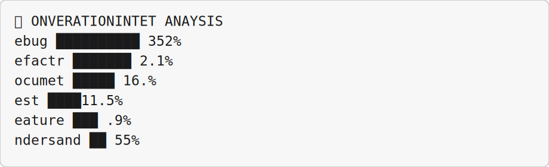
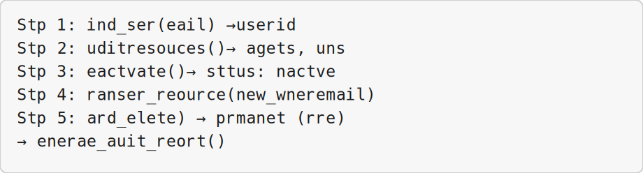

# Cursor Training Program — Speaker Scripts

Full instructor scripts for [`course-complete-marp.md`](course-complete-marp.md) (433 slides). **Script** = read aloud verbatim. **Facilitator notes** = pacing and troubleshooting only.

*Generated: 2026-05-25*

## How to use

- Match **Slide N** to the page number in the deck footer or Marp presenter view (`p`).
- **Script** = exactly what to say to the room. No improvisation required.
- Hands-on slides reference lab guides in [`slide-exercises/`](../slide-exercises/).
- Embedded presenter notes: [`course-complete-marp-with-notes.md`](course-complete-marp-with-notes.md).

---

### Slide 1 — Cursor Training Program

**Type:** course_title

**Script**

Good morning, and welcome to the Cursor Training Program — AI-Assisted Development with Cursor. Thank you for being here. Over the next two days we will move from mental models to daily editor workflows, then into automation, Cloud Agents, and the Cursor APIs.

Springpeople · 2-day instructor-led course · Modules 1–10. Before we start, please confirm three things: Cursor is installed, you are signed in, and you have a Git repository you can experiment in — sample repos are fine if you do not want to use production code.

This course is roughly seventy percent hands-on and thirty percent concept and discussion. Questions are welcome during a slide if they are quick; save longer ones for breaks or module transitions.

---

### Slide 2 — Course Agenda

**Type:** course_agenda

**Script**

Here is the full two-day arc for our time together.

Day one builds editor fluency. Module one gives us shared mental models for how AI assistants actually work. Modules two through four are hands-on in the Cursor editor — understanding codebases, making safe changes, working with agent modes, and customizing rules and skills. Module five introduces the CLI for terminal and scripting workflows.

Day two shifts to automation and integration: Cloud Agents in the UI, API authentication and reliability, programmatic Cloud Agent launches and webhooks, admin and analytics reporting, and AI code tracking.

The total scheduled time is about eleven and a half hours across both days, plus breaks. If you have never opened Cursor before, let me know now so I can allow extra setup time in Module two.

---

### Slide 3 — Day 1 — Foundations & Editor Workflows

**Type:** day_overview

**Script**

Day one is about editor confidence — mental models first, then hands-on Cursor through Module 5. We will not call external APIs until tomorrow.

Today's modules in one breath: Module 1 (Foundations), Module 2 (Hands-On), Module 3 (Hands-On + Concept), Module 4 (Hands-On + Walkthrough). Details are on the slide.

---

### Slide 4 — Day 2 — Cloud Agents, APIs & Analytics

**Type:** day_overview

**Script**

Day two assumes yesterday's habits stuck — API keys ready, PowerShell working, and realistic expectations about agent autonomy.

Cloud Agents keep working when your laptop is closed — long tasks, parallel runs, handoffs from local sessions.

When the PR comes back, the same review discipline applies.

Today's modules in one breath: Module 6 (Hands-On + Demonstration), Module 7 (Concept + Hands-On), Module 8 (Hands-On), Module 9 (Hands-On + Demonstrations). Details are on the slide.

---

## Module 1 — Mental Models for AI-Assisted Development

### Slide 5 — Mental Models for AI-Assisted Development

**Type:** module_intro

**Script**

Welcome to Module 1. This block is about sixty minutes of concepts — keep Cursor closed for now.

We are building vocabulary so tomorrow's hands-on work feels predictable instead of magical.

Timing on slide: Cursor Training Program · Concept block · ~60 min

---

### Slide 6 — Module Overview

**Type:** module_overview

**Script**

Our goal for this module: Build accurate mental models of how AI coding assistants work, their limitations, and how to use them effectively

Check duration and prerequisites on the slide — raise your hand if anything would block you.

---

### Slide 7 — Learning Objectives

**Type:** learning_objectives

**Script**

By the end of Module 1, you should be able to do the following.

1. Explain why AI outputs are probabilistic, not deterministic.

2. Identify and mitigate hallucinations in coding contexts.

3. Understand token-based pricing and cost optimization.

4. Master context as the single most valuable AI skill.

5. Distinguish between tool calling, MCP, and autonomous agents.

6. Define the developer's evolving role with AI agents.

---

### Slide 8 — Lesson 1.1

**Type:** lesson_intro · **Lesson:** 1.1

**Script**

Lesson 1.1: How AI Models Work. Concept · 12 minutes For this lesson, listen and take notes — you do not need to type along yet.

In this lesson we look under the hood at how large language models actually produce text. You won't need Cursor open yet — just listen and connect this to the Agent behavior you'll see all day tomorrow.

The key takeaway is this: the same prompt can produce different code on different runs. That is normal, not a broken tool.

**Facilitator notes**

- Pacing: Concept · 12 minutes. Shorten repetition before cutting exercise time.

---

### Slide 9 — Why Outputs Are Probabilistic

**Type:** quote · **Lesson:** 1.1

**Script**

Read with me: "Unlike traditional software that gives the same output for the same input, AI models generate responses based on probability distributions."

At its simplest, an LLM is a next-token prediction engine. Given a sequence of tokens, it predicts what comes next — then samples, appends, repeats.

Run the same unit test twice and you get the same result every time. Run the same prompt in Cursor twice and you may get different wording, structure, or even logic.

An LLM is not executing a program you wrote. It predicts the next token, samples one, appends it, and repeats — millions of times per answer. That is why we never treat a single Agent run as final without review.

Has anyone been burned by that — a summary that changed overnight, or code that worked once and not the second time?

---

### Slide 10 — Next-Token Prediction

**Type:** diagram · **Lesson:** 1.1

**Script**

Look at the diagram. The model reads everything so far, ranks possible next tokens by probability, picks one, appends it, and runs the loop again. That is the entire answer — autocomplete at scale.

It can feel like reasoning, but the mechanism is still pattern completion. Keeping that in mind will save you hours of false expectations later today.

---

### Slide 11 — Traditional Code vs. AI Model

**Type:** table · **Lesson:** 1.1

**Script**

Traditional software is deterministic — same input, same output. You own every branch and bug fix.

AI models are probabilistic — you influence them through prompts, context, and settings, but you do not fully control them.

When the model invents a wrong import, that is not a bug in your repo the way a null pointer is — it is the model filling a gap. You manage that with review, grounding, and constraints — not only more prompts.

---

### Slide 12 — Traditional vs. AI — Implication

**Type:** content · **Lesson:** 1.1

**Script**

The practical rule is on the slide: never trust a single run as ground truth. Run the code, read the diff, check the docs — every time.

Teams that skip verification accumulate AI debt — code that looked fine in chat but fails in CI.

---

### Slide 13 — What Determines AI Output?

**Type:** diagram · **Lesson:** 1.1

**Script**

When output quality drops, walk through these inputs: your prompt, system instructions, open files, model choice, and parameters like temperature. One of them changed — not necessarily the model itself.

Before you switch models, compare today's prompt and attachments to yesterday's session. That diff often explains the regression.

---

### Slide 14 — Key Parameters You Control

**Type:** table · **Lesson:** 1.1

**Script**

Temperature controls randomness — keep it low for bug fixes, slightly higher for brainstorming, then back down before you merge.

Top-p and max tokens shape breadth and length. Two teammates with the same prompt can still differ if their settings differ.

---

### Slide 15 — Key Parameters — Example Values

**Type:** code · **Lesson:** 1.1

**Script**

On the slide are sensible defaults for focused coding: temperature around 0.2, top-p near 0.9, and a max token cap to control cost.

---

### Slide 16 — Temperature Impact

**Type:** code · **Lesson:** 1.1

**Script**

Same prompt: _"Write a function to reverse a string"_

The same prompt produces different code at different temperatures — lower stays close to the obvious fix; higher adds variation and sometimes instability.

Same ask, three temperatures on the slide. Notice low temperature stays close to the obvious solution; high temperature adds variation — and sometimes instability you do not want in production code.

---

### Slide 17 — The Training Gap

**Type:** bullets · **Lesson:** 1.1

**Script**

On The Training Gap, here is what I want you to take away. Code written after their training date; Your company's internal APIs; Your specific architecture decisions; Recent library updates (unless in context).

Models are frozen at a training cutoff. They do not automatically know your internal APIs, your architecture decisions, or libraries released last month unless you put that information in context.

If the Agent guesses wrong about your stack, the fix is usually better context — not a different model.

Models are frozen at their training cutoff date. They don't know: - Code written after their training date

---

### Slide 18 — Lesson 1.2

**Type:** lesson_intro · **Lesson:** 1.2

**Script**

Lesson 1.2: Hallucinations. Concept · 10 minutes For this lesson, listen and take notes — you do not need to type along yet.

**Facilitator notes**

- Pacing: Concept · 10 minutes. Shorten repetition before cutting exercise time.

---

### Slide 19 — What Are Hallucinations?

**Type:** quote · **Lesson:** 1.2

**Script**

Read with me: "Confident-sounding outputs that are factually wrong, made up, or don't exist."

Most dangerous form: the model sounds completely confident while being completely wrong.

A hallucination is a confident answer that is wrong — a library that does not exist, a method that was never in the API, outdated syntax presented as current best practice.

The danger is the tone: the model sounds as sure as a senior engineer in a code review.

---

### Slide 20 — Hallucinations in Code

**Type:** table · **Lesson:** 1.2

**Script**

Fake imports and invented methods show up constantly. Your fastest checks are: does it import, does the type checker agree, does the official doc mention this API?

Build a team habit: if the Agent cites an API, someone verifies it before merge.

---

### Slide 21 — Why Models Hallucinate

**Type:** diagram · **Lesson:** 1.2

**Script**

Turn to the diagram — Root causes of hallucination.

Gaps in training data, missing context, and pressure to answer even when uncertain all push the model toward invented details.

---

### Slide 22 — Example: Confident Wrong

**Type:** code · **Lesson:** 1.2

**Script**

The snippet on screen invents requests.async — that API does not exist. For async HTTP in Python, use httpx or aiohttp.

---

### Slide 23 — Hallucination Mitigation Strategies

**Type:** table · **Lesson:** 1.2

**Script**

Ground the model with docs and @mentions. Ask it to cite sources. Use structured outputs when you need predictable shape.

Which of these can your team adopt Monday — paste docs, require citations, or JSON-only responses for scripts?

---

### Slide 24 — Hallucination Detection Checklist

**Type:** bullets · **Lesson:** 1.2

**Script**

On Hallucination Detection Checklist, here is what I want you to take away. Do the imported libraries exist?; Are function signatures correct?; Does the syntax match my language version?; and several more points on the slide you can scan as we go.

Before accepting AI-generated code, verify: - Do the imported libraries exist?

---

### Slide 25 — The Developer's Mindset

**Type:** quote · **Lesson:** 1.2

**Script**

Read with me: "_"Trust, but verify – especially when the AI sounds most confident."_"

- Hallucinations decrease with better prompts and context - They never fully disappear - You are the human-in-the-loop responsible for verification - Experience helps you "smell" potential hallucinations

---

### Slide 26 — Lesson 1.3

**Type:** lesson_intro · **Lesson:** 1.3

**Script**

Lesson 1.3: Tokens and Pricing. Concept · 10 minutes For this lesson, listen and take notes — you do not need to type along yet.

Tokens are how models meter context and cost — roughly three quarters of a word in English.

Small chat prompts are cheap; agent loops over large repos are not. Narrow context saves money and often improves quality.

**Facilitator notes**

- Pacing: Concept · 10 minutes. Shorten repetition before cutting exercise time.

---

### Slide 27 — What Is a Token?

**Type:** table · **Lesson:** 1.3

**Script**

Tokens are how models meter context and cost — roughly three quarters of a word in English.

Small chat prompts are cheap; agent loops over large repos are not. Narrow context saves money and often improves quality.

---

### Slide 28 — Why Tokens Matter

**Type:** content · **Lesson:** 1.3

**Script**

A token is the atomic unit of processing for LLMs — not a word, not a character. You pay per token · Context windows are measured in tokens · Token limits determine how much code the AI can "see"

---

### Slide 29 — Input vs. Output Pricing

**Type:** content · **Lesson:** 1.3

**Script**

Input tokens (prompt, code context, retrieved docs) cost less than output tokens (generated code and explanations). Output is often 5–8× more expensive — generation is more compute-intensive than reading.

---

### Slide 30 — Model Pricing Examples

**Type:** table · **Lesson:** 1.3

**Script**

Model: Input (per 1M). Use this when Output (per 1M). GPT-5 Mini: $0.25. Use this when $2.00. Claude 4.5 Haiku: $1.00. Use this when $5.00. GPT-5.3 Codex: $1.75. Use this when $14.00. Gemini 3.1 Pro: $2.00. Use this when $12.00. Claude 4.6 Sonnet: $3.00. Use this when $15.00. Claude 4.7 Opus: $5.00. Use this when $25.00. GPT-5.5: $5.00. Use this when $30.00.

---

### Slide 31 — What 1 Million Tokens Looks Like

**Type:** table · **Lesson:** 1.3

**Script**

Plain English text. With AI models, ~750,000 words (~1,500 pages). Python code. With AI models, ~250,000–500,000 lines. Average conversation. With AI models, 5–10 sessions. Full codebase. With AI models, small to medium project.

---

### Slide 32 — Cost Calculation Example

**Type:** code · **Lesson:** 1.3

**Script**

The code on screen shows: prompt_tokens = 5000    # instructions + context; output_tokens = 2000    # AI response; model = "claude-4.6-sonnet".

Bound your tasks: specific @mentions, clear stop conditions, checkpoints before long agent runs.

A five-minute agent loop on two files beats a twenty-minute loop on the whole tree.

---

### Slide 33 — Cost Optimization Strategies

**Type:** table · **Lesson:** 1.3

**Script**

Bound your tasks: specific @mentions, clear stop conditions, checkpoints before long agent runs.

A five-minute agent loop on two files beats a twenty-minute loop on the whole tree.

---

### Slide 34 — Real-World Cost Bounds

**Type:** table · **Lesson:** 1.3

**Script**

Usage Level: Monthly Cost. Use this when What You Can Do. Light: $10–20. Use this when Occasional questions, small fixes. Medium: $50–100. Use this when Daily coding, regular agent use. Heavy: $200–500. Use this when Full-time AI assistance, multiple agents. Enterprise: $1000+. Use this when Team usage, automation, CI/CD.

---

### Slide 35 — The Cache Effect

**Type:** code · **Lesson:** 1.3

**Script**

Models can cache frequently used content: - Cache Write: Cost to initially store

---

### Slide 36 — Lesson 1.4

**Type:** lesson_intro · **Lesson:** 1.4

**Script**

Lesson 1.4: Context. Concept · 12 minutes · The single most valuable AI skill For this lesson, listen and take notes — you do not need to type along yet.

**Facilitator notes**

- Pacing: Concept · 12 minutes · The single most valuable AI skill. Shorten repetition before cutting exercise time.

---

### Slide 37 — What Is Context?

**Type:** diagram · **Lesson:** 1.4

**Script**

Turn to the diagram — What goes into context.

Context = all the information the model has access to when generating a response. 

---

### Slide 38 — The Context Window Limit

**Type:** table · **Lesson:** 1.4

**Script**

Model: Context Window. Use this when Pages of Text. Claude 4 (Haiku / Sonnet / Opus): 200k. Use this when ~150. GPT-5 Mini / GPT-5.3 Codex: 272k. Use this when ~200.

---

### Slide 39 — Context Window — What Happens When Full

**Type:** content · **Lesson:** 1.4

**Script**

When you exceed context: Oldest content gets truncated · Critical information may be dropped Context engineering = knowing what to put in, what to leave out, and how to structure it.

---

### Slide 40 — Context Checklist

**Type:** bullets · **Lesson:** 1.4

**Script**

On Context Checklist, here is what I want you to take away. What problem am I trying to solve?; What files/code does the model need to see?; What would a human need to know to help me?; and several more points on the slide you can scan as we go.

Before every AI interaction, ask: - What problem am I trying to solve?

---

### Slide 41 — Good vs. Bad Context — Bad Example

**Type:** code · **Lesson:** 1.4

**Script**

BAD (vague):

The code on screen shows: "Fix this bug: my code doesn't work".

---

### Slide 42 — Good vs. Bad Context — Good Example

**Type:** code · **Lesson:** 1.4

**Script**

GOOD (specific):

The code on screen shows: Python function sorts dicts by key but raises KeyError.; Code: def sort_by_key(data, key): ...; Input: [{'name': 'Alice'}, {'age': 30}].

---

### Slide 43 — Context Prioritization Pyramid

**Type:** diagram · **Lesson:** 1.4

**Script**

Not all context is equal. Recent messages, open files, and rules compete for the same token budget. Three precise @mentions beat ten files attached just in case.

---

### Slide 44 — Context Window Management

**Type:** table · **Lesson:** 1.4

**Script**

Summarization: Compress earlier conversation. Use this when Long sessions. Selective inclusion: Only relevant files. Use this when Large codebases. Chunking: Split across multiple calls. Use this when Exceeding limit. Hierarchical: Summaries + details on demand. Use this when Complex projects. Vector retrieval: Semantic search for relevant context. Use this when Very large codebases.

---

### Slide 45 — The "Lost in the Middle" Problem

**Type:** diagram · **Lesson:** 1.4

**Script**

Models attend strongly to the beginning and end of context and weaker to the middle. Put critical constraints at the top of your prompt and repeat them after large pasted logs.

---

### Slide 46 — Lesson 1.5

**Type:** lesson_intro · **Lesson:** 1.5

**Script**

Lesson 1.5: Tool Calling and MCP. Concept · 8 minutes For this lesson, listen and take notes — you do not need to type along yet.

Tool calling is how the model stops guessing and starts acting — read a file, run a terminal command, fetch a URL.

Plain chat only produces text. Tools close the loop with real feedback from your environment.

MCP is standard plumbing for connecting Cursor to databases, browsers, and internal services — one protocol instead of a custom integration per tool.

**Facilitator notes**

- Pacing: Concept · 8 minutes. Shorten repetition before cutting exercise time.

---

### Slide 47 — What Is Tool Calling?

**Type:** diagram · **Lesson:** 1.5

**Script**

Tool calling is how the model stops guessing and starts acting — read a file, run a terminal command, fetch a URL.

Plain chat only produces text. Tools close the loop with real feedback from your environment.

---

### Slide 48 — Common Tool Types in Development

**Type:** table · **Lesson:** 1.5

**Script**

Tool: Purpose. Use this when Example. read_file: Read code files. Use this when "Show me the auth module". edit_file: Modify code. Use this when "Add error handling to line 42". search_code: Find patterns. Use this when "Find all uses of this function". run_terminal: Execute commands. Use this when "Run the tests". web_search: Find documentation. Use this when "Look up pandas DataFrame API". browser: Browse web pages. Use this when "Open the PR and review it". git: Version control. Use this when "Create a branch and commit".

---

### Slide 49 — MCP (Model Context Protocol)

**Type:** diagram · **Lesson:** 1.5

**Script**

MCP is standard plumbing for connecting Cursor to databases, browsers, and internal services — one protocol instead of a custom integration per tool.

---

### Slide 50 — Why MCP Matters

**Type:** table · **Lesson:** 1.5

**Script**

MCP is standard plumbing for connecting Cursor to databases, browsers, and internal services — one protocol instead of a custom integration per tool.

---

### Slide 51 — Tool Calling Best Practices

**Type:** content · **Lesson:** 1.5

**Script**

Tool calling is how the model stops guessing and starts acting — read a file, run a terminal command, fetch a URL.

Plain chat only produces text. Tools close the loop with real feedback from your environment.

---

### Slide 52 — Lesson 1.6

**Type:** lesson_intro · **Lesson:** 1.6

**Script**

Lesson 1.6: Agents. Concept · 8 minutes For this lesson, listen and take notes — you do not need to type along yet.

**Facilitator notes**

- Pacing: Concept · 8 minutes. Shorten repetition before cutting exercise time.

---

### Slide 53 — Agent vs. Chatbot

**Type:** table · **Lesson:** 1.6

**Script**

Chatbots answer questions. Agents pursue outcomes across multiple steps — edits, commands, follow-ups.

That difference drives cost, risk, and how carefully you review each step.

---

### Slide 54 — The Agent Loop

**Type:** content · **Lesson:** 1.6

**Script**

---

### Slide 55 — The Agent Loop — Diagram

**Type:** diagram · **Lesson:** 1.6

**Script**

Follow the loop on the slide: you state a goal, the model plans, Cursor runs a tool, results return, and the cycle repeats until the task finishes or you stop it. Each cycle is a chance to review before more changes land.

---

### Slide 56 — Levels of Agent Autonomy

**Type:** table · **Lesson:** 1.6

**Script**

Chatbots answer questions. Agents pursue outcomes across multiple steps — edits, commands, follow-ups.

That difference drives cost, risk, and how carefully you review each step.

---

### Slide 57 — How Agents Change Your Role

**Type:** diagram · **Lesson:** 1.6

**Script**

Turn to the diagram — Traditional developer workflow.

Traditional: 

---

### Slide 58 — Developer Role Shift

**Type:** table · **Lesson:** 1.6

**Script**

Code writer. With AI models, intent specifier. Debugger. With AI models, quality reviewer. Implementation. With AI models, orchestration. Manual testing. With AI models, acceptance testing. Problem solver. With AI models, problem framer.

---

### Slide 59 — When to Use Agents

**Type:** bullets · **Lesson:** 1.6

**Script**

On When to Use Agents, here is what I want you to take away. Large, multi-step tasks · Repetitive patterns; Well-defined with clear success criteria; Low-risk changes · Documentation updates; and several more points on the slide you can scan as we go.

Good for agents: - Large, multi-step tasks · Repetitive patterns

---

### Slide 60 — Module Summary

**Type:** module_summary · **Lesson:** 1.6

**Script**

That completes Module 1. Lesson 1.1, How AI Models Work — key insight: Probabilistic, not deterministic – manage with temperature; Lesson 1.2, Hallucinations — key insight: Models invent confidently – always verify; Lesson 1.3, Tokens and Pricing — key insight: Output costs more – optimize context, use cheaper models; Lesson 1.4, Context — key insight: Single most valuable skill – quality in = quality out; Lesson 1.5, Tool Calling & MCP — key insight: AI requests actions, you control execution; Lesson 1.6, Agents — key insight: Goal-directed action – changes developer role

What will you do differently on Monday? I will take two or three answers before we break or move on.

---

## Module 2 — Cursor Editor Essentials

### Slide 61 — Cursor Editor Essentials

**Type:** module_intro

**Script**

Module 2 is our longest hands-on block. Open Cursor now, load your repo with File → Open Folder, and keep the Agent panel ready — Ctrl+I on Windows.

Timing on slide: Cursor Training Program · Hands-on exercise · ~90 min

---

### Slide 62 — Module Overview

**Type:** module_overview

**Script**

Our goal for this module: Master the core workflows of AI-assisted coding in Cursor

Check duration and prerequisites on the slide — raise your hand if anything would block you.

---

### Slide 63 — Learning Objectives

**Type:** learning_objectives

**Script**

By the end of Module 2, you should be able to do the following.

1. Orient an AI agent to an unfamiliar codebase.

2. Get targeted explanations of specific files or symbols.

3. Make safe, reviewable changes using diff review.

4. Design complex changes with Plan Mode.

5. Compare models to choose the right one for each task.

6. Use @mentions for precise context control.

---

### Slide 64 — Agenda

**Type:** module_agenda

**Script**

Here is how we will spend our time: Lesson 2.1, Codebase Understanding, about 20 min; Lesson 2.2, Explaining Files/Symbols, about 13 min; Lesson 2.3, Safe Reviewable Changes, about 13 min; Lesson 2.4, Plan Mode, about 13 min; Lesson 2.5, Comparing Models, about 13 min; Lesson 2.6, @mentions, about 13 min; Lesson 2.7, Checkpoints, about 8 min; Lesson 2.8, Terminal Integration, about 13 min.

**Facilitator notes**

- Announce when the next hands-on block starts so people can close email and open Cursor.

---

### Slide 65 — Lesson 2.1

**Type:** lesson_intro · **Lesson:** 2.1

**Script**

Lesson 2.1: Codebase Understanding. For this lesson, listen, participate, or follow along as indicated on the next slides.

Use the Cursor Agent to orient yourself in an unfamiliar repository.

The detailed lab guide is slide-exercises/module-02/exercise-2.1-codebase-understanding.md.

---

### Slide 66 — The Problem & The Solution

**Type:** quote · **Lesson:** 2.1

**Script**

Read with me: "Drop an agent into a codebase you've never seen and get a coherent explanation of how it works."

The Problem: Opening a new codebase is overwhelming. Where do you start? What's the entry point? The Cursor Solution: Ask the agent to explain the codebase. It reads files, traces connections, and returns a roadmap.

Every one of us has opened a repo and wondered where to start. The Agent can produce a roadmap in minutes — but the first answer is a draft, not gospel. Your job is to verify and follow up.

---

### Slide 67 — Exercise 2.1 — Steps 1–2

**Type:** exercise · **Lesson:** 2.1 · **Exercise:** 2.1

**Script**

We are starting Exercise 2.1 — Codebase Understanding. We have about 20 min for this lab.

Use the Cursor Agent to orient yourself in an unfamiliar repository.

The full lab guide is in slide-exercises/module-02/exercise-2.1-codebase-understanding.md if you need extra detail.

On Windows: PowerShell in the integrated terminal — Ctrl+backtick — and the Agent panel — Ctrl+I. Open the repo folder with File → Open Folder.

Any unfamiliar repository works here — detectron2 is on the slide, but a smaller repo is fine if we are short on time.

Use File → Open Folder, not a single file, so the Agent can see the project tree.

Step 1: Open an unfamiliar repository in Cursor.

Step 2: Open the Agent panel — `Ctrl+I`.

I'll give you a few minutes to work — raise your hand if you get stuck.

**Facilitator notes**

- If Agent panel doesn't open: Make sure Cursor is the active window. Try `Ctrl+Shift+I` or click the Agent icon in the left sidebar
- If Agent not responding: Check your internet connection. The Agent requires an internet connection to access AI models

---

### Slide 68 — Exercise 2.1 — Step 3: Orientation Prompt

**Type:** exercise · **Lesson:** 2.1 · **Exercise:** 2.1

**Script**

Now for Step 3: Orientation Prompt.

Copy this into the Agent chat: "Explain this codebase to me as if I'm a new team member. Specifically tell me: 1. What is the main purpose of this project? 2. What are the entry points (main scripts, CLI, API)? 3. What are the key modules and how do they relate? 4. What are the main dependencies? 5. What files should I read first to understand the architecture?"

You want a reading order and named entry points — not a flat list of every filename.

If the Agent dumps dozens of files, reply in chat: which three should I read first?

When we debrief, I will ask what the Agent got wrong about dependencies or architecture.

I'll give you a few minutes to work — raise your hand if you get stuck.

**Facilitator notes**

- If Agent panel doesn't open: Make sure Cursor is the active window. Try `Ctrl+Shift+I` or click the Agent icon in the left sidebar
- If Agent not responding: Check your internet connection. The Agent requires an internet connection to access AI models

---

### Slide 69 — Exercise 2.1 — Step 4: Trace Data Flow

**Type:** exercise · **Lesson:** 2.1 · **Exercise:** 2.1

**Script**

Now for Step 4: Trace Data Flow.

Copy this into the Agent chat: "Based on what you just told me, trace the flow of data from input to output. What functions get called in order?"

The first answer was a map; this follow-up tests whether the Agent can chain function calls logically.

If the trace looks wrong, ask it to cite file and line for each hop — that is a verification habit worth keeping.

I'll give you a few minutes to work — raise your hand if you get stuck.

**Facilitator notes**

- If Agent panel doesn't open: Make sure Cursor is the active window. Try `Ctrl+Shift+I` or click the Agent icon in the left sidebar
- If Agent not responding: Check your internet connection. The Agent requires an internet connection to access AI models

---

### Slide 70 — Exercise 2.1 — Step 5: Visual Overview

**Type:** exercise · **Lesson:** 2.1 · **Exercise:** 2.1

**Script**

Now for Step 5: Visual Overview.

Copy this into the Agent chat: "Create an ASCII diagram showing the module relationships in this codebase."

An ASCII diagram is enough for onboarding — we care about communicating structure, not graphic design.

I'll give you a few minutes to work — raise your hand if you get stuck.

**Facilitator notes**

- If Agent panel doesn't open: Make sure Cursor is the active window. Try `Ctrl+Shift+I` or click the Agent icon in the left sidebar
- If Agent not responding: Check your internet connection. The Agent requires an internet connection to access AI models

---

### Slide 71 — Expected Agent Output (Sample)

**Type:** diagram · **Lesson:** 2.1 · **Exercise:** 2.1

**Script**

Turn to the diagram — Expected Agent Output (Sample).

---

### Slide 72 — Pro Tip — Save the Overview

**Type:** code · **Lesson:** 2.1 · **Exercise:** 2.1

**Script**

Pro Tip: Save the agent's explanation as a project note:

The code on screen shows: Save this explanation as .cursor/project-overview.md so future; team members can read it..

---

### Slide 73 — Exercise 2.1 — Success Criteria

**Type:** exercise · **Lesson:** 2.1 · **Exercise:** 2.1

**Script**

That finishes Exercise 2.1 — Codebase Understanding.

Check off what you actually did: Agent described project purpose; Agent identified entry points and key modules; Agent suggested first files to read.

Who completed all three parts? What did the Agent get wrong, and what prompt change fixed it?

Raise your hand if you finished. What did the Agent get wrong, and what prompt change fixed it?

**Facilitator notes**

- If stuck: If Agent panel doesn't open: Make sure Cursor is the active window. Try `Ctrl+Shift+I` or click the Agent icon in the left sidebar; If Agent not responding: Check your internet connection. The Agent requires an internet connection to access AI models; If "No codebase found" error: Make sure you opened a folder (File → Open Folder), not just a single file

---

### Slide 74 — Lesson 2.2

**Type:** lesson_intro · **Lesson:** 2.2

**Script**

Lesson 2.2: Explaining a Specific File or Symbol. For this lesson, listen, participate, or follow along as indicated on the next slides.

Get targeted explanations of one file or symbol without reading the whole repo.

The detailed lab guide is slide-exercises/module-02/exercise-2.2-explaining-a-specific-file-or-symbol.md.

---

### Slide 75 — Targeted Explanations

**Type:** quote · **Lesson:** 2.2

**Script**

Read with me: "Don't make the agent read the whole codebase when you just need to understand one function."

Use precise context — select a function or class, then ask focused questions.

---

### Slide 76 — Exercise 2.2 — Steps 1–3

**Type:** exercise · **Lesson:** 2.2 · **Exercise:** 2.2

**Script**

We are starting Exercise 2.2 — Explaining a Specific File or Symbol. We have about 13 min for this lab.

Get targeted explanations of one file or symbol without reading the whole repo.

The full lab guide is in slide-exercises/module-02/exercise-2.2-explaining-a-specific-file-or-symbol.md if you need extra detail.

On Windows: PowerShell in the integrated terminal — Ctrl+backtick — and the Agent panel — Ctrl+I. Open the repo folder with File → Open Folder.

Step 1: Open a specific file in your project.

Step 2: Select a function or class you want explained.

Step 3: Use the Agent with precise context:.

Copy this into the Agent chat: "Explain the function I have selected. For each major section, tell me: - What it does - Why it's designed that way (trade-offs) - Potential edge cases or bugs - How it could be improved"

I'll give you a few minutes to work — raise your hand if you get stuck.

**Facilitator notes**

- If `@filename` doesn't autocomplete: Start typing the full filename. Make sure the file exists in your project
- If Agent says "File not found": Check the exact filename including extension. Use `@` then browse the dropdown

---

### Slide 77 — Exercise 2.2 — Step 4: Example I/O

**Type:** exercise · **Lesson:** 2.2 · **Exercise:** 2.2

**Script**

Now for Step 4: Example I/O.

Copy this into the Agent chat: "Give me a concrete example of inputs and outputs for this function. Show me what happens in the normal case and one edge case."

I'll give you a few minutes to work — raise your hand if you get stuck.

**Facilitator notes**

- If `@filename` doesn't autocomplete: Start typing the full filename. Make sure the file exists in your project
- If Agent says "File not found": Check the exact filename including extension. Use `@` then browse the dropdown

---

### Slide 78 — Exercise 2.2 — Step 5: Dependencies

**Type:** exercise · **Lesson:** 2.2 · **Exercise:** 2.2

**Script**

Now for Step 5: Dependencies.

Copy this into the Agent chat: "What other functions does this call? What calls this function? Trace the call chain two levels in each direction."

I'll give you a few minutes to work — raise your hand if you get stuck.

**Facilitator notes**

- If `@filename` doesn't autocomplete: Start typing the full filename. Make sure the file exists in your project
- If Agent says "File not found": Check the exact filename including extension. Use `@` then browse the dropdown

---

### Slide 79 — Inline Explanation Shortcut

**Type:** code · **Lesson:** 2.2 · **Exercise:** 2.2

**Script**

Inline Explanation Shortcut

---

### Slide 80 — Lesson 2.3

**Type:** lesson_intro · **Lesson:** 2.3

**Script**

Lesson 2.3: Making a Safe, Reviewable Change. For this lesson, listen, participate, or follow along as indicated on the next slides.

Let the Agent propose a small change and review the diff before accepting.

The detailed lab guide is slide-exercises/module-02/exercise-2.3-making-a-safe-reviewable-change.md.

---

### Slide 81 — The Diff Review Workflow

**Type:** quote · **Lesson:** 2.3

**Script**

Read with me: "Before AI changes your code, see exactly what will change and approve it."

1. Ask agent to propose a change 2. Review the diff (what's added/removed) 3. Accept or reject changes 4. Test after acceptance

---

### Slide 82 — Exercise 2.3 — Steps 1–2

**Type:** exercise · **Lesson:** 2.3 · **Exercise:** 2.3

**Script**

We are starting Exercise 2.3 — Making a Safe, Reviewable Change. We have about 13 min for this lab.

Let the Agent propose a small change and review the diff before accepting.

The full lab guide is in slide-exercises/module-02/exercise-2.3-making-a-safe-reviewable-change.md if you need extra detail.

On Windows: PowerShell in the integrated terminal — Ctrl+backtick — and the Agent panel — Ctrl+I. Open the repo folder with File → Open Folder.

The change is tiny on purpose — read every line of the diff before you click Accept. If you accepted without reading, undo and do it again; that is the exercise.

Step 1: Ask for a small, safe change:.

Step 2: Watch the agent generate the diff:.

Copy this into the Agent chat: "Change the welcome message in index.html from "Hello World" to "Welcome to My App""

Copy this into the Agent chat: "📝 Changes to index.html: <h1>- Hello World</h1> <h1>+ Welcome to My App</h1> Accept? [Yes] [No] [Edit]"

I'll give you a few minutes to work — raise your hand if you get stuck.

**Facilitator notes**

- If Agent makes changes without showing diff: Ask: *"Show me the diff before applying"*
- If Change breaks the code: Click a checkpoint (in chat timeline) to restore previous version

---

### Slide 83 — Exercise 2.3 — Review Questions

**Type:** exercise · **Lesson:** 2.3 · **Exercise:** 2.3

**Script**

Now for Review Questions.

Step 4: Accept · Step 5: Test manually.

The change is tiny on purpose — read every line of the diff before you click Accept. If you accepted without reading, undo and do it again; that is the exercise.

I'll give you a few minutes to work — raise your hand if you get stuck.

**Facilitator notes**

- If Agent makes changes without showing diff: Ask: *"Show me the diff before applying"*
- If Change breaks the code: Click a checkpoint (in chat timeline) to restore previous version

---

### Slide 84 — Exercise 2.3 — Test After Accept

**Type:** exercise · **Lesson:** 2.3 · **Exercise:** 2.3

**Script**

Now for Test After Accept.

Copy this into the Agent chat: "start index.html # open HTML in default browser python script.py # run Python script npm start # Node/React dev server"

The change is tiny on purpose — read every line of the diff before you click Accept. If you accepted without reading, undo and do it again; that is the exercise.

I'll give you a few minutes to work — raise your hand if you get stuck.

**Facilitator notes**

- If Agent makes changes without showing diff: Ask: *"Show me the diff before applying"*
- If Change breaks the code: Click a checkpoint (in chat timeline) to restore previous version

---

### Slide 85 — Exercise 2.3 — If Something Goes Wrong

**Type:** exercise · **Lesson:** 2.3 · **Exercise:** 2.3

**Script**

Now for If Something Goes Wrong.

Copy this into the Agent chat: "That change didn't work. The button disappeared. Please explain what happened and suggest a fix."

The change is tiny on purpose — read every line of the diff before you click Accept. If you accepted without reading, undo and do it again; that is the exercise.

I'll give you a few minutes to work — raise your hand if you get stuck.

**Facilitator notes**

- If Agent makes changes without showing diff: Ask: *"Show me the diff before applying"*
- If Change breaks the code: Click a checkpoint (in chat timeline) to restore previous version

---

### Slide 86 — Lesson 2.4

**Type:** lesson_intro · **Lesson:** 2.4

**Script**

Lesson 2.4: Plan Mode. For this lesson, listen, participate, or follow along as indicated on the next slides.

Use Plan Mode to design a change before the Agent edits files.

Plan Mode shows you the design before files change. Use it for multi-file work and unfamiliar codebases — plans are cheaper to throw away than bad diffs.

The detailed lab guide is slide-exercises/module-02/exercise-2.4-plan-mode.md.

---

### Slide 87 — Design Before You Code

**Type:** bullets · **Lesson:** 2.4

**Script**

On Design Before You Code, here is what I want you to take away. Changing multiple files · Adding a new feature; Refactoring existing code; You're not 100% sure of the best approach; The change is risky or hard to undo.

Plan Mode makes the agent create a detailed plan BEFORE writing any code. When to use Plan Mode:

---

### Slide 88 — Exercise 2.4 — Step 1: Enable Plan Mode

**Type:** exercise · **Lesson:** 2.4 · **Exercise:** 2.4

**Script**

We are starting Exercise 2.4 — Plan Mode. We have about 13 min for this lab.

Use Plan Mode to design a change before the Agent edits files.

The full lab guide is in slide-exercises/module-02/exercise-2.4-plan-mode.md if you need extra detail.

On Windows: PowerShell in the integrated terminal — Ctrl+backtick — and the Agent panel — Ctrl+I. Open the repo folder with File → Open Folder.

Step 1: Enable Plan Mode (Shift+Tab in the Agent input):.

Copy this into the Agent chat: "# Press Shift+Tab in the Agent input # The input border changes color to indicate Plan Mode"

I'll give you a few minutes to work — raise your hand if you get stuck.

**Facilitator notes**

- If Plan Mode not activating: Press `Shift+Tab` again. Check chat input shows "Plan"
- If Agent starts coding immediately: Ask: *"I'm in Plan Mode. Please plan first, don't write code yet"*

---

### Slide 89 — Exercise 2.4 — Step 2: Describe Change

**Type:** exercise · **Lesson:** 2.4 · **Exercise:** 2.4

**Script**

Now for Step 2: Describe Change.

Copy this into the Agent chat: "Add user authentication to this web app. Requirements: - Email/password login · Session management - Protected routes (dashboard, settings) - Logout functionality · "Remember me" option Don't write code yet – just give me a plan."

I'll give you a few minutes to work — raise your hand if you get stuck.

**Facilitator notes**

- If Plan Mode not activating: Press `Shift+Tab` again. Check chat input shows "Plan"
- If Agent starts coding immediately: Ask: *"I'm in Plan Mode. Please plan first, don't write code yet"*

---

### Slide 90 — Exercise 2.4 — Step 3: Review the Plan

**Type:** exercise · **Lesson:** 2.4 · **Exercise:** 2.4

**Script**

Now for Step 3: Review the Plan.

Copy this into the Agent chat: "📋 IMPLEMENTATION PLAN Step 1: Create User Model — models/user.js Step 2: Auth Routes — routes/auth.js (login, logout, register) Step 3: Session Management — middleware/session.js Step 4: Protected Route Middleware — middleware/auth.js Step 5: Update Frontend — pages/login.html, dashboard.html Step 6: Environment Variables — .env (SESSION_SECRET, REDIS_URL) Questions for you: 1. JWT or server-side sessions? 2. Existing user database? 3. Include email verification? Ready to proceed? [Yes] [No] [Modify Plan]"

I'll give you a few minutes to work — raise your hand if you get stuck.

**Facilitator notes**

- If Plan Mode not activating: Press `Shift+Tab` again. Check chat input shows "Plan"
- If Agent starts coding immediately: Ask: *"I'm in Plan Mode. Please plan first, don't write code yet"*

---

### Slide 91 — Exercise 2.4 — Approve & Execute

**Type:** exercise · **Lesson:** 2.4 · **Exercise:** 2.4

**Script**

Now for Approve & Execute.

Step 4: Answer questions and approve:.

Step 5: Watch the agent execute the plan step by step.

Copy this into the Agent chat: "Use JWT for simplicity. No existing database yet – use SQLite for now. Skip email verification for this version. Proceed."

I'll give you a few minutes to work — raise your hand if you get stuck.

**Facilitator notes**

- If Plan Mode not activating: Press `Shift+Tab` again. Check chat input shows "Plan"
- If Agent starts coding immediately: Ask: *"I'm in Plan Mode. Please plan first, don't write code yet"*

---

### Slide 92 — Exercise 2.4 — Success Criteria

**Type:** exercise · **Lesson:** 2.4 · **Exercise:** 2.4

**Script**

That finishes Exercise 2.4 — Plan Mode.

Check off what you actually did: Enabled Plan Mode (Shift+Tab); Agent created structured plan; Agent asked clarifying questions; Approved plan before code was written.

Raise your hand if you finished. What did the Agent get wrong, and what prompt change fixed it?

**Facilitator notes**

- If stuck: If Plan Mode not activating: Press `Shift+Tab` again. Check chat input shows "Plan"; If Agent starts coding immediately: Ask: *"I'm in Plan Mode. Please plan first, don't write code yet"*; If Plan is too vague: Ask: *"Be more specific. What files will you change? What functions?"*

---

### Slide 93 — Lesson 2.5

**Type:** lesson_intro · **Lesson:** 2.5

**Script**

Lesson 2.5: Comparing Two Models. For this lesson, listen, participate, or follow along as indicated on the next slides.

Run the same prompt on two models and compare quality, speed, and cost.

Run the same prompt on two models. Judge correctness first, then speed, then cost. The prettiest answer that fails tests loses.

The detailed lab guide is slide-exercises/module-02/exercise-2.5-comparing-two-models.md.

---

### Slide 94 — Model Selection Guide

**Type:** table · **Lesson:** 2.5

**Script**

Task Type: Recommended Model. Use this when Why. Typo fixes, simple edits: GPT-5 Mini. Use this when Cheap, fast, good enough. Daily coding, bug fixes: Composer 2.5 or GPT-5.3 Codex. Use this when Best value in Cursor; built for agent tools. Complex logic, architecture: Claude Opus or GPT-5.5. Use this when Smartest, but expensive. Frontend/visual work: Gemini 3.1 Pro. Use this when Can see images. Fast, simple questions: Claude Haiku. Use this when Fastest responses.

---

### Slide 95 — Exercise 2.5 — Compare Two Models

**Type:** exercise · **Lesson:** 2.5 · **Exercise:** 2.5

**Script**

We are starting Exercise 2.5 — Comparing Two Models. We have about 13 min for this lab.

Run the same prompt on two models and compare quality, speed, and cost.

The full lab guide is in slide-exercises/module-02/exercise-2.5-comparing-two-models.md if you need extra detail.

On Windows: PowerShell in the integrated terminal — Ctrl+backtick — and the Agent panel — Ctrl+I. Open the repo folder with File → Open Folder.

Step 1: Set model to Composer 2.5 (/model composer-2.5), ask:.

Step 2: Copy the response.

Step 3: Switch to GPT-5 Mini — ask the same question.

Step 4: Compare responses side by side.

Copy this into the Agent chat: "Explain what a closure is in JavaScript with a practical example."

I'll give you a few minutes to work — raise your hand if you get stuck.

**Facilitator notes**

- If Model not available: Check your plan – some models require Pro or higher
- If `/model` command not working: Type it in the Agent chat, not in terminal

---

### Slide 96 — Exercise 2.5 — Comparison Table

**Type:** exercise · **Lesson:** 2.5 · **Exercise:** 2.5

**Script**

Now for Comparison Table.

I'll give you a few minutes to work — raise your hand if you get stuck.

**Facilitator notes**

- If Model not available: Check your plan – some models require Pro or higher
- If `/model` command not working: Type it in the Agent chat, not in terminal

---

### Slide 97 — Exercise 2.5 — Cost & Decision Matrix

**Type:** exercise · **Lesson:** 2.5 · **Exercise:** 2.5

**Script**

Now for Cost & Decision Matrix.

Step 5: Check token usage at bottom of chat after each request.

Step 6: Create a personal decision matrix:.

I'll give you a few minutes to work — raise your hand if you get stuck.

**Facilitator notes**

- If Model not available: Check your plan – some models require Pro or higher
- If `/model` command not working: Type it in the Agent chat, not in terminal

---

### Slide 98 — Exercise 2.5 — Success Criteria

**Type:** exercise · **Lesson:** 2.5 · **Exercise:** 2.5

**Script**

That finishes Exercise 2.5 — Comparing Two Models.

Check off what you actually did: Same question to two models; Compared quality and speed; Created personal model-selection guide.

Raise your hand if you finished. What did the Agent get wrong, and what prompt change fixed it?

**Facilitator notes**

- If stuck: If Model not available: Check your plan – some models require Pro or higher; If `/model` command not working: Type it in the Agent chat, not in terminal; If Can't tell which model is active: Look at the model name in the chat input dropdown

---

### Slide 99 — Lesson 2.6

**Type:** lesson_intro · **Lesson:** 2.6

**Script**

Lesson 2.6: Precise Context with @mentions. For this lesson, listen, participate, or follow along as indicated on the next slides.

Use @mentions to point the Agent at exact files, symbols, and context.

The detailed lab guide is slide-exercises/module-02/exercise-2.6-precise-context-with-mentions.md.

---

### Slide 100 — @mention Types

**Type:** table · **Lesson:** 2.6

**Script**

@mention: What It Does. Use this when Example. @filename: Include specific file. Use this when @auth.py. @symbol: Include function/class. Use this when @UserModel. @branch: Reference git branch. Use this when @main. @chat: Reference past conversation. Use this when @previous-chat. @folder: Reference entire directory. Use this when @/src/utils. @web: Search the web. Use this when @web pandas DataFrame.

---

### Slide 101 — Exercise 2.6 — Steps 1–2

**Type:** exercise · **Lesson:** 2.6 · **Exercise:** 2.6

**Script**

We are starting Exercise 2.6 — Precise Context with @mentions. We have about 13 min for this lab.

Use @mentions to point the Agent at exact files, symbols, and context.

The full lab guide is in slide-exercises/module-02/exercise-2.6-precise-context-with-mentions.md if you need extra detail.

On Windows: PowerShell in the integrated terminal — Ctrl+backtick — and the Agent panel — Ctrl+I. Open the repo folder with File → Open Folder.

Step 1: Use @filename to point at a specific file:.

Step 2: Use @symbol to reference a specific function:.

Copy this into the Agent chat: "@database.py What are the security vulnerabilities in this database connection?"

Copy this into the Agent chat: "@calculate_total This function is returning NaN sometimes. Why?"

I'll give you a few minutes to work — raise your hand if you get stuck.

**Facilitator notes**

- If `@` doesn't show suggestions: Make sure you're in the Agent chat, not a code file
- If Wrong file appears: Type more letters to narrow down the suggestion

---

### Slide 102 — Exercise 2.6 — Step 3: Multiple @mentions

**Type:** exercise · **Lesson:** 2.6 · **Exercise:** 2.6

**Script**

Now for Step 3: Multiple @mentions.

Copy this into the Agent chat: "@auth.py @UserModel @login_handler Review the authentication flow. Are there any race conditions or timing attacks?"

I'll give you a few minutes to work — raise your hand if you get stuck.

**Facilitator notes**

- If `@` doesn't show suggestions: Make sure you're in the Agent chat, not a code file
- If Wrong file appears: Type more letters to narrow down the suggestion

---

### Slide 103 — Exercise 2.6 — Step 4: @branch

**Type:** exercise · **Lesson:** 2.6 · **Exercise:** 2.6

**Script**

Now for Step 4: @branch.

Copy this into the Agent chat: "Compare @main and @feature/payment branches. What are the key differences in the payment handling code?"

I'll give you a few minutes to work — raise your hand if you get stuck.

**Facilitator notes**

- If `@` doesn't show suggestions: Make sure you're in the Agent chat, not a code file
- If Wrong file appears: Type more letters to narrow down the suggestion

---

### Slide 104 — Exercise 2.6 — Step 5: @chat

**Type:** exercise · **Lesson:** 2.6 · **Exercise:** 2.6

**Script**

Now for Step 5: @chat.

Copy this into the Agent chat: "@chat(authentication-discussion) Based on that discussion, implement the fix we agreed on."

I'll give you a few minutes to work — raise your hand if you get stuck.

**Facilitator notes**

- If `@` doesn't show suggestions: Make sure you're in the Agent chat, not a code file
- If Wrong file appears: Type more letters to narrow down the suggestion

---

### Slide 105 — Exercise 2.6 — Steps 6–7: @folder & @web

**Type:** exercise · **Lesson:** 2.6 · **Exercise:** 2.6

**Script**

Now for Steps 6–7: @folder & @web.

Step 6: Use @folder for directory-level context:.

Step 7: Use @web for external documentation:.

Copy this into the Agent chat: "@src/components Find all components that don't have loading states."

Copy this into the Agent chat: "@web React 19 useTransition hook How do I use it?"

I'll give you a few minutes to work — raise your hand if you get stuck.

**Facilitator notes**

- If `@` doesn't show suggestions: Make sure you're in the Agent chat, not a code file
- If Wrong file appears: Type more letters to narrow down the suggestion

---

### Slide 106 — @mention Pro Tips

**Type:** bullets · **Lesson:** 2.6 · **Exercise:** 2.6

**Script**

On @mention Pro Tips, here is what I want you to take away. Start typing @ — Cursor auto-suggests available mentions; You can @mention multiple items in one message; @mentions work in both Agent and Chat modes.

- Start typing @ — Cursor auto-suggests available mentions - You can @mention multiple items in one message

---

### Slide 107 — Exercise 2.6 — Success Criteria

**Type:** exercise · **Lesson:** 2.6 · **Exercise:** 2.6

**Script**

That finishes Exercise 2.6 — Precise Context with @mentions.

Check off what you actually did: Used @filename to target a specific file; Used @symbol to target a function or class; Used multiple @mentions together; Used @web for external search.

Raise your hand if you finished. What did the Agent get wrong, and what prompt change fixed it?

**Facilitator notes**

- If stuck: If `@` doesn't show suggestions: Make sure you're in the Agent chat, not a code file; If Wrong file appears: Type more letters to narrow down the suggestion; If @mention not working: Put a space after the @mention before your question

---

### Slide 108 — Lesson 2.7

**Type:** lesson_intro · **Lesson:** 2.7

**Script**

Lesson 2.7: Checkpoints. For this lesson, listen, participate, or follow along as indicated on the next slides.

Create and restore checkpoints before risky Agent experiments.

Checkpoints are undo for agent experiments — create one before risky prompts or broad @folder mentions.

The detailed lab guide is slide-exercises/module-02/exercise-2.7-checkpoints.md.

---

### Slide 109 — A Safety Net for Experiments

**Type:** bullets · **Lesson:** 2.7

**Script**

On A Safety Net for Experiments, here is what I want you to take away. Code changes made by the agent; Conversation history · File states; Before complex changes · At milestones (Step 2 of 5); Before risky experiments · Before terminal commands.

What Checkpoints Save: - Code changes made by the agent

---

### Slide 110 — Exercise 2.7 — Create & Restore

**Type:** exercise · **Lesson:** 2.7 · **Exercise:** 2.7

**Script**

We are starting Exercise 2.7 — Checkpoints. We have about 8 min for this lab.

Create and restore checkpoints before risky Agent experiments.

The full lab guide is in slide-exercises/module-02/exercise-2.7-checkpoints.md if you need extra detail.

On Windows: PowerShell in the integrated terminal — Ctrl+backtick — and the Agent panel — Ctrl+I. Open the repo folder with File → Open Folder.

Step 1: Create a checkpoint before making a change.

Copy this into the Agent chat: "# Click checkpoint icon in Agent panel # Windows: ``Ctrl+Shift+S`` (Mac: ``Cmd+Shift+S``)"

I'll give you a few minutes to work — raise your hand if you get stuck.

**Facilitator notes**

- If No checkpoint appears: Make sure you're in Agent mode (not Ask mode). Agent mode creates checkpoints automatically
- If Can't find checkpoint: Scroll up in chat – checkpoints are marked with a dot or icon

---

### Slide 111 — Exercise 2.7 — Steps 2–3

**Type:** exercise · **Lesson:** 2.7 · **Exercise:** 2.7

**Script**

Now for Steps 2–3.

Step 2: Name it descriptively: "Before auth refactor - safe point".

Step 3: Let the agent make changes:.

Copy this into the Agent chat: "Add input validation to all form handlers."

I'll give you a few minutes to work — raise your hand if you get stuck.

**Facilitator notes**

- If No checkpoint appears: Make sure you're in Agent mode (not Ask mode). Agent mode creates checkpoints automatically
- If Can't find checkpoint: Scroll up in chat – checkpoints are marked with a dot or icon

---

### Slide 112 — Exercise 2.7 — Steps 4–5

**Type:** exercise · **Lesson:** 2.7 · **Exercise:** 2.7

**Script**

Now for Steps 4–5.

Step 4: If something goes wrong → Restore to checkpoint.

Step 5: View history via the clock icon in Agent panel.

I'll give you a few minutes to work — raise your hand if you get stuck.

**Facilitator notes**

- If No checkpoint appears: Make sure you're in Agent mode (not Ask mode). Agent mode creates checkpoints automatically
- If Can't find checkpoint: Scroll up in chat – checkpoints are marked with a dot or icon

---

### Slide 113 — Checkpoint Best Practices

**Type:** bullets · **Lesson:** 2.7 · **Exercise:** 2.7

**Script**

On Checkpoint Best Practices, here is what I want you to take away. Create checkpoints every 5–10 minutes during complex work; Use descriptive names, not "checkpoint1"; Test the restored state before continuing; and several more points on the slide you can scan as we go.

Checkpoints are undo for agent experiments — create one before risky prompts or broad @folder mentions.

- Create checkpoints every 5–10 minutes during complex work - Use descriptive names, not "checkpoint1"

---

### Slide 114 — Lesson 2.8

**Type:** lesson_intro · **Lesson:** 2.8

**Script**

Lesson 2.8: Terminal Integration. For this lesson, listen, participate, or follow along as indicated on the next slides.

Let the Agent run terminal commands and react to command output.

The detailed lab guide is slide-exercises/module-02/exercise-2.8-terminal-integration.md.

---

### Slide 115 — What the Agent Can Do

**Type:** bullets · **Lesson:** 2.8

**Script**

On What the Agent Can Do, here is what I want you to take away. Run shell commands · See stdout, stderr, exit codes; React to command output · Install dependencies; Run tests · Start/stop services; and several more points on the slide you can scan as we go.

- Run shell commands · See stdout, stderr, exit codes - React to command output · Install dependencies

---

### Slide 116 — Exercise 2.8 — Steps 1–3

**Type:** exercise · **Lesson:** 2.8 · **Exercise:** 2.8

**Script**

We are starting Exercise 2.8 — Terminal Integration. We have about 13 min for this lab.

Let the Agent run terminal commands and react to command output.

The full lab guide is in slide-exercises/module-02/exercise-2.8-terminal-integration.md if you need extra detail.

On Windows: PowerShell in the integrated terminal — Ctrl+backtick — and the Agent panel — Ctrl+I. Open the repo folder with File → Open Folder.

Step 1: Check the environment:.

Step 2: Approve the command when prompted.

Step 3: List project files:.

Copy this into the Agent chat: "Run `python --version` and `gcc --version` in PowerShell. Tell me what versions we're using."

Copy this into the Agent chat: "Run `dir` and tell me which file looks like the main program."

I'll give you a few minutes to work — raise your hand if you get stuck.

**Facilitator notes**

- If Command not found: Ask: *"The command `xxx` is not found. How do I install it?"*
- If Permission denied: You may need to approve with `sudo` (be careful!)

---

### Slide 117 — Exercise 2.8 — Agent Terminal Loop

**Type:** exercise · **Lesson:** 2.8 · **Exercise:** 2.8

**Script**

Now for Agent Terminal Loop.

I'll give you a few minutes to work — raise your hand if you get stuck.

**Facilitator notes**

- If Command not found: Ask: *"The command `xxx` is not found. How do I install it?"*
- If Permission denied: You may need to approve with `sudo` (be careful!)

---

### Slide 118 — Exercise 2.8 — Step 5: Install Dependency

**Type:** exercise · **Lesson:** 2.8 · **Exercise:** 2.8

**Script**

Now for Step 5: Install Dependency.

Copy this into the Agent chat: "Install the requests library with pip if it's not already installed. Use: py -m pip install requests Show me the command output."

I'll give you a few minutes to work — raise your hand if you get stuck.

**Facilitator notes**

- If Command not found: Ask: *"The command `xxx` is not found. How do I install it?"*
- If Permission denied: You may need to approve with `sudo` (be careful!)

---

### Slide 119 — Exercise 2.8 — Step 6: Multi-Step Workflow

**Type:** exercise · **Lesson:** 2.8 · **Exercise:** 2.8

**Script**

Now for Step 6: Multi-Step Workflow.

Copy this into the Agent chat: "Run these commands in order: 1. git status 2. git branch 3. dir Summarize what you see after each command. Confirm before each command that might affect the repo."

I'll give you a few minutes to work — raise your hand if you get stuck.

**Facilitator notes**

- If Command not found: Ask: *"The command `xxx` is not found. How do I install it?"*
- If Permission denied: You may need to approve with `sudo` (be careful!)

---

### Slide 120 — Terminal Command Safety Rules

**Type:** table · **Lesson:** 2.8 · **Exercise:** 2.8

**Script**

Always approve first. With AI models, remove-Item, sudo, git push --force, production changes. Review carefully. With AI models, pip install, npm install, git branch changes, docker. Safe to auto-approve (Windows demo). With AI models, python --version, dir, Get-Location, Get-Content, pytest, npm test.

---

### Slide 121 — Module Summary

**Type:** module_summary · **Lesson:** 2.8 · **Exercise:** 2.8

**Script**

That completes Module 2. Lesson 2.1, Codebase Understanding — key insight: Orient to new repo; Lesson 2.2, Explaining Files/Symbols — key insight: Targeted explanations; Lesson 2.3, Safe Reviewable Changes — key insight: Diff review workflow; Lesson 2.4, Plan Mode — key insight: Design before code; Lesson 2.5, Comparing Models — key insight: Model selection; Lesson 2.6, @mentions — key insight: Precise context; Lesson 2.7, Checkpoints — key insight: Safety net; Lesson 2.8, Terminal Integration — key insight: Command execution

What will you do differently on Monday? I will take two or three answers before we break or move on.

---

### Slide 122 — Quick Reference Card

**Type:** quick_reference · **Lesson:** 2.8 · **Exercise:** 2.8

**Script**

This quick reference slide is for you to keep after the course — screenshot it or copy the commands into your team wiki.

Quick Reference Card

**Facilitator notes**

- Allow about two minutes for final questions on this module.

---

## Module 3 — Agent Modes and Tools

### Slide 123 — Agent Modes and Tools

**Type:** module_intro

**Script**

Module 3 connects Ask Mode, Agent Mode, the browser, the terminal, and prompting craft to the mental models from Module 1.

Timing on slide: Cursor Training Program · ~60 min

---

### Slide 124 — Module Overview

**Type:** module_overview

**Script**

Our goal for this module: Master different agent modes and the core tools that make agents powerful

Check duration and prerequisites on the slide — raise your hand if anything would block you.

---

### Slide 125 — Learning Objectives

**Type:** learning_objectives

**Script**

By the end of Module 3, you should be able to do the following.

1. Choose between Ask Mode and Agent Mode based on task and safety needs.

2. Use the Browser Tool to inspect live pages and read console output.

3. Run terminal commands through the agent and diagnose failures.

4. Write effective, constrained prompts that avoid scope creep.

---

### Slide 126 — Agenda

**Type:** module_agenda

**Script**

Here is how we will spend our time: Lesson 3.1, Ask Mode vs. Agent Mode, about 18 min; Lesson 3.2, Browser Tool, about 18 min; Lesson 3.3, Terminal Tool, about 20 min; Lesson 3.4, Effective Prompting in Practice, about 22 min.

**Facilitator notes**

- Announce when the next hands-on block starts so people can close email and open Cursor.

---

### Slide 127 — Lesson 3.1

**Type:** lesson_intro · **Lesson:** 3.1

**Script**

Lesson 3.1: Ask Mode vs. Agent Mode. For this lesson, listen, participate, or follow along as indicated on the next slides.

Learn when Ask Mode is read-only and when Agent Mode can edit files.

Ask Mode is read-only — great for architecture questions and understanding code without surprise diffs.

Agent Mode can edit files. Same question, different risk profile. Watch the mode indicator in the panel footer before you send.

The detailed lab guide is slide-exercises/module-03/exercise-3.1-ask-mode-vs-agent-mode.md.

---

### Slide 128 — The Core Distinction

**Type:** table · **Lesson:** 3.1

**Script**

Can read files: ✅ Yes (with @mentions). Use this when ✅ Yes. Can edit files: ❌ No. Use this when ✅ Yes. Can run terminal: ❌ No. Use this when ✅ Yes. Can browse web: ❌ No (limited). Use this when ✅ Yes (with tool). Can call tools: ❌ No. Use this when ✅ Yes. Safety level: Very high (read-only). Use this when Moderate (needs oversight). Best for: Questions, learning, code review. Use this when Implementation, debugging, automation.

---

### Slide 129 — When to Use Each Mode

**Type:** bullets · **Lesson:** 3.1

**Script**

On When to Use Each Mode, here is what I want you to take away. You have a question about code · Exploring a codebase; You want a second opinion on design; You're not ready to make changes · Production environment; and several more points on the slide you can scan as we go.

USE ASK MODE when: - You have a question about code · Exploring a codebase

---

### Slide 130 — Safety Implications

**Type:** table · **Lesson:** 3.1

**Script**

The practical rule is on the slide: never trust a single run as ground truth. Run the code, read the diff, check the docs — every time.

Teams that skip verification accumulate AI debt — code that looked fine in chat but fails in CI.

---

### Slide 131 — The Mode Continuum

**Type:** diagram · **Lesson:** 3.1

**Script**

Turn to the diagram — The Mode Continuum.

---

### Slide 132 — Windows Exercise Environment

**Type:** exercise_setup · **Lesson:** 3.1

**Script**

Let's pause for environment setup. Open PowerShell in Cursor's integrated terminal — Ctrl+backtick.

For API exercises, set your keys in the session, for example `$env:CURSOR_ADMIN_API_KEY` or `$env:CURSOR_USER_API_KEY`. Never commit keys to git.

On Windows, use `curl.exe` when a lab shows curl — not the PowerShell alias.

Once your test call succeeds, give me a thumbs-up and we will continue.

**Facilitator notes**

- Allow two to three minutes. Pair anyone blocked on keys or curl with a neighbor.

---

### Slide 133 — Exercise 3.1 — Steps 1–2

**Type:** exercise · **Lesson:** 3.1 · **Exercise:** 3.1

**Script**

We are starting Exercise 3.1 — Ask Mode vs. Agent Mode. We have about 18 min for this lab.

Learn when Ask Mode is read-only and when Agent Mode can edit files.

The full lab guide is in slide-exercises/module-03/exercise-3.1-ask-mode-vs-agent-mode.md if you need extra detail.

On Windows: PowerShell in the integrated terminal — Ctrl+backtick — and the Agent panel — Ctrl+I. Open the repo folder with File → Open Folder.

Step 1: Open Agent panel (Cmd+I / Ctrl+I) — note mode indicator at bottom.

Where: Agent panel — `Ctrl+I`.

I'll give you a few minutes to work — raise your hand if you get stuck.

**Facilitator notes**

- If Can't switch modes: Type `/ask` or `/agent` exactly. Use `Shift+Tab` as alternative
- If Agent still makes changes in Ask Mode: You might not be in Ask Mode. Check the mode indicator

---

### Slide 134 — Exercise 3.1 — Steps 1–2 (Part 2)

**Type:** exercise · **Lesson:** 3.1 · **Exercise:** 3.1

**Script**

Now for Steps 1–2 (Part 2).

Step 2: Try to make a change in Ask Mode:.

Where: Agent panel — `Ctrl+I`.

Copy this into the Agent chat: "Change the variable name 'temp' to 'temperature' in the current file."

I'll give you a few minutes to work — raise your hand if you get stuck.

**Facilitator notes**

- If Can't switch modes: Type `/ask` or `/agent` exactly. Use `Shift+Tab` as alternative
- If Agent still makes changes in Ask Mode: You might not be in Ask Mode. Check the mode indicator

---

### Slide 135 — Exercise 3.1 — Steps 3–5

**Type:** exercise · **Lesson:** 3.1 · **Exercise:** 3.1

**Script**

Now for Steps 3–5.

Step 3: Ask a question Ask Mode handles well:.

Where: Agent panel — `Ctrl+I`.

Copy this into the Agent chat: "Explain the purpose of the main() function in this file. What edge cases does it handle?"

I'll give you a few minutes to work — raise your hand if you get stuck.

**Facilitator notes**

- If Can't switch modes: Type `/ask` or `/agent` exactly. Use `Shift+Tab` as alternative
- If Agent still makes changes in Ask Mode: You might not be in Ask Mode. Check the mode indicator

---

### Slide 136 — Exercise 3.1 — Steps 3–5 (Part 2)

**Type:** exercise · **Lesson:** 3.1 · **Exercise:** 3.1

**Script**

Now for Steps 3–5 (Part 2).

Step 4: Switch to Agent Mode via the dropdown.

Where: Agent panel — `Ctrl+I`.

Step 5: Repeat the rename request — agent shows diff for approval.

Where: Agent panel — `Ctrl+I`.

I'll give you a few minutes to work — raise your hand if you get stuck.

**Facilitator notes**

- If Can't switch modes: Type `/ask` or `/agent` exactly. Use `Shift+Tab` as alternative
- If Agent still makes changes in Ask Mode: You might not be in Ask Mode. Check the mode indicator

---

### Slide 137 — Exercise 3.1 — Step 6 & Success Criteria

**Type:** exercise · **Lesson:** 3.1 · **Exercise:** 3.1

**Script**

That finishes Exercise 3.1 — Ask Mode vs. Agent Mode.

Check off what you actually did: Used Ask Mode for questions · Observed Ask Mode cannot make changes; Switched to Agent Mode · Made a change with diff review.

Raise your hand if you finished. What did the Agent get wrong, and what prompt change fixed it?

**Facilitator notes**

- If stuck: If Can't switch modes: Type `/ask` or `/agent` exactly. Use `Shift+Tab` as alternative; If Agent still makes changes in Ask Mode: You might not be in Ask Mode. Check the mode indicator; If Don't see mode indicator: Look near the chat input – it shows "Ask", "Agent", or "Plan"

---

### Slide 138 — Lesson 3.2

**Type:** lesson_intro · **Lesson:** 3.2

**Script**

Lesson 3.2: Browser Tool. For this lesson, listen, participate, or follow along as indicated on the next slides.

Use the Browser tool so the Agent can inspect live web pages.

The Browser tool lets the Agent see what users see — rendered pages, console errors, layout issues CSS alone won't reveal.

The detailed lab guide is slide-exercises/module-03/exercise-3.2-browser-tool.md.

---

### Slide 139 — What the Browser Tool Can Do

**Type:** quote · **Lesson:** 3.2

**Script**

Read with me: "See what your app actually looks like in a browser — not just the source code."

- Navigate to URLs · Read page content and DOM structure - See console logs and errors · Take screenshots (depending on model) - Click elements and interact with pages - Extract data from live pages

The Browser tool lets the Agent see what users see — rendered pages, console errors, layout issues CSS alone won't reveal.

---

### Slide 140 — Browser Tool: With vs. Without

**Type:** table · **Lesson:** 3.2

**Script**

The Browser tool lets the Agent see what users see — rendered pages, console errors, layout issues CSS alone won't reveal.

---

### Slide 141 — Exercise 3.2 — Steps 1–2

**Type:** exercise · **Lesson:** 3.2 · **Exercise:** 3.2

**Script**

We are starting Exercise 3.2 — Browser Tool. We have about 18 min for this lab.

Use the Browser tool so the Agent can inspect live web pages.

The full lab guide is in slide-exercises/module-03/exercise-3.2-browser-tool.md if you need extra detail.

On Windows: PowerShell in the integrated terminal — Ctrl+backtick — and the Agent panel — Ctrl+I. Open the repo folder with File → Open Folder.

Step 1: Start a local web app (or use a public test page).

Terminal: PowerShell — unless step notes Git Bash or WSL.

Copy this into the Agent chat: "python -m http.server 8000 # Or use a public test page"

I'll give you a few minutes to work — raise your hand if you get stuck.

**Facilitator notes**

- If Browser pane doesn't appear: Ask: *"Show me the browser window"* or check Cursor Settings → Features → Browser
- If Page won't load: Check internet connection. Try a different URL

---

### Slide 142 — Exercise 3.2 — Steps 1–2 (Part 2)

**Type:** exercise · **Lesson:** 3.2 · **Exercise:** 3.2

**Script**

Now for Steps 1–2 (Part 2).

Step 2: In Agent Mode:.

Terminal: PowerShell — `Ctrl+ `` in Cursor.

Copy this into the Agent chat: "Use the browser tool to open http://localhost:8000 Tell me what you see on the page."

I'll give you a few minutes to work — raise your hand if you get stuck.

**Facilitator notes**

- If Browser pane doesn't appear: Ask: *"Show me the browser window"* or check Cursor Settings → Features → Browser
- If Page won't load: Check internet connection. Try a different URL

---

### Slide 143 — Exercise 3.2 — Steps 3–4

**Type:** exercise · **Lesson:** 3.2 · **Exercise:** 3.2

**Script**

Now for Steps 3–4.

Step 3: Find specific elements:.

Where: Agent panel — `Ctrl+I`.

Copy this into the Agent chat: "On that same page, find: 1. The main heading text 2. The number of buttons 3. Any error messages visible"

I'll give you a few minutes to work — raise your hand if you get stuck.

**Facilitator notes**

- If Browser pane doesn't appear: Ask: *"Show me the browser window"* or check Cursor Settings → Features → Browser
- If Page won't load: Check internet connection. Try a different URL

---

### Slide 144 — Exercise 3.2 — Steps 3–4 (Part 2)

**Type:** exercise · **Lesson:** 3.2 · **Exercise:** 3.2

**Script**

Now for Steps 3–4 (Part 2).

Step 4: Check the console:.

Where: Agent panel — `Ctrl+I`.

Copy this into the Agent chat: "Now open the browser developer console. Are there any errors or warnings? If so, what are they?"

I'll give you a few minutes to work — raise your hand if you get stuck.

**Facilitator notes**

- If Browser pane doesn't appear: Ask: *"Show me the browser window"* or check Cursor Settings → Features → Browser
- If Page won't load: Check internet connection. Try a different URL

---

### Slide 145 — Expected Agent Actions

**Type:** diagram · **Lesson:** 3.2 · **Exercise:** 3.2

**Script**

Turn to the diagram — Expected Agent Actions.

---

### Slide 146 — Exercise 3.2 — Steps 5–6

**Type:** exercise · **Lesson:** 3.2 · **Exercise:** 3.2

**Script**

Now for Steps 5–6.

Step 5: Diagnose a layout issue:.

Where: Agent panel — `Ctrl+I`.

Copy this into the Agent chat: "The login button is partially hidden on mobile sizes. Use the browser tool to check what's happening."

I'll give you a few minutes to work — raise your hand if you get stuck.

**Facilitator notes**

- If Browser pane doesn't appear: Ask: *"Show me the browser window"* or check Cursor Settings → Features → Browser
- If Page won't load: Check internet connection. Try a different URL

---

### Slide 147 — Exercise 3.2 — Steps 5–6 (Part 2)

**Type:** exercise · **Lesson:** 3.2 · **Exercise:** 3.2

**Script**

Now for Steps 5–6 (Part 2).

Step 6: Extract data from a page:.

Where: Agent panel — `Ctrl+I`.

Copy this into the Agent chat: "Go to https://example.com/pricing Extract all pricing plan names and their monthly costs into a table."

I'll give you a few minutes to work — raise your hand if you get stuck.

**Facilitator notes**

- If Browser pane doesn't appear: Ask: *"Show me the browser window"* or check Cursor Settings → Features → Browser
- If Page won't load: Check internet connection. Try a different URL

---

### Slide 148 — Browser Tool Limitations

**Type:** table · **Lesson:** 3.2 · **Exercise:** 3.2

**Script**

The Browser tool lets the Agent see what users see — rendered pages, console errors, layout issues CSS alone won't reveal.

---

### Slide 149 — Lesson 3.3

**Type:** lesson_intro · **Lesson:** 3.3

**Script**

Lesson 3.3: Terminal Tool. For this lesson, listen, participate, or follow along as indicated on the next slides.

Use the Terminal tool to run tests, read output, and fix failures.

The Terminal tool lets the Agent run tests and builds and read real output. That is how we turn guesses into evidence.

The detailed lab guide is slide-exercises/module-03/exercise-3.3-terminal-tool.md.

---

### Slide 150 — What the Terminal Tool Can Do

**Type:** bullets · **Lesson:** 3.3

**Script**

On What the Terminal Tool Can Do, here is what I want you to take away. Run any shell command (with approval); See stdout, stderr, exit codes; Read command output as context for next actions; Chain commands based on previous results.

The Terminal tool lets the Agent run tests and builds and read real output. That is how we turn guesses into evidence.

- Run any shell command (with approval) - See stdout, stderr, exit codes

---

### Slide 151 — Terminal Tool Flow

**Type:** diagram · **Lesson:** 3.3

**Script**

The Terminal tool lets the Agent run tests and builds and read real output. That is how we turn guesses into evidence.

---

### Slide 152 — Exercise 3.3 — Setup

**Type:** exercise · **Lesson:** 3.3 · **Exercise:** 3.3

**Script**

We are starting Exercise 3.3 — Terminal Tool. We have about 20 min for this lab.

Use the Terminal tool to run tests, read output, and fix failures.

The full lab guide is in slide-exercises/module-03/exercise-3.3-terminal-tool.md if you need extra detail.

On Windows: PowerShell in the integrated terminal — Ctrl+backtick — and the Agent panel — Ctrl+I. Open the repo folder with File → Open Folder.

If the lab asked you to break a test, the Agent should read the failing output — not guess the fix.

Use the terminal tool on the calculator test project in this repo.

I'll give you a few minutes to work — raise your hand if you get stuck.

**Facilitator notes**

- If `gcc: command not found`: Install GCC, or ask Agent for install steps for your OS
- If Agent won't run command: Click **Allow** / **Run** when the approval dialog appears

---

### Slide 153 — Exercise 3.3 — Step 1: Safe Command

**Type:** exercise · **Lesson:** 3.3 · **Exercise:** 3.3

**Script**

Now for Step 1: Safe Command.

Learn which commands usually need careful review.

Step 1 — Read-only command.

Where: Agent panel — `Ctrl+I`.

Copy this into the Agent chat: "Check whether gcc and git are available. Run gcc --version and git --version. Summarize the output. Do not modify any files."

If the lab asked you to break a test, the Agent should read the failing output — not guess the fix.

I'll give you a few minutes to work — raise your hand if you get stuck.

**Facilitator notes**

- If `gcc: command not found`: Install GCC, or ask Agent for install steps for your OS
- If Agent won't run command: Click **Allow** / **Run** when the approval dialog appears

---

### Slide 154 — Exercise 3.3 — Step 2: Run Passing Tests

**Type:** exercise · **Lesson:** 3.3 · **Exercise:** 3.3

**Script**

Now for Step 2: Run Passing Tests.

Compile and run tests — all should pass first.

You should see: Four PASS: lines · All tests passed!

Step 2 — Run test suite.

Copy this into the Agent chat: "Run .\run_tests.bat in this folder. Show full output: compilation OK? how many tests passed?"

If the lab asked you to break a test, the Agent should read the failing output — not guess the fix.

I'll give you a few minutes to work — raise your hand if you get stuck.

**Facilitator notes**

- If `gcc: command not found`: Install GCC, or ask Agent for install steps for your OS
- If Agent won't run command: Click **Allow** / **Run** when the approval dialog appears

---

### Slide 155 — Exercise 3.3 — Step 3: Break a Test

**Type:** exercise · **Lesson:** 3.3 · **Exercise:** 3.3

**Script**

Now for Step 3: Break a Test.

Compile and run tests — all should pass first.

You should see: Four PASS: lines · All tests passed!

Step 3 — Introduce a failure (you edit).

If the lab asked you to break a test, the Agent should read the failing output — not guess the fix.

I'll give you a few minutes to work — raise your hand if you get stuck.

**Facilitator notes**

- If `gcc: command not found`: Install GCC, or ask Agent for install steps for your OS
- If Agent won't run command: Click **Allow** / **Run** when the approval dialog appears

---

### Slide 156 — Exercise 3.3 — Step 4: Diagnose Failure

**Type:** exercise · **Lesson:** 3.3 · **Exercise:** 3.3

**Script**

Now for Step 4: Diagnose Failure.

Use the terminal tool on the calculator test project in this repo.

Step 4 — Read terminal output.

Copy this into the Agent chat: "@test_calculator.c Run the test suite again. Which test failed? What assertion failed? Is the bug in the test or in add()? Explain only — do not fix yet."

Keep @calculator.c in the prompt so the Agent stays in the right file.

If the lab asked you to break a test, the Agent should read the failing output — not guess the fix.

I'll give you a few minutes to work — raise your hand if you get stuck.

**Facilitator notes**

- If `gcc: command not found`: Install GCC, or ask Agent for install steps for your OS
- If Agent won't run command: Click **Allow** / **Run** when the approval dialog appears

---

### Slide 157 — Exercise 3.3 — Step 5: Fix and Verify

**Type:** exercise · **Lesson:** 3.3 · **Exercise:** 3.3

**Script**

Now for Step 5: Fix and Verify.

Use the terminal tool on the calculator test project in this repo.

Step 5 — Debug workflow.

Copy this into the Agent chat: "@test_calculator.c 1. Run tests and confirm the failure 2. Fix the incorrect assertion in test_add() only 3. Re-run tests and confirm all pass Show the diff before I accept changes."

Keep @calculator.c in the prompt so the Agent stays in the right file.

If the lab asked you to break a test, the Agent should read the failing output — not guess the fix.

I'll give you a few minutes to work — raise your hand if you get stuck.

**Facilitator notes**

- If `gcc: command not found`: Install GCC, or ask Agent for install steps for your OS
- If Agent won't run command: Click **Allow** / **Run** when the approval dialog appears

---

### Slide 158 — Exercise 3.3 — Step 6: Approval Rules

**Type:** exercise · **Lesson:** 3.3 · **Exercise:** 3.3

**Script**

Now for Step 6: Approval Rules.

Use the terminal tool on the calculator test project in this repo.

Step 6 — Safe vs. risky commands.

Copy this into the Agent chat: "Run git status. Summarize only — do not commit or push."

If the lab asked you to break a test, the Agent should read the failing output — not guess the fix.

I'll give you a few minutes to work — raise your hand if you get stuck.

**Facilitator notes**

- If `gcc: command not found`: Install GCC, or ask Agent for install steps for your OS
- If Agent won't run command: Click **Allow** / **Run** when the approval dialog appears

---

### Slide 159 — Lesson 3.4

**Type:** lesson_intro · **Lesson:** 3.4

**Script**

Lesson 3.4: Effective Prompting in Practice. For this lesson, listen, participate, or follow along as indicated on the next slides.

Write constrained prompts and reusable templates for real tasks.

Vague prompts produce wide diffs. Constraints — which file, which function, what format — shrink the blast radius.

In the next exercise we use calculator.c on purpose: you will see one vague sentence refactor half the file.

The detailed lab guide is slide-exercises/module-03/exercise-3.4-effective-prompting-in-practice.md.

---

### Slide 160 — Anatomy of an Effective Prompt

**Type:** content · **Lesson:** 3.4

**Script**

1. ROLE / CONTEXT — "You are a senior Python developer…" 2. TASK — "Fix the bug in calculate_total()…" 3. CONSTRAINTS — "Do not change the function signature…" 4. OUTPUT FORMAT — "Show me the diff and explain your change…" 5. SUCCESS CRITERIA — "Function should return 0 for empty input…"

---

### Slide 161 — Bad Prompts vs. Good Prompts

**Type:** table · **Lesson:** 3.4

**Script**

"Fix this code". With AI models, "Fix the IndexError in process_list() when list is empty. Do not change return type.". @calculator.c Fix divide. With AI models, @calculator.c Improve divide() for division by zero. Change ONLY divide(). Show diff + cause.. "Add logging". With AI models, "Add INFO-level logging to calculate() using existing logger config.". "Make it faster". With AI models, "Optimize find_user() from O(n²) to O(n log n). Don't change signature.". "Review my code". With AI models, "Review auth.py for SQL injection, password handling, session issues. Ignore style.".

---

### Slide 162 — The "Boundaries" Technique

**Type:** code · **Lesson:** 3.4

**Script**

Always tell the agent what NOT to touch:

The code on screen shows: BOUNDARIES:; - Do NOT change: function signatures, return types, existing tests; - Do NOT touch: config files, database schemas, other modules.

---

### Slide 163 — Avoiding Scope Creep

**Type:** table · **Lesson:** 3.4

**Script**

Explicit boundaries. With AI models, "Change ONLY login.js lines 42–56". One thing at a time. With AI models, "First, just identify the issue. Don't fix yet.". Ask for plan first. With AI models, "Plan Mode: Show me what you'll change before doing it". Use checkpoints. With AI models, create checkpoint before complex requests. Prefer diffs. With AI models, "Show me the diff, don't replace the whole file".

---

### Slide 164 — Exercise 3.4 — Setup

**Type:** exercise · **Lesson:** 3.4 · **Exercise:** 3.4

**Script**

We are starting Exercise 3.4 — Effective Prompting in Practice. We have about 22 min for this lab.

Write constrained prompts and reusable templates for real tasks.

The full lab guide is in slide-exercises/module-03/exercise-3.4-effective-prompting-in-practice.md if you need extra detail.

On Windows: PowerShell in the integrated terminal — Ctrl+backtick — and the Agent panel — Ctrl+I. Open the repo folder with File → Open Folder.

Step two's vague prompt may refactor more than divide() — that is the lesson.

Keep @calculator.c in every prompt so the Agent stays in the right file.

Practice six prompting techniques on calculator.c from earlier exercises.

I'll give you a few minutes to work — raise your hand if you get stuck.

**Facilitator notes**

- If Agent changes too many files: Add *"Change ONLY [function/file]."* Reject the diff and retry.
- If Agent edits when you wanted a plan: Switch to `/ask` or add *"Do not edit files yet."*

---

### Slide 165 — Exercise 3.4 — Step 1: Constrained Prompt

**Type:** exercise · **Lesson:** 3.4 · **Exercise:** 3.4

**Script**

Now for Step 1: Constrained Prompt.

Task + boundaries + output format + success criteria.

You should see: Diff limited to divide() — not a full refactor.

Step 1 — Constrained prompt.

Where: Agent panel — `Ctrl+I`.

Copy this into the Agent chat: "@calculator.c Task: Improve divide() so it handles division by zero safely inside the function itself. Constraints: - Do NOT change any function signatures - Do NOT add new #include lines - Do NOT modify main() or other functions - Change ONLY the divide() function body Output format: Show the exact diff and explain the root cause in 2–3 sentences. Success criteria: divide(10, 0) returns safely; divide(10, 2) still returns 5."

Keep @calculator.c in the prompt so the Agent stays in the right file.

Step two's vague prompt may refactor more than divide() — that is the lesson.

Keep @calculator.c in every prompt so the Agent stays in the right file.

I'll give you a few minutes to work — raise your hand if you get stuck.

**Facilitator notes**

- If Agent changes too many files: Add *"Change ONLY [function/file]."* Reject the diff and retry.
- If Agent edits when you wanted a plan: Switch to `/ask` or add *"Do not edit files yet."*

---

### Slide 166 — Exercise 3.4 — Step 2: Vague vs. Constrained

**Type:** exercise · **Lesson:** 3.4 · **Exercise:** 3.4

**Script**

Now for Step 2: Vague vs. Constrained.

Task + boundaries + output format + success criteria.

You should see: Diff limited to divide() — not a full refactor.

Step 2 — Vague vs. constrained.

Copy this into the Agent chat: "@calculator.c Fix the divide function."

Keep @calculator.c in the prompt so the Agent stays in the right file.

Step two's vague prompt may refactor more than divide() — that is the lesson.

Keep @calculator.c in every prompt so the Agent stays in the right file.

I'll give you a few minutes to work — raise your hand if you get stuck.

**Facilitator notes**

- If Agent changes too many files: Add *"Change ONLY [function/file]."* Reject the diff and retry.
- If Agent edits when you wanted a plan: Switch to `/ask` or add *"Do not edit files yet."*

---

### Slide 167 — Exercise 3.4 — Step 3: Plan Before Editing

**Type:** exercise · **Lesson:** 3.4 · **Exercise:** 3.4

**Script**

Now for Step 3: Plan Before Editing.

Approve a plan before any file changes.

You should see: Written plan, no diff until you approve.

Step 3 — Plan before editing.

Where: Ask Mode (/ask) or Agent with "do not edit yet".

Copy this into the Agent chat: "@calculator.c Before making any changes, answer: 1. What is the smallest change needed for divide()? 2. Which lines would you change? 3. What could go wrong? 4. What will you NOT change? Do not edit files yet — I will review first."

Keep @calculator.c in the prompt so the Agent stays in the right file.

Step two's vague prompt may refactor more than divide() — that is the lesson.

Keep @calculator.c in every prompt so the Agent stays in the right file.

I'll give you a few minutes to work — raise your hand if you get stuck.

**Facilitator notes**

- If Agent changes too many files: Add *"Change ONLY [function/file]."* Reject the diff and retry.
- If Agent edits when you wanted a plan: Switch to `/ask` or add *"Do not edit files yet."*

---

### Slide 168 — Exercise 3.4 — Step 4: DO NOT List

**Type:** exercise · **Lesson:** 3.4 · **Exercise:** 3.4

**Script**

Now for Step 4: DO NOT List.

Forbid scope creep explicitly.

You should see: Comment only — no logic changes.

Step 4 — DO NOT list.

Copy this into the Agent chat: "@calculator.c Add a one-line comment above divide() explaining it performs integer division. DO NOT: - Change any function bodies - Rename functions - Add new functions - Modify main()"

Keep @calculator.c in the prompt so the Agent stays in the right file.

Step two's vague prompt may refactor more than divide() — that is the lesson.

Keep @calculator.c in every prompt so the Agent stays in the right file.

I'll give you a few minutes to work — raise your hand if you get stuck.

**Facilitator notes**

- If Agent changes too many files: Add *"Change ONLY [function/file]."* Reject the diff and retry.
- If Agent edits when you wanted a plan: Switch to `/ask` or add *"Do not edit files yet."*

---

### Slide 169 — Exercise 3.4 — Step 5: One Change at a Time

**Type:** exercise · **Lesson:** 3.4 · **Exercise:** 3.4

**Script**

Now for Step 5: One Change at a Time.

Two messages — propose, then apply.

You should see: Message 1 = no edit · Message 2 = small diff.

Step 5 — One change at a time.

Copy this into the Agent chat: "@calculator.c Show me the validation you would add inside divide() for division by zero. Do not edit the file yet."

Keep @calculator.c in the prompt so the Agent stays in the right file.

Copy this into the Agent chat: "Now add only that validation to divide(). Show the diff before I accept. Do not change main() or other functions."

Step two's vague prompt may refactor more than divide() — that is the lesson.

Keep @calculator.c in every prompt so the Agent stays in the right file.

I'll give you a few minutes to work — raise your hand if you get stuck.

**Facilitator notes**

- If Agent changes too many files: Add *"Change ONLY [function/file]."* Reject the diff and retry.
- If Agent edits when you wanted a plan: Switch to `/ask` or add *"Do not edit files yet."*

---

### Slide 170 — Exercise 3.4 — Step 6: Prompt Templates

**Type:** exercise · **Lesson:** 3.4 · **Exercise:** 3.4

**Script**

Now for Step 6: Prompt Templates.

Create prompts you can copy on real projects.

Step 6 — Prompt templates.

Copy this into the Agent chat: "## Bug Fix Template @{{file}} Task: [Describe bug] Constraints: Do NOT change [signatures / other files] Output: Show diff + root cause Success: [How to verify] ## Plan-First Template @{{file}} Before editing: list files, risks, and what you will NOT touch. Wait for my approval. ## Small Change Template @{{file}} Change ONLY: [function or lines] DO NOT: [forbidden changes] Show diff before applying."

Step two's vague prompt may refactor more than divide() — that is the lesson.

Keep @calculator.c in every prompt so the Agent stays in the right file.

I'll give you a few minutes to work — raise your hand if you get stuck.

**Facilitator notes**

- If Agent changes too many files: Add *"Change ONLY [function/file]."* Reject the diff and retry.
- If Agent edits when you wanted a plan: Switch to `/ask` or add *"Do not edit files yet."*

---

### Slide 171 — Module Summary

**Type:** module_summary · **Lesson:** 3.4 · **Exercise:** 3.4

**Script**

That completes Module 3. Lesson 3.1, Ask vs Agent Mode — key insight: Use Ask for questions, Agent for action; Lesson 3.2, Browser Tool — key insight: Agent can see live pages and console; Lesson 3.3, Terminal Tool — key insight: Agent can run commands and react; Lesson 3.4, Effective Prompting — key insight: Boundaries prevent scope creep

What will you do differently on Monday? I will take two or three answers before we break or move on.

---

### Slide 172 — Quick Reference Card

**Type:** quick_reference · **Lesson:** 3.4 · **Exercise:** 3.4

**Script**

This quick reference slide is for you to keep after the course — screenshot it or copy the commands into your team wiki.

Quick Reference Card

**Facilitator notes**

- Allow about two minutes for final questions on this module.

---

## Module 4 — Customizing Cursor for Your Team

### Slide 173 — Customizing Cursor for Your Team

**Type:** module_intro

**Script**

Module 4 is about scaling Cursor for your team — rules, repository instructions, and reusable skills.

Timing on slide: Cursor Training Program · ~60 min

---

### Slide 174 — Module Overview

**Type:** module_overview

**Script**

Our goal for this module: Customize Cursor for team workflows with rules, skills, MCP, and subagents

Check duration and prerequisites on the slide — raise your hand if anything would block you.

---

### Slide 175 — Learning Objectives

**Type:** learning_objectives

**Script**

By the end of Module 4, you should be able to do the following.

1. Create Rules that encode team conventions and guardrails.

2. Write Repository Instructions for lightweight project guidance.

3. Build and invoke reusable Skills for specialized workflows.

4. Connect external tools via MCP and create slash workflows.

5. Understand when and how to use Subagents for delegation.

---

### Slide 176 — Agenda

**Type:** module_agenda

**Script**

Here is how we will spend our time: Lesson 4.1, Creating a Rule, about 20 min; Lesson 4.2, Repository Instructions, about 13 min; Lesson 4.3, Creating and Invoking a Skill, about 20 min; Lesson 4.4, MCP, Hooks, and Slash Workflows, about 10 min; Lesson 4.5, Subagents, about 6 min.

**Facilitator notes**

- Announce when the next hands-on block starts so people can close email and open Cursor.

---

### Slide 177 — Lesson 4.1

**Type:** lesson_intro · **Lesson:** 4.1

**Script**

Lesson 4.1: Creating a Rule. For this lesson, listen, participate, or follow along as indicated on the next slides.

Create Cursor rules that persist coding standards for your team.

Rules and AGENTS.md travel with the repo so the whole team gets the same standards without repeating them in every prompt.

The detailed lab guide is slide-exercises/module-04/exercise-4.1-creating-a-rule.md.

---

### Slide 178 — What Are Rules?

**Type:** table · **Lesson:** 4.1

**Script**

Rule Type: Scope. Use this when When Applied. Global: All projects. Use this when Always. Project: Specific repo. Use this when When opening that project. File pattern: Matching files. Use this when When editing those files. User: Your account. Use this when Always across all projects.

---

### Slide 179 — Rule Structure

**Type:** code · **Lesson:** 4.1

**Script**

Rule Structure

---

### Slide 180 — description: Brief description of what this rule does globs: .py, src//.js alway…

**Type:** content · **Lesson:** 4.1

**Script**

description: Brief description of what this rule does globs: .py, src//.js alwaysApply: true

---

### Slide 181 — Rule Title

**Type:** code · **Lesson:** 4.1

**Script**

Write your instructions here in natural language. Good: ...  Bad: ...

---

### Slide 182 — Windows Exercise Environment

**Type:** exercise_setup · **Lesson:** 4.1

**Script**

Let's pause for environment setup. Open PowerShell in Cursor's integrated terminal — Ctrl+backtick.

For API exercises, set your keys in the session, for example `$env:CURSOR_ADMIN_API_KEY` or `$env:CURSOR_USER_API_KEY`. Never commit keys to git.

On Windows, use `curl.exe` when a lab shows curl — not the PowerShell alias.

Once your test call succeeds, give me a thumbs-up and we will continue.

**Facilitator notes**

- Allow two to three minutes. Pair anyone blocked on keys or curl with a neighbor.

---

### Slide 183 — Exercise 4.1 — Step 1: Setup

**Type:** exercise · **Lesson:** 4.1 · **Exercise:** 4.1

**Script**

We are starting Exercise 4.1 — Creating a Rule. We have about 20 min for this lab.

Create Cursor rules that persist coding standards for your team.

The full lab guide is in slide-exercises/module-04/exercise-4.1-creating-a-rule.md if you need extra detail.

On Windows: PowerShell in the integrated terminal — Ctrl+backtick — and the Agent panel — Ctrl+I. Open the repo folder with File → Open Folder.

Copy this into the Agent chat: "mkdir -p .cursor/rules"

Copy this into the Agent chat: "globs: **/*.{js,ts,py} | alwaysApply: true Python: type hints, Black (88 chars), Google docstrings JS/TS: const over let, arrow functions, optional chaining General: no commented-out code, no console.log in prod"

I'll give you a few minutes to work — raise your hand if you get stuck.

**Facilitator notes**

- If Rule not being applied: Check that `alwaysApply: true` is set correctly
- If Agent ignores the rule: Restart Cursor to reload rules

---

### Slide 184 — Exercise 4.1 — Build & Test Rule

**Type:** exercise · **Lesson:** 4.1 · **Exercise:** 4.1

**Script**

Now for Build & Test Rule.

Copy this into the Agent chat: "Before changes: git status, git diff After changes: make test / pytest / npm test → make lint Do NOT suggest changes that break tests or need undocumented API keys"

Copy this into the Agent chat: "Never: hardcoded secrets, eval() on user input, SQL concatenation Always: input validation, rate limiting, HTTPS, safe error messages Flag: exec/eval with user input, password/secret in variable names"

I'll give you a few minutes to work — raise your hand if you get stuck.

**Facilitator notes**

- If Rule not being applied: Check that `alwaysApply: true` is set correctly
- If Agent ignores the rule: Restart Cursor to reload rules

---

### Slide 185 — Exercise 4.1 — Test & File-Specific Rules

**Type:** exercise · **Lesson:** 4.1 · **Exercise:** 4.1

**Script**

Now for Test & File-Specific Rules.

Step 5: Verify rules are applied:.

Where: Agent panel — `Ctrl+I`.

Copy this into the Agent chat: "Based on the project rules, what are the coding standards I should follow? What are the security guardrails?"

I'll give you a few minutes to work — raise your hand if you get stuck.

**Facilitator notes**

- If Rule not being applied: Check that `alwaysApply: true` is set correctly
- If Agent ignores the rule: Restart Cursor to reload rules

---

### Slide 186 — Exercise 4.1 — Test & File-Specific Rules (Part 2)

**Type:** exercise · **Lesson:** 4.1 · **Exercise:** 4.1

**Script**

Now for Test & File-Specific Rules (Part 2).

Step 6: Create .cursor/rules/react-components.mdc for */.jsx, */.tsx:.

Where: Agent panel — `Ctrl+I`.

I'll give you a few minutes to work — raise your hand if you get stuck.

**Facilitator notes**

- If Rule not being applied: Check that `alwaysApply: true` is set correctly
- If Agent ignores the rule: Restart Cursor to reload rules

---

### Slide 187 — Lesson 4.2

**Type:** lesson_intro · **Lesson:** 4.2

**Script**

Lesson 4.2: Repository Instructions. For this lesson, listen, participate, or follow along as indicated on the next slides.

Add repository instructions the Agent reads automatically.

Rules and AGENTS.md travel with the repo so the whole team gets the same standards without repeating them in every prompt.

The detailed lab guide is slide-exercises/module-04/exercise-4.2-repository-instructions.md.

---

### Slide 188 — Rules vs. Repository Instructions

**Type:** table · **Lesson:** 4.2

**Script**

Rules and AGENTS.md travel with the repo so the whole team gets the same standards without repeating them in every prompt.

---

### Slide 189 — Repository Instructions Structure

**Type:** code · **Lesson:** 4.2

**Script**

Repository Instructions Structure

Rules and AGENTS.md travel with the repo so the whole team gets the same standards without repeating them in every prompt.

---

### Slide 190 — Exercise 4.2 — Create Instructions

**Type:** exercise · **Lesson:** 4.2 · **Exercise:** 4.2

**Script**

We are starting Exercise 4.2 — Repository Instructions. We have about 13 min for this lab.

Add repository instructions the Agent reads automatically.

The full lab guide is in slide-exercises/module-04/exercise-4.2-repository-instructions.md if you need extra detail.

On Windows: PowerShell in the integrated terminal — Ctrl+backtick — and the Agent panel — Ctrl+I. Open the repo folder with File → Open Folder.

I'll give you a few minutes to work — raise your hand if you get stuck.

**Facilitator notes**

- If Agent ignores AGENTS.md: Make sure file is named exactly `AGENTS.md` (case-sensitive)
- If File not found: Place it in the root of your project (same level as .cursor folder)

---

### Slide 191 — Exercise 4.2 — Verify & Maintain

**Type:** exercise · **Lesson:** 4.2 · **Exercise:** 4.2

**Script**

Now for Verify & Maintain.

Step 2: Ask the Agent:.

Where: Agent panel — `Ctrl+I`.

Copy this into the Agent chat: "What are the key technologies used in this project? How do I run the tests?"

I'll give you a few minutes to work — raise your hand if you get stuck.

**Facilitator notes**

- If Agent ignores AGENTS.md: Make sure file is named exactly `AGENTS.md` (case-sensitive)
- If File not found: Place it in the root of your project (same level as .cursor folder)

---

### Slide 192 — Exercise 4.2 — Verify & Maintain (Part 2)

**Type:** exercise · **Lesson:** 4.2 · **Exercise:** 4.2

**Script**

Now for Verify & Maintain (Part 2).

Step 3: Update instructions when:.

Where: Agent panel — `Ctrl+I`.

I'll give you a few minutes to work — raise your hand if you get stuck.

**Facilitator notes**

- If Agent ignores AGENTS.md: Make sure file is named exactly `AGENTS.md` (case-sensitive)
- If File not found: Place it in the root of your project (same level as .cursor folder)

---

### Slide 193 — Lesson 4.3

**Type:** lesson_intro · **Lesson:** 4.3

**Script**

Lesson 4.3: Creating and Invoking a Skill. For this lesson, listen, participate, or follow along as indicated on the next slides.

Build and invoke reusable Agent skills for repeated workflows.

Rules and AGENTS.md travel with the repo so the whole team gets the same standards without repeating them in every prompt.

The detailed lab guide is slide-exercises/module-04/exercise-4.3-creating-and-invoking-a-skill.md.

---

### Slide 194 — What Is a Skill?

**Type:** diagram · **Lesson:** 4.3

**Script**

Rules and AGENTS.md travel with the repo so the whole team gets the same standards without repeating them in every prompt.

---

### Slide 195 — Exercise 4.3 — PR Review Skill

**Type:** exercise · **Lesson:** 4.3 · **Exercise:** 4.3

**Script**

We are starting Exercise 4.3 — Creating and Invoking a Skill. We have about 20 min for this lab.

Build and invoke reusable Agent skills for repeated workflows.

The full lab guide is in slide-exercises/module-04/exercise-4.3-creating-and-invoking-a-skill.md if you need extra detail.

On Windows: PowerShell in the integrated terminal — Ctrl+backtick — and the Agent panel — Ctrl+I. Open the repo folder with File → Open Folder.

Copy this into the Agent chat: "name: pr-review description: Review a PR for code quality, security, and team standards Step 1: Fetch diff (git fetch + git diff main...FETCH_HEAD) Step 2: Review — code quality, security, testing, docs, style Step 3: Output formatted review with Critical / Warning / Suggestion Verdict: APPROVE / REQUEST CHANGES / COMMENT"

I'll give you a few minutes to work — raise your hand if you get stuck.

**Facilitator notes**

- If Skill not recognized: Check file path: `.cursor/skills/skill-name/SKILL.md`
- If Agent ignores skill: Invoke manually: `/skill-name` or "Use the [name] skill"

---

### Slide 196 — Exercise 4.3 — Security Audit Skill

**Type:** exercise · **Lesson:** 4.3 · **Exercise:** 4.3

**Script**

Now for Security Audit Skill.

Copy this into the Agent chat: "Scan for: Critical: hardcoded secrets, SQL injection, command injection, eval() Medium: no input validation, weak crypto, missing CSRF Low: debug endpoints, verbose errors, outdated deps Output: report with line numbers, fix suggestions, overall risk rating"

I'll give you a few minutes to work — raise your hand if you get stuck.

**Facilitator notes**

- If Skill not recognized: Check file path: `.cursor/skills/skill-name/SKILL.md`
- If Agent ignores skill: Invoke manually: `/skill-name` or "Use the [name] skill"

---

### Slide 197 — Exercise 4.3 — Invoke Skills

**Type:** exercise · **Lesson:** 4.3 · **Exercise:** 4.3

**Script**

Now for Invoke Skills.

Step 4: Invoke via slash command:.

Where: Agent panel — `Ctrl+I`.

Copy this into the Agent chat: "/pr-review PR #42 /pr-review feature/payment-integration"

I'll give you a few minutes to work — raise your hand if you get stuck.

**Facilitator notes**

- If Skill not recognized: Check file path: `.cursor/skills/skill-name/SKILL.md`
- If Agent ignores skill: Invoke manually: `/skill-name` or "Use the [name] skill"

---

### Slide 198 — Exercise 4.3 — Invoke Skills (Part 2)

**Type:** exercise · **Lesson:** 4.3 · **Exercise:** 4.3

**Script**

Now for Invoke Skills (Part 2).

Step 5: List available skills:.

Where: Agent panel — `Ctrl+I`.

Copy this into the Agent chat: "What skills are available in this project?"

I'll give you a few minutes to work — raise your hand if you get stuck.

**Facilitator notes**

- If Skill not recognized: Check file path: `.cursor/skills/skill-name/SKILL.md`
- If Agent ignores skill: Invoke manually: `/skill-name` or "Use the [name] skill"

---

### Slide 199 — Exercise 4.3 — Invoke Skills (Part 3)

**Type:** exercise · **Lesson:** 4.3 · **Exercise:** 4.3

**Script**

Now for Invoke Skills (Part 3).

Step 6: Create Onboarding skill — generates setup checklist from repo instructions.

Where: Agent panel — `Ctrl+I`.

I'll give you a few minutes to work — raise your hand if you get stuck.

**Facilitator notes**

- If Skill not recognized: Check file path: `.cursor/skills/skill-name/SKILL.md`
- If Agent ignores skill: Invoke manually: `/skill-name` or "Use the [name] skill"

---

### Slide 200 — Lesson 4.4

**Type:** lesson_intro · **Lesson:** 4.4

**Script**

Lesson 4.4: MCP, Hooks, and Slash Workflows. For this lesson, listen, participate, or follow along as indicated on the next slides.

MCP is standard plumbing for connecting Cursor to databases, browsers, and internal services — one protocol instead of a custom integration per tool.

---

### Slide 201 — What Is MCP?

**Type:** diagram · **Lesson:** 4.4

**Script**

MCP is standard plumbing for connecting Cursor to databases, browsers, and internal services — one protocol instead of a custom integration per tool.

---

### Slide 202 — Hooks & Slash Workflows

**Type:** table · **Lesson:** 4.4

**Script**

Hook: When It Runs. Use this when Use Case. pre-tool-use: Before tool call. Use this when Validate permissions, log. post-tool-use: After tool returns. Use this when Transform results, audit. pre-prompt: Before sending to model. Use this when Inject context, redact secrets. post-response: After agent responds. Use this when Format output, log.

---

### Slide 203 — Walkthrough: MCP Configuration

**Type:** walkthrough · **Lesson:** 4.4

**Script**

In this walkthrough we will look at MCP Configuration. Create ~/.cursor/mcp.json: Watch where this lives in Cursor or in the repository — that location matters as much as the content.

---

### Slide 204 — Walkthrough: Slash Command Example

**Type:** walkthrough · **Lesson:** 4.4

**Script**

In this walkthrough we will look at Slash Command Example. Create .cursor/commands/deploy.md:  Usage: /deploy staging Success Criteria: Understood MCP, hooks, slash commands · saw configuration examples Watch where this lives in Cursor or in the repository — that location matters as much as the content.

---

### Slide 205 — Lesson 4.5

**Type:** lesson_intro · **Lesson:** 4.5

**Script**

Lesson 4.5: Subagents. For this lesson, listen, participate, or follow along as indicated on the next slides.

---

### Slide 206 — What Are Subagents?

**Type:** diagram · **Lesson:** 4.5

**Script**

Turn to the diagram — What Are Subagents?.

Independent agent instances for specialized tasks — own context, tools, and instructions — then report back to the main agent. 

---

### Slide 207 — When to Use Subagents

**Type:** table · **Lesson:** 4.5

**Script**

Parallel work: Multiple tasks simultaneously. Use this when Scan security AND generate docs. Isolation: Separate context. Use this when Analyze large file independently. Specialization: Different instructions. Use this when Security expert vs. UI designer. Sandboxing: Limit tool access. Use this when Read-only subagent for unknown code.

---

### Slide 208 — Subagent vs. Tool vs. Skill

**Type:** table · **Lesson:** 4.5

**Script**

Rules and AGENTS.md travel with the repo so the whole team gets the same standards without repeating them in every prompt.

---

### Slide 209 — Walkthrough: Subagents in Action

**Type:** walkthrough · **Lesson:** 4.5

**Script**

In this walkthrough we will look at Subagents in Action. Task: "Review codebase for security issues and generate API documentation" Without subagents: Mixed context, sequential, slower With subagents (parallel): Invoke: Success Criteria: Understood concept · parallel execution · recognized templates Watch where this lives in Cursor or in the repository — that location matters as much as the content.

---

### Slide 210 — Module Summary

**Type:** module_summary · **Lesson:** 4.5

**Script**

That completes Module 4. Lesson 4.1, Creating a Rule — key insight: .cursor/rules/*.mdc files; Lesson 4.2, Repository Instructions — key insight: .cursor/repository-instructions.md; Lesson 4.3, Creating Skills — key insight: .cursor/skills/*/SKILL.md; Lesson 4.4, MCP & Slash Commands — key insight: MCP config, slash commands; Lesson 4.5, Subagents — key insight: Understanding of delegation

What will you do differently on Monday? I will take two or three answers before we break or move on.

---

### Slide 211 — Quick Reference Card

**Type:** quick_reference · **Lesson:** 4.5

**Script**

This quick reference slide is for you to keep after the course — screenshot it or copy the commands into your team wiki.

Quick Reference Card

**Facilitator notes**

- Allow about two minutes for final questions on this module.

---

## Module 5 — Cursor CLI and Local Automation

### Slide 212 — Cursor CLI and Local Automation

**Type:** module_intro

**Script**

Module 5 moves the same agent to the terminal and to scripts you can automate.

Timing on slide: Cursor Training Program · ~60 min

---

### Slide 213 — Module Overview

**Type:** module_overview

**Script**

Our goal for this module: Master the Cursor CLI for terminal-based AI workflows and automation

Check duration and prerequisites on the slide — raise your hand if anything would block you.

---

### Slide 214 — Learning Objectives

**Type:** learning_objectives

**Script**

By the end of Module 5, you should be able to do the following.

1. Use the Cursor CLI in interactive mode for real-time AI collaboration.

2. Run one-shot CLI commands for scripting and CI/CD integration.

3. Hand off local sessions to Cloud Agents for remote execution.

4. List, resume, and manage concurrent sessions effectively.

---

### Slide 215 — Agenda

**Type:** module_agenda

**Script**

Here is how we will spend our time: Lesson 5.1, Interactive CLI, about 20 min; Lesson 5.2, One-Shot CLI, about 20 min; Lesson 5.3, Cloud Handoff, about 18 min; Lesson 5.4, Listing and Resuming Sessions, about 20 min.

**Facilitator notes**

- Announce when the next hands-on block starts so people can close email and open Cursor.

---

### Slide 216 — Lesson 5.1

**Type:** lesson_intro · **Lesson:** 5.1

**Script**

Lesson 5.1: Interactive CLI. For this lesson, listen, participate, or follow along as indicated on the next slides.

Start an interactive Cursor CLI session from the terminal.

The detailed lab guide is slide-exercises/module-05/exercise-5.1-interactive-cli.md.

---

### Slide 217 — What Is the Cursor CLI?

**Type:** bullets · **Lesson:** 5.1

**Script**

On What Is the Cursor CLI?, here is what I want you to take away. Start AI sessions from your terminal; Get code assistance without leaving your workflow; Automate coding tasks with scripts; Integrate AI into existing CLI tools.

The Cursor CLI brings AI-powered coding directly to your command line. - Start AI sessions from your terminal

---

### Slide 218 — Interactive Mode Commands

**Type:** table · **Lesson:** 5.1

**Script**

/model. With AI models, switch between AI models interactively. /compress. With AI models, summarize conversation, free up context window. /rules. With AI models, create and edit rules directly from CLI. /commands. With AI models, create and modify custom commands. /mcp enable/disable. With AI models, manage MCP servers. /usage. With AI models, view Cursor usage stats. /about. With AI models, view environment and CLI configuration. /resume. With AI models, view and resume previous sessions.

---

### Slide 219 — Windows Exercise Environment

**Type:** exercise_setup · **Lesson:** 5.1

**Script**

Let's pause for environment setup. Open PowerShell in Cursor's integrated terminal — Ctrl+backtick.

For API exercises, set your keys in the session, for example `$env:CURSOR_ADMIN_API_KEY` or `$env:CURSOR_USER_API_KEY`. Never commit keys to git.

On Windows, use `curl.exe` when a lab shows curl — not the PowerShell alias.

Once your test call succeeds, give me a thumbs-up and we will continue.

**Facilitator notes**

- Allow two to three minutes. Pair anyone blocked on keys or curl with a neighbor.

---

### Slide 220 — Exercise 5.1 — Steps 1–2

**Type:** exercise · **Lesson:** 5.1 · **Exercise:** 5.1

**Script**

We are starting Exercise 5.1 — Interactive CLI. We have about 20 min for this lab.

Start an interactive Cursor CLI session from the terminal.

The full lab guide is in slide-exercises/module-05/exercise-5.1-interactive-cli.md if you need extra detail.

On Windows: PowerShell in the integrated terminal — Ctrl+backtick — and the Agent panel — Ctrl+I. Open the repo folder with File → Open Folder.

Step 1: Start an interactive session.

Terminal: PowerShell — unless step notes Git Bash or WSL.

Copy this into the Agent chat: "agent agent "Help me understand the current codebase structure""

I'll give you a few minutes to work — raise your hand if you get stuck.

**Facilitator notes**

- Watch PATH, working directory, and resumed session branch.

---

### Slide 221 — Exercise 5.1 — Steps 1–2 (Part 2)

**Type:** exercise · **Lesson:** 5.1 · **Exercise:** 5.1

**Script**

Now for Steps 1–2 (Part 2).

Step 2: Navigate the session (inside the running agent session — same terminal window) — unless step notes Git Bash or WSL.

I'll give you a few minutes to work — raise your hand if you get stuck.

**Facilitator notes**

- Watch PATH, working directory, and resumed session branch.

---

### Slide 222 — Exercise 5.1 — Steps 3–5

**Type:** exercise · **Lesson:** 5.1 · **Exercise:** 5.1

**Script**

Now for Steps 3–5.

Step 3: Switch models:.

Terminal: PowerShell — unless step notes Git Bash or WSL.

Copy this into the Agent chat: "/model # Or list models outside session: agent --list-models"

I'll give you a few minutes to work — raise your hand if you get stuck.

**Facilitator notes**

- Watch PATH, working directory, and resumed session branch.

---

### Slide 223 — Exercise 5.1 — Steps 3–5 (Part 2)

**Type:** exercise · **Lesson:** 5.1 · **Exercise:** 5.1

**Script**

Now for Steps 3–5 (Part 2).

Step 4: Ask Mode (read-only):.

Where: Agent panel — `Ctrl+I`.

Copy this into the Agent chat: "agent --mode=ask "What does this project's main function do?" # Or inside session: /ask"

I'll give you a few minutes to work — raise your hand if you get stuck.

**Facilitator notes**

- Watch PATH, working directory, and resumed session branch.

---

### Slide 224 — Exercise 5.1 — Steps 3–5 (Part 3)

**Type:** exercise · **Lesson:** 5.1 · **Exercise:** 5.1

**Script**

Now for Steps 3–5 (Part 3).

Step 5: Plan Mode:.

Where: Agent panel — `Ctrl+I`.

Copy this into the Agent chat: "agent --mode=plan "Add user authentication to this API""

I'll give you a few minutes to work — raise your hand if you get stuck.

**Facilitator notes**

- Watch PATH, working directory, and resumed session branch.

---

### Slide 225 — Exercise 5.1 — Steps 6–7

**Type:** exercise · **Lesson:** 5.1 · **Exercise:** 5.1

**Script**

Now for Steps 6–7.

Step 6: Configure status line:.

Terminal: PowerShell — unless step notes Git Bash or WSL.

Copy this into the Agent chat: "npx -y cursor-statusline # Shows: [model: claude-4.5-sonnet] [~/project] [main] [ctx: 45k/200k]"

I'll give you a few minutes to work — raise your hand if you get stuck.

**Facilitator notes**

- Watch PATH, working directory, and resumed session branch.

---

### Slide 226 — Exercise 5.1 — Steps 6–7 (Part 2)

**Type:** exercise · **Lesson:** 5.1 · **Exercise:** 5.1

**Script**

Now for Steps 6–7 (Part 2).

Step 7: Terminal key bindings:.

Terminal: PowerShell — unless step notes Git Bash or WSL.

Copy this into the Agent chat: "agent /setup-terminal"

I'll give you a few minutes to work — raise your hand if you get stuck.

**Facilitator notes**

- Watch PATH, working directory, and resumed session branch.

---

### Slide 227 — Lesson 5.2

**Type:** lesson_intro · **Lesson:** 5.2

**Script**

Lesson 5.2: One-Shot CLI. For this lesson, listen, participate, or follow along as indicated on the next slides.

Run single-shot Agent commands from scripts and CI.

The detailed lab guide is slide-exercises/module-05/exercise-5.2-one-shot-cli.md.

---

### Slide 228 — One-Shot Command Structure

**Type:** quote · **Lesson:** 5.2

**Script**

Read with me: "Perfect for automation, CI/CD pipelines, and batch operations."

---

### Slide 229 — Use Cases for One-Shot CLI

**Type:** table · **Lesson:** 5.2

**Script**

Code generation. With AI models, agent "Create a React component for a login form". Documentation. With AI models, agent "Generate JSDoc comments for src/api.js". CI/CD tasks. With AI models, agent "Review this PR diff for security issues". Batch processing. With AI models, loop through files with agent commands. Pre-commit hooks. With AI models, agent --mode=ask "Check for console.log statements".

---

### Slide 230 — Exercise 5.2 — Steps 1–2

**Type:** exercise · **Lesson:** 5.2 · **Exercise:** 5.2

**Script**

We are starting Exercise 5.2 — One-Shot CLI. We have about 20 min for this lab.

Run single-shot Agent commands from scripts and CI.

The full lab guide is in slide-exercises/module-05/exercise-5.2-one-shot-cli.md if you need extra detail.

On Windows: PowerShell in the integrated terminal — Ctrl+backtick — and the Agent panel — Ctrl+I. Open the repo folder with File → Open Folder.

Step 1: Basic one-shot commands:.

Terminal: PowerShell — unless step notes Git Bash or WSL.

Copy this into the Agent chat: "agent "What is the difference between let and const in JavaScript?" agent "Write a bash function that checks if a port is in use" agent --mode=ask "Explain the git rebase command with examples""

I'll give you a few minutes to work — raise your hand if you get stuck.

**Facilitator notes**

- Watch PATH, working directory, and resumed session branch.

---

### Slide 231 — Exercise 5.2 — Steps 1–2 (Part 2)

**Type:** exercise · **Lesson:** 5.2 · **Exercise:** 5.2

**Script**

Now for Steps 1–2 (Part 2).

Step 2: Specify models:.

Terminal: PowerShell — unless step notes Git Bash or WSL.

Copy this into the Agent chat: "agent --model gpt-5-mini "What does this command do: ls -la | grep .txt" agent --model claude-4.5-opus "Design a database schema for a task management system""

I'll give you a few minutes to work — raise your hand if you get stuck.

**Facilitator notes**

- Watch PATH, working directory, and resumed session branch.

---

### Slide 232 — Exercise 5.2 — Scriptable Code Reviewer

**Type:** exercise · **Lesson:** 5.2 · **Exercise:** 5.2

**Script**

Now for Scriptable Code Reviewer.

Copy this into the Agent chat: "#!/bin/bash STAGED_FILES=$(git diff --cached --name-only | tr '\n' ', ') agent --mode=ask "Review these staged files for common issues: Files: $STAGED_FILES Check for: debugging statements, unused imports, security issues, missing error handling. Be concise.""

I'll give you a few minutes to work — raise your hand if you get stuck.

**Facilitator notes**

- Watch PATH, working directory, and resumed session branch.

---

### Slide 233 — Exercise 5.2 — Batch & Git Hooks

**Type:** exercise · **Lesson:** 5.2 · **Exercise:** 5.2

**Script**

Now for Batch & Git Hooks.

Step 4: Batch process files:.

Terminal: PowerShell — unless step notes Git Bash or WSL.

Copy this into the Agent chat: "for file in src/**/*.py; do agent --mode=ask --non-interactive \ "Summarize this Python file in one sentence: $(head -50 $file)" done"

I'll give you a few minutes to work — raise your hand if you get stuck.

**Facilitator notes**

- Watch PATH, working directory, and resumed session branch.

---

### Slide 234 — Exercise 5.2 — Batch & Git Hooks (Part 2)

**Type:** exercise · **Lesson:** 5.2 · **Exercise:** 5.2

**Script**

Now for Batch & Git Hooks (Part 2).

Step 5: Pre-commit hook — review staged diff for secrets, debug statements, merge markers.

Where: Agent panel — `Ctrl+I`.

Step 6: CI/CD — analyze test output and suggest fixes for failures.

Terminal: PowerShell — clone/open repo, then continue in Agent panel.

I'll give you a few minutes to work — raise your hand if you get stuck.

**Facilitator notes**

- Watch PATH, working directory, and resumed session branch.

---

### Slide 235 — Lesson 5.3

**Type:** lesson_intro · **Lesson:** 5.3

**Script**

Lesson 5.3: Cloud Handoff. For this lesson, listen, participate, or follow along as indicated on the next slides.

Hand off a local CLI task to a Cloud Agent with &.

Cloud Agents keep working when your laptop is closed — long tasks, parallel runs, handoffs from local sessions.

When the PR comes back, the same review discipline applies.

The detailed lab guide is slide-exercises/module-05/exercise-5.3-cloud-handoff.md.

---

### Slide 236 — What Is Cloud Handoff?

**Type:** bullets · **Lesson:** 5.3

**Script**

On What Is Cloud Handoff?, here is what I want you to take away. Continue from web or mobile (cursor.com/agents); Let the agent run long tasks while you're away; Resume the session later from any device.

Cloud Agents keep working when your laptop is closed — long tasks, parallel runs, handoffs from local sessions.

When the PR comes back, the same review discipline applies.

Send a local conversation to a Cloud Agent: - Continue from web or mobile (cursor.com/agents)

---

### Slide 237 — Cloud Handoff Flow

**Type:** diagram · **Lesson:** 5.3

**Script**

Cloud Agents keep working when your laptop is closed — long tasks, parallel runs, handoffs from local sessions.

When the PR comes back, the same review discipline applies.

---

### Slide 238 — Exercise 5.3 — Steps 1–3

**Type:** exercise · **Lesson:** 5.3 · **Exercise:** 5.3

**Script**

We are starting Exercise 5.3 — Cloud Handoff. We have about 18 min for this lab.

Hand off a local CLI task to a Cloud Agent with &.

The full lab guide is in slide-exercises/module-05/exercise-5.3-cloud-handoff.md if you need extra detail.

On Windows: PowerShell in the integrated terminal — Ctrl+backtick — and the Agent panel — Ctrl+I. Open the repo folder with File → Open Folder.

Step 1: Start local session and hand off:.

Terminal: PowerShell — unless step notes Git Bash or WSL.

Copy this into the Agent chat: "agent & "Analyze the entire codebase and create a dependency graph.""

I'll give you a few minutes to work — raise your hand if you get stuck.

**Facilitator notes**

- Watch PATH, working directory, and resumed session branch.

---

### Slide 239 — Exercise 5.3 — Steps 1–3 (Part 2)

**Type:** exercise · **Lesson:** 5.3 · **Exercise:** 5.3

**Script**

Now for Steps 1–3 (Part 2).

Step 2: Verify handoff:.

Terminal: PowerShell — unless step notes Git Bash or WSL.

Copy this into the Agent chat: "🚀 Handing off to Cloud Agent... ✅ Session running at: https://cursor.com/agents/[agent-id]"

I'll give you a few minutes to work — raise your hand if you get stuck.

**Facilitator notes**

- Watch PATH, working directory, and resumed session branch.

---

### Slide 240 — Exercise 5.3 — Steps 1–3 (Part 3)

**Type:** exercise · **Lesson:** 5.3 · **Exercise:** 5.3

**Script**

Now for Steps 1–3 (Part 3).

Step 3: Check status via browser or CLI.

Where: Web browser — Edge or Chrome.

I'll give you a few minutes to work — raise your hand if you get stuck.

**Facilitator notes**

- Watch PATH, working directory, and resumed session branch.

---

### Slide 241 — Exercise 5.3 — Steps 4–6

**Type:** exercise · **Lesson:** 5.3 · **Exercise:** 5.3

**Script**

Now for Steps 4–6.

Step 4: Push existing conversation:.

Terminal: PowerShell — unless step notes Git Bash or WSL.

Copy this into the Agent chat: "& "Continue this conversation in the cloud. I need to log off.""

I'll give you a few minutes to work — raise your hand if you get stuck.

**Facilitator notes**

- Watch PATH, working directory, and resumed session branch.

---

### Slide 242 — Exercise 5.3 — Steps 4–6 (Part 2)

**Type:** exercise · **Lesson:** 5.3 · **Exercise:** 5.3

**Script**

Now for Steps 4–6 (Part 2).

Step 5: Long-running task:.

Terminal: PowerShell — unless step notes Git Bash or WSL.

Copy this into the Agent chat: "agent "& Refactor the auth module to use JWT. Update all tests and docs.""

I'll give you a few minutes to work — raise your hand if you get stuck.

**Facilitator notes**

- Watch PATH, working directory, and resumed session branch.

---

### Slide 243 — Exercise 5.3 — Steps 4–6 (Part 3)

**Type:** exercise · **Lesson:** 5.3 · **Exercise:** 5.3

**Script**

Now for Steps 4–6 (Part 3).

Step 6: Resume later:.

Terminal: PowerShell — unless step notes Git Bash or WSL.

Copy this into the Agent chat: "agent --resume [agent-id-from-cloud]"

I'll give you a few minutes to work — raise your hand if you get stuck.

**Facilitator notes**

- Watch PATH, working directory, and resumed session branch.

---

### Slide 244 — Cloud Handoff Best Practices

**Type:** table · **Lesson:** 5.3 · **Exercise:** 5.3

**Script**

Cloud Agents keep working when your laptop is closed — long tasks, parallel runs, handoffs from local sessions.

When the PR comes back, the same review discipline applies.

---

### Slide 245 — Lesson 5.4

**Type:** lesson_intro · **Lesson:** 5.4

**Script**

Lesson 5.4: Listing and Resuming Sessions. For this lesson, listen, participate, or follow along as indicated on the next slides.

List, name, resume, and compress CLI Agent sessions.

The detailed lab guide is slide-exercises/module-05/exercise-5.4-listing-and-resuming-sessions.md.

---

### Slide 246 — Session Management Commands

**Type:** table · **Lesson:** 5.4

**Script**

/resume. With AI models, list all previous sessions and resume one. agent --resume [id]. With AI models, resume a specific session by ID. agent --list. With AI models, list available sessions (alternative).

---

### Slide 247 — Exercise 5.4 — Steps 1–2

**Type:** exercise · **Lesson:** 5.4 · **Exercise:** 5.4

**Script**

We are starting Exercise 5.4 — Listing and Resuming Sessions. We have about 20 min for this lab.

List, name, resume, and compress CLI Agent sessions.

The full lab guide is in slide-exercises/module-05/exercise-5.4-listing-and-resuming-sessions.md if you need extra detail.

On Windows: PowerShell in the integrated terminal — Ctrl+backtick — and the Agent panel — Ctrl+I. Open the repo folder with File → Open Folder.

Step 1: Create multiple named sessions:.

Terminal: PowerShell — unless step notes Git Bash or WSL.

Copy this into the Agent chat: "agent "Just say one word: frontend-cleanup" # do work, exit agent "Just say one word: db-optimization" # do work, exit agent "Just say one word: docs-update""

I'll give you a few minutes to work — raise your hand if you get stuck.

**Facilitator notes**

- Watch PATH, working directory, and resumed session branch.

---

### Slide 248 — Exercise 5.4 — Steps 1–2 (Part 2)

**Type:** exercise · **Lesson:** 5.4 · **Exercise:** 5.4

**Script**

Now for Steps 1–2 (Part 2).

Step 2: List all sessions:.

Terminal: PowerShell — unless step notes Git Bash or WSL.

Copy this into the Agent chat: "/resume # 1. frontend-cleanup Agent (2 hours ago) # 2. db-optimization Agent (1 hour ago) # 3. docs-update Agent (30 minutes ago)"

I'll give you a few minutes to work — raise your hand if you get stuck.

**Facilitator notes**

- Watch PATH, working directory, and resumed session branch.

---

### Slide 249 — Exercise 5.4 — Steps 3–5

**Type:** exercise · **Lesson:** 5.4 · **Exercise:** 5.4

**Script**

Now for Steps 3–5.

Step 3: Resume by ID:.

Terminal: PowerShell — unless step notes Git Bash or WSL.

Copy this into the Agent chat: "agent --resume abc123-def456-ghi789"

I'll give you a few minutes to work — raise your hand if you get stuck.

**Facilitator notes**

- Watch PATH, working directory, and resumed session branch.

---

### Slide 250 — Exercise 5.4 — Steps 3–5 (Part 2)

**Type:** exercise · **Lesson:** 5.4 · **Exercise:** 5.4

**Script**

Now for Steps 3–5 (Part 2).

Step 4: Concurrent sessions in different terminals:.

Where: Agent panel — `Ctrl+I`.

Copy this into the Agent chat: "# Terminal 1: agent --resume frontend-cleanup # Terminal 2: agent --resume db-optimization"

I'll give you a few minutes to work — raise your hand if you get stuck.

**Facilitator notes**

- Watch PATH, working directory, and resumed session branch.

---

### Slide 251 — Exercise 5.4 — Steps 3–5 (Part 3)

**Type:** exercise · **Lesson:** 5.4 · **Exercise:** 5.4

**Script**

Now for Steps 3–5 (Part 3).

Step 5: Context management:.

Terminal: PowerShell — unless step notes Git Bash or WSL.

Copy this into the Agent chat: "/compress # Summarize conversation, free context window"

I'll give you a few minutes to work — raise your hand if you get stuck.

**Facilitator notes**

- Watch PATH, working directory, and resumed session branch.

---

### Slide 252 — Exercise 5.4 — Steps 6–7 & Best Practices

**Type:** exercise · **Lesson:** 5.4 · **Exercise:** 5.4

**Script**

Now for Steps 6–7 & Best Practices.

Step 6: Export session summary as markdown.

Where: Agent panel — `Ctrl+I`.

Step 7: Create bin/cursor-sessions.sh to list and manage sessions.

Where: Agent panel — `Ctrl+I`.

I'll give you a few minutes to work — raise your hand if you get stuck.

**Facilitator notes**

- Watch PATH, working directory, and resumed session branch.

---

### Slide 253 — Module Summary

**Type:** module_summary · **Lesson:** 5.4 · **Exercise:** 5.4

**Script**

That completes Module 5. Lesson 5.1, Interactive CLI — key insight: Real-time terminal AI; Lesson 5.2, One-Shot CLI — key insight: Scripting & automation; Lesson 5.3, Cloud Handoff — key insight: Remote/long-running tasks; Lesson 5.4, Session Management — key insight: Concurrent work handling

What will you do differently on Monday? I will take two or three answers before we break or move on.

---

### Slide 254 — Quick Reference Card

**Type:** quick_reference · **Lesson:** 5.4 · **Exercise:** 5.4

**Script**

This quick reference slide is for you to keep after the course — screenshot it or copy the commands into your team wiki.

Quick Reference Card

**Facilitator notes**

- Allow about two minutes for final questions on this module.

---

### Slide 255 — Day 2

**Type:** day_break · **Lesson:** 5.4 · **Exercise:** 5.4

**Script**

Welcome back — Day 2.

Yesterday we established how AI models behave and how to use Cursor safely in real repositories. Today we extend that work outside the IDE: the CLI, Cloud Agents, and production-grade API integration.

Before we continue, make sure API keys are available where needed and that you can open PowerShell and reach api.cursor.com from this network. We will store every key in environment variables — never paste secrets on screen or into chat logs.

---

## Module 6 — Cloud Agents in the UI

### Slide 256 — Cloud Agents in the UI

**Type:** module_intro

**Script**

Module 6 introduces Cloud Agents in the Cursor UI — launching runs, tracking progress, and collecting artifacts.

Cloud Agents keep working when your laptop is closed — long tasks, parallel runs, handoffs from local sessions.

When the PR comes back, the same review discipline applies.

Timing on slide: Cursor Training Program · ~90 min

---

### Slide 257 — Module Overview

**Type:** module_overview

**Script**

Our goal for this module: Master Cloud Agents UI for remote execution, artifact collection, and messaging integrations

Check duration and prerequisites on the slide — raise your hand if anything would block you.

---

### Slide 258 — Learning Objectives

**Type:** learning_objectives

**Script**

By the end of Module 6, you should be able to do the following.

1. Launch and monitor Cloud Agents from the Cursor UI.

2. Collect and download artifacts from completed cloud runs.

3. Trigger Cloud Agents from messaging platforms (Slack, Microsoft Teams, Discord) and project tools (Jira).

4. Manage cloud agent history and settings.

---

### Slide 259 — Agenda

**Type:** module_agenda

**Script**

Here is how we will spend our time: Lesson 6.1, Launching a Cloud Agent, about 25 min; Lesson 6.2, Cloud Agent Artifacts, about 23 min; Lesson 6.3, Cloud Agents from Messaging Platforms, about 20 min.

**Facilitator notes**

- Announce when the next hands-on block starts so people can close email and open Cursor.

---

### Slide 260 — Lesson 6.1

**Type:** lesson_intro · **Lesson:** 6.1

**Script**

Lesson 6.1: Launching a Cloud Agent. For this lesson, listen, participate, or follow along as indicated on the next slides.

Launch a Cloud Agent from the Cursor UI and track its run.

Cloud Agents keep working when your laptop is closed — long tasks, parallel runs, handoffs from local sessions.

When the PR comes back, the same review discipline applies.

The detailed lab guide is slide-exercises/module-06/exercise-6.1-launching-a-cloud-agent.md.

---

### Slide 261 — Cloud Agents vs. Local Agent

**Type:** table · **Lesson:** 6.1

**Script**

Cloud Agents keep working when your laptop is closed — long tasks, parallel runs, handoffs from local sessions.

When the PR comes back, the same review discipline applies.

---

### Slide 262 — When to Use Cloud Agents

**Type:** bullets · **Lesson:** 6.1

**Script**

On When to Use Cloud Agents, here is what I want you to take away. Long-running tasks (>10 min) · Scheduled jobs; Tasks while offline · Parallel execution; Team-accessible results (share agent URL); and several more points on the slide you can scan as we go.

Cloud Agents keep working when your laptop is closed — long tasks, parallel runs, handoffs from local sessions.

When the PR comes back, the same review discipline applies.

Good for: - Long-running tasks (>10 min) · Scheduled jobs

---

### Slide 263 — Accessing Cloud Agents UI

**Type:** table · **Lesson:** 6.1

**Script**

Cloud Agents keep working when your laptop is closed — long tasks, parallel runs, handoffs from local sessions.

When the PR comes back, the same review discipline applies.

---

### Slide 264 — Cloud Agent Dashboard

**Type:** code · **Lesson:** 6.1

**Script**

The code on screen shows: Active (2);   🔄 security-audit-2024    running • 12 min elapsed;   🔄 doc-generator           running • 3 min elapsed.

Cloud Agents keep working when your laptop is closed — long tasks, parallel runs, handoffs from local sessions.

When the PR comes back, the same review discipline applies.

---

### Slide 265 — Windows Exercise Environment

**Type:** exercise_setup · **Lesson:** 6.1

**Script**

Let's pause for environment setup. Open PowerShell in Cursor's integrated terminal — Ctrl+backtick.

For API exercises, set your keys in the session, for example `$env:CURSOR_ADMIN_API_KEY` or `$env:CURSOR_USER_API_KEY`. Never commit keys to git.

On Windows, use `curl.exe` when a lab shows curl — not the PowerShell alias.

Once your test call succeeds, give me a thumbs-up and we will continue.

**Facilitator notes**

- Allow two to three minutes. Pair anyone blocked on keys or curl with a neighbor.

---

### Slide 266 — Exercise 6.1 — Steps 1–2

**Type:** exercise · **Lesson:** 6.1 · **Exercise:** 6.1

**Script**

We are starting Exercise 6.1 — Launching a Cloud Agent. We have about 25 min for this lab.

Launch a Cloud Agent from the Cursor UI and track its run.

The full lab guide is in slide-exercises/module-06/exercise-6.1-launching-a-cloud-agent.md if you need extra detail.

On Windows: PowerShell in the integrated terminal — Ctrl+backtick — and the Agent panel — Ctrl+I. Open the repo folder with File → Open Folder.

Step 1: Navigate to Cloud Agents.

Terminal: PowerShell — `Ctrl+ `` in Cursor.

Copy this into the Agent chat: "# Cursor Editor: cloud icon or View → Cloud Agents open https://cursor.com/agents"

I'll give you a few minutes to work — raise your hand if you get stuck.

**Facilitator notes**

- If No repositories shown: Connect GitHub in dashboard Integrations first
- If Agent fails immediately: Check logs for error messages

---

### Slide 267 — Exercise 6.1 — Steps 1–2 (Part 2)

**Type:** exercise · **Lesson:** 6.1 · **Exercise:** 6.1

**Script**

Now for Steps 1–2 (Part 2).

Step 2: Click "+ New" and fill out:.

Terminal: PowerShell — unless step notes Git Bash or WSL.

Copy this into the Agent chat: "Repository: https://github.com/YOUR_ORG/YOUR_REPO Branch: main Prompt: Read README and main source files. Summarize: - What this project does - Key dependencies · How to run locally · Common issues Model: claude-4.6-sonnet Auto-create PR: ☐"

I'll give you a few minutes to work — raise your hand if you get stuck.

**Facilitator notes**

- If No repositories shown: Connect GitHub in dashboard Integrations first
- If Agent fails immediately: Check logs for error messages

---

### Slide 268 — Exercise 6.1 — Steps 3–4

**Type:** exercise · **Lesson:** 6.1 · **Exercise:** 6.1

**Script**

Now for Steps 3–4.

Step 3: Monitor live log in real time:.

Where: Agent panel — `Ctrl+I`.

Copy this into the Agent chat: "[10:45:01] Agent starting... [10:45:02] Cloning repository... [10:45:15] Repository cloned [10:45:16] Reading README.md [10:45:40] Generating summary..."

I'll give you a few minutes to work — raise your hand if you get stuck.

**Facilitator notes**

- If No repositories shown: Connect GitHub in dashboard Integrations first
- If Agent fails immediately: Check logs for error messages

---

### Slide 269 — Exercise 6.1 — Steps 3–4 (Part 2)

**Type:** exercise · **Lesson:** 6.1 · **Exercise:** 6.1

**Script**

Now for Steps 3–4 (Part 2).

Step 4: Configure settings (gear icon):.

Where: Agent panel — `Ctrl+I`.

I'll give you a few minutes to work — raise your hand if you get stuck.

**Facilitator notes**

- If No repositories shown: Connect GitHub in dashboard Integrations first
- If Agent fails immediately: Check logs for error messages

---

### Slide 270 — Exercise 6.1 — Steps 5–6

**Type:** exercise · **Lesson:** 6.1 · **Exercise:** 6.1

**Script**

Now for Steps 5–6.

Step 5: Launch with PR creation:.

Where: Agent panel — `Ctrl+I`.

Copy this into the Agent chat: "Prompt: Add CONTRIBUTING.md with dev setup, tests, PR process, code style Auto-create PR: ✅ Yes Branch prefix: docs/contributing"

I'll give you a few minutes to work — raise your hand if you get stuck.

**Facilitator notes**

- If No repositories shown: Connect GitHub in dashboard Integrations first
- If Agent fails immediately: Check logs for error messages

---

### Slide 271 — Exercise 6.1 — Steps 5–6 (Part 2)

**Type:** exercise · **Lesson:** 6.1 · **Exercise:** 6.1

**Script**

Now for Steps 5–6 (Part 2).

Step 6: Share agent URL with team:.

Where: Agent panel — `Ctrl+I`.

Copy this into the Agent chat: "https://cursor.com/agents/agt_abc123def456"

I'll give you a few minutes to work — raise your hand if you get stuck.

**Facilitator notes**

- If No repositories shown: Connect GitHub in dashboard Integrations first
- If Agent fails immediately: Check logs for error messages

---

### Slide 272 — Lesson 6.2

**Type:** lesson_intro · **Lesson:** 6.2

**Script**

Lesson 6.2: Cloud Agent Artifacts. For this lesson, listen, participate, or follow along as indicated on the next slides.

Collect and download artifacts produced by Cloud Agents.

Cloud Agents keep working when your laptop is closed — long tasks, parallel runs, handoffs from local sessions.

When the PR comes back, the same review discipline applies.

The detailed lab guide is slide-exercises/module-06/exercise-6.2-cloud-agent-artifacts.md.

---

### Slide 273 — Types of Artifacts

**Type:** table · **Lesson:** 6.2

**Script**

Artifact Type. With AI models, examples. Log files. With AI models, agent.log, debug.log. Code files. With AI models, .py, .js, *.html. Documents. With AI models, .md, .txt, *.json. Images. With AI models, .png, .jpg, *.svg. Archives. With AI models, .zip, .tar.gz. Test results. With AI models, junit.xml, coverage.json.

---

### Slide 274 — Artifact Storage

**Type:** bullets · **Lesson:** 6.2

**Script**

On Artifact Storage, here is what I want you to take away. Stored for 30 days; Multiple artifacts per agent; Download URLs expire after 15 minutes; Max 100MB per file · 1GB total per agent.

- Stored for 30 days - Multiple artifacts per agent

---

### Slide 275 — Exercise 6.2 — Steps 1–2

**Type:** exercise · **Lesson:** 6.2 · **Exercise:** 6.2

**Script**

We are starting Exercise 6.2 — Cloud Agent Artifacts. We have about 25 min for this lab.

Collect and download artifacts produced by Cloud Agents.

The full lab guide is in slide-exercises/module-06/exercise-6.2-cloud-agent-artifacts.md if you need extra detail.

On Windows: PowerShell in the integrated terminal — Ctrl+backtick — and the Agent panel — Ctrl+I. Open the repo folder with File → Open Folder.

Step 1: Launch agent that generates artifacts:.

Where: Agent panel — `Ctrl+I`.

Copy this into the Agent chat: "Generate: 1. api_documentation.md — OpenAPI-style docs for all endpoints 2. test_report.json — test suite summary 3. screenshot.png — main UI screenshot (if applicable) 4. dependencies.txt — all packages and versions Place all in artifacts/ directory."

I'll give you a few minutes to work — raise your hand if you get stuck.

**Facilitator notes**

- If No artifacts shown: Not all agents produce artifacts. Try a task that uses browser or generates files
- If Artifacts won't load: Check internet connection; try refreshing page

---

### Slide 276 — Exercise 6.2 — Steps 1–2 (Part 2)

**Type:** exercise · **Lesson:** 6.2 · **Exercise:** 6.2

**Script**

Now for Steps 1–2 (Part 2).

Step 2: After completion, view artifact list in UI with Download buttons and Download All (zip).

Where: Agent panel — `Ctrl+I`.

I'll give you a few minutes to work — raise your hand if you get stuck.

**Facilitator notes**

- If No artifacts shown: Not all agents produce artifacts. Try a task that uses browser or generates files
- If Artifacts won't load: Check internet connection; try refreshing page

---

### Slide 277 — Exercise 6.2 — Steps 3–5

**Type:** exercise · **Lesson:** 6.2 · **Exercise:** 6.2

**Script**

Now for Steps 3–5.

Step 3: Download individual artifacts.

Where: Agent panel — `Ctrl+I`.

Step 4: Download all as zip.

Where: Agent panel — `Ctrl+I`.

I'll give you a few minutes to work — raise your hand if you get stuck.

**Facilitator notes**

- If No artifacts shown: Not all agents produce artifacts. Try a task that uses browser or generates files
- If Artifacts won't load: Check internet connection; try refreshing page

---

### Slide 278 — Exercise 6.2 — Steps 3–5 (Part 2)

**Type:** exercise · **Lesson:** 6.2 · **Exercise:** 6.2

**Script**

Now for Steps 3–5 (Part 2).

Step 5: Preview in browser:.

Where: Web browser — Edge or Chrome.

I'll give you a few minutes to work — raise your hand if you get stuck.

**Facilitator notes**

- If No artifacts shown: Not all agents produce artifacts. Try a task that uses browser or generates files
- If Artifacts won't load: Check internet connection; try refreshing page

---

### Slide 279 — Exercise 6.2 — API Access

**Type:** exercise · **Lesson:** 6.2 · **Exercise:** 6.2

**Script**

Now for API Access.

I'll give you a few minutes to work — raise your hand if you get stuck.

**Facilitator notes**

- If No artifacts shown: Not all agents produce artifacts. Try a task that uses browser or generates files
- If Artifacts won't load: Check internet connection; try refreshing page

---

### Slide 280 — Exercise 6.2 — CI/CD Integration

**Type:** exercise · **Lesson:** 6.2 · **Exercise:** 6.2

**Script**

Now for CI/CD Integration.

I'll give you a few minutes to work — raise your hand if you get stuck.

**Facilitator notes**

- If No artifacts shown: Not all agents produce artifacts. Try a task that uses browser or generates files
- If Artifacts won't load: Check internet connection; try refreshing page

---

### Slide 281 — Lesson 6.3

**Type:** lesson_intro · **Lesson:** 6.3

**Script**

Lesson 6.3: Cloud Agents from Messaging Platforms. For this lesson, listen, participate, or follow along as indicated on the next slides.

Cloud Agents keep working when your laptop is closed — long tasks, parallel runs, handoffs from local sessions.

When the PR comes back, the same review discipline applies.

---

### Slide 282 — Supported Integrations

**Type:** table · **Lesson:** 6.3

**Script**

Platform: Capabilities. Use this when Setup. Slack: @Cursor mentions, command triggering, notifications. Use this when Medium (Slack app). Microsoft Teams: @Cursor in channels, delegate tasks to cloud agents. Use this when Medium (Teams integration). Jira: Assign issues to Cursor, @Cursor in comments, PR updates in Jira. Use this when Medium (requires Rovo). Discord: Command triggering, webhook responses. Use this when Medium (Bot token). Generic Webhook: POST-triggered agents. Use this when Low (any platform).

---

### Slide 283 — Messaging Integration Architecture

**Type:** diagram · **Lesson:** 6.3

**Script**

Turn to the diagram — Messaging Integration Architecture.

---

### Slide 284 — Demo: Slack Integration

**Type:** demo · **Lesson:** 6.3

**Script**

I am going to demonstrate Slack Integration live on my machine. Step 1: Create Slack App at api.slack.com Step 2: Configure slash command: Step 3: Deploy webhook receiver (Flask/Python) that: - Parses Slack command → launches Cloud Agent via API - Acknowledges immediately with agent URL - Posts completion summary when webhook fires I will narrate each click and keystroke as I go.

When the demo finishes, we will discuss when slack integration belongs in production workflow and when a lighter-weight approach is enough.

**Facilitator notes**

- If the network fails, describe the expected result and use a screenshot backup.

---

### Slide 285 — Demo: Slack Usage

**Type:** demo · **Lesson:** 6.3

**Script**

I am going to demonstrate Slack Usage live on my machine. In Slack: Response: I will narrate each click and keystroke as I go.

When the demo finishes, we will discuss when slack usage belongs in production workflow and when a lighter-weight approach is enough.

**Facilitator notes**

- If the network fails, describe the expected result and use a screenshot backup.

---

### Slide 286 — Demo: Jira Integration

**Type:** demo · **Lesson:** 6.3

**Script**

I am going to demonstrate Jira Integration live on my machine. Step 1: Install the Jira integration from the Cursor dashboard (requires Cursor admin access). Step 2: Ensure Jira Commercial Cloud has Rovo enabled. Step 3: Assign a work item to Cursor or mention @Cursor in a comment: What happens: - Agent reads the issue title, description, comments, and repository settings - Agent implements the fix and opens a pull request - Jira receives a completion update with a link to the PR I will narrate each click and keystroke as I go.

When the demo finishes, we will discuss when jira integration belongs in production workflow and when a lighter-weight approach is enough.

**Facilitator notes**

- If the network fails, describe the expected result and use a screenshot backup.

---

### Slide 287 — Demo: Discord Integration

**Type:** demo · **Lesson:** 6.3

**Script**

I am going to demonstrate Discord Integration live on my machine. Usage: !cursor Add error handling to all API endpoints I will narrate each click and keystroke as I go.

When the demo finishes, we will discuss when discord integration belongs in production workflow and when a lighter-weight approach is enough.

**Facilitator notes**

- If the network fails, describe the expected result and use a screenshot backup.

---

### Slide 288 — Generic Webhook & Notifications

**Type:** code · **Lesson:** 6.3

**Script**

Any HTTP POST can trigger agents: Use cases: GitHub webhook on PR · Cron jobs · CI/CD post-deploy · Internal dashboard

Run this from PowerShell with your key in an environment variable. Never paste live credentials into chat or commit them to git.

Production API work comes down to auth, retries, caching, and verified webhooks. On Windows we use environment variables and curl.exe — details are in the lab steps on screen.

---

### Slide 289 — Module Summary

**Type:** module_summary · **Lesson:** 6.3

**Script**

That completes Module 6. Lesson 6.1, Launching Cloud Agents — key insight: Remote execution; Lesson 6.2, Cloud Agent Artifacts — key insight: Output collection; Lesson 6.3, Messaging Integrations — key insight: Chat-triggered agents

What will you do differently on Monday? I will take two or three answers before we break or move on.

---

### Slide 290 — Quick Reference Card

**Type:** quick_reference · **Lesson:** 6.3

**Script**

This quick reference slide is for you to keep after the course — screenshot it or copy the commands into your team wiki.

Quick Reference Card

**Facilitator notes**

- Allow about two minutes for final questions on this module.

---

## Module 7 — Cursor API Foundations

### Slide 291 — Cursor API Foundations

**Type:** module_intro

**Script**

Module 7 covers API foundations — keys, errors, and caching — the infrastructure that keeps integrations running.

Timing on slide: Cursor Training Program · ~60 min

---

### Slide 292 — Module Overview

**Type:** module_overview

**Script**

Our goal for this module: Understand the Cursor API ecosystem, authenticate securely, handle errors, and optimize requests

Check duration and prerequisites on the slide — raise your hand if anything would block you.

---

### Slide 293 — Learning Objectives

**Type:** learning_objectives

**Script**

By the end of Module 7, you should be able to do the following.

1. Identify the five Cursor APIs and their use cases.

2. Generate and securely manage API keys.

3. Implement rate limit handling and error recovery.

4. Use ETag caching for efficient repeat queries.

5. Test authentication by listing available models.

---

### Slide 294 — Agenda

**Type:** module_agenda

**Script**

Here is how we will spend our time: Lesson 7.1, The Cursor API Landscape, about 10 min; Lesson 7.2, Authentication, about 20 min; Lesson 7.3, Rate Limits and Error Handling, about 20 min; Lesson 7.4, ETag Caching, about 18 min; Lesson 7.5, Listing Available Models, about 10 min.

**Facilitator notes**

- Announce when the next hands-on block starts so people can close email and open Cursor.

---

### Slide 295 — Lesson 7.1

**Type:** lesson_intro · **Lesson:** 7.1

**Script**

Lesson 7.1: The Cursor API Landscape. For this lesson, listen, participate, or follow along as indicated on the next slides.

---

### Slide 296 — The Five APIs

**Type:** table · **Lesson:** 7.1

**Script**

API: Endpoint. Use this when Purpose. Chat Completions: /v1/chat/completions. Use this when OpenAI-compatible chat interface. Agents: /v1/agents. Use this when Create and manage Cloud Agents. Files: /v1/files. Use this when Upload/download files for agents. Admin: /v1/admin/*. Use this when Team management, analytics, policies. Webhooks: /v1/webhooks. Use this when Register and manage webhook endpoints.

---

### Slide 297 — API Comparison Matrix

**Type:** table · **Lesson:** 7.1

**Script**

API: Auth Type. Use this when Rate Limit. Chat Completions: User or API key. Use this when Per-minute token. Agents: User API key. Use this when Per-minute requests. Files: User API key. Use this when Per-minute. Admin: Admin API key. Use this when Higher limits. Webhooks: User API key. Use this when Per-minute.

---

### Slide 298 — When to Use Which API

**Type:** bullets · **Lesson:** 7.1

**Script**

On When to Use Which API, here is what I want you to take away. Call a model directly → Chat Completions API (OpenAI-compatible); Run a long task that writes code → Agents API; Manage team usage and limits → Admin API; Be notified when agents complete → Webhooks API.

- Call a model directly → Chat Completions API (OpenAI-compatible) - Run a long task that writes code → Agents API

---

### Slide 299 — OpenAI Compatibility

**Type:** code · **Lesson:** 7.1

**Script**

Run this from PowerShell with your key in an environment variable. Never paste live credentials into chat or commit them to git.

---

### Slide 300 — Lesson 7.2

**Type:** lesson_intro · **Lesson:** 7.2

**Script**

Lesson 7.2: Authentication. For this lesson, listen, participate, or follow along as indicated on the next slides.

Create Admin and User API keys and verify authentication.

The detailed lab guide is slide-exercises/module-07/exercise-7.2-generate-and-test-api-keys.md.

---

### Slide 301 — Authentication Methods

**Type:** table · **Lesson:** 7.2

**Script**

Method: Format. Use this when When to Use. HTTP Basic: -u "api_key:". Use this when CLI, curl, most SDKs. Bearer Token: Authorization: Bearer <key>. Use this when OAuth-style clients. User API Key: Regular key. Use this when Agents, Chat, Files APIs. Admin API Key: admin_ prefixed. Use this when Admin API only.

---

### Slide 302 — API Key Types

**Type:** bullets · **Lesson:** 7.2

**Script**

On API Key Types, here is what I want you to take away. Generated in: Cursor Settings → API Keys; Format: cursor_xxxxxxxxxxxx; Can access: Agents, Chat, Files, Webhooks; and several more points on the slide you can scan as we go.

Production API work comes down to auth, retries, caching, and verified webhooks. On Windows we use environment variables and curl.exe — details are in the lab steps on screen.

User API Key - Generated in: Cursor Settings → API Keys

---

### Slide 303 — Security Best Practices

**Type:** bullets · **Lesson:** 7.2

**Script**

On Security Best Practices, here is what I want you to take away. Never commit API keys to git; Use environment variables or secret managers; Rotate keys periodically (every 90 days); and several more points on the slide you can scan as we go.

- Never commit API keys to git - Use environment variables or secret managers

---

### Slide 304 — Windows Exercise Environment

**Type:** exercise_setup · **Lesson:** 7.2

**Script**

Let's pause for environment setup. Open PowerShell in Cursor's integrated terminal — Ctrl+backtick.

For API exercises, set your keys in the session, for example `$env:CURSOR_ADMIN_API_KEY` or `$env:CURSOR_USER_API_KEY`. Never commit keys to git.

On Windows, use `curl.exe` when a lab shows curl — not the PowerShell alias.

Once your test call succeeds, give me a thumbs-up and we will continue.

**Facilitator notes**

- Allow two to three minutes. Pair anyone blocked on keys or curl with a neighbor.

---

### Slide 305 — Exercise 7.2 — Steps 1–3

**Type:** exercise · **Lesson:** 7.2 · **Exercise:** 7.2

**Script**

We are starting Exercise 7.2 — Generate and Test API Keys. We have about 15 min for this lab.

Create Admin and User API keys and verify authentication.

The full lab guide is in slide-exercises/module-07/exercise-7.2-generate-and-test-api-keys.md if you need extra detail.

On Windows: PowerShell in the integrated terminal — Ctrl+backtick — and the Agent panel — Ctrl+I. Open the repo folder with File → Open Folder.

A 401 usually means the wrong key type — Admin versus User — not a bad copy-paste.

Once you see a 200 with the expected JSON, you are ready for the rest of today's API labs.

Step 1: Generate User API Key — Where: Cursor app → Settings → API Keys → Generate New Key (copy the key; you will not see it again).

I'll give you a few minutes to work — raise your hand if you get stuck.

**Facilitator notes**

- If `401 Unauthorized`: Check that the API key is correct and includes the colon after it in Basic Auth
- If `403 Forbidden`: Admin API requires Enterprise plan. Use User API key for Cloud Agents API instead
- If Key not found in dashboard: Check correct section: Admin Keys vs Integrations vs Service Accounts

---

### Slide 306 — Exercise 7.2 — Steps 1–3 (Part 2)

**Type:** exercise · **Lesson:** 7.2 · **Exercise:** 7.2

**Script**

Now for Steps 1–3 (Part 2).

Step 2: Set environment variable — Terminal: PowerShell (`Ctrl+ ``).

Copy this into the Agent chat: "$env:CURSOR_USER_API_KEY = "cursor_xxxxxxxxxxxx" $env:CURSOR_USER_API_KEY"

A 401 usually means the wrong key type — Admin versus User — not a bad copy-paste.

Once you see a 200 with the expected JSON, you are ready for the rest of today's API labs.

I'll give you a few minutes to work — raise your hand if you get stuck.

**Facilitator notes**

- If `401 Unauthorized`: Check that the API key is correct and includes the colon after it in Basic Auth
- If `403 Forbidden`: Admin API requires Enterprise plan. Use User API key for Cloud Agents API instead
- If Key not found in dashboard: Check correct section: Admin Keys vs Integrations vs Service Accounts

---

### Slide 307 — Exercise 7.2 — Steps 1–3 (Part 3)

**Type:** exercise · **Lesson:** 7.2 · **Exercise:** 7.2

**Script**

Now for Steps 1–3 (Part 3).

Step 3: Test with curl — Terminal: PowerShell.

A 401 usually means the wrong key type — Admin versus User — not a bad copy-paste.

Once you see a 200 with the expected JSON, you are ready for the rest of today's API labs.

I'll give you a few minutes to work — raise your hand if you get stuck.

**Facilitator notes**

- If `401 Unauthorized`: Check that the API key is correct and includes the colon after it in Basic Auth
- If `403 Forbidden`: Admin API requires Enterprise plan. Use User API key for Cloud Agents API instead
- If Key not found in dashboard: Check correct section: Admin Keys vs Integrations vs Service Accounts

---

### Slide 308 — Exercise 7.2 — Steps 4–5

**Type:** exercise · **Lesson:** 7.2 · **Exercise:** 7.2

**Script**

Now for Steps 4–5.

Step 4: Test with Python requests:.

Terminal: PowerShell — save as test_models.py, then python test_models.py — `Ctrl+L`.

Copy this into the Agent chat: "response = requests.get( "https://api.cursor.com/v1/models", auth=(API_KEY, "") # Empty password )"

A 401 usually means the wrong key type — Admin versus User — not a bad copy-paste.

Once you see a 200 with the expected JSON, you are ready for the rest of today's API labs.

I'll give you a few minutes to work — raise your hand if you get stuck.

**Facilitator notes**

- If `401 Unauthorized`: Check that the API key is correct and includes the colon after it in Basic Auth
- If `403 Forbidden`: Admin API requires Enterprise plan. Use User API key for Cloud Agents API instead
- If Key not found in dashboard: Check correct section: Admin Keys vs Integrations vs Service Accounts

---

### Slide 309 — Exercise 7.2 — Steps 4–5 (Part 2)

**Type:** exercise · **Lesson:** 7.2 · **Exercise:** 7.2

**Script**

Now for Steps 4–5 (Part 2).

Step 5: Test with OpenAI SDK:.

Terminal: PowerShell — python test_openai_sdk.py — `Ctrl+L`.

Copy this into the Agent chat: "client = OpenAI(base_url="https://api.cursor.com/v1", api_key=API_KEY) response = client.chat.completions.create( model="gpt-5-mini", messages=[{"role": "user", "content": "Say 'API works!'"}], max_tokens=10 )"

A 401 usually means the wrong key type — Admin versus User — not a bad copy-paste.

Once you see a 200 with the expected JSON, you are ready for the rest of today's API labs.

I'll give you a few minutes to work — raise your hand if you get stuck.

**Facilitator notes**

- If `401 Unauthorized`: Check that the API key is correct and includes the colon after it in Basic Auth
- If `403 Forbidden`: Admin API requires Enterprise plan. Use User API key for Cloud Agents API instead
- If Key not found in dashboard: Check correct section: Admin Keys vs Integrations vs Service Accounts

---

### Slide 310 — Exercise 7.2 — Steps 6–7

**Type:** exercise · **Lesson:** 7.2 · **Exercise:** 7.2

**Script**

Now for Steps 6–7.

Step 6: Generate and test Admin API Key:.

Terminal: PowerShell — unless step notes Git Bash or WSL.

A 401 usually means the wrong key type — Admin versus User — not a bad copy-paste.

Once you see a 200 with the expected JSON, you are ready for the rest of today's API labs.

I'll give you a few minutes to work — raise your hand if you get stuck.

**Facilitator notes**

- If `401 Unauthorized`: Check that the API key is correct and includes the colon after it in Basic Auth
- If `403 Forbidden`: Admin API requires Enterprise plan. Use User API key for Cloud Agents API instead
- If Key not found in dashboard: Check correct section: Admin Keys vs Integrations vs Service Accounts

---

### Slide 311 — Exercise 7.2 — Steps 6–7 (Part 2)

**Type:** exercise · **Lesson:** 7.2 · **Exercise:** 7.2

**Script**

Now for Steps 6–7 (Part 2).

Step 7: Revoke compromised keys via API or Settings → API Keys → Revoke.

Terminal: PowerShell — unless step notes Git Bash or WSL.

A 401 usually means the wrong key type — Admin versus User — not a bad copy-paste.

Once you see a 200 with the expected JSON, you are ready for the rest of today's API labs.

I'll give you a few minutes to work — raise your hand if you get stuck.

**Facilitator notes**

- If `401 Unauthorized`: Check that the API key is correct and includes the colon after it in Basic Auth
- If `403 Forbidden`: Admin API requires Enterprise plan. Use User API key for Cloud Agents API instead
- If Key not found in dashboard: Check correct section: Admin Keys vs Integrations vs Service Accounts

---

### Slide 312 — Lesson 7.3

**Type:** lesson_intro · **Lesson:** 7.3

**Script**

Lesson 7.3: Rate Limits and Error Handling. For this lesson, listen, participate, or follow along as indicated on the next slides.

Handle 429 responses with backoff and rate-limit headers.

Production API work comes down to auth, retries, caching, and verified webhooks. On Windows we use environment variables and curl.exe — details are in the lab steps on screen.

The detailed lab guide is slide-exercises/module-07/exercise-7.3-rate-limits-and-error-handling.md.

---

### Slide 313 — Rate Limits by API

**Type:** table · **Lesson:** 7.3

**Script**

Production API work comes down to auth, retries, caching, and verified webhooks. On Windows we use environment variables and curl.exe — details are in the lab steps on screen.

---

### Slide 314 — HTTP Status Codes to Handle

**Type:** table · **Lesson:** 7.3

**Script**

Code: Meaning. Use this when Action. 200: Success. Use this when Process response. 400: Bad Request. Use this when Fix request parameters. 401: Unauthorized. Use this when Check API key. 403: Forbidden. Use this when Check permissions. 429: Too Many Requests. Use this when Implement backoff. 500/503: Server Error. Use this when Retry with backoff.

---

### Slide 315 — Rate Limit Headers

**Type:** table · **Lesson:** 7.3

**Script**

Production API work comes down to auth, retries, caching, and verified webhooks. On Windows we use environment variables and curl.exe — details are in the lab steps on screen.

---

### Slide 316 — Exercise 7.3 — Exponential Backoff

**Type:** exercise · **Lesson:** 7.3 · **Exercise:** 7.3

**Script**

We are starting Exercise 7.3 — Rate Limits and Error Handling. We have about 15 min for this lab.

Handle 429 responses with backoff and rate-limit headers.

The full lab guide is in slide-exercises/module-07/exercise-7.3-rate-limits-and-error-handling.md if you need extra detail.

On Windows: PowerShell in the integrated terminal — Ctrl+backtick — and the Agent panel — Ctrl+I. Open the repo folder with File → Open Folder.

I'll give you a few minutes to work — raise your hand if you get stuck.

**Facilitator notes**

- If 401 Unauthorized: Check API key is correct and includes the colon in Basic Auth
- If 403 Forbidden: Some endpoints require Enterprise plan. Use a different endpoint or upgrade
- If 404 Not Found: Verify the endpoint URL is correct

---

### Slide 317 — Exercise 7.3 — Rate Limiter & Client

**Type:** exercise · **Lesson:** 7.3 · **Exercise:** 7.3

**Script**

Now for Rate Limiter & Client.

I'll give you a few minutes to work — raise your hand if you get stuck.

**Facilitator notes**

- If 401 Unauthorized: Check API key is correct and includes the colon in Basic Auth
- If 403 Forbidden: Some endpoints require Enterprise plan. Use a different endpoint or upgrade
- If 404 Not Found: Verify the endpoint URL is correct

---

### Slide 318 — Lesson 7.4

**Type:** lesson_intro · **Lesson:** 7.4

**Script**

Lesson 7.4: ETag Caching. For this lesson, listen, participate, or follow along as indicated on the next slides.

Use ETags to avoid re-downloading unchanged API data.

Production API work comes down to auth, retries, caching, and verified webhooks. On Windows we use environment variables and curl.exe — details are in the lab steps on screen.

The detailed lab guide is slide-exercises/module-07/exercise-7.4-etag-caching.md.

---

### Slide 319 — What Are ETags?

**Type:** content · **Lesson:** 7.4

**Script**

Production API work comes down to auth, retries, caching, and verified webhooks. On Windows we use environment variables and curl.exe — details are in the lab steps on screen.

---

### Slide 320 — ETag Flow

**Type:** diagram · **Lesson:** 7.4

**Script**

Production API work comes down to auth, retries, caching, and verified webhooks. On Windows we use environment variables and curl.exe — details are in the lab steps on screen.

---

### Slide 321 — Endpoints Supporting ETags

**Type:** table · **Lesson:** 7.4

**Script**

Production API work comes down to auth, retries, caching, and verified webhooks. On Windows we use environment variables and curl.exe — details are in the lab steps on screen.

---

### Slide 322 — Exercise 7.4 — Basic ETag Usage

**Type:** exercise · **Lesson:** 7.4 · **Exercise:** 7.4

**Script**

We are starting Exercise 7.4 — ETag Caching. We have about 15 min for this lab.

Use ETags to avoid re-downloading unchanged API data.

The full lab guide is in slide-exercises/module-07/exercise-7.4-etag-caching.md if you need extra detail.

On Windows: PowerShell in the integrated terminal — Ctrl+backtick — and the Agent panel — Ctrl+I. Open the repo folder with File → Open Folder.

I'll give you a few minutes to work — raise your hand if you get stuck.

**Facilitator notes**

- If No ETag in response: Some endpoints don't support caching. Use Analytics or AI Code Tracking API
- If Always getting 200, not 304: Data may be changing frequently. Try a different endpoint or shorter time range
- If 304 but no cached data: Cache was cleared. Make initial request first

---

### Slide 323 — Exercise 7.4 — ETagCache & CachedClient

**Type:** exercise · **Lesson:** 7.4 · **Exercise:** 7.4

**Script**

Now for ETagCache & CachedClient.

I'll give you a few minutes to work — raise your hand if you get stuck.

**Facilitator notes**

- If No ETag in response: Some endpoints don't support caching. Use Analytics or AI Code Tracking API
- If Always getting 200, not 304: Data may be changing frequently. Try a different endpoint or shorter time range
- If 304 but no cached data: Cache was cleared. Make initial request first

---

### Slide 324 — Lesson 7.5

**Type:** lesson_intro · **Lesson:** 7.5

**Script**

Lesson 7.5: Listing Available Models. For this lesson, listen, participate, or follow along as indicated on the next slides.

Query available models and pick the right one programmatically.

The detailed lab guide is slide-exercises/module-07/exercise-7.5-list-available-models.md.

---

### Slide 325 — The Models Endpoint

**Type:** quote · **Lesson:** 7.5

**Script**

Read with me: "Simplest API call — perfect for verifying your API key works."

Response includes: - Model ID · Display name · Context window size - Pricing (input/output per 1M tokens) - Capabilities (vision, tool calling, etc.)

---

### Slide 326 — Exercise 7.5 — Steps 1–2

**Type:** exercise · **Lesson:** 7.5 · **Exercise:** 7.5

**Script**

We are starting Exercise 7.5 — List Available Models. We have about 10 min for this lab.

Query available models and pick the right one programmatically.

The full lab guide is in slide-exercises/module-07/exercise-7.5-list-available-models.md if you need extra detail.

On Windows: PowerShell in the integrated terminal — Ctrl+backtick — and the Agent panel — Ctrl+I. Open the repo folder with File → Open Folder.

Step 1: List with curl:.

Terminal: PowerShell — `Ctrl+ `` in Cursor.

I'll give you a few minutes to work — raise your hand if you get stuck.

**Facilitator notes**

- If 401 Unauthorized: Check API key is set correctly
- If Empty models list: Your plan may have limited models. Check subscription
- If `jq: command not found`: Install jq: `brew install jq` (Mac) or `apt-get install jq` (Linux)

---

### Slide 327 — Exercise 7.5 — Steps 1–2 (Part 2)

**Type:** exercise · **Lesson:** 7.5 · **Exercise:** 7.5

**Script**

Now for Steps 1–2 (Part 2).

Step 2: Format with Python tabulate — Model ID, Context, Input/Output Price, Vision support.

Terminal: PowerShell — python script.py.

I'll give you a few minutes to work — raise your hand if you get stuck.

**Facilitator notes**

- If 401 Unauthorized: Check API key is set correctly
- If Empty models list: Your plan may have limited models. Check subscription
- If `jq: command not found`: Install jq: `brew install jq` (Mac) or `apt-get install jq` (Linux)

---

### Slide 328 — Exercise 7.5 — Steps 3–4

**Type:** exercise · **Lesson:** 7.5 · **Exercise:** 7.5

**Script**

Now for Steps 3–4.

Step 3: Filter models:.

Terminal: PowerShell — unless step notes Git Bash or WSL.

Copy this into the Agent chat: "# Models with 100k+ context large_context = [m for m in models if m.get('context_window', 0) >= 100000] # Cheapest by input price cheapest = sorted(models, key=lambda x: x['pricing']['input'])[:5]"

I'll give you a few minutes to work — raise your hand if you get stuck.

**Facilitator notes**

- If 401 Unauthorized: Check API key is set correctly
- If Empty models list: Your plan may have limited models. Check subscription
- If `jq: command not found`: Install jq: `brew install jq` (Mac) or `apt-get install jq` (Linux)

---

### Slide 329 — Exercise 7.5 — Steps 3–4 (Part 2)

**Type:** exercise · **Lesson:** 7.5 · **Exercise:** 7.5

**Script**

Now for Steps 3–4 (Part 2).

Step 4: Model selection helper:.

Terminal: PowerShell — unless step notes Git Bash or WSL.

Copy this into the Agent chat: "select_model("code_review", "balanced") # → claude-4.6-sonnet select_model("simple_fix", "low") # → gpt-5-mini select_model("frontend_ui", "high") # → gemini-3.1-pro"

I'll give you a few minutes to work — raise your hand if you get stuck.

**Facilitator notes**

- If 401 Unauthorized: Check API key is set correctly
- If Empty models list: Your plan may have limited models. Check subscription
- If `jq: command not found`: Install jq: `brew install jq` (Mac) or `apt-get install jq` (Linux)

---

### Slide 330 — Module Summary

**Type:** module_summary · **Lesson:** 7.5 · **Exercise:** 7.5

**Script**

That completes Module 7. Lesson 7.1, API Landscape — key insight: API selection; Lesson 7.2, Authentication — key insight: Key management; Lesson 7.3, Rate Limits & Errors — key insight: Robust clients; Lesson 7.4, ETag Caching — key insight: Efficient queries; Lesson 7.5, Listing Models — key insight: Auth smoke-test

What will you do differently on Monday? I will take two or three answers before we break or move on.

---

### Slide 331 — Quick Reference Card

**Type:** quick_reference · **Lesson:** 7.5 · **Exercise:** 7.5

**Script**

This quick reference slide is for you to keep after the course — screenshot it or copy the commands into your team wiki.

Quick Reference Card

**Facilitator notes**

- Allow about two minutes for final questions on this module.

---

## Module 8 — Cloud Agents API and Webhooks

### Slide 332 — Cloud Agents API and Webhooks

**Type:** module_intro

**Script**

Module 8 wires Cloud Agents programmatically: create runs, stream events, and verify webhooks.

Cloud Agents keep working when your laptop is closed — long tasks, parallel runs, handoffs from local sessions.

When the PR comes back, the same review discipline applies.

Production API work comes down to auth, retries, caching, and verified webhooks. On Windows we use environment variables and curl.exe — details are in the lab steps on screen.

Timing on slide: Cursor Training Program · ~60 min

---

### Slide 333 — Module Overview

**Type:** module_overview

**Script**

Our goal for this module: Programmatically create, stream, and manage Cloud Agents, and set up webhook notifications

Check duration and prerequisites on the slide — raise your hand if anything would block you.

---

### Slide 334 — Learning Objectives

**Type:** learning_objectives

**Script**

By the end of Module 8, you should be able to do the following.

1. Create a Cloud Agent programmatically using the API.

2. Stream agent responses in real-time using SSE with resume support.

3. List and download artifacts from a completed agent.

4. Create a webhook endpoint with HMAC verification.

5. Test webhooks locally using ngrok.

6. Build an end-to-end automated agent workflow.

---

### Slide 335 — Agenda

**Type:** module_agenda

**Script**

Here is how we will spend our time: Lesson 8.1, Creating a Cloud Agent Programmatically, about 15 min; Lesson 8.2, Streaming Agent Responses (SSE), about 15 min; Lesson 8.3, Listing and Downloading Artifacts, about 15 min; Lesson 8.4, Creating a Webhook Endpoint, about 15 min; Lesson 8.5, Testing Webhooks Locally with ngrok, about 13 min; Lesson 8.6, End-to-End Automated Agent Workflow, about 17 min.

**Facilitator notes**

- Announce when the next hands-on block starts so people can close email and open Cursor.

---

### Slide 336 — Lesson 8.1

**Type:** lesson_intro · **Lesson:** 8.1

**Script**

Lesson 8.1: Creating a Cloud Agent Programmatically. For this lesson, listen, participate, or follow along as indicated on the next slides.

Create a Cloud Agent run using curl or Python.

Cloud Agents keep working when your laptop is closed — long tasks, parallel runs, handoffs from local sessions.

When the PR comes back, the same review discipline applies.

The detailed lab guide is slide-exercises/module-08/exercise-8.1-create-a-cloud-agent-via-api.md.

---

### Slide 337 — Agent + Runs

**Type:** table · **Lesson:** 8.1

**Script**

Agent. With AI models, durable entity with conversation history and workspace state. Run. With AI models, single execution (one prompt/response cycle).

---

### Slide 338 — Request Fields

**Type:** table · **Lesson:** 8.1

**Script**

prompt.text. With AI models, "Add a README.md file". repos[].url. With AI models, "https://github.com/org/repo".

---

### Slide 339 — Windows Exercise Environment

**Type:** exercise_setup · **Lesson:** 8.1

**Script**

Let's pause for environment setup. Open PowerShell in Cursor's integrated terminal — Ctrl+backtick.

For API exercises, set your keys in the session, for example `$env:CURSOR_ADMIN_API_KEY` or `$env:CURSOR_USER_API_KEY`. Never commit keys to git.

On Windows, use `curl.exe` when a lab shows curl — not the PowerShell alias.

Once your test call succeeds, give me a thumbs-up and we will continue.

**Facilitator notes**

- Allow two to three minutes. Pair anyone blocked on keys or curl with a neighbor.

---

### Slide 340 — Exercise 8.1 — Create with curl

**Type:** exercise · **Lesson:** 8.1 · **Exercise:** 8.1

**Script**

We are starting Exercise 8.1 — Create a Cloud Agent via API. We have about 15 min for this lab.

Create a Cloud Agent run using curl or Python.

The full lab guide is in slide-exercises/module-08/exercise-8.1-create-a-cloud-agent-via-api.md if you need extra detail.

On Windows: PowerShell in the integrated terminal — Ctrl+backtick — and the Agent panel — Ctrl+I. Open the repo folder with File → Open Folder.

Step 1 — set API key · Terminal: PowerShell.

Step 2 — create agent · Terminal: PowerShell.

Copy this into the Agent chat: "$env:CURSOR_USER_API_KEY = "cursor_xxxxxxxxxxxx""

I'll give you a few minutes to work — raise your hand if you get stuck.

**Facilitator notes**

- If 401 Unauthorized: Check API key is set correctly
- If 404 Not Found: Repository URL may be incorrect or GitHub not connected
- If 400 Bad Request: Check JSON syntax. Missing quotes or commas

---

### Slide 341 — Exercise 8.1 — Capture IDs

**Type:** exercise · **Lesson:** 8.1 · **Exercise:** 8.1

**Script**

Now for Capture IDs.

Step 1: Save the JSON from the create-agent call — Terminal: PowerShell.

I'll give you a few minutes to work — raise your hand if you get stuck.

**Facilitator notes**

- If 401 Unauthorized: Check API key is set correctly
- If 404 Not Found: Repository URL may be incorrect or GitHub not connected
- If 400 Bad Request: Check JSON syntax. Missing quotes or commas

---

### Slide 342 — Exercise 8.1 — Capture IDs (Part 2)

**Type:** exercise · **Lesson:** 8.1 · **Exercise:** 8.1

**Script**

Now for Capture IDs (Part 2).

Step 2: Optional model override in create payload — Where: edit JSON before POST (any terminal).

I'll give you a few minutes to work — raise your hand if you get stuck.

**Facilitator notes**

- If 401 Unauthorized: Check API key is set correctly
- If 404 Not Found: Repository URL may be incorrect or GitHub not connected
- If 400 Bad Request: Check JSON syntax. Missing quotes or commas

---

### Slide 343 — Exercise 8.1 — Python Helper

**Type:** exercise · **Lesson:** 8.1 · **Exercise:** 8.1

**Script**

Now for Python Helper.

I'll give you a few minutes to work — raise your hand if you get stuck.

**Facilitator notes**

- If 401 Unauthorized: Check API key is set correctly
- If 404 Not Found: Repository URL may be incorrect or GitHub not connected
- If 400 Bad Request: Check JSON syntax. Missing quotes or commas

---

### Slide 344 — Lesson 8.2

**Type:** lesson_intro · **Lesson:** 8.2

**Script**

Lesson 8.2: Streaming Agent Responses (SSE). For this lesson, listen, participate, or follow along as indicated on the next slides.

Stream Cloud Agent events with Server-Sent Events.

The detailed lab guide is slide-exercises/module-08/exercise-8.2-stream-agent-responses-sse.md.

---

### Slide 345 — SSE Event Types

**Type:** table · **Lesson:** 8.2

**Script**

Event: When It Happens. Use this when Data Example. status: Run status changes. Use this when {"status":"RUNNING"}. assistant: Agent speaks. Use this when {"text":"I'll read the file..."}. thinking: Agent is reasoning. Use this when {"text":"Let me consider..."}. tool_call: Agent uses a tool. Use this when {"name":"read_file","status":"started"}. result: Run completes. Use this when {"status":"FINISHED"}. error: Something went wrong. Use this when {"message":"..."}. done: Stream ends. Use this when {}.

---

### Slide 346 — Resume Support

**Type:** content · **Lesson:** 8.2

**Script**

SSE streams support the Last-Event-ID header — if your connection drops, resume from the last received event.

---

### Slide 347 — Exercise 8.2 — Stream with curl

**Type:** exercise · **Lesson:** 8.2 · **Exercise:** 8.2

**Script**

We are starting Exercise 8.2 — Stream Agent Responses (SSE). We have about 15 min for this lab.

Stream Cloud Agent events with Server-Sent Events.

The full lab guide is in slide-exercises/module-08/exercise-8.2-stream-agent-responses-sse.md if you need extra detail.

On Windows: PowerShell in the integrated terminal — Ctrl+backtick — and the Agent panel — Ctrl+I. Open the repo folder with File → Open Folder.

Terminal: PowerShell.

I'll give you a few minutes to work — raise your hand if you get stuck.

**Facilitator notes**

- If No output from curl: Use `-N` flag to disable buffering
- If Connection drops: Implement resume with `Last-Event-ID`
- If Events not parsing: Check JSON format; some events have different structures

---

### Slide 348 — Exercise 8.2 — Python SSE Client

**Type:** exercise · **Lesson:** 8.2 · **Exercise:** 8.2

**Script**

Now for Python SSE Client.

I'll give you a few minutes to work — raise your hand if you get stuck.

**Facilitator notes**

- If No output from curl: Use `-N` flag to disable buffering
- If Connection drops: Implement resume with `Last-Event-ID`
- If Events not parsing: Check JSON format; some events have different structures

---

### Slide 349 — Exercise 8.2 — ResumableSSEClient

**Type:** exercise · **Lesson:** 8.2 · **Exercise:** 8.2

**Script**

Now for ResumableSSEClient.

I'll give you a few minutes to work — raise your hand if you get stuck.

**Facilitator notes**

- If No output from curl: Use `-N` flag to disable buffering
- If Connection drops: Implement resume with `Last-Event-ID`
- If Events not parsing: Check JSON format; some events have different structures

---

### Slide 350 — Lesson 8.3

**Type:** lesson_intro · **Lesson:** 8.3

**Script**

Lesson 8.3: Listing and Downloading Artifacts. For this lesson, listen, participate, or follow along as indicated on the next slides.

Wait for completion, list artifacts, and download outputs.

The detailed lab guide is slide-exercises/module-08/exercise-8.3-list-and-download-artifacts.md.

---

### Slide 351 — Key Endpoints

**Type:** table · **Lesson:** 8.3

**Script**

Endpoint: Method. Use this when Purpose. /v1/agents/{id}/artifacts: GET. Use this when List all artifacts. /v1/agents/{id}/artifacts/download: GET. Use this when Get presigned URL for download.

---

### Slide 352 — Exercise 8.3 — Wait & List

**Type:** exercise · **Lesson:** 8.3 · **Exercise:** 8.3

**Script**

We are starting Exercise 8.3 — List and Download Artifacts. We have about 15 min for this lab.

Wait for completion, list artifacts, and download outputs.

The full lab guide is in slide-exercises/module-08/exercise-8.3-list-and-download-artifacts.md if you need extra detail.

On Windows: PowerShell in the integrated terminal — Ctrl+backtick — and the Agent panel — Ctrl+I. Open the repo folder with File → Open Folder.

I'll give you a few minutes to work — raise your hand if you get stuck.

**Facilitator notes**

- If No artifacts found: Agent may not have produced any. Run agent with browser or file operations
- If Download URL expired: URLs expire after 15 minutes. Generate new URL
- If 404 Not Found: Agent ID may be incorrect or agent may be archived

---

### Slide 353 — Exercise 8.3 — Download

**Type:** exercise · **Lesson:** 8.3 · **Exercise:** 8.3

**Script**

Now for Download.

I'll give you a few minutes to work — raise your hand if you get stuck.

**Facilitator notes**

- If No artifacts found: Agent may not have produced any. Run agent with browser or file operations
- If Download URL expired: URLs expire after 15 minutes. Generate new URL
- If 404 Not Found: Agent ID may be incorrect or agent may be archived

---

### Slide 354 — Exercise 8.3 — CI Integration

**Type:** exercise · **Lesson:** 8.3 · **Exercise:** 8.3

**Script**

Now for CI Integration.

I'll give you a few minutes to work — raise your hand if you get stuck.

**Facilitator notes**

- If No artifacts found: Agent may not have produced any. Run agent with browser or file operations
- If Download URL expired: URLs expire after 15 minutes. Generate new URL
- If 404 Not Found: Agent ID may be incorrect or agent may be archived

---

### Slide 355 — Lesson 8.4

**Type:** lesson_intro · **Lesson:** 8.4

**Script**

Lesson 8.4: Creating a Webhook Endpoint. For this lesson, listen, participate, or follow along as indicated on the next slides.

Receive webhooks and verify HMAC signatures.

Production API work comes down to auth, retries, caching, and verified webhooks. On Windows we use environment variables and curl.exe — details are in the lab steps on screen.

The detailed lab guide is slide-exercises/module-08/exercise-8.4-webhooks-and-hmac-verification.md.

---

### Slide 356 — Webhook Headers

**Type:** table · **Lesson:** 8.4

**Script**

Production API work comes down to auth, retries, caching, and verified webhooks. On Windows we use environment variables and curl.exe — details are in the lab steps on screen.

---

### Slide 357 — Webhook Payload

**Type:** code · **Lesson:** 8.4

**Script**

The code on screen shows: {;   "event": "statusChange",;   "id": "agent_abc123",.

Production API work comes down to auth, retries, caching, and verified webhooks. On Windows we use environment variables and curl.exe — details are in the lab steps on screen.

---

### Slide 358 — Exercise 8.4 — HMAC Verification

**Type:** exercise · **Lesson:** 8.4 · **Exercise:** 8.4

**Script**

We are starting Exercise 8.4 — Webhooks and HMAC Verification. We have about 15 min for this lab.

Receive webhooks and verify HMAC signatures.

The full lab guide is in slide-exercises/module-08/exercise-8.4-webhooks-and-hmac-verification.md if you need extra detail.

On Windows: PowerShell in the integrated terminal — Ctrl+backtick — and the Agent panel — Ctrl+I. Open the repo folder with File → Open Folder.

I'll give you a few minutes to work — raise your hand if you get stuck.

**Facilitator notes**

- If Port 5000 in use: Change to different port (e.g., 5001)
- If ngrok not found: Install ngrok from ngrok.com/download
- If Webhook not received: Check ngrok URL is correct and server is running

---

### Slide 359 — Exercise 8.4 — Configure Agent

**Type:** exercise · **Lesson:** 8.4 · **Exercise:** 8.4

**Script**

Now for Configure Agent.

I'll give you a few minutes to work — raise your hand if you get stuck.

**Facilitator notes**

- If Port 5000 in use: Change to different port (e.g., 5001)
- If ngrok not found: Install ngrok from ngrok.com/download
- If Webhook not received: Check ngrok URL is correct and server is running

---

### Slide 360 — Lesson 8.5

**Type:** lesson_intro · **Lesson:** 8.5

**Script**

Lesson 8.5: Testing Webhooks Locally with ngrok. For this lesson, listen, participate, or follow along as indicated on the next slides.

Expose a local server with ngrok and inspect webhook payloads.

Production API work comes down to auth, retries, caching, and verified webhooks. On Windows we use environment variables and curl.exe — details are in the lab steps on screen.

The detailed lab guide is slide-exercises/module-08/exercise-8.5-test-webhooks-with-ngrok.md.

---

### Slide 361 — What Is ngrok?

**Type:** bullets · **Lesson:** 8.5

**Script**

On What Is ngrok?, here is what I want you to take away. Test webhooks without deploying; Debug locally · Demo to stakeholders.

Creates a secure tunnel from a public URL to your local server. - Test webhooks without deploying

---

### Slide 362 — Exercise 8.5 — Steps 1–3

**Type:** exercise · **Lesson:** 8.5 · **Exercise:** 8.5

**Script**

We are starting Exercise 8.5 — Test Webhooks with ngrok. We have about 15 min for this lab.

Expose a local server with ngrok and inspect webhook payloads.

The full lab guide is in slide-exercises/module-08/exercise-8.5-test-webhooks-with-ngrok.md if you need extra detail.

On Windows: PowerShell in the integrated terminal — Ctrl+backtick — and the Agent panel — Ctrl+I. Open the repo folder with File → Open Folder.

Step 1: Start tunnel:.

Terminal: PowerShell — unless step notes Git Bash or WSL.

Copy this into the Agent chat: "ngrok http 5000 # Forwarding: https://abc123.ngrok.io -> http://localhost:5000"

I'll give you a few minutes to work — raise your hand if you get stuck.

**Facilitator notes**

- If ngrok connection refused: Start ngrok before creating agent
- If Webhook not received: Check ngrok URL is correct (use HTTPS, not HTTP)
- If 404 on webhook: Ensure endpoint path matches (`/webhook/cursor`)

---

### Slide 363 — Exercise 8.5 — Steps 1–3 (Part 2)

**Type:** exercise · **Lesson:** 8.5 · **Exercise:** 8.5

**Script**

Now for Steps 1–3 (Part 2).

Step 2: Copy HTTPS URL.

Terminal: PowerShell — unless step notes Git Bash or WSL.

I'll give you a few minutes to work — raise your hand if you get stuck.

**Facilitator notes**

- If ngrok connection refused: Start ngrok before creating agent
- If Webhook not received: Check ngrok URL is correct (use HTTPS, not HTTP)
- If 404 on webhook: Ensure endpoint path matches (`/webhook/cursor`)

---

### Slide 364 — Exercise 8.5 — Steps 1–3 (Part 3)

**Type:** exercise · **Lesson:** 8.5 · **Exercise:** 8.5

**Script**

Now for Steps 1–3 (Part 3).

Step 3: Create agent with ngrok URL:.

Terminal: PowerShell — `Ctrl+ `` in Cursor.

I'll give you a few minutes to work — raise your hand if you get stuck.

**Facilitator notes**

- If ngrok connection refused: Start ngrok before creating agent
- If Webhook not received: Check ngrok URL is correct (use HTTPS, not HTTP)
- If 404 on webhook: Ensure endpoint path matches (`/webhook/cursor`)

---

### Slide 365 — Exercise 8.5 — Inspect & Replay

**Type:** exercise · **Lesson:** 8.5 · **Exercise:** 8.5

**Script**

Now for Inspect & Replay.

Step 4: Inspect requests at http://127.0.0.1:4040.

Terminal: PowerShell — unless step notes Git Bash or WSL.

Step 5: Replay failed webhooks (ngrok premium) — inspect raw body and headers.

Terminal: Git Bash or Ubuntu (WSL) — bash syntax required.

I'll give you a few minutes to work — raise your hand if you get stuck.

**Facilitator notes**

- If ngrok connection refused: Start ngrok before creating agent
- If Webhook not received: Check ngrok URL is correct (use HTTPS, not HTTP)
- If 404 on webhook: Ensure endpoint path matches (`/webhook/cursor`)

---

### Slide 366 — Lesson 8.6

**Type:** lesson_intro · **Lesson:** 8.6

**Script**

Lesson 8.6: End-to-End Automated Agent Workflow. For this lesson, listen, participate, or follow along as indicated on the next slides.

---

### Slide 367 — The Capstone Integration

**Type:** content · **Lesson:** 8.6

**Script**

Combine everything into automated_workflow.py: 1. Create agent (with optional webhook URL) 2. Wait for completion (webhook or polling) 3. Download artifacts 4. Process results (CI exit codes, notifications)

---

### Slide 368 — Workflow Architecture

**Type:** diagram · **Lesson:** 8.6

**Script**

Turn to the diagram — Workflow Architecture.

---

### Slide 369 — Run the Workflow

**Type:** code · **Lesson:** 8.6

**Script**

The code on screen shows: export CURSOR_USER_API_KEY="cursor_xxxxxxxxxxxx"; python automated_workflow.py \;   --repo "https://github.com/YOUR_ORG/YOUR_REPO" \.

---

### Slide 370 — Workflow Output

**Type:** code · **Lesson:** 8.6

**Script**

The code on screen shows: 🚀 CLOUD AGENT AUTOMATED WORKFLOW; 📝 Creating agent... Agent ID: agt_abc123; ⏳ Waiting for completion....

---

### Slide 371 — Module Summary

**Type:** module_summary · **Lesson:** 8.6

**Script**

That completes Module 8. Lesson 8.1, Creating a Cloud Agent — key insight: Programmatic agent launch; Lesson 8.2, Streaming Agent Responses — key insight: SSE with resume support; Lesson 8.3, Listing and Downloading Artifacts — key insight: CI pipeline integration; Lesson 8.4, Creating a Webhook Endpoint — key insight: HMAC verification; Lesson 8.5, Testing Webhooks with ngrok — key insight: Local tunnel debugging; Lesson 8.6, End-to-End Workflow — key insight: Complete automation

What will you do differently on Monday? I will take two or three answers before we break or move on.

---

### Slide 372 — Quick Reference Card

**Type:** quick_reference · **Lesson:** 8.6

**Script**

This quick reference slide is for you to keep after the course — screenshot it or copy the commands into your team wiki.

Quick Reference Card

**Facilitator notes**

- Allow about two minutes for final questions on this module.

---

## Module 9 — Admin and Analytics APIs

### Slide 373 — Admin and Analytics APIs

**Type:** module_intro

**Script**

Module 9 is admin and analytics — usage, spend, and models across your organization.

Timing on slide: Cursor Training Program · ~75 min

---

### Slide 374 — Module Overview

**Type:** module_overview

**Script**

Our goal for this module: Master team management, usage analytics, cost governance, and safe admin operations

Check duration and prerequisites on the slide — raise your hand if anything would block you.

---

### Slide 375 — Learning Objectives

**Type:** learning_objectives

**Script**

By the end of Module 9, you should be able to do the following.

1. List and manage team members programmatically.

2. Retrieve daily usage data for cost tracking and reporting.

3. Set user spend limits for budget governance.

4. Analyze model usage for cost optimization insights.

5. Track daily active users for leadership reporting.

6. Build responsible leaderboards without privacy violations.

---

### Slide 376 — Agenda

**Type:** module_agenda

**Script**

Here is how we will spend our time: Lesson 9.1, Listing Team Members, about 8 min; Lesson 9.2, Daily Usage Data, about 10 min; Lesson 9.3, Setting User Spend Limits, about 8 min; Lesson 9.4, Model Usage Analytics, about 8 min; Lesson 9.5, Daily Active Users, about 6 min; Lesson 9.6, Leaderboards, about 6 min; Lesson 9.7, Conversation Insights, about 6 min; Lesson 9.8, Destructive Admin Operations, about 6 min.

**Facilitator notes**

- Announce when the next hands-on block starts so people can close email and open Cursor.

---

### Slide 377 — Lesson 9.1

**Type:** lesson_intro · **Lesson:** 9.1

**Script**

Lesson 9.1: Listing Team Members. For this lesson, listen, participate, or follow along as indicated on the next slides.

List team members with pagination and export to CSV.

The detailed lab guide is slide-exercises/module-09/exercise-9.1-list-team-members.md.

---

### Slide 378 — User vs. Admin API Key

**Type:** table · **Lesson:** 9.1

**Script**

Production API work comes down to auth, retries, caching, and verified webhooks. On Windows we use environment variables and curl.exe — details are in the lab steps on screen.

---

### Slide 379 — Windows Exercise Environment

**Type:** exercise_setup · **Lesson:** 9.1

**Script**

Let's pause for environment setup. Open PowerShell in Cursor's integrated terminal — Ctrl+backtick.

For API exercises, set your keys in the session, for example `$env:CURSOR_ADMIN_API_KEY` or `$env:CURSOR_USER_API_KEY`. Never commit keys to git.

On Windows, use `curl.exe` when a lab shows curl — not the PowerShell alias.

Once your test call succeeds, give me a thumbs-up and we will continue.

**Facilitator notes**

- Allow two to three minutes. Pair anyone blocked on keys or curl with a neighbor.

---

### Slide 380 — Exercise 9.1 — Setup & List

**Type:** exercise · **Lesson:** 9.1 · **Exercise:** 9.1

**Script**

We are starting Exercise 9.1 — List Team Members. We have about 13 min for this lab.

List team members with pagination and export to CSV.

The full lab guide is in slide-exercises/module-09/exercise-9.1-list-team-members.md if you need extra detail.

On Windows: PowerShell in the integrated terminal — Ctrl+backtick — and the Agent panel — Ctrl+I. Open the repo folder with File → Open Folder.

I'll give you a few minutes to work — raise your hand if you get stuck.

**Facilitator notes**

- If 401 Unauthorized: Use Admin API key, not User API key
- If 403 Forbidden: Admin API requires Enterprise plan
- If Empty response: Team may have no members (at least one owner should exist)

---

### Slide 381 — Exercise 9.1 — Pagination & Export

**Type:** exercise · **Lesson:** 9.1 · **Exercise:** 9.1

**Script**

Now for Pagination & Export.

I'll give you a few minutes to work — raise your hand if you get stuck.

**Facilitator notes**

- If 401 Unauthorized: Use Admin API key, not User API key
- If 403 Forbidden: Admin API requires Enterprise plan
- If Empty response: Team may have no members (at least one owner should exist)

---

### Slide 382 — Lesson 9.2

**Type:** lesson_intro · **Lesson:** 9.2

**Script**

Lesson 9.2: Daily Usage Data. For this lesson, listen, participate, or follow along as indicated on the next slides.

Pull daily usage and build a weekly cost report.

The detailed lab guide is slide-exercises/module-09/exercise-9.2-daily-usage-data.md.

---

### Slide 383 — Key Endpoint

**Type:** quote · **Lesson:** 9.2

**Script**

Read with me: "Finance asks: 'What did we spend yesterday?' Engineering leads ask: 'Who's using what?"

GET /v1/admin/analytics/usage/daily Returns: - Cost per day · Input/output token counts - Active users per day · Breakdown by user and model (optional)

---

### Slide 384 — Exercise 9.2 — Weekly Usage

**Type:** exercise · **Lesson:** 9.2 · **Exercise:** 9.2

**Script**

We are starting Exercise 9.2 — Daily Usage Data. We have about 15 min for this lab.

Pull daily usage and build a weekly cost report.

The full lab guide is in slide-exercises/module-09/exercise-9.2-daily-usage-data.md if you need extra detail.

On Windows: PowerShell in the integrated terminal — Ctrl+backtick — and the Agent panel — Ctrl+I. Open the repo folder with File → Open Folder.

I'll give you a few minutes to work — raise your hand if you get stuck.

**Facilitator notes**

- If 401 Unauthorized: Use Admin API key, not User API key
- If 403 Forbidden: Admin API requires Enterprise plan
- If No data returned: No activity in date range; try different dates

---

### Slide 385 — Exercise 9.2 — Cost Report

**Type:** exercise · **Lesson:** 9.2 · **Exercise:** 9.2

**Script**

Now for Cost Report.

I'll give you a few minutes to work — raise your hand if you get stuck.

**Facilitator notes**

- If 401 Unauthorized: Use Admin API key, not User API key
- If 403 Forbidden: Admin API requires Enterprise plan
- If No data returned: No activity in date range; try different dates

---

### Slide 386 — Lesson 9.3

**Type:** lesson_intro · **Lesson:** 9.3

**Script**

Lesson 9.3: Setting User Spend Limits. For this lesson, listen, participate, or follow along as indicated on the next slides.

Set and bulk-update per-user spending limits.

The detailed lab guide is slide-exercises/module-09/exercise-9.3-set-user-spend-limits.md.

---

### Slide 387 — Key Endpoint

**Type:** table · **Lesson:** 9.3

**Script**

alert. With AI models, send notification but allow usage. block. With AI models, prevent any further requests for the month.

---

### Slide 388 — Exercise 9.3 — Set Limits

**Type:** exercise · **Lesson:** 9.3 · **Exercise:** 9.3

**Script**

We are starting Exercise 9.3 — Set User Spend Limits. We have about 13 min for this lab.

Set and bulk-update per-user spending limits.

The full lab guide is in slide-exercises/module-09/exercise-9.3-set-user-spend-limits.md if you need extra detail.

On Windows: PowerShell in the integrated terminal — Ctrl+backtick — and the Agent panel — Ctrl+I. Open the repo folder with File → Open Folder.

I'll give you a few minutes to work — raise your hand if you get stuck.

**Facilitator notes**

- If 401 Unauthorized: Use Admin API key, not User API key
- If 403 Forbidden: Spend limits require Enterprise plan
- If "User is not a member": Verify email is in your team

---

### Slide 389 — Exercise 9.3 — Bulk Limits

**Type:** exercise · **Lesson:** 9.3 · **Exercise:** 9.3

**Script**

Now for Bulk Limits.

Copy this into the Agent chat: "intern@company.com,20,block contractor@company.com,50,alert lead@company.com,200,alert"

I'll give you a few minutes to work — raise your hand if you get stuck.

**Facilitator notes**

- If 401 Unauthorized: Use Admin API key, not User API key
- If 403 Forbidden: Spend limits require Enterprise plan
- If "User is not a member": Verify email is in your team

---

### Slide 390 — Lesson 9.4

**Type:** lesson_intro · **Lesson:** 9.4

**Script**

Lesson 9.4: Model Usage Analytics. For this lesson, listen, participate, or follow along as indicated on the next slides.

Analyze model usage and identify optimization opportunities.

The detailed lab guide is slide-exercises/module-09/exercise-9.4-model-usage-analytics.md.

---

### Slide 391 — Key Endpoint

**Type:** quote · **Lesson:** 9.4

**Script**

Read with me: "Which models are actually being used? Is Opus worth the cost? Should you train people on cheaper alternatives?"

GET /v1/admin/analytics/usage/models

---

### Slide 392 — Exercise 9.4 — Model Breakdown

**Type:** exercise · **Lesson:** 9.4 · **Exercise:** 9.4

**Script**

We are starting Exercise 9.4 — Model Usage Analytics. We have about 13 min for this lab.

Analyze model usage and identify optimization opportunities.

The full lab guide is in slide-exercises/module-09/exercise-9.4-model-usage-analytics.md if you need extra detail.

On Windows: PowerShell in the integrated terminal — Ctrl+backtick — and the Agent panel — Ctrl+I. Open the repo folder with File → Open Folder.

I'll give you a few minutes to work — raise your hand if you get stuck.

**Facilitator notes**

- If 401 Unauthorized: Use Admin API key
- If 403 Forbidden: Enterprise plan required
- If No data: Check date range and team activity

---

### Slide 393 — Exercise 9.4 — Optimization Report

**Type:** exercise · **Lesson:** 9.4 · **Exercise:** 9.4

**Script**

Now for Optimization Report.

I'll give you a few minutes to work — raise your hand if you get stuck.

**Facilitator notes**

- If 401 Unauthorized: Use Admin API key
- If 403 Forbidden: Enterprise plan required
- If No data: Check date range and team activity

---

### Slide 394 — Lesson 9.5

**Type:** lesson_intro · **Lesson:** 9.5

**Script**

Lesson 9.5: Daily Active Users (DAU). For this lesson, listen, participate, or follow along as indicated on the next slides.

Report daily active users over a date range.

The detailed lab guide is slide-exercises/module-09/exercise-9.5-daily-active-users-dau.md.

---

### Slide 395 — Why DAU Matters

**Type:** bullets · **Lesson:** 9.5

**Script**

On Why DAU Matters, here is what I want you to take away. Track adoption after rollout; Identify unused licenses for reallocation; Measure impact of training sessions; Justify renewal and expansion.

- Track adoption after rollout - Identify unused licenses for reallocation

---

### Slide 396 — Exercise 9.5 — DAU Report

**Type:** exercise · **Lesson:** 9.5 · **Exercise:** 9.5

**Script**

We are starting Exercise 9.5 — Daily Active Users (DAU). We have about 10 min for this lab.

Report daily active users over a date range.

The full lab guide is in slide-exercises/module-09/exercise-9.5-daily-active-users-dau.md if you need extra detail.

On Windows: PowerShell in the integrated terminal — Ctrl+backtick — and the Agent panel — Ctrl+I. Open the repo folder with File → Open Folder.

I'll give you a few minutes to work — raise your hand if you get stuck.

**Facilitator notes**

- If No data: Team may have no activity in date range
- If 403 Forbidden: Enterprise plan required

---

### Slide 397 — Lesson 9.6

**Type:** lesson_intro · **Lesson:** 9.6

**Script**

Lesson 9.6: Leaderboards. For this lesson, listen, participate, or follow along as indicated on the next slides.

Build leaderboards for tabs, AI lines, and agent runs.

The detailed lab guide is slide-exercises/module-09/exercise-9.6-leaderboards.md.

---

### Slide 398 — Responsible Leaderboard Principles

**Type:** table · **Lesson:** 9.6

**Script**

Anonymize. With AI models, roles or anonymized names, not full emails. Focus on positive metrics. With AI models, show savings, not spending. Opt-in only. With AI models, allow users to choose public visibility. Include context. With AI models, show team size, role differences.

---

### Slide 399 — Exercise 9.6 — Three Leaderboards

**Type:** exercise · **Lesson:** 9.6 · **Exercise:** 9.6

**Script**

We are starting Exercise 9.6 — Leaderboards. We have about 11 min for this lab.

Build leaderboards for tabs, AI lines, and agent runs.

The full lab guide is in slide-exercises/module-09/exercise-9.6-leaderboards.md if you need extra detail.

On Windows: PowerShell in the integrated terminal — Ctrl+backtick — and the Agent panel — Ctrl+I. Open the repo folder with File → Open Folder.

I'll give you a few minutes to work — raise your hand if you get stuck.

**Facilitator notes**

- If No data: Team may have no activity in date range
- If 403 Forbidden: Enterprise plan required
- If User not found in filter: Check email spelling or user ID format

---

### Slide 400 — Lesson 9.7

**Type:** lesson_intro · **Lesson:** 9.7

**Script**

Lesson 9.7: Conversation Insights. For this lesson, listen, participate, or follow along as indicated on the next slides.

---

### Slide 401 — What Conversation Insights Reveal

**Type:** bullets · **Lesson:** 9.7

**Script**

On What Conversation Insights Reveal, here is what I want you to take away. Simple questions vs. complex refactors?; Most common task categories; Where users get stuck; Which models perform best for which task types.

- Simple questions vs. complex refactors? - Most common task categories

---

### Slide 402 — Demo: Intent Analysis

**Type:** demo · **Lesson:** 9.7

**Script**

I am going to demonstrate Intent Analysis live on my machine.  I will narrate each click and keystroke as I go.

When the demo finishes, we will discuss when intent analysis belongs in production workflow and when a lighter-weight approach is enough.

**Facilitator notes**

- If the network fails, describe the expected result and use a screenshot backup.

---

### Slide 403 — Demo: Complexity & Categories

**Type:** demo · **Lesson:** 9.7

**Script**

I am going to demonstrate Complexity & Categories live on my machine. Complexity distribution: - simple 45% · moderate 33% · complex 15% · architectural 7% Category analysis: - backend 40% · frontend 29% · database 15% · devops 10% · security 6% Stuck patterns: conversations >5 min with success: false → suggest training/docs Success Criteria: Understood capabilities · intent/complexity/category tracking · stuck patterns I will narrate each click and keystroke as I go.

When the demo finishes, we will discuss when complexity & categories belongs in production workflow and when a lighter-weight approach is enough.

**Facilitator notes**

- If the network fails, describe the expected result and use a screenshot backup.

---

### Slide 404 — Lesson 9.8

**Type:** lesson_intro · **Lesson:** 9.8

**Script**

Lesson 9.8: Destructive Admin Operations. For this lesson, listen, participate, or follow along as indicated on the next slides.

---

### Slide 405 — Safe Removal Playbook

**Type:** content · **Lesson:** 9.8

**Script**

1. Audit first — active agents, runs, API keys 2. Soft delete — deactivate (no new agents; existing continue) 3. Transfer ownership — critical agents, webhooks 4. Log everything — compliance audit trail 5. Confirm before hard delete — GDPR/security only

---

### Slide 406 — Demo: SafeRemovalDemo Workflow

**Type:** demo · **Lesson:** 9.8

**Script**

I am going to demonstrate SafeRemovalDemo Workflow live on my machine.  Bulk deactivation: find users inactive 90+ days → review → notify → deactivate Success Criteria: 5-step pattern · audit-first · soft vs hard delete · resource transfer I will narrate each click and keystroke as I go.

When the demo finishes, we will discuss when saferemovaldemo workflow belongs in production workflow and when a lighter-weight approach is enough.

**Facilitator notes**

- If the network fails, describe the expected result and use a screenshot backup.

---

### Slide 407 — Module Summary

**Type:** module_summary · **Lesson:** 9.8

**Script**

That completes Module 9. Lesson 9.1, Listing Team Members — key insight: Exercise; Lesson 9.2, Daily Usage Data — key insight: Exercise; Lesson 9.3, Setting User Spend Limits — key insight: Exercise; Lesson 9.4, Model Usage Analytics — key insight: Exercise; Lesson 9.5, Daily Active Users — key insight: Exercise; Lesson 9.6, Leaderboards — key insight: Exercise; Lesson 9.7, Conversation Insights — key insight: Demo; Lesson 9.8, Destructive Operations — key insight: Demo

What will you do differently on Monday? I will take two or three answers before we break or move on.

---

### Slide 408 — Quick Reference Card

**Type:** quick_reference · **Lesson:** 9.8

**Script**

This quick reference slide is for you to keep after the course — screenshot it or copy the commands into your team wiki.

Quick Reference Card

**Facilitator notes**

- Allow about two minutes for final questions on this module.

---

## Module 10 — AI Code Tracking and Reporting

### Slide 409 — AI Code Tracking and Reporting

**Type:** module_intro

**Script**

Module 10 closes with AI code tracking — measuring adoption and change in your codebase.

Timing on slide: Cursor Training Program · ~20 min + take-home

---

### Slide 410 — Module Overview

**Type:** module_overview

**Script**

Our goal for this module: Track AI vs. human contributions, export metrics to BI tools, build compliance dashboards

Check duration and prerequisites on the slide — raise your hand if anything would block you.

---

### Slide 411 — Learning Objectives

**Type:** learning_objectives

**Script**

By the end of Module 10, you should be able to do the following.

1. Attribute AI vs. human contributions per commit.

2. Stream metrics to BI tools via CSV export.

3. Access granular AI change events for compliance.

4. Build a complete reporting dashboard combining all data sources.

---

### Slide 412 — Agenda

**Type:** module_agenda

**Script**

Here is how we will spend our time: Lesson 10.1, AI Commit Metrics, about 8 min; Lesson 10.2, Bulk Export via CSV Streaming, about 7 min; Lesson 10.3, Granular AI Change Events, about 7 min; Lesson 10.4, Reporting Dashboard Architecture, about 4 min + take-home.

**Facilitator notes**

- Announce when the next hands-on block starts so people can close email and open Cursor.

---

### Slide 413 — Lesson 10.1

**Type:** lesson_intro · **Lesson:** 10.1

**Script**

Lesson 10.1: AI Commit Metrics. For this lesson, listen, participate, or follow along as indicated on the next slides.

Fetch AI commit metrics and calculate contribution percentage.

The detailed lab guide is slide-exercises/module-10/exercise-10.1-ai-commit-metrics.md.

---

### Slide 414 — Key Endpoint

**Type:** quote · **Lesson:** 10.1

**Script**

Read with me: "The 'ROI of AI' metric — how much code was AI-generated vs. human-written."

GET /v1/admin/analytics/commits What this measures: - Lines added by AI vs. human - Files modified by agent vs. manual - Commit-level attribution · Per-developer breakdown

---

### Slide 415 — Windows Exercise Environment

**Type:** exercise_setup · **Lesson:** 10.1

**Script**

Let's pause for environment setup. Open PowerShell in Cursor's integrated terminal — Ctrl+backtick.

For API exercises, set your keys in the session, for example `$env:CURSOR_ADMIN_API_KEY` or `$env:CURSOR_USER_API_KEY`. Never commit keys to git.

On Windows, use `curl.exe` when a lab shows curl — not the PowerShell alias.

Once your test call succeeds, give me a thumbs-up and we will continue.

**Facilitator notes**

- Allow two to three minutes. Pair anyone blocked on keys or curl with a neighbor.

---

### Slide 416 — Exercise 10.1 — Fetch Metrics

**Type:** exercise · **Lesson:** 10.1 · **Exercise:** 10.1

**Script**

We are starting Exercise 10.1 — AI Commit Metrics. We have about 8 min for this lab.

Fetch AI commit metrics and calculate contribution percentage.

The full lab guide is in slide-exercises/module-10/exercise-10.1-ai-commit-metrics.md if you need extra detail.

On Windows: PowerShell in the integrated terminal — Ctrl+backtick — and the Agent panel — Ctrl+I. Open the repo folder with File → Open Folder.

I'll give you a few minutes to work — raise your hand if you get stuck.

**Facilitator notes**

- If 401 Unauthorized: Use Admin API key
- If 403 Forbidden: AI Code Tracking requires Enterprise plan
- If No data: No commits with AI tracking in date range

---

### Slide 417 — Exercise 10.1 — AI Contribution %

**Type:** exercise · **Lesson:** 10.1 · **Exercise:** 10.1

**Script**

Now for AI Contribution %.

I'll give you a few minutes to work — raise your hand if you get stuck.

**Facilitator notes**

- If 401 Unauthorized: Use Admin API key
- If 403 Forbidden: AI Code Tracking requires Enterprise plan
- If No data: No commits with AI tracking in date range

---

### Slide 418 — Exercise 10.1 — ROI Analysis

**Type:** exercise · **Lesson:** 10.1 · **Exercise:** 10.1

**Script**

Now for ROI Analysis.

Copy this into the Agent chat: "AI-generated lines vs. human-written lines (%) Estimated time saved (10 lines/min assumption) Estimated cost saved ($100/hr developer cost) AI usage cost → Net ROI"

I'll give you a few minutes to work — raise your hand if you get stuck.

**Facilitator notes**

- If 401 Unauthorized: Use Admin API key
- If 403 Forbidden: AI Code Tracking requires Enterprise plan
- If No data: No commits with AI tracking in date range

---

### Slide 419 — Lesson 10.2

**Type:** lesson_intro · **Lesson:** 10.2

**Script**

Lesson 10.2: Bulk Export via CSV Streaming. For this lesson, listen, participate, or follow along as indicated on the next slides.

Stream large CSV exports for BI tools.

The detailed lab guide is slide-exercises/module-10/exercise-10.2-bulk-export-via-csv-streaming.md.

---

### Slide 420 — Key Endpoint

**Type:** quote · **Lesson:** 10.2

**Script**

Read with me: "Wire metrics into BI tools (Tableau, PowerBI, Looker, Metabase) without timeouts."

GET /v1/admin/analytics/export/csv (streaming) Export types: commits · events · usage

---

### Slide 421 — Exercise 10.2 — Stream to File

**Type:** exercise · **Lesson:** 10.2 · **Exercise:** 10.2

**Script**

We are starting Exercise 10.2 — Bulk Export via CSV Streaming. We have about 7 min for this lab.

Stream large CSV exports for BI tools.

The full lab guide is in slide-exercises/module-10/exercise-10.2-bulk-export-via-csv-streaming.md if you need extra detail.

On Windows: PowerShell in the integrated terminal — Ctrl+backtick — and the Agent panel — Ctrl+I. Open the repo folder with File → Open Folder.

I'll give you a few minutes to work — raise your hand if you get stuck.

**Facilitator notes**

- If Empty CSV: No data in date range; try longer range
- If Partial download: Use `-L` flag with curl to follow redirects
- If Memory issues: CSV streams; shouldn't cause memory problems

---

### Slide 422 — Exercise 10.2 — BI Integration

**Type:** exercise · **Lesson:** 10.2 · **Exercise:** 10.2

**Script**

Now for BI Integration.

Copy this into the Agent chat: "export_for_bi(): bi_commits.csv # commit data bi_events.csv # event data bi_usage.csv # usage data"

I'll give you a few minutes to work — raise your hand if you get stuck.

**Facilitator notes**

- If Empty CSV: No data in date range; try longer range
- If Partial download: Use `-L` flag with curl to follow redirects
- If Memory issues: CSV streams; shouldn't cause memory problems

---

### Slide 423 — Lesson 10.3

**Type:** lesson_intro · **Lesson:** 10.3

**Script**

Lesson 10.3: Granular AI Change Events. For this lesson, listen, participate, or follow along as indicated on the next slides.

Query per-change AI events for compliance reporting.

The detailed lab guide is slide-exercises/module-10/exercise-10.3-granular-ai-change-events.md.

---

### Slide 424 — Key Endpoint

**Type:** quote · **Lesson:** 10.3

**Script**

Read with me: "Essential for SOC2, ISO, and internal audits."

GET /v1/admin/analytics/events Tracks per event: - File, line range, model used, timestamp - User, accepted/rejected status

---

### Slide 425 — Exercise 10.3 — Query Events

**Type:** exercise · **Lesson:** 10.3 · **Exercise:** 10.3

**Script**

We are starting Exercise 10.3 — Granular AI Change Events. We have about 7 min for this lab.

Query per-change AI events for compliance reporting.

The full lab guide is in slide-exercises/module-10/exercise-10.3-granular-ai-change-events.md if you need extra detail.

On Windows: PowerShell in the integrated terminal — Ctrl+backtick — and the Agent panel — Ctrl+I. Open the repo folder with File → Open Folder.

I'll give you a few minutes to work — raise your hand if you get stuck.

**Facilitator notes**

- If No data: No AI acceptances in date range
- If Empty metadata: Privacy mode may be enabled
- If 403 Forbidden: Enterprise plan required

---

### Slide 426 — Exercise 10.3 — Compliance Report

**Type:** exercise · **Lesson:** 10.3 · **Exercise:** 10.3

**Script**

Now for Compliance Report.

I'll give you a few minutes to work — raise your hand if you get stuck.

**Facilitator notes**

- If No data: No AI acceptances in date range
- If Empty metadata: Privacy mode may be enabled
- If 403 Forbidden: Enterprise plan required

---

### Slide 427 — Lesson 10.4

**Type:** lesson_intro · **Lesson:** 10.4

**Script**

Lesson 10.4: Reporting Dashboard Architecture. For this lesson, listen, participate, or follow along as indicated on the next slides.

Design a leadership dashboard combining analytics APIs.

The detailed lab guide is slide-exercises/module-10/exercise-10.4-reporting-dashboard-architecture.md.

---

### Slide 428 — Dashboard Components

**Type:** table · **Lesson:** 10.4

**Script**

Component: Data Source. Use this when Purpose. Usage Overview: Usage API. Use this when Cost, tokens, active users. AI Contribution: Commits API. Use this when ROI, adoption metrics. Model Performance: Events API. Use this when Acceptance rates, efficiency. Team Activity: Members API. Use this when Onboarding, licensing. Compliance: Events + Audit. Use this when Audit trail, security.

---

### Slide 429 — Take-Home: Streamlit Dashboard

**Type:** content · **Lesson:** 10.4

**Script**

Run with: streamlit run cursor_dashboard.py 5 panels: 1. Executive Summary — cost, DAU, AI %, team size 2. Usage Analytics — daily cost trend (Plotly line chart) 3. AI Code Impact — AI vs human bar chart + acceptance by model 4. Team Management — member table 5. Compliance Export — download events CSV

---

### Slide 430 — Project Deliverables

**Type:** table · **Lesson:** 10.4

**Script**

Working dashboard. With AI models, streamlit, Metabase, or custom frontend. Documentation. With AI models, setup instructions and data source descriptions. One insight. With AI models, key finding from your team's data. Export script. With AI models, automated CSV export for compliance.

---

### Slide 431 — Module Summary

**Type:** module_summary · **Lesson:** 10.4

**Script**

That completes Module 10. Lesson 10.1, AI Commit Metrics — key insight: ROI calculation; Lesson 10.2, Bulk Export via CSV — key insight: BI integration; Lesson 10.3, Granular Change Events — key insight: Compliance reporting; Lesson 10.4, Dashboard Architecture — key insight: Complete dashboard

What will you do differently on Monday? I will take two or three answers before we break or move on.

---

### Slide 432 — Quick Reference Card

**Type:** quick_reference · **Lesson:** 10.4

**Script**

This quick reference slide is for you to keep after the course — screenshot it or copy the commands into your team wiki.

Quick Reference Card

**Facilitator notes**

- Allow about two minutes for final questions on this module.

---

### Slide 433 — Course Complete

**Type:** module_intro · **Lesson:** 10.4

**Script**

Module 10 closes with AI code tracking — measuring adoption and change in your codebase.

---
