<!-- _class: lead -->

# Mental Models for AI-Assisted Development

## Module 1 · Day 1 (Foundations)

Cursor Training Program · Concept block · ~60 min

---

## Module Overview

| Aspect            | Details                                                                                                           |
| ----------------- | ----------------------------------------------------------------------------------------------------------------- |
| **Duration**      | ~60 minutes                                                                                                       |
| **Format**        | Concept block (foundational theory)                                                                               |
| **Prerequisites** | None – this is the starting point                                                                                 |
| **Module Goal**   | Build accurate mental models of how AI coding assistants work, their limitations, and how to use them effectively |

---

## Learning Objectives

By the end of this module, participants will be able to:

- Explain why AI outputs are probabilistic, not deterministic
- Identify and mitigate hallucinations in coding contexts
- Understand token-based pricing and cost optimization
- Master context as the single most valuable AI skill
- Distinguish between tool calling, MCP, and autonomous agents
- Define the developer's evolving role with AI agents

---

<!-- _class: lead -->

# Lesson 1.1

## How AI Models Work

_Concept · 12 minutes_

---

## Why Outputs Are Probabilistic

> Unlike traditional software that gives the same output for the same input, AI models generate responses based on **probability distributions**.

At its simplest, an LLM is a **next-token prediction engine**.

Given a sequence of tokens, it predicts what comes next — then samples, appends, repeats.

---

## Next-Token Prediction

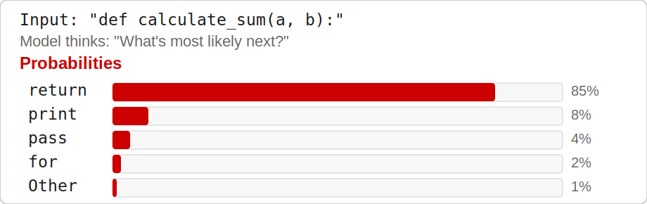

---

## Traditional Code vs. AI Model

| Traditional Code                         | AI Model                                   |
| ---------------------------------------- | ------------------------------------------ |
| Deterministic (same input → same output) | Probabilistic (different outputs possible) |
| You control the logic                    | You influence, but don't control           |
| Errors are bugs                          | Errors are features of probability         |
| Predictable behavior                     | Needs management via parameters            |

---

## Traditional vs. AI — Implication

**Implication:** Never trust a single run as ground truth.

---

## What Determines AI Output?

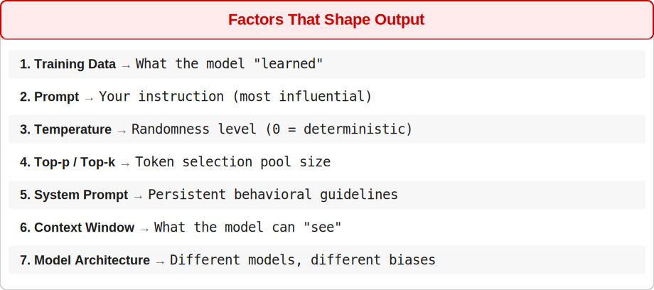

---

## Key Parameters You Control

| Parameter       | What It Does                                 | Best For                              |
| --------------- | -------------------------------------------- | ------------------------------------- |
| **Temperature** | Randomness (0 = deterministic, 1 = creative) | Bug fixes (low), brainstorming (high) |
| **Top-p**       | Nucleus sampling – limits token pool         | Balanced responses                    |
| **Max Tokens**  | Limits response length                       | Controlling cost                      |

---

## Key Parameters — Example Values

```python
temperature: 0.2   # focused
top_p: 0.9         # balanced
max_tokens: 4000   # cap length
```

---

## Temperature Impact

Same prompt: _"Write a function to reverse a string"_

```python
# Temperature 0.1 — very deterministic
def reverse_string(s):
    return s[::-1]

# Temperature 0.7 — balanced (adds edge cases)
def reverse_string(s):
    if not s: return s
    return s[::-1]

# Temperature 1.2 — creative, potentially unstable
def flip_the_text(text): ...
```

---

## The Training Gap

Models are frozen at their training cutoff date. They don't know:

- Code written after their training date
- Your company's internal APIs
- Your specific architecture decisions
- Recent library updates (unless in context)

**Implication:** You must provide this information in the prompt or context.

---

<!-- _class: lead -->

# Lesson 1.2

## Hallucinations

_Concept · 10 minutes_

---

## What Are Hallucinations?

> Confident-sounding outputs that are **factually wrong**, made up, or don't exist.

Most dangerous form: the model sounds **completely confident** while being **completely wrong**.

---

## Hallucinations in Code

| Type                   | Example                        | How to Spot               |
| ---------------------- | ------------------------------ | ------------------------- |
| **Fake APIs**          | `import nonexistent_library`   | Check docs; import fails  |
| **Wrong parameters**   | Incorrect function signature   | Type checking             |
| **Invented methods**   | `list.reverse_in_place()`      | Know the standard library |
| **Confident nonsense** | "This is the standard way to…" | Cross-reference           |
| **Outdated syntax**    | Old Python 2 style             | Know version differences  |

---

## Why Models Hallucinate

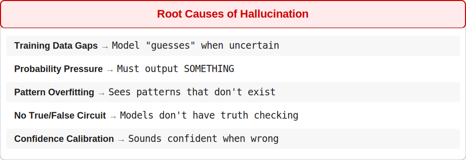

---

## Example: Confident Wrong

```python
User: "How do I use requests for async calls?"

# Hallucinated (confident, wrong)
import requests.async as async_requests
response = await async_requests.get('https://api.example.com')

# Reality: requests does NOT have async support.
# Correct answer: Use httpx or aiohttp
```

---

## Hallucination Mitigation Strategies

| Strategy                 | How It Works                | Example                              |
| ------------------------ | --------------------------- | ------------------------------------ |
| **Grounding**            | Provide source material     | Paste library docs into context      |
| **Verification**         | Ask for citations           | "Which line of the docs shows this?" |
| **Constrained decoding** | Limit possible outputs      | JSON mode, regex patterns            |
| **Self-consistency**     | Ask multiple times, compare | Run same prompt 3×, take majority    |
| **Low temperature**      | Reduce randomness           | `temperature: 0.1`                   |
| **Tool use**             | Let model search/lookup     | Enable web search for docs           |

---

## Hallucination Detection Checklist

Before accepting AI-generated code, verify:

- Do the imported libraries exist?
- Are function signatures correct?
- Does the syntax match my language version?
- Are there obvious logic errors?
- Would this code actually run?
- Does the model cite sources you can verify?

---

## The Developer's Mindset

> _"Trust, but verify – especially when the AI sounds most confident."_

- Hallucinations decrease with better prompts and context
- They never fully disappear
- You are the human-in-the-loop responsible for verification
- Experience helps you "smell" potential hallucinations

---

<!-- _class: lead -->

# Lesson 1.3

## Tokens and Pricing

_Concept · 10 minutes_

---

## What Is a Token?

| Language | Example                     | Token Count                  |
| -------- | --------------------------- | ---------------------------- |
| English  | "Hello world"               | 2 tokens (~0.75 words/token) |
| English  | "Congratulations"           | 1 token                      |
| Code     | `function calculateTotal()` | ~5 tokens (~2–4 chars/token) |
| Chinese  | "你好世界"                  | 4–8 tokens                   |

---

## Why Tokens Matter

A token is the atomic unit of processing for LLMs — not a word, not a character.

You pay per token · Context windows are measured in tokens · Token limits determine how much code the AI can "see"

---

## Input vs. Output Pricing

**Input tokens** (prompt, code context, retrieved docs) cost **less** than **output tokens** (generated code and explanations).

Output is often **5–8× more expensive** — generation is more compute-intensive than reading.

---

## Model Pricing Examples

| Model             | Input (per 1M) | Output (per 1M) | Output/Input |
| ----------------- | -------------: | --------------: | -----------: |
| GPT-5 Mini        |          $0.25 |           $2.00 |           8× |
| Claude 4.5 Haiku  |          $1.00 |           $5.00 |           5× |
| GPT-5.3 Codex     |          $1.75 |          $14.00 |           8× |
| Gemini 3.1 Pro    |          $2.00 |          $12.00 |           6× |
| Claude 4.6 Sonnet |          $3.00 |          $15.00 |           5× |
| Claude 4.7 Opus   |          $5.00 |          $25.00 |           5× |
| GPT-5.5           |          $5.00 |          $30.00 |           6× |

---

## What 1 Million Tokens Looks Like

| Content Type         | Approximate Amount            |
| -------------------- | ----------------------------- |
| Plain English text   | ~750,000 words (~1,500 pages) |
| Python code          | ~250,000–500,000 lines        |
| Average conversation | 5–10 sessions                 |
| Full codebase        | Small to medium project       |

---

## Cost Calculation Example

```python
prompt_tokens = 5000    # instructions + context
output_tokens = 2000    # AI response

model = "claude-4.6-sonnet"
input_price  = 3.00     # per 1M tokens
output_price = 15.00    # per 1M tokens

input_cost  = (5000 / 1_000_000) * 3.00
output_cost = (2000 / 1_000_000) * 15.00
total_cost  = input_cost + output_cost   # ~$0.045 (4.5 cents)
```

---

## Cost Optimization Strategies

| Strategy               | How It Works                | Impact             |
| ---------------------- | --------------------------- | ------------------ |
| **Use cheaper models** | Mini/Haiku for simple tasks | 5–20× reduction    |
| **Reduce context**     | Only send relevant code     | 2–5× reduction     |
| **Cache responses**    | Reuse common answers        | Variable           |
| **Batch operations**   | Combine multiple tasks      | 30–50% reduction   |
| **Monitor usage**      | Track spending per user     | Prevents surprises |
| **Set limits**         | Monthly spending caps       | Budget protection  |

---

## Real-World Cost Bounds

| Usage Level | Monthly Cost | What You Can Do                          |
| ----------- | ------------ | ---------------------------------------- |
| Light       | $10–20       | Occasional questions, small fixes        |
| Medium      | $50–100      | Daily coding, regular agent use          |
| Heavy       | $200–500     | Full-time AI assistance, multiple agents |
| Enterprise  | $1000+       | Team usage, automation, CI/CD            |

---

## The Cache Effect

Models can cache frequently used content:

- **Cache Write:** Cost to initially store
- **Cache Read:** **Much cheaper** than fresh input (80–95% savings)

```python
# First request  → pays full input price
# Second request → same context → pays cache read price
```

Context discipline = cost discipline.

---

<!-- _class: lead -->

# Lesson 1.4

## Context

_Concept · 12 minutes · The single most valuable AI skill_

---

## What Is Context?

Context = all the information the model has access to when generating a response.

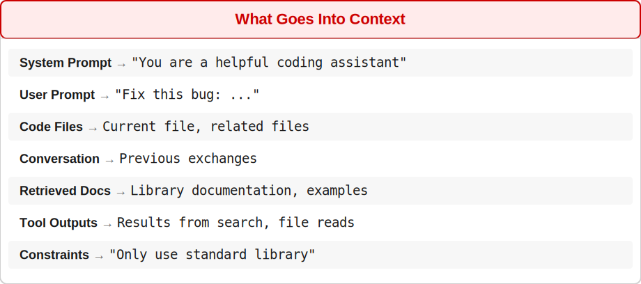

---

## The Context Window Limit

| Model                            | Context Window | Pages of Text | Lines of Code |
| -------------------------------- | -------------: | ------------: | ------------: |
| Claude 4 (Haiku / Sonnet / Opus) |           200k |          ~150 |       ~50,000 |
| GPT-5 Mini / GPT-5.3 Codex       |           272k |          ~200 |       ~70,000 |

---

## Context Window — What Happens When Full

**When you exceed context:** Oldest content gets truncated · Critical information may be dropped

**Context engineering** = knowing what to put in, what to leave out, and how to structure it.

---

## Context Checklist

Before every AI interaction, ask:

- What problem am I trying to solve?
- What files/code does the model need to see?
- What would a human need to know to help me?
- What information can I safely leave out?
- Is my context under the token limit?
- Have I included relevant error messages?
- Have I specified constraints (libraries, version, style)?

---

## Good vs. Bad Context — Bad Example

**BAD (vague):**

```
"Fix this bug: my code doesn't work"
```

---

## Good vs. Bad Context — Good Example

**GOOD (specific):**

```
Python function sorts dicts by key but raises KeyError.
Code: def sort_by_key(data, key): ...
Input: [{'name': 'Alice'}, {'age': 30}]
Using Python 3.11. Expected: skip dicts without the key.
```

---

## Context Prioritization Pyramid

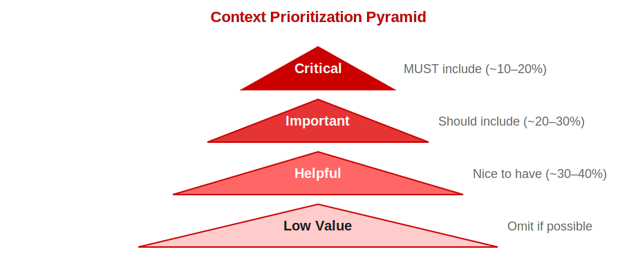

---

## Context Window Management

| Strategy                | How It Works                         | When to Use          |
| ----------------------- | ------------------------------------ | -------------------- |
| **Summarization**       | Compress earlier conversation        | Long sessions        |
| **Selective inclusion** | Only relevant files                  | Large codebases      |
| **Chunking**            | Split across multiple calls          | Exceeding limit      |
| **Hierarchical**        | Summaries + details on demand        | Complex projects     |
| **Vector retrieval**    | Semantic search for relevant context | Very large codebases |

---

## The "Lost in the Middle" Problem

Models pay **most attention to the beginning and end** of context, and **less to the middle**.

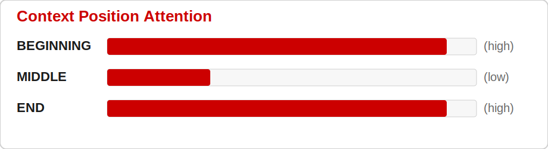

**Implication:** Put critical information at the beginning OR end, not the middle.

---

<!-- _class: lead -->

# Lesson 1.5

## Tool Calling and MCP

_Concept · 8 minutes_

---

## What Is Tool Calling?

Tool calling (function calling) lets the AI request execution of external functions.

The AI **doesn't execute code** — it outputs a structured request that **your system** executes.

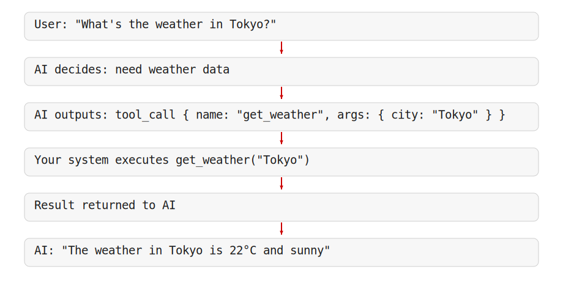

---

## Common Tool Types in Development

| Tool             | Purpose            | Example                          |
| ---------------- | ------------------ | -------------------------------- |
| **read_file**    | Read code files    | "Show me the auth module"        |
| **edit_file**    | Modify code        | "Add error handling to line 42"  |
| **search_code**  | Find patterns      | "Find all uses of this function" |
| **run_terminal** | Execute commands   | "Run the tests"                  |
| **web_search**   | Find documentation | "Look up pandas DataFrame API"   |
| **browser**      | Browse web pages   | "Open the PR and review it"      |
| **git**          | Version control    | "Create a branch and commit"     |

---

## MCP (Model Context Protocol)

> _"USB-C for AI — one protocol that works across different tools."_

**Without MCP:** Each tool needs custom integration

**With MCP:** Tools advertise their capabilities; AI discovers them dynamically

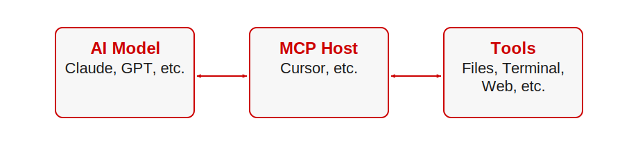

---

## Why MCP Matters

| Benefit              | Explanation                                |
| -------------------- | ------------------------------------------ |
| **Interoperability** | Same tools work across different AI models |
| **Discoverability**  | AI can learn what tools are available      |
| **Standardization**  | One protocol, not dozens of custom APIs    |
| **Extensibility**    | Add new tools without changing AI logic    |

---

## Tool Calling Best Practices

1. **Define clear tool schemas** — name, description, parameters
2. **Validate tool calls** before execution — allowlist + parameter checks
3. **Set timeouts** — e.g., 30 seconds max per tool
4. **Log all tool calls** — audit trail for debugging
5. **Require human approval** for destructive actions — never auto-run writes/deletes

---

<!-- _class: lead -->

# Lesson 1.6

## Agents

_Concept · 8 minutes_

---

## Agent vs. Chatbot

| Aspect          | Chatbot                              | Agent                             |
| --------------- | ------------------------------------ | --------------------------------- |
| **Interaction** | Single turn or simple back-and-forth | Multi-step, goal-oriented         |
| **Control**     | User drives each step                | Agent plans and executes          |
| **Memory**      | Limited to conversation              | Can maintain state across steps   |
| **Actions**     | None (text only)                     | Can call tools, modify files      |
| **Autonomy**    | None                                 | Goal-directed autonomy            |
| **Example**     | "Explain this code"                  | "Fix all bugs in this repository" |

---

## The Agent Loop

---

## The Agent Loop — Diagram

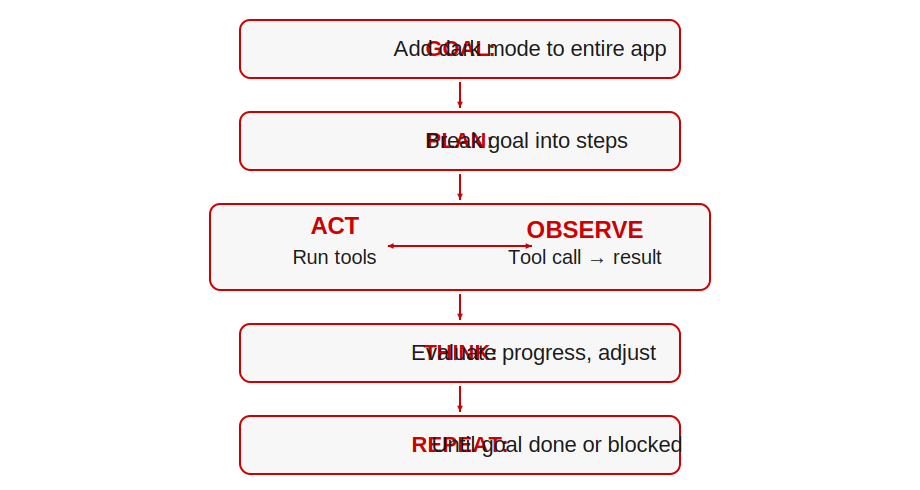

---

## Levels of Agent Autonomy

| Level  | Name        | Description                            | Example                    |
| ------ | ----------- | -------------------------------------- | -------------------------- |
| **L1** | Assistant   | Responds, needs step-by-step guidance  | Basic chatbot              |
| **L2** | Tool-caller | Can request tools, human approves      | Cursor Agent with approval |
| **L3** | Planner     | Makes plans, executes with supervision | Auto-code review           |
| **L4** | Autonomous  | Self-directed, minimal supervision     | CI/CD agent                |
| **L5** | Full Agent  | Complete task ownership                | Enterprise automation      |

---

## How Agents Change Your Role

**Traditional:**

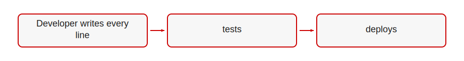

**Agent-Assisted:**

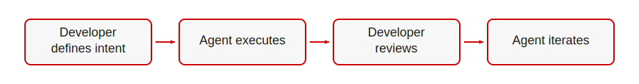

---

## Developer Role Shift

| Old Role       | New Role           |
| -------------- | ------------------ |
| Code writer    | Intent specifier   |
| Debugger       | Quality reviewer   |
| Implementation | Orchestration      |
| Manual testing | Acceptance testing |
| Problem solver | Problem framer     |

---

## When to Use Agents

**Good for agents:**

- Large, multi-step tasks · Repetitive patterns
- Well-defined with clear success criteria
- Low-risk changes · Documentation updates

**Bad for agents:**

- Security-critical systems · Unrecoverable actions
- Poorly defined goals · Real-time requirements
- High cost of failure

---

## Module Summary

| Lesson | Topic              | Key Insight                                                |
| ------ | ------------------ | ---------------------------------------------------------- |
| 1.1    | How AI Models Work | Probabilistic, not deterministic – manage with temperature |
| 1.2    | Hallucinations     | Models invent confidently – always verify                  |
| 1.3    | Tokens and Pricing | Output costs more – optimize context, use cheaper models   |
| 1.4    | Context            | Single most valuable skill – quality in = quality out      |
| 1.5    | Tool Calling & MCP | AI requests actions, you control execution                 |
| 1.6    | Agents             | Goal-directed action – changes developer role              |

---

<!-- _class: lead -->

# Up Next: Module 2

## Cursor Editor Essentials · Day 1 (Hands-On)

> Now that you understand how AI models think, what they cost, and how agents work, **Module 2: Cursor Editor Essentials** covers core editor workflows — codebase orientation, diffs, Plan Mode, @mentions, and terminal integration.

_End of Module 1_
