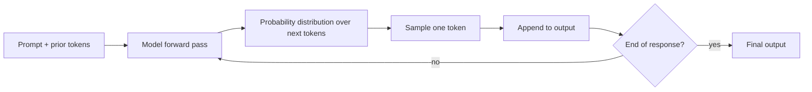
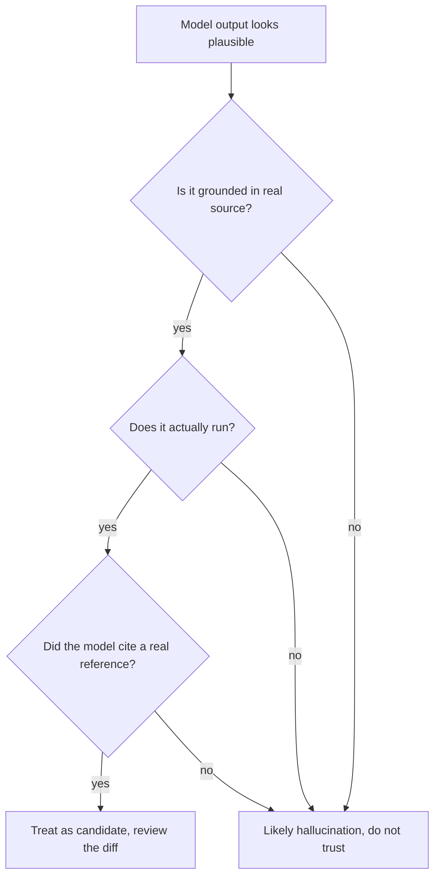
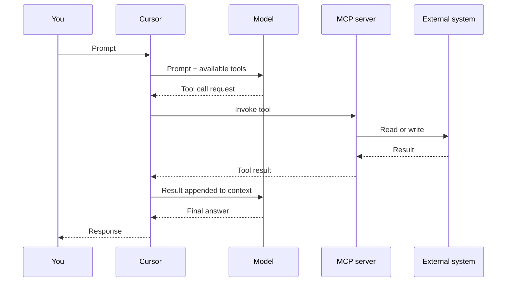

# Module 1 — Mental Models for AI-Assisted Development

> **Instructor deck spec.** Source of truth for the Figma Slides build of Module 1.
> Mapped 1:1 to `TABLE_OF_CONTENTS.md` lines 81–93 (Module 1 topics), lines 70–80 (Day 1 outcomes), lines 40–49 (program goals).
> Audience: working software engineers, tech leads, senior developers (TOC lines 22–26).
> Format: concept block, ~60 min, no exercises (Module 2 onward is hands-on).

---

## Deck-level decisions

- **15 slides** (was 14; 1.4 Context expanded to 3 slides because it is the headline mental model).
- **3 embedded diagrams**, generated separately via `generate_diagram` and placed on slides 4, 5, 10.
- **Speaker notes**: full ~150-word instructor scripts, not bullet hints. Each script is the spoken version of the slide.
- **Sections** (Figma Slides rows): four sections, named *Intro · Six Models · Wrap · Reference*.
  - Row 0 *Intro*: slides 1–3
  - Row 1 *Six Models*: slides 4–11
  - Row 2 *Wrap*: slides 12–14
  - Row 3 *Reference*: slide 15
- **Visual system**: deferred. This deck uses Figma Slides default light theme. A follow-up pass (`figma-generate-library` skill) will define shared tokens before Modules 2–10 are built, so all ten decks share one system.

---

## Slide-by-slide

### Slide 1 — Title · *Section: Intro*

- **Title:** Mental Models for AI-Assisted Development
- **Body:**
  - Module 1 · Day 1
  - Cursor Training Program
  - Concept block · ~60 min

**Instructor script (~150 words).** Welcome to Module 1. Over the next hour we are not going to write any code. That is deliberate. Everything you will do for the rest of the two days — driving the Cursor Agent through an unfamiliar codebase, designing changes in Plan Mode, customizing Cursor for your team, calling the Cursor APIs from a CI pipeline — sits on six mental models that we will work through here. People who have these models internalized treat AI as a reliable, inspectable collaborator. People who do not treat it as a slot machine. The difference is not talent and it is not the tool; it is whether you understand what is actually happening when you prompt a model. So: no exercise until Module 2. Just the six ideas. Ask questions whenever something does not land — the more we anchor these models now, the more leverage you get for the next thirteen hours.

---

### Slide 2 — Why this module exists · *Section: Intro*

- **Body:**
  - You are about to spend two days driving AI at production quality.
  - Without the right mental models, AI feels like luck.
  - With them, AI feels like an inspectable collaborator.

**Instructor script (~150 words).** I want to be specific about the promise here. By the end of today you will navigate an unfamiliar codebase with the Agent, make a safe reviewable change, use Plan Mode to design something larger before writing it, switch fluidly between Ask and Agent modes, and customize Cursor with Rules and Skills. By the end of tomorrow you will launch Cloud Agents from the UI and programmatically, handle webhooks, pull team usage from the Admin and Analytics APIs, and attribute AI versus human contributions per commit. That is a lot of surface area. None of it works reliably without the six mental models we are about to cover. If you only remember one thing from this hour, remember this: the lever you have on an AI tool is not which model you pick — it is what context you feed it, and the next sixty minutes are about understanding why.

---

### Slide 3 — Agenda · *Section: Intro*

- **Body:**
  - 1.1 How AI Models Work
  - 1.2 Hallucinations
  - 1.3 Tokens and Pricing
  - 1.4 **Context** (3 slides)
  - 1.5 Tool Calling and MCP
  - 1.6 Agents

**Instructor script (~150 words).** Six models, in this order. One: how AI models actually produce output, and why the same prompt gives different answers. Two: hallucinations, the failure mode that gets engineers in the most trouble. Three: tokens and pricing, so you can reason about cost the way you reason about latency. Four: context — the single most valuable AI skill, and the only one I am spending three slides on. Five: tool calling and the Model Context Protocol, which is what turns a chatbot into something that can read your repo and run your tests. Six: agents — what the word actually means, and how it changes your day-to-day role. After this hour, every later module is one of these six ideas made concrete and hands-on. I will call them out by name when we get there so you can see the through-line.

---

### Slide 4 — 1.1 How AI Models Work · *Section: Six Models*

- **Title:** Outputs are probabilistic, not deterministic
- **Body:**
  - Same prompt → different outputs, by design.
  - Outputs are sampled from a distribution over tokens.
  - "Why did it do that?" usually has a probabilistic answer.
  - Implication: never trust a single run as ground truth.
- **Diagram:** *Token-by-token sampling flowchart* (see `### Diagram A` below).

**Instructor script (~150 words).** A model does not "answer" your prompt. At each step, it produces a probability distribution over the next token — a token being roughly a piece of a word — and then samples from that distribution. Sample, append, repeat. Two consequences. First: identical inputs can yield different outputs, because sampling is non-deterministic. That is not a bug, it is the design. Second: the model has no preferences and no intent. Its output is shaped entirely by its training data plus what you put in front of it right now. When someone asks "why did the model do that?", the honest answer is almost always probabilistic — the path it took was simply more likely given its inputs. This is why two engineers running the same prompt can get different code, and why you should never treat a single run as ground truth. Always be willing to run it again, or to look at the diff.

---

### Slide 5 — 1.2 Hallucinations · *Section: Six Models*

- **Title:** When the model invents things
- **Body:**
  - Hallucination = plausible output with no grounding.
  - In code: invented APIs, wrong signatures, fabricated file paths.
  - Spotting it: cross-check sources, run it, ask the model to cite.
  - Cursor's defense: real codebase context + tool calls + your review.
- **Diagram:** *Hallucination decision flow* (see `### Diagram B` below).

**Instructor script (~150 words).** A hallucination is when a model produces something fluent and plausible that has no grounding in reality. In coding contexts this is especially dangerous because the output looks like working code. The model invents an API that does not exist. It gives you the wrong signature for a function it actually has seen. It fabricates a file path that fits the project's naming convention but points nowhere. The output reads correctly, and the bug is silent until runtime. Three defenses, ordered cheapest first. One: cross-check against source — open the file, read the API. Two: run it — failing tests catch many hallucinations immediately. Three: ask the model to cite. Cursor's structural defense is that it grounds the model in your actual codebase via context and tool calls, and asks you to review every diff. We will exercise all three defenses repeatedly in Modules 2 through 4.

---

### Slide 6 — 1.3 Tokens and Pricing · *Section: Six Models*

- **Title:** What you actually pay for
- **Body:**
  - Tokens ≈ pieces of words. Input and output both count.
  - Long context, long files, long chats → more tokens.
  - Predictable cost = predictable context discipline.

**Instructor script (~150 words).** Pricing on AI tools is measured in tokens. Roughly: a token is a few characters, the average English word is about one and a third tokens, and code tends to tokenize at a similar rate. The number you pay for is input tokens plus output tokens. The input side includes everything the model sees — your prompt, the files you @-mentioned, the chat history, any rules attached, any tool results. The output side includes the entire response. So a long chat with several large file mentions can easily run thirty to fifty times more expensive than a focused one-shot prompt, even though it feels the same to type. The practical takeaway is not "use less context", it is "use the right context". Context discipline — which we cover next — is also cost discipline. In Module 9 we will look at the Admin API for capping spend at the team level, and the Analytics API for attributing it.

---

### Slide 7 — 1.4 Context (1 of 3) · The core skill · *Section: Six Models*

- **Title:** Context is the single most valuable AI skill
- **Body:**
  - The model only knows what it sees in this turn.
  - You decide what it sees. That is the lever.
  - Garbage context → garbage output, even with a great model.

**Instructor script (~150 words).** This is the slide to slow down on. The model has no memory across turns unless you provide it. It does not "know" your repo. It does not "remember" the conversation you had yesterday. Every turn, the model sees a window of text — that is its entire universe for this response. Whatever you put in that window determines the answer you get back. This is the lever. Not the model, not the prompt cleverness, not the framework: the contents of the context window. Engineers who get a lot out of AI tools all share one habit — they are deliberate about what they put in the window and what they leave out. They mention exactly the right files. They link to exactly the right past chat. They strip out the conversation when it has wandered. The rest of this hour, and the rest of Day 1, is about exercising that lever competently.

---

### Slide 8 — 1.4 Context (2 of 3) · The Cursor levers · *Section: Six Models*

- **Body:**
  - **@mentions** — files, symbols, branches, past chats *(Module 2.6)*
  - **Rules & Repository Instructions** — persistent context *(Module 4.1–4.2)*
  - **Ask Mode vs Agent Mode** — different context surfaces *(Module 3.1)*
  - **Plan Mode** — context built collaboratively before code is written *(Module 2.4)*

**Instructor script (~150 words).** Every customization tool Cursor gives you is, fundamentally, a context tool. @mentions let you put a specific file, a specific symbol, a specific git branch, or a past chat into the window — surgically. Rules let you put persistent instructions into the window every turn, without retyping them. Repository Instructions do the same at the project level. Ask Mode versus Agent Mode are two different default context surfaces — Ask sees what you mention, Agent sees what you mention plus what its tools discover. Plan Mode is collaborative context construction: you and the model build a plan, and the plan itself becomes the context for the actual implementation turn. Hold this frame in your head for the rest of today: when you wonder which Cursor feature to reach for, ask "what context does it put in the window?". That question almost always picks the right tool.

---

### Slide 9 — 1.4 Context (3 of 3) · Practical patterns · *Section: Six Models*

- **Title:** Three patterns to use today
- **Body:**
  - **Mention narrowly.** A symbol beats a file beats a folder.
  - **Reset when stuck.** New chat is cheaper than 20 turns of drift.
  - **Make context cheap to reproduce.** Save good context as a Rule or Skill.

**Instructor script (~150 words).** Three patterns that pay back immediately. First: mention as narrowly as you can. If you can mention a symbol, do not mention its file. If you can mention a file, do not mention its folder. Narrow context is sharper context. Second: reset when the chat starts drifting. If you have been going twenty turns and the model is making contradictory edits, start a fresh chat — the cost of re-establishing context is almost always lower than the cost of fighting accumulated noise. Third: when you discover a piece of context that consistently makes the model better — a coding standard, a build command, a domain explanation — make it cheap to reproduce. Save it as a Rule, a Skill, or a Repository Instruction. Then every future turn for every teammate gets that context for free. We will build all three of these in Module 4.

---

### Slide 10 — 1.5 Tool Calling and MCP · *Section: Six Models*

- **Title:** Models that take real actions
- **Body:**
  - Tool call = model decides to invoke a function and use the result.
  - MCP = a protocol for exposing tools to any AI client.
  - Examples in Cursor: file edits, terminal, browser, custom MCP servers.
  - This is what turns a chatbot into an *agent*.
- **Diagram:** *Tool-call sequence: model ↔ Cursor ↔ MCP server ↔ external system* (see `### Diagram C` below).

**Instructor script (~150 words).** Tool calling is what turns a chat model into something that can affect the real world. The model is given a list of available tools — read this file, edit this file, run this command, hit this API. Mid-response, it can decide to invoke a tool, see the result, and continue reasoning. That loop is what makes Cursor able to read your repo, run your tests, and check a webpage in the browser. MCP — the Model Context Protocol — is the standard for exposing tools to any AI client. It means a tool you write once can be used by Cursor, by another editor, by a CI agent, by a different vendor's client entirely. In Module 4 we will connect a custom MCP server hands-on. In Module 8 we will be on the other side of the boundary — the Cursor API itself is the integration surface a CI pipeline talks to.

---

### Slide 11 — 1.6 Agents · *Section: Six Models*

- **Title:** What an agent is — and what changes for you
- **Body:**
  - Agent = model + tools + a loop (plan → act → observe → repeat).
  - Your role shifts: from typing code to *directing* and *reviewing*.
  - New skills: prompting, planning, diffing, checkpointing, verifying.

**Instructor script (~150 words).** An agent is the combination of a model, a set of tools, and a loop that lets the model use those tools repeatedly until it decides it is done. Plan, act, observe, plan, act, observe. That is it. The interesting consequence is not technical — it is what it does to your day. You spend less time typing code and more time directing and reviewing. The skills that matter shift accordingly. Prompting becomes a craft, because prompts are now project briefs. Planning gets value because reviewing a plan is cheaper than reviewing a thousand-line diff. Diffing gets value, because reviewing the agent's output is now where bugs are caught. Checkpointing matters, because you want to roll back when an agent takes a wrong turn. Verifying matters, because the model is willing to claim it did something it did not actually do. The rest of the program is practice in these new skills.

---

### Slide 12 — Discussion prompts · *Section: Wrap*

- **Body:**
  - When have you seen a hallucination in your own work?
  - Where in your day does *bad context* cost you the most time?
  - Which of these six feels least intuitive?

**Instructor script (~150 words).** Five minutes for discussion. I want you to ground these models in your own work before we move on. Three questions, pick whichever resonates. One: hallucinations — when have you caught a model inventing something? What were the cues? Two: context — where in your day does bad context cost you the most? My bet is on debugging unfamiliar code, but I am curious to hear yours. Three: which of the six models feels the least intuitive to you? That is the one to flag — I will make a note and we will revisit it in the Day 1 wrap-up. There are no wrong answers. The point of this discussion is to anchor the abstract to your actual work so that when we hit Module 2 and start driving the Agent through a real repo, you have already mapped these ideas onto something concrete.

---

### Slide 13 — Recap · *Section: Wrap*

- **Body:**
  - Six mental models: **Probabilistic · Hallucinations · Tokens · Context · Tools/MCP · Agents**
  - **Context is the lever**; everything else is in service of it.
  - Every later module is one of these six, made concrete.

**Instructor script (~150 words).** Quick recap. Six models. Probabilistic outputs — same input, different output, by design. Hallucinations — fluent fabrication, defended against by grounding, running, and citing. Tokens — what you pay for, on both sides of the conversation, and the reason context discipline is also cost discipline. Context — the lever, the one skill that matters more than the others. Tools and MCP — what turns a chatbot into an agent. Agents themselves — model plus tools plus loop, and the role shift from typing to directing. If I have done my job, you will hear me name these six by name across the rest of today and tomorrow. Watch for it. When we get to Plan Mode, that is Context. When we get to MCP setup, that is Tools. When we get to Cloud Agents, that is Agents at scale. The vocabulary travels.

---

### Slide 14 — Up next: Module 2 · *Section: Wrap*

- **Title:** Cursor Editor Essentials · 90 min hands-on
- **Body:**
  - Orient an agent to an unfamiliar repo.
  - Make a safe, reviewable change.
  - Use Plan Mode and Checkpoints.
  - Compare models head-to-head.

**Instructor script (~150 words).** Energy shift now — concept block is over. The next ninety minutes are hands-on. You will open the Cursor Agent on an unfamiliar repository, orient yourself, make a small reviewable change, and we will look at your diff together. We will use Plan Mode for something a little larger to see how it changes the shape of the conversation. We will hit a Checkpoint, take an experimental detour, and roll back. And we will compare two different models on the same task so you can see how model choice actually feels in your hands rather than on a benchmark. Everything you do in Module 2 will be an exercise of the context lever from this module. When something goes well, ask yourself which mental model from this hour explains why. When something goes badly, same question. Take a five-minute break, refill your coffee, and we will start.

---

### Slide 15 — Reference / Speaker backup · *Section: Reference*

- **Body:**
  - Program goals (TOC lines 42–49).
  - Day 1 outcomes (TOC lines 72–80).
  - Cross-reference: where each of the six models resurfaces later.

**Instructor script (~150 words).** Speaker reference slide, hidden in delivery, visible in the speaker handout export. The cross-reference grid maps each of the six mental models to the later modules where it shows up concretely. Probabilistic outputs: Module 2.5 (comparing two models), Module 3.4 (effective prompting). Hallucinations: Module 2.2 (explaining a specific symbol), Module 3.3 (terminal tool as ground truth). Tokens: Module 9.3 (spend limits), Module 9.4 (model usage analytics). Context: every module on Day 1, and Modules 7 through 10 on the API side. Tools and MCP: Module 3.2 and 3.3 (Cursor's built-in tools), Module 4.4 (custom MCP). Agents: Module 3 (modes), Module 6 (Cloud Agents in the UI), Module 8 (Cloud Agents API). Use this grid when an attendee asks "where do we cover X again?" — it lets you answer without flipping through the TOC live.

---

## Diagrams

These three Mermaid sources are ready to feed into `generate_diagram`. They follow the universal constraints from the `figma-generate-diagram` skill: no emojis, no `\n`, no HTML, no reserved-word node IDs, camelCase IDs.

### Diagram A — slide 4 — Token-by-token sampling (flowchart)



**Generate via:** `generate_diagram` with `name: "Token sampling"`, `mermaidSyntax` above. No architecture layout.

### Diagram B — slide 5 — Hallucination decision flow (flowchart)



**Generate via:** `generate_diagram` with `name: "Spotting a hallucination"`, `mermaidSyntax` above.

### Diagram C — slide 10 — Tool-call sequence (sequence diagram)

Per the skill's universal constraints, no `Note over` markers — they are silently stripped.



**Generate via:** `generate_diagram` with `name: "Model, Cursor, and MCP"`, `mermaidSyntax` above.

---

## Figma Slides build — execution plan

This deck is built in three phases. Auth-gated phases are marked `[needs Figma auth]`.

### Phase 0 — Generate the three diagrams `[needs Figma auth]`

Three `generate_diagram` calls, one per source above. Each returns a FigJam file URL. Copy each diagram's PNG export (or screenshot the diagram node) for embedding on slides 4, 5, 10.

> Use the same `fileKey` for all three so they live in one FigJam file, per the `figma-generate-diagram` skill's "reuse the same file" guidance.

### Phase 1 — Create the Slides file `[needs Figma auth]`

Per the `figma-create-new-file` skill:

1. Call `whoami` to resolve `planKey`. If multiple plans, ask the user.
2. Call `create_new_file` with:
   - `editorType: "slides"`
   - `fileName: "Module 1 — Mental Models for AI-Assisted Development"`
   - `planKey: <from step 1>`
3. Capture the returned `file_key`. All subsequent `use_figma` calls target this file.

Recall from the skill: a newly created Slides file has an **empty grid** — `figma.getSlideGrid()` returns `[]`. The first `createSlide()` implicitly creates row 0.

### Phase 2 — Build the deck `[needs Figma auth]`

Split the build into **5 `use_figma` calls**, each building 3 slides — keeps each call under the skill's 10-logical-op ceiling and produces visible progress between calls.

| Call | Slides | Section assignment |
|------|--------|--------------------|
| 1    | 1–3    | Row 0 → rename to *Intro*           |
| 2    | 4–6    | Row 1 → rename to *Six Models*      |
| 3    | 7–9    | Stays in row 1                      |
| 4    | 10–12  | Slides 10–11 in row 1; slide 12 starts row 2, rename to *Wrap* |
| 5    | 13–15  | Slides 13–14 in row 2; slide 15 starts row 3, rename to *Reference* |

#### Reusable per-slide build helper

This is the pattern every slide uses. Each `use_figma` call wraps it in a top-level `await` block and `return`s the created node IDs.

```js
// PATTERN — DO NOT execute as-is. Each phase below wraps this for its slides.
// Critical rules applied:
//   - skill figma-use rules 8, 12, 13 (font preload, appendChild before FILL, position away from 0,0)
//   - skill figma-use-slides rule 2  (appendChild BEFORE setting x/y on slide content)
//   - skill figma-use rule 15        (return all created node IDs)

async function buildSlide({ title, bodyLines, speakerScript, sectionName, isNewRow }) {
  const slide = figma.createSlide(); // implicitly appends to current row, or row 0 if grid is empty
  slide.name = title;

  // Title text
  const titleNode = figma.createText();
  slide.appendChild(titleNode);          // PARENT FIRST (slide rule 2)
  await figma.loadFontAsync({ family: "Inter", style: "Bold" });
  titleNode.fontName = { family: "Inter", style: "Bold" };
  titleNode.fontSize = 48;
  titleNode.characters = title;
  titleNode.x = 80;
  titleNode.y = 80;

  // Body text
  const bodyNode = figma.createText();
  slide.appendChild(bodyNode);
  await figma.loadFontAsync({ family: "Inter", style: "Regular" });
  bodyNode.fontName = { family: "Inter", style: "Regular" };
  bodyNode.fontSize = 24;
  bodyNode.characters = bodyLines.join("\n");
  bodyNode.x = 80;
  bodyNode.y = 180;

  // Speaker notes (Slides API: slide.speakerNotes)
  slide.speakerNotes = speakerScript;

  return { slideId: slide.id, titleId: titleNode.id, bodyId: bodyNode.id };
}
```

> If `slide.speakerNotes` is not the canonical API on the version of the plugin runtime in use, fall back to checking `figma.getSlideGrid()[r][c]` for the speaker-notes property and adjust. The `figma-use-slides` skill's `slide-properties` reference is the source of truth; load it before the first build call.

#### Section renaming (after the right row exists)

```js
const slideGrid = figma.currentPage.children.find(c => c.type === "SLIDE_GRID");
slideGrid.children[0].name = "Intro";
slideGrid.children[1].name = "Six Models";
slideGrid.children[2].name = "Wrap";
slideGrid.children[3].name = "Reference";
return { renamedRows: slideGrid.children.length };
```

#### Embedding diagrams on slides 4, 5, 10

After phase 0 produces the three diagrams in FigJam, the simplest embed path is:

1. Export each diagram as a PNG (FigJam → Export selected nodes → PNG).
2. In each target slide's `use_figma` call, create a `RECTANGLE`, set `fills` to an `IMAGE` paint with the PNG's image hash (use `figma.createImage(bytes)` if you have the bytes inline, or `figma.createImageAsync(url)` if you have a URL).
3. Place it at `x: 80, y: 320` with a sensible width.

If you would rather keep diagrams live (editable Mermaid → re-renders), leave a labeled placeholder rectangle on each slide and link out to the FigJam file from speaker notes. Either is defensible — pick based on whether instructors will edit diagrams during delivery.

### Phase 3 — Validate `[needs Figma auth]`

Per the `figma-use-slides` skill: `get_metadata` does **not** work on Slides files. Validate by:

1. A read-only `use_figma` script that returns the slide grid shape, slide names, and per-slide text content (use the "List all slides" snippet from the skill).
2. `get_screenshot` on slides 1, 4, 9, 10, 15 — covers each section and each diagram-bearing slide.
3. Visually confirm no clipped text and no overlapping bounding boxes.

---

## What's blocking the Figma push

Only one thing: Figma MCP authentication. Re-run the plugin's auth flow (or invoke `mcp_auth` for `plugin-figma-figma`) and ping me to proceed. Estimated time-to-built-deck after auth: ~10 minutes (3 diagram calls + 1 create + 5 build calls + 1 validate).

---

## Provenance

Content grounded in:

- `TABLE_OF_CONTENTS.md` lines 81–93 (Module 1 topic list)
- `TABLE_OF_CONTENTS.md` lines 70–80 (Day 1 outcomes)
- `TABLE_OF_CONTENTS.md` lines 40–49 (program goals)
- `TABLE_OF_CONTENTS.md` lines 94–108, 109–119, 120–131 (Module 2/3/4 forward references)
- `TABLE_OF_CONTENTS.md` lines 195–209, 210–219 (Modules 9/10 forward references for tokens/cost)

No facts about specific model names, prices, vendors, or accuracy numbers are claimed.
