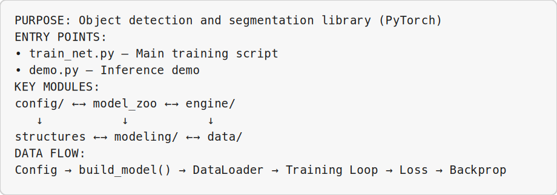
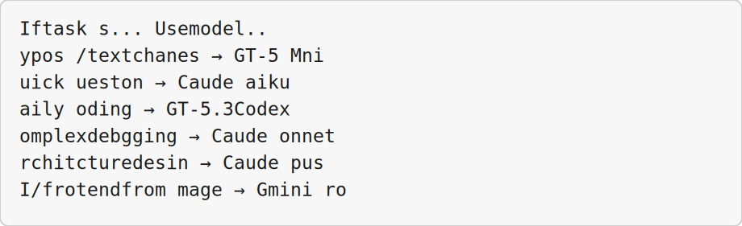
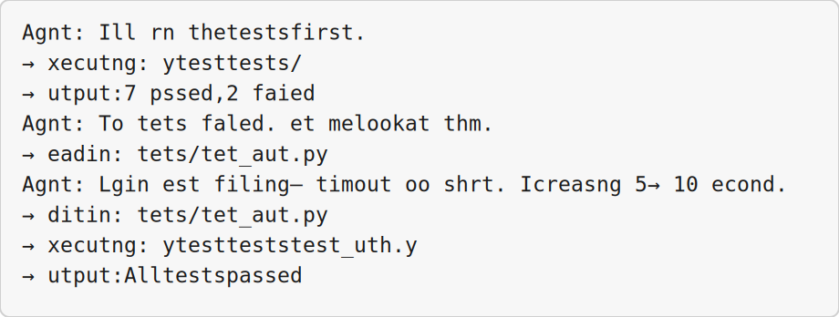
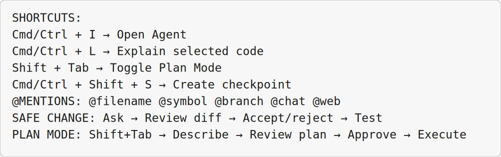

<!-- _class: lead -->

# Cursor Editor Essentials

## Module 2 · Day 1 (Hands-On)

Cursor Training Program · Hands-on exercise · ~90 min


---


<!-- _class: fit-md -->

## Module Overview

| Aspect | Details |
|--------|---------|
| **Duration** | ~90 minutes |
| **Format** | Hands-on exercise |
| **Prerequisites** | Module 1 completed, Cursor installed, Git repository access |
| **Module Goal** | Master the core workflows of AI-assisted coding in Cursor |


---


<!-- _class: fit-md -->

## Learning Objectives

By the end of this module, participants will be able to:

- Orient an AI agent to an unfamiliar codebase
- Get targeted explanations of specific files or symbols
- Make safe, reviewable changes using diff review
- Design complex changes with Plan Mode
- Compare models to choose the right one for each task
- Use @mentions for precise context control
- Navigate checkpoints as a safety net
- Let agents run terminal commands and react to output


---


<!-- _class: fit-xs -->

## Agenda

| Lesson | Topic | Time |
|--------|-------|------|
| 2.1 | Codebase Understanding | 20 min |
| 2.2 | Explaining Files/Symbols | 13 min |
| 2.3 | Safe Reviewable Changes | 13 min |
| 2.4 | Plan Mode | 13 min |
| 2.5 | Comparing Models | 13 min |
| 2.6 | @mentions | 13 min |
| 2.7 | Checkpoints | 8 min |
| 2.8 | Terminal Integration | 13 min |


---


<!-- _class: lead -->

# Lesson 2.1

## Codebase Understanding

*Concept · 8 min · Exercise · 12 min*


---


## The Problem & The Solution

**The Problem:** Opening a new codebase is overwhelming. Where do you start? What's the entry point?

**The Cursor Solution:** Ask the agent to explain the codebase. It reads files, traces connections, and returns a roadmap.

> *"Drop an agent into a codebase you've never seen and get a coherent explanation of how it works."*


---


<!-- _class: fit-md -->

## Exercise 2.1 — Steps 1–2

**Step 1:** Open an unfamiliar repository in Cursor

**Windows (PowerShell)** in Cursor's integrated terminal (``Ctrl+` `` → **PowerShell**):

```bash
git clone https://github.com/facebookresearch/detectron2
cd detectron2
cursor .
```

**Step 2:** Open the Agent panel — ``Ctrl+I``


---


<!-- _class: fit-xs -->

## Exercise 2.1 — Step 3: Orientation Prompt

```
Explain this codebase to me as if I'm a new team member.

Specifically tell me:
1. What is the main purpose of this project?
2. What are the entry points (main scripts, CLI, API)?
3. What are the key modules and how do they relate?
4. What are the main dependencies?
5. What files should I read first to understand the architecture?
```


---


## Exercise 2.1 — Step 4: Trace Data Flow

**Step 4:** Follow up — trace data flow:

```
Based on what you just told me, trace the flow of data from input
to output. What functions get called in order?
```


---


## Exercise 2.1 — Step 5: Visual Overview

**Step 5:** Ask for a visual overview:

```
Create an ASCII diagram showing the module relationships in this codebase.
```


---


<!-- _class: fit-sm -->

## Expected Agent Output (Sample)




---


## Pro Tip — Save the Overview

**Pro Tip:** Save the agent's explanation as a project note:

```
Save this explanation as .cursor/project-overview.md so future
team members can read it.
```


---


## Exercise 2.1 — Success Criteria

**Success Criteria:**
- Agent described project purpose
- Agent identified entry points and key modules
- Agent suggested first files to read


---


<!-- _class: lead -->

# Lesson 2.2

## Explaining a Specific File or Symbol

*Concept · 5 min · Exercise · 8 min*


---


## Targeted Explanations

> *"Don't make the agent read the whole codebase when you just need to understand one function."*

Use **precise context** — select a function or class, then ask focused questions.


---


<!-- _class: fit-sm -->

## Exercise 2.2 — Steps 1–3

**Step 1:** Open a specific file in your project

**Step 2:** Select a function or class you want explained

**Step 3:** Use the Agent with precise context:

```
Explain the function I have selected. For each major section, tell me:
- What it does
- Why it's designed that way (trade-offs)
- Potential edge cases or bugs
- How it could be improved
```


---


## Exercise 2.2 — Step 4: Example I/O

**Step 4:** Ask for a concrete example:

```
Give me a concrete example of inputs and outputs for this function.
Show me what happens in the normal case and one edge case.
```


---


## Exercise 2.2 — Step 5: Dependencies

**Step 5:** Ask about dependencies:

```
What other functions does this call? What calls this function?
Trace the call chain two levels in each direction.
```


---


<!-- _class: fit-md -->

## Inline Explanation Shortcut

```bash
# Select code, press Cmd+L (or Ctrl+L)
# The agent explains the selected code in the chat panel
```

**Success Criteria:**
- Selected specific code · Agent explained the selection
- Agent provided input/output examples · Agent traced call dependencies


---


<!-- _class: lead -->

# Lesson 2.3

## Making a Safe, Reviewable Change

*Concept · 5 min · Exercise · 8 min*


---


## The Diff Review Workflow

1. Ask agent to propose a change
2. Review the diff (what's added/removed)
3. Accept or reject changes
4. Test after acceptance

> *"Before AI changes your code, see exactly what will change and approve it."*


---


<!-- _class: fit-sm -->

## Exercise 2.3 — Steps 1–2

**Step 1:** Ask for a small, safe change:

```
Change the welcome message in index.html from "Hello World"
to "Welcome to My App"
```

**Step 2:** Watch the agent generate the diff:

```
📝 Changes to index.html:

  <h1>- Hello World</h1>
  <h1>+ Welcome to My App</h1>

Accept? [Yes] [No] [Edit]
```


---


## Exercise 2.3 — Review Questions

Before accepting, ask yourself:

- Are the changes **only** what I asked for?
- Are there unexpected additions or deletions?
- Does the syntax look correct?
- Will this break anything else?

**Step 4:** Accept · **Step 5:** Test manually


---


## Exercise 2.3 — Test After Accept

**Windows (PowerShell) — use these in the demo:**

```powershell
start index.html          # open HTML in default browser
python script.py          # run Python script
npm start                 # Node/React dev server
```

**Other platforms:** Mac — `open index.html` · same `python` / `npm` commands.


---


## Exercise 2.3 — If Something Goes Wrong

```
That change didn't work. The button disappeared.
Please explain what happened and suggest a fix.
```

**Success Criteria:**
- Agent proposed a change · Reviewed diff before accepting
- Accepted only after verification · Tested the change


---


<!-- _class: lead -->

# Lesson 2.4

## Plan Mode

*Concept · 5 min · Exercise · 8 min*


---


## Design Before You Code

Plan Mode makes the agent create a **detailed plan BEFORE writing any code**.

**When to use Plan Mode:**
- Changing multiple files · Adding a new feature
- Refactoring existing code
- You're not 100% sure of the best approach
- The change is risky or hard to undo


---


## Exercise 2.4 — Step 1: Enable Plan Mode

**Step 1:** Enable Plan Mode (Shift+Tab in the Agent input):

```bash
# Press Shift+Tab in the Agent input
# The input border changes color to indicate Plan Mode
```


---


<!-- _class: fit-sm -->

## Exercise 2.4 — Step 2: Describe Change

**Step 2:** Describe a complex change:

```
Add user authentication to this web app.

Requirements:
- Email/password login · Session management
- Protected routes (dashboard, settings)
- Logout functionality · "Remember me" option

Don't write code yet – just give me a plan.
```


---


<!-- _class: fit-xs -->

## Exercise 2.4 — Step 3: Review the Plan

**Step 3:** Review the agent's plan — a good plan includes:

```
📋 IMPLEMENTATION PLAN

Step 1: Create User Model — models/user.js
Step 2: Auth Routes — routes/auth.js (login, logout, register)
Step 3: Session Management — middleware/session.js
Step 4: Protected Route Middleware — middleware/auth.js
Step 5: Update Frontend — pages/login.html, dashboard.html
Step 6: Environment Variables — .env (SESSION_SECRET, REDIS_URL)

Questions for you:
1. JWT or server-side sessions?
2. Existing user database?
3. Include email verification?

Ready to proceed? [Yes] [No] [Modify Plan]
```


---


## Exercise 2.4 — Approve & Execute

**Step 4:** Answer questions and approve:

```
Use JWT for simplicity. No existing database yet – use SQLite for now.
Skip email verification for this version. Proceed.
```

**Step 5:** Watch the agent execute the plan step by step


---


## Exercise 2.4 — Success Criteria

**Success Criteria:**
- Enabled Plan Mode (Shift+Tab)
- Agent created structured plan
- Agent asked clarifying questions
- Approved plan before code was written


---


<!-- _class: lead -->

# Lesson 2.5

## Comparing Two Models

*Concept · 5 min · Exercise · 8 min*


---


<!-- _class: fit-sm -->

## Model Selection Guide

| Task Type | Recommended Model | Why |
|-----------|-------------------|-----|
| Typo fixes, simple edits | GPT-5 Mini | Cheap, fast, good enough |
| Daily coding, bug fixes | **Composer 2.5** or GPT-5.3 Codex | Best value in Cursor; built for agent tools |
| Complex logic, architecture | Claude Opus or GPT-5.5 | Smartest, but expensive |
| Frontend/visual work | Gemini 3.1 Pro | Can see images |
| Fast, simple questions | Claude Haiku | Fastest responses |

**Model reference:** [`docs-content-readmes/010-docs-models-cursor-composer-2-5.md`](../docs-content-readmes/010-docs-models-cursor-composer-2-5.md)


---


## Exercise 2.5 — Compare Two Models

**Step 1:** Set model to **Composer 2.5** (`/model composer-2.5`), ask:

```
Explain what a closure is in JavaScript with a practical example.
```

**Step 2:** Copy the response

**Step 3:** Switch to GPT-5 Mini — ask the **same question**

**Step 4:** Compare responses side by side


---


<!-- _class: fit-md -->

## Exercise 2.5 — Comparison Table

| Comparison Point | Composer 2.5 | GPT-5 Mini |
|-----------------|---------------|------------|
| Length | | |
| Code example quality | | |
| Explanation clarity | | |
| Speed | | |


---


<!-- _class: fit-xs -->

## Exercise 2.5 — Cost & Decision Matrix

**Step 5:** Check token usage at bottom of chat after each request

**Step 6:** Create a personal decision matrix:




---


## Exercise 2.5 — Success Criteria

**Success Criteria:**
- Same question to two models
- Compared quality and speed
- Created personal model-selection guide


---


<!-- _class: lead -->

# Lesson 2.6

## Precise Context with @mentions

*Concept · 5 min · Exercise · 8 min*


---


<!-- _class: fit-xs -->

## @mention Types

| @mention | What It Does | Example |
|----------|--------------|---------|
| `@filename` | Include specific file | `@auth.py` |
| `@symbol` | Include function/class | `@UserModel` |
| `@branch` | Reference git branch | `@main` |
| `@chat` | Reference past conversation | `@previous-chat` |
| `@folder` | Reference entire directory | `@/src/utils` |
| `@web` | Search the web | `@web pandas DataFrame` |

> *"Laser-targeting instead of spraying the whole codebase."*


---


## Exercise 2.6 — Steps 1–2

**Step 1:** Use @filename to point at a specific file:

```
@database.py What are the security vulnerabilities in this database connection?
```

**Step 2:** Use @symbol to reference a specific function:

```
@calculate_total This function is returning NaN sometimes. Why?
```


---


## Exercise 2.6 — Step 3: Multiple @mentions

**Step 3:** Combine multiple @mentions:

```
@auth.py @UserModel @login_handler Review the authentication flow.
Are there any race conditions or timing attacks?
```


---


## Exercise 2.6 — Step 4: @branch

**Step 4:** Use @branch to reference a different branch:

```
Compare @main and @feature/payment branches.
What are the key differences in the payment handling code?
```


---


## Exercise 2.6 — Step 5: @chat

**Step 5:** Use @chat to refer to a previous conversation:

```
@chat(authentication-discussion) Based on that discussion,
implement the fix we agreed on.
```


---


## Exercise 2.6 — Steps 6–7: @folder & @web

**Step 6:** Use @folder for directory-level context:

```
@src/components Find all components that don't have loading states.
```

**Step 7:** Use @web for external documentation:

```
@web React 19 useTransition hook How do I use it?
```


---


## @mention Pro Tips

- Start typing **@** — Cursor auto-suggests available mentions
- You can @mention **multiple items** in one message
- @mentions work in both **Agent** and **Chat** modes


---


## Exercise 2.6 — Success Criteria

**Success Criteria:**
- Used @filename to target a specific file
- Used @symbol to target a function or class
- Used multiple @mentions together
- Used @web for external search


---


<!-- _class: lead -->

# Lesson 2.7

## Checkpoints

*Concept · 4 min · Exercise · 4 min*


---


## A Safety Net for Experiments

**What Checkpoints Save:**
- Code changes made by the agent
- Conversation history · File states

**When to Create Checkpoints:**
- Before complex changes · At milestones (Step 2 of 5)
- Before risky experiments · Before terminal commands


---


## Exercise 2.7 — Create & Restore

**Step 1:** Create a checkpoint before making a change

```bash
# Click checkpoint icon in Agent panel
# Windows: ``Ctrl+Shift+S`` (Mac: ``Cmd+Shift+S``)
```


---


## Exercise 2.7 — Steps 2–3

**Step 2:** Name it descriptively: `"Before auth refactor - safe point"`

**Step 3:** Let the agent make changes:

```
Add input validation to all form handlers.
```


---


## Exercise 2.7 — Steps 4–5

**Step 4:** If something goes wrong → **Restore to checkpoint**

**Step 5:** View history via the clock icon in Agent panel


---


## Checkpoint Best Practices

- Create checkpoints every 5–10 minutes during complex work
- Use **descriptive names**, not "checkpoint1"
- Test the restored state before continuing
- Clean up old checkpoints periodically

**Success Criteria:**
- Created checkpoint · Made changes · Restored · Verified restoration


---


<!-- _class: lead -->

# Lesson 2.8

## Terminal Integration

*Concept · 5 min · Exercise · 8 min*


---


## What the Agent Can Do

- Run shell commands · See stdout, stderr, exit codes
- React to command output · Install dependencies
- Run tests · Start/stop services

**Safety Features:**
- You approve each command before execution
- Commands appear in terminal for you to see
- You can reject dangerous commands


---


<!-- _class: fit-md -->

## Exercise 2.8 — Steps 1–3

**Demonstration (Windows):** **PowerShell** · Agent ``Ctrl+I``

**Step 1:** Check the environment:

```
Run `python --version` and `gcc --version` in PowerShell.
Tell me what versions we're using.
```

**Step 2:** Approve the command when prompted

**Step 3:** List project files:

```
Run `dir` and tell me which file looks like the main program.
```


---


<!-- _class: fit-sm -->

## Exercise 2.8 — Agent Terminal Loop




---


## Exercise 2.8 — Step 5: Install Dependency

**Step 5:** Install a dependency (Windows):

```
Install the requests library with pip if it's not already installed.
Use: py -m pip install requests
Show me the command output.
```


---


<!-- _class: fit-sm -->

## Exercise 2.8 — Step 6: Multi-Step Workflow

**Step 6:** Multi-step workflow (Windows PowerShell):

```
Run these commands in order:
1. git status
2. git branch
3. dir

Summarize what you see after each command.
Confirm before each command that might affect the repo.
```


---


<!-- _class: fit-md -->

## Terminal Command Safety Rules

| Category | Commands |
|----------|----------|
| **Always approve first** | `Remove-Item`, `sudo`, `git push --force`, production changes |
| **Review carefully** | `pip install`, `npm install`, git branch changes, docker |
| **Safe to auto-approve (Windows demo)** | `python --version`, `dir`, `Get-Location`, `Get-Content`, `pytest`, `npm test` |

**Success Criteria:**
- Ran version check · Ran tests and reacted to output
- Installed dependency · Executed multi-step workflow


---


<!-- _class: fit-xs -->

## Module Summary

| Lesson | Topic | Key Skill |
|--------|-------|-----------|
| 2.1 | Codebase Understanding | Orient to new repo |
| 2.2 | Explaining Files/Symbols | Targeted explanations |
| 2.3 | Safe Reviewable Changes | Diff review workflow |
| 2.4 | Plan Mode | Design before code |
| 2.5 | Comparing Models | Model selection |
| 2.6 | @mentions | Precise context |
| 2.7 | Checkpoints | Safety net |
| 2.8 | Terminal Integration | Command execution |


---


<!-- _class: fit-sm -->

## Quick Reference Card




---


<!-- _class: lead -->

# Up Next: Module 3

## Agent Modes and Tools · Day 1 (Hands-On + Concept)

> Now that you've mastered essential Cursor workflows, **Module 3: Agent Modes and Tools** covers Ask, Agent, and custom modes plus browser and terminal tools.

*End of Module 2*


