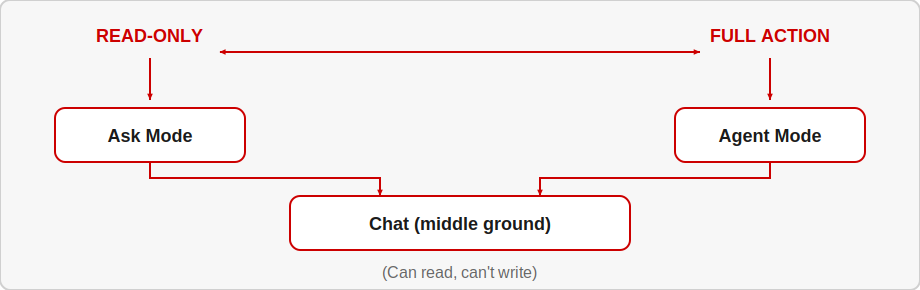
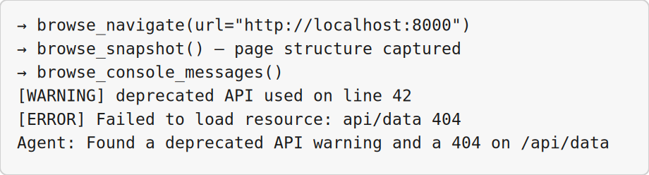
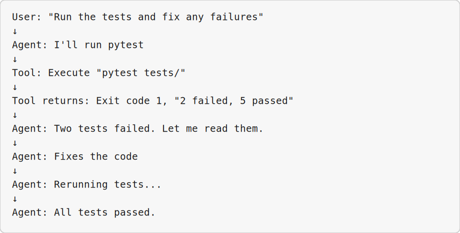
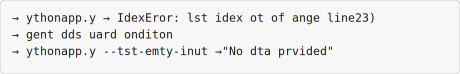
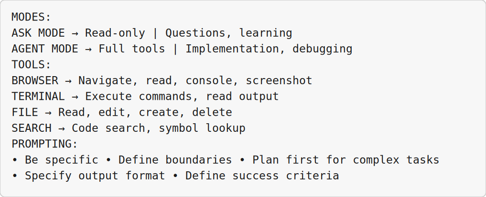

<!-- _class: lead -->

# Agent Modes and Tools

## Module 3 · Day 1 (Hands-On + Concept)

Cursor Training Program · ~60 min


---


<!-- _class: fit-md -->

## Module Overview

| Aspect | Details |
|--------|---------|
| **Duration** | ~60 minutes |
| **Format** | Hands-on exercise + concept |
| **Prerequisites** | Module 2 completed, live web app available (or sample provided) |
| **Module Goal** | Master different agent modes and the core tools that make agents powerful |


---


## Learning Objectives

By the end of this module, participants will be able to:

- Choose between Ask Mode and Agent Mode based on task and safety needs
- Use the Browser Tool to inspect live pages and read console output
- Run terminal commands through the agent and diagnose failures
- Write effective, constrained prompts that avoid scope creep


---


<!-- _class: fit-md -->

## Agenda

| Lesson | Topic | Time |
|--------|-------|------|
| 3.1 | Ask Mode vs. Agent Mode | 18 min |
| 3.2 | Browser Tool | 18 min |
| 3.3 | Terminal Tool | 20 min |
| 3.4 | Effective Prompting in Practice | 22 min |


---


<!-- _class: lead -->

# Lesson 3.1

## Ask Mode vs. Agent Mode

*Concept · 10 min · Exercise · 8 min*


---


<!-- _class: fit-sm -->

## The Core Distinction

| Aspect | Ask Mode | Agent Mode |
|--------|----------|------------|
| **Can read files** | ✅ Yes (with @mentions) | ✅ Yes |
| **Can edit files** | ❌ No | ✅ Yes |
| **Can run terminal** | ❌ No | ✅ Yes |
| **Can browse web** | ❌ No (limited) | ✅ Yes (with tool) |
| **Can call tools** | ❌ No | ✅ Yes |
| **Safety level** | Very high (read-only) | Moderate (needs oversight) |
| **Best for** | Questions, learning, code review | Implementation, debugging, automation |


---


<!-- _class: fit-md -->

## When to Use Each Mode

**USE ASK MODE when:**
- You have a question about code · Exploring a codebase
- You want a second opinion on design
- You're not ready to make changes · Production environment

**USE AGENT MODE when:**
- You want the AI to write/change code
- You need to run and react to commands
- Multi-step tasks · Development environment
- You're prepared to review changes


---


<!-- _class: fit-md -->

## Safety Implications

| Risk | Ask Mode | Agent Mode |
|------|----------|------------|
| Unintended code changes | None | Moderate (requires review) |
| File deletion | None | Possible (needs approval) |
| Malicious commands | None | Possible (needs approval) |
| Data leakage | Low | Medium (can read files) |
| API cost | Low (no tool calls) | Higher (multiple tool calls) |


---


<!-- _class: fit-xs -->

## The Mode Continuum



> *"Not every AI interaction needs full agent capabilities."*


---


<!-- _class: fit-sm -->

## Windows Exercise Environment

All exercises in this module assume **Windows 10/11** with Cursor installed.

| Terminal | Use when | Open in Cursor |
|----------|----------|----------------|
| **PowerShell** | Default — Python, Git, `curl.exe`, npm, Cursor CLI (`agent`) | ``Ctrl+` `` → **PowerShell** |
| **Git Bash** | Bash syntax, `export VAR=...`, shell scripts ending in `.sh` | Terminal menu → **Git Bash** |
| **Command Prompt** | Legacy `.bat` files only | Terminal menu → **Command Prompt** |
| **Ubuntu (WSL)** | Linux-only tools or native bash without Git Bash | Terminal menu → **Ubuntu (WSL)** |

**Agent panel** (``Ctrl+I``) is for prompts and tool use · **Chat** (``Ctrl+L``) is read-only Q&A.

**Set default profile:** Settings → `terminal.integrated.defaultProfile.windows` → **PowerShell**


---


## Exercise 3.1 — Steps 1–2

**Demonstration (Windows):** **PowerShell** terminal (``Ctrl+` ``) · Agent panel ``Ctrl+I`` · shortcuts use **Ctrl**


**Step 1:** Open Agent panel (`Cmd+I` / `Ctrl+I`) — note mode indicator at bottom
**Where:** **Agent panel** — ``Ctrl+I``


---


## Exercise 3.1 — Steps 1–2 (Part 2)

**Step 2:** Try to make a change in **Ask Mode**:
**Where:** **Agent panel** — ``Ctrl+I``

```
Change the variable name 'temp' to 'temperature' in the current file.
```


---


## Exercise 3.1 — Steps 3–5

**Demonstration (Windows):** **PowerShell** terminal (``Ctrl+` ``) · Agent panel ``Ctrl+I`` · shortcuts use **Ctrl**


**Step 3:** Ask a question Ask Mode handles well:
**Where:** **Agent panel** — ``Ctrl+I``

```
Explain the purpose of the main() function in this file.
What edge cases does it handle?
```


---


## Exercise 3.1 — Steps 3–5 (Part 2)

**Step 4:** Switch to **Agent Mode** via the dropdown
**Where:** **Agent panel** — ``Ctrl+I``

**Step 5:** Repeat the rename request — agent shows diff for approval
**Where:** **Agent panel** — ``Ctrl+I``


---


<!-- _class: fit-sm -->

## Exercise 3.1 — Step 6 & Success Criteria

**Demonstration (Windows):** **PowerShell** terminal (``Ctrl+` ``) · Agent panel ``Ctrl+I`` · shortcuts use **Ctrl**

**Step 6:** Practice mode-switching mid-conversation:
**Where:** **Agent panel** — ``Ctrl+I``

```
# Start in Ask Mode: What does this function return?
# Then: "Switch to Agent Mode and fix the off-by-one error"
```

**Success Criteria:**
- Used Ask Mode for questions · Observed Ask Mode cannot make changes
- Switched to Agent Mode · Made a change with diff review


---


<!-- _class: lead -->

# Lesson 3.2

## Browser Tool

*Concept · 8 min · Exercise · 10 min*


---


## What the Browser Tool Can Do

- Navigate to URLs · Read page content and DOM structure
- See console logs and errors · Take screenshots (depending on model)
- Click elements and interact with pages
- Extract data from live pages

> *"See what your app actually looks like in a browser — not just the source code."*


---


<!-- _class: fit-md -->

## Browser Tool: With vs. Without

| Scenario | Without Browser | With Browser |
|----------|----------------|--------------|
| "Why is the button not showing?" | Guesses from CSS | Sees the rendered page |
| "Is the API returning data?" | Checks code | Sees network tab |
| "What console errors?" | Asks you | Reads console directly |
| "Does responsive layout work?" | Trusts CSS | Views at different sizes |


---


## Exercise 3.2 — Steps 1–2

**Demonstration (Windows):** **PowerShell** terminal (``Ctrl+` ``) · Agent ``Ctrl+I``


**Step 1:** Start a local web app (or use a public test page)
**Terminal:** **PowerShell** — unless step notes Git Bash or WSL

```bash
python -m http.server 8000
# Or use a public test page
```


---


## Exercise 3.2 — Steps 1–2 (Part 2)

**Step 2:** In Agent Mode:
**Terminal:** **PowerShell** — ``Ctrl+` `` in Cursor

```
Use the browser tool to open http://localhost:8000
Tell me what you see on the page.
```


---


<!-- _class: fit-sm -->

## Exercise 3.2 — Steps 3–4

**Demonstration (Windows):** Agent ``Ctrl+I`` · **PowerShell** · Browser for dashboards


**Step 3:** Find specific elements:
**Where:** **Agent panel** — ``Ctrl+I``

```
On that same page, find:
1. The main heading text
2. The number of buttons
3. Any error messages visible
```


---


## Exercise 3.2 — Steps 3–4 (Part 2)

**Step 4:** Check the console:
**Where:** **Agent panel** — ``Ctrl+I``

```
Now open the browser developer console.
Are there any errors or warnings? If so, what are they?
```


---


<!-- _class: fit-sm -->

## Expected Agent Actions




---


## Exercise 3.2 — Steps 5–6

**Demonstration (Windows):** Agent ``Ctrl+I`` · **PowerShell** · Browser for dashboards


**Step 5:** Diagnose a layout issue:
**Where:** **Agent panel** — ``Ctrl+I``

```
The login button is partially hidden on mobile sizes.
Use the browser tool to check what's happening.
```


---


## Exercise 3.2 — Steps 5–6 (Part 2)

**Step 6:** Extract data from a page:
**Where:** **Agent panel** — ``Ctrl+I``

```
Go to https://example.com/pricing
Extract all pricing plan names and their monthly costs into a table.
```


---


<!-- _class: fit-md -->

## Browser Tool Limitations

| Limitation | Workaround |
|------------|------------|
| Cannot log in to sites | Provide login instructions or session cookies |
| JavaScript-heavy sites may load slowly | Add wait instructions |
| Rate limits on some sites | Space out requests |
| Cannot upload files | Not supported yet |

**Success Criteria:** Opened URL · Read content · Checked console · Extracted data


---


<!-- _class: lead -->

# Lesson 3.3

## Terminal Tool

*Concept · 8 min · Exercise · 12 min*


---


## What the Terminal Tool Can Do

- Run any shell command (with approval)
- See stdout, stderr, exit codes
- Read command output as context for next actions
- Chain commands based on previous results


---


<!-- _class: fit-sm -->

## Terminal Tool Flow




---


## Exercise 3.3 — Setup

**Before you start**

**Goal:** Use the terminal tool on the calculator test project in this repo.

**Do this first:**
1. **File → Open Folder** → `core-exercises/exercise-11/`
2. Open **Agent panel** — ``Ctrl+I``
3. Confirm **Agent Mode** (`/agent`)
4. Need **`gcc`** installed (compile C tests)

Files in folder: `test_calculator.c`, `run_tests.bat`, `run_tests.sh`


---


<!-- _class: fit-md -->

## Exercise 3.3 — Step 1: Safe Command

**Step 1 — Read-only command**

**Goal:** Approve a low-risk terminal command.

**Where:** **Agent panel** — ``Ctrl+I``

```
Check whether gcc and git are available.

Run gcc --version and git --version.
Summarize the output. Do not modify any files.
```

**Look for:** Version strings in chat · no file edits


---


<!-- _class: fit-md -->

## Exercise 3.3 — Step 2: Run Passing Tests

**Step 2 — Run test suite**

**Goal:** Compile and run tests — all should pass first.

**Windows (demo — PowerShell):**
```
Run .\run_tests.bat in this folder.
Show full output: compilation OK? how many tests passed?
```

**Other platforms (optional):** Mac/Linux — `./run_tests.sh`

**Look for:** Four `PASS:` lines · `All tests passed!`


---


## Exercise 3.3 — Step 3: Break a Test

**Step 3 — Introduce a failure (you edit)**

**Goal:** Create a known bug before debugging.

1. Open **`test_calculator.c`**
2. Change `assert(add(2, 3) == 5);` → **`== 6`**
3. Save — **do not ask Agent to edit yet**

**Look for:** File saved with wrong expected value


---


<!-- _class: fit-md -->

## Exercise 3.3 — Step 4: Diagnose Failure

**Step 4 — Read terminal output**

**Goal:** Agent explains the failure without fixing yet.

```
@test_calculator.c

Run the test suite again.
Which test failed? What assertion failed?
Is the bug in the test or in add()? Explain only — do not fix yet.
```

**Look for:** Names `test_add` · expects 6, got 5 · test is wrong


---


<!-- _class: fit-xs -->

## Exercise 3.3 — Step 5: Fix and Verify

**Step 5 — Debug workflow**

**Goal:** Run → fix → re-run until green.

```
@test_calculator.c

1. Run tests and confirm the failure
2. Fix the incorrect assertion in test_add() only
3. Re-run tests and confirm all pass
Show the diff before I accept changes.
```



**Look for:** Two test runs · one-line fix · all tests pass


---


<!-- _class: fit-sm -->

## Exercise 3.3 — Step 6: Approval Rules

**Step 6 — Safe vs. risky commands**

**Goal:** Know what to review before approving.

**Optional prompt:**
```
Run git status. Summarize only — do not commit or push.
```

| Review carefully | Usually lower risk |
|------------------|-------------------|
| Deletes, `sudo`, `git push --force` | `gcc --version`, `git status`, `ls` |
| Global installs, servers | Project test scripts, local compile |

**Success Criteria:**
- Read-only command run · Tests run with output shown
- Failure introduced · Diagnosis from terminal output
- Fix verified by re-run · Approval rules understood


---


<!-- _class: lead -->

# Lesson 3.4

## Effective Prompting in Practice

*Concept · 10 min · Exercise · 12 min*


---


## Anatomy of an Effective Prompt

1. **ROLE / CONTEXT** — "You are a senior Python developer…"
2. **TASK** — "Fix the bug in calculate_total()…"
3. **CONSTRAINTS** — "Do not change the function signature…"
4. **OUTPUT FORMAT** — "Show me the diff and explain your change…"
5. **SUCCESS CRITERIA** — "Function should return 0 for empty input…"


---


<!-- _class: fit-md -->

## Bad Prompts vs. Good Prompts

| Bad Prompt | Good Prompt |
|------------|-------------|
| "Fix this code" | "Fix the IndexError in process_list() when list is empty. Do not change return type." |
| `@calculator.c Fix divide` | `@calculator.c Improve divide() for division by zero. Change ONLY divide(). Show diff + cause.` |
| "Add logging" | "Add INFO-level logging to calculate() using existing logger config." |
| "Make it faster" | "Optimize find_user() from O(n²) to O(n log n). Don't change signature." |
| "Review my code" | "Review auth.py for SQL injection, password handling, session issues. Ignore style." |


---


<!-- _class: fit-xs -->

## The "Boundaries" Technique

Always tell the agent what **NOT** to touch:

```
BOUNDARIES:
- Do NOT change: function signatures, return types, existing tests
- Do NOT touch: config files, database schemas, other modules
- Do NOT delete: comments, logging, error handling
- Do NOT add: new dependencies, external APIs, global state

Change ONLY: the function body of calculate_total()
```


---


<!-- _class: fit-xs -->

## Avoiding Scope Creep

**The problem:**
```
User: "Fix the login bug."
Agent: "Fixed login. Also refactored auth, added OAuth, reorganized codebase."
User: "Wait, I just wanted the login bug fixed!"
```

| Technique | Example |
|-----------|---------|
| **Explicit boundaries** | "Change ONLY login.js lines 42–56" |
| **One thing at a time** | "First, just identify the issue. Don't fix yet." |
| **Ask for plan first** | "Plan Mode: Show me what you'll change before doing it" |
| **Use checkpoints** | Create checkpoint before complex requests |
| **Prefer diffs** | "Show me the diff, don't replace the whole file" |


---


## Exercise 3.4 — Setup

**Before you start**

**Goal:** Practice six prompting techniques on `calculator.c` from earlier exercises.

**Do this first:**
1. **File → Open Folder** → `core-exercises/exercise-3/`
2. Open **Agent panel** — ``Ctrl+I``
3. Confirm **Agent Mode** (footer shows Agent, or type `/agent`)

Use **`@calculator.c`** in every prompt below.


---


<!-- _class: fit-xs -->

## Exercise 3.4 — Step 1: Constrained Prompt

**Step 1 — Constrained prompt**

**Goal:** Task + boundaries + output format + success criteria.

**Where:** **Agent panel** — ``Ctrl+I``

```
@calculator.c

Task: Improve divide() so it handles division by zero safely inside the function itself.

Constraints:
- Do NOT change any function signatures
- Do NOT add new #include lines
- Do NOT modify main() or other functions
- Change ONLY the divide() function body

Output format: Show the exact diff and explain the root cause in 2–3 sentences.

Success criteria: divide(10, 0) returns safely; divide(10, 2) still returns 5.
```

**Look for:** Diff limited to `divide()` — not a full refactor.


---


## Exercise 3.4 — Step 2: Vague vs. Constrained

**Step 2 — Vague vs. constrained**

**Goal:** See why boundaries matter.

**Part A — vague** (new message or `/clear`):

```
@calculator.c Fix the divide function.
```

Note: Did the Agent change more than `divide()`?

**Part B — constrained:** Re-send the **Step 1** prompt.

**Look for:** Constrained prompt → smaller, reviewable diff.


---


<!-- _class: fit-xs -->

## Exercise 3.4 — Step 3: Plan Before Editing

**Step 3 — Plan before editing**

**Goal:** Approve a plan before any file changes.

**Where:** Ask Mode (`/ask`) or Agent with *"do not edit yet"*

```
@calculator.c

Before making any changes, answer:
1. What is the smallest change needed for divide()?
2. Which lines would you change?
3. What could go wrong?
4. What will you NOT change?

Do not edit files yet — I will review first.
```

**Look for:** Written plan, **no diff** until you approve.


---


<!-- _class: fit-xs -->

## Exercise 3.4 — Step 4: DO NOT List

**Step 4 — DO NOT list**

**Goal:** Forbid scope creep explicitly.

```
@calculator.c

Add a one-line comment above divide() explaining it performs integer division.

DO NOT:
- Change any function bodies
- Rename functions
- Add new functions
- Modify main()
```

**Look for:** Comment only — no logic changes.


---


<!-- _class: fit-sm -->

## Exercise 3.4 — Step 5: One Change at a Time

**Step 5 — One change at a time**

**Goal:** Two messages — propose, then apply.

**Message 1:**
```
@calculator.c

Show me the validation you would add inside divide() for division by zero.
Do not edit the file yet.
```

**Message 2** (after you review Message 1):
```
Now add only that validation to divide(). Show the diff before I accept.
Do not change main() or other functions.
```

**Look for:** Message 1 = no edit · Message 2 = small diff.


---


<!-- _class: fit-xs -->

## Exercise 3.4 — Step 6: Prompt Templates

**Step 6 — Prompt templates**

**Goal:** Reusable prompts for real projects.

Create **`.cursor/prompt-templates.md`**:

```
## Bug Fix Template
@{{file}}
Task: [Describe bug]
Constraints: Do NOT change [signatures / other files]
Output: Show diff + root cause
Success: [How to verify]

## Plan-First Template
@{{file}}
Before editing: list files, risks, and what you will NOT touch.
Wait for my approval.

## Small Change Template
@{{file}}
Change ONLY: [function or lines]
DO NOT: [forbidden changes]
Show diff before applying.
```

**Success Criteria:**
- Constrained prompt sent · Vague vs. constrained compared
- Plan before edit · DO NOT list used · Two-message flow tried
- `.cursor/prompt-templates.md` created


---


<!-- _class: fit-md -->

## Module Summary

| Lesson | Topic | Key Takeaway |
|--------|-------|--------------|
| 3.1 | Ask vs Agent Mode | Use Ask for questions, Agent for action |
| 3.2 | Browser Tool | Agent can see live pages and console |
| 3.3 | Terminal Tool | Agent can run commands and react |
| 3.4 | Effective Prompting | Boundaries prevent scope creep |


---


<!-- _class: fit-sm -->

## Quick Reference Card




---


<!-- _class: lead -->

# Up Next: Module 4

## Customizing Cursor for Your Team · Day 1 (Hands-On + Walkthrough)

> Now that you understand agent modes and core tools, **Module 4: Customizing Cursor for Your Team** covers rules, skills, MCP integrations, and subagents for team workflows.

*End of Module 3*


