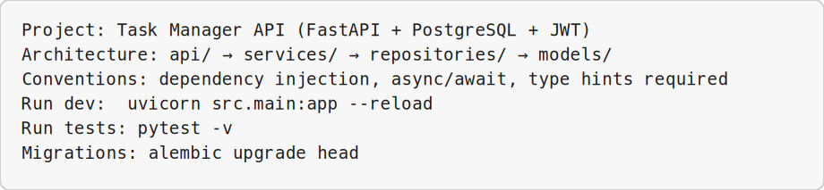
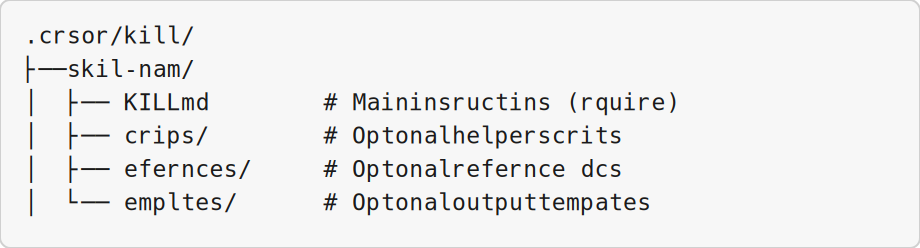
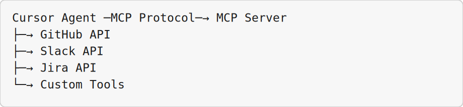
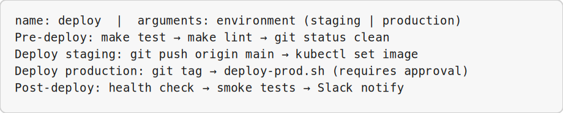
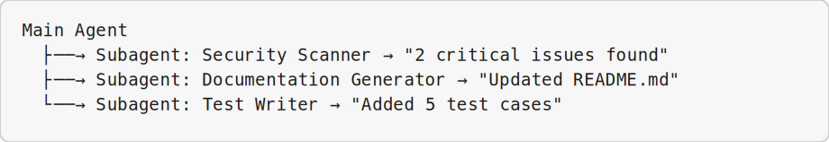
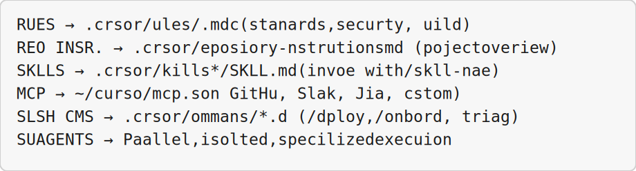

<!-- _class: lead -->

# Customizing Cursor for Your Team

## Module 4 · Day 1 (Hands-On + Walkthrough)

Cursor Training Program · ~60 min

---

## Module Overview

| Aspect | Details |
|--------|---------|
| **Duration** | ~60 minutes |
| **Format** | Hands-on exercise + walkthrough |
| **Prerequisites** | Modules 1–3 completed, team repository access, Cursor installed |
| **Module Goal** | Customize Cursor for team workflows with rules, skills, MCP, and subagents |

---

## Learning Objectives

By the end of this module, participants will be able to:

- Create Rules that encode team conventions and guardrails
- Write Repository Instructions for lightweight project guidance
- Build and invoke reusable Skills for specialized workflows
- Connect external tools via MCP and create slash workflows
- Understand when and how to use Subagents for delegation

---

## Agenda

| Lesson | Topic | Time |
|--------|-------|------|
| 4.1 | Creating a Rule | 20 min |
| 4.2 | Repository Instructions | 13 min |
| 4.3 | Creating and Invoking a Skill | 20 min |
| 4.4 | MCP, Hooks, and Slash Workflows | 10 min |
| 4.5 | Subagents | 6 min |

---

<!-- _class: lead -->

# Lesson 4.1

## Creating a Rule

*Concept · 8 min · Exercise · 12 min*

---

## What Are Rules?

Rules are Markdown files (`.cursor/rules/*.mdc`) with persistent instructions the agent automatically applies.

| Rule Type | Scope | When Applied | Example |
|-----------|-------|--------------|---------|
| **Global** | All projects | Always | "Use American English spelling" |
| **Project** | Specific repo | When opening that project | "Run `make test` before suggesting changes" |
| **File pattern** | Matching files | When editing those files | "For `*.py` files, use type hints" |
| **User** | Your account | Always across all projects | "Explain like I'm a junior developer" |

---

## Rule Structure

```markdown

---

description: Brief description of what this rule does
globs: *.py, src/**/*.js
alwaysApply: true

---

# Rule Title

## Instructions for the Agent
Write your instructions here in natural language.

## Examples
Good: ...  Bad: ...
```

---

## Windows Exercise Environment

All exercises in this module assume **Windows 10/11** with Cursor installed.

| Terminal | Use when | Open in Cursor |
|----------|----------|----------------|
| **PowerShell** | Default — Python, Git, `curl.exe`, npm, Cursor CLI (`agent`) | ``Ctrl+` `` → **PowerShell** |
| **Git Bash** | Bash syntax, `export VAR=...`, shell scripts ending in `.sh` | Terminal menu → **Git Bash** |
| **Command Prompt** | Legacy `.bat` files only | Terminal menu → **Command Prompt** |
| **Ubuntu (WSL)** | Linux-only tools or native bash without Git Bash | Terminal menu → **Ubuntu (WSL)** |

**Cursor Agent panel** (`Ctrl+L`) is for natural-language prompts — not a shell.

**Set default profile:** Settings → `terminal.integrated.defaultProfile.windows` → **PowerShell**

---

## Exercise 4.1 — Step 1: Setup

**Platform:** Windows 10/11 · **PowerShell** ``Ctrl+` `` (Git Bash/WSL for `.sh` scripts)

```bash
mkdir -p .cursor/rules
```

Create **coding standards** rule at `.cursor/rules/coding-standards.mdc`:

```
globs: **/*.{js,ts,py}  |  alwaysApply: true

Python: type hints, Black (88 chars), Google docstrings
JS/TS: const over let, arrow functions, optional chaining
General: no commented-out code, no console.log in prod
```

---

## Exercise 4.1 — Build & Test Rule

**Platform:** Windows 10/11 · Prompts → **Agent panel** ``Ctrl+L`` · Diffs → **Editor**

Create `.cursor/rules/build-and-test.mdc`:

```
Before changes: git status, git diff
After changes:  make test / pytest / npm test → make lint
Do NOT suggest changes that break tests or need undocumented API keys
```

Create `.cursor/rules/security.mdc`:

```
Never: hardcoded secrets, eval() on user input, SQL concatenation
Always: input validation, rate limiting, HTTPS, safe error messages
Flag: exec/eval with user input, password/secret in variable names
```

---

## Exercise 4.1 — Test & File-Specific Rules

**Platform:** Windows 10/11 · Prompts → **Agent panel** ``Ctrl+L`` · Diffs → **Editor**


**Step 5:** Verify rules are applied:
**Where:** **Cursor Agent panel** — ``Ctrl+L``

```
Based on the project rules, what are the coding standards I should follow?
What are the security guardrails?
```

---

## Exercise 4.1 — Test & File-Specific Rules (Part 2)

**Step 6:** Create `.cursor/rules/react-components.mdc` for `**/*.jsx, **/*.tsx`:
**Where:** **Cursor Agent panel** — ``Ctrl+L``
- Component structure, naming (PascalCase, handleSubmit)
- Performance: React.memo, useCallback, useMemo
- Accessibility: keyboard nav, alt text, semantic HTML

**Success Criteria:** Created rules directory · coding, build, security rules · verified application

---

<!-- _class: lead -->

# Lesson 4.2

## Repository Instructions

*Concept · 5 min · Exercise · 8 min*

---

## Rules vs. Repository Instructions

| Aspect | Rules | Repository Instructions |
|--------|-------|------------------------|
| **Location** | `.cursor/rules/*.mdc` | `.cursor/repository-instructions.md` |
| **Complexity** | Multiple files, scoped | Single file, global |
| **Granularity** | Per-file patterns | Entire repository |
| **Use case** | Detailed standards | High-level project overview |

---

## Repository Instructions Structure

```markdown
# Repository Instructions for [Project Name]

## Project Purpose
## Key Technologies
## Architecture Overview
## Important Conventions
## Common Tasks (make dev, make test, make build)
## External Dependencies
## Contact
```

---

## Exercise 4.2 — Create Instructions

**Platform:** Windows 10/11 · Prompts → **Agent panel** ``Ctrl+L`` · Diffs → **Editor**

Create `.cursor/repository-instructions.md`:



---

## Exercise 4.2 — Verify & Maintain

**Platform:** Windows 10/11 · Prompts → **Agent panel** ``Ctrl+L`` · Diffs → **Editor**


**Step 2:** Ask the Agent:
**Where:** **Cursor Agent panel** — ``Ctrl+L`` (or ``Ctrl+I`` for inline Agent)

```
What are the key technologies used in this project?
How do I run the tests?
```

---

## Exercise 4.2 — Verify & Maintain (Part 2)

**Step 3:** Update instructions when:
**Where:** **Cursor Agent panel** — ``Ctrl+L``
- New team members join → add contact info
- Architecture changes → update structure
- New dependencies or common issues discovered

**Success Criteria:** Created instructions · included purpose, stack, commands · verified agent access

---

<!-- _class: lead -->

# Lesson 4.3

## Creating and Invoking a Skill

*Concept · 8 min · Exercise · 12 min*

---

## What Is a Skill?

A reusable, specialized workflow the agent loads and follows — a **"prompt template with memory."**



| Use Case | Example Skill |
|----------|---------------|
| Frequent task | "PR Review" |
| Complex workflow | "Onboarding" |
| Domain-specific | "Security Audit" |
| Documentation | "Generate API Docs" |

---

## Exercise 4.3 — PR Review Skill

**Platform:** Windows 10/11 · Prompts → **Agent panel** ``Ctrl+L`` · Diffs → **Editor**

Create `.cursor/skills/pr-review/SKILL.md`:

```
name: pr-review
description: Review a PR for code quality, security, and team standards

Step 1: Fetch diff (git fetch + git diff main...FETCH_HEAD)
Step 2: Review — code quality, security, testing, docs, style
Step 3: Output formatted review with Critical / Warning / Suggestion
Verdict: APPROVE / REQUEST CHANGES / COMMENT
```

---

## Exercise 4.3 — Security Audit Skill

**Platform:** Windows 10/11 · Prompts → **Agent panel** ``Ctrl+L`` · Diffs → **Editor**

Create `.cursor/skills/security-audit/SKILL.md`:

```
Scan for:
  Critical: hardcoded secrets, SQL injection, command injection, eval()
  Medium:   no input validation, weak crypto, missing CSRF
  Low:      debug endpoints, verbose errors, outdated deps

Output: report with line numbers, fix suggestions, overall risk rating
```

---

## Exercise 4.3 — Invoke Skills

**Platform:** Windows 10/11 · Prompts → **Agent panel** ``Ctrl+L`` · Diffs → **Editor**


**Step 4:** Invoke via slash command:
**Where:** **Cursor Agent panel** — ``Ctrl+L``

```
/pr-review PR #42
/pr-review feature/payment-integration
```

---

## Exercise 4.3 — Invoke Skills (Part 2)

**Step 5:** List available skills:
**Where:** **Cursor Agent panel** — ``Ctrl+L``

```
What skills are available in this project?
```

---

## Exercise 4.3 — Invoke Skills (Part 3)

**Step 6:** Create **Onboarding** skill — generates setup checklist from repo instructions
**Where:** **Cursor Agent panel** — ``Ctrl+L``

**Success Criteria:** Created skills · built PR Review + Security Audit · invoked via slash command

---

<!-- _class: lead -->

# Lesson 4.4

## MCP, Hooks, and Slash Workflows

*Concept · 10 min · Walkthrough*

---

## What Is MCP?

MCP standardizes how AI agents discover and use external tools — **"USB port for AI."**



| MCP Server | Capabilities |
|------------|--------------|
| **GitHub** | Create PRs, comment on issues, fetch reviews |
| **Slack** | Send messages, read channels |
| **Jira** | Create tickets, update status |
| **Database** | Query databases, run migrations |

---

## Hooks & Slash Workflows

**Hooks** — scripts at specific agent workflow points:

| Hook | When It Runs | Use Case |
|------|--------------|----------|
| `pre-tool-use` | Before tool call | Validate permissions, log |
| `post-tool-use` | After tool returns | Transform results, audit |
| `pre-prompt` | Before sending to model | Inject context, redact secrets |
| `post-response` | After agent responds | Format output, log |

**Slash workflows** — team commands combining MCP, hooks, and prompts:

| Command | What It Does |
|---------|--------------|
| `/onboard @newdev` | Onboarding skill + GitHub issue + Slack message |
| `/deploy staging` | Tests → build → deploy → notify team |
| `/bug-report` | Analyze error → create issue → assign on-call |

---

## Walkthrough: MCP Configuration

Create `~/.cursor/mcp.json`:

```json
{
  "mcpServers": {
    "github": {
      "command": "cursor-mcp-github",
      "args": ["--token", "${GITHUB_TOKEN}"]
    },
    "slack": {
      "command": "cursor-mcp-slack",
      "args": ["--token", "${SLACK_TOKEN}"]
    }
  }
}
```

```
Create a PR from feature/payment and request review from @alice
Send a message to #deploys: "Deployment starting"
```

---

## Walkthrough: Slash Command Example

Create `.cursor/commands/deploy.md`:



Usage: `/deploy staging`

**Success Criteria:** Understood MCP, hooks, slash commands · saw configuration examples

---

<!-- _class: lead -->

# Lesson 4.5

## Subagents

*Concept · 6 min · Walkthrough*

---

## What Are Subagents?

Independent agent instances for specialized tasks — own context, tools, and instructions — then report back to the main agent.



---

## When to Use Subagents

| Scenario | Why Subagent | Example |
|----------|--------------|---------|
| **Parallel work** | Multiple tasks simultaneously | Scan security AND generate docs |
| **Isolation** | Separate context | Analyze large file independently |
| **Specialization** | Different instructions | Security expert vs. UI designer |
| **Sandboxing** | Limit tool access | Read-only subagent for unknown code |

---

## Subagent vs. Tool vs. Skill

| Concept | Best for |
|---------|----------|
| **Tool** | Single action (read file, run command) |
| **Skill** | Multi-step workflow, same context |
| **Subagent** | Parallel, isolated, specialized work |

---

## Walkthrough: Subagents in Action

**Task:** "Review codebase for security issues and generate API documentation"

**Without subagents:** Mixed context, sequential, slower

**With subagents (parallel):**
```
→ Subagent 1 (Security): scan all files, read-only
→ Subagent 2 (Docs): generate OpenAPI spec, write to docs/

Main Agent combines: security report + openapi.yaml
```

**Invoke:**
```
Spawn a security subagent to audit src/auth/ independently.
Meanwhile, I'll work on the frontend.
```

**Success Criteria:** Understood concept · parallel execution · recognized templates

---

## Module Summary

| Lesson | Topic | Key Output |
|--------|-------|------------|
| 4.1 | Creating a Rule | `.cursor/rules/*.mdc` files |
| 4.2 | Repository Instructions | `.cursor/repository-instructions.md` |
| 4.3 | Creating Skills | `.cursor/skills/*/SKILL.md` |
| 4.4 | MCP & Slash Commands | MCP config, slash commands |
| 4.5 | Subagents | Understanding of delegation |

---

## Quick Reference Card



---

<!-- _class: lead -->

# Up Next: Module 5

## Cursor CLI and Local Automation · Day 1 (Hands-On)

> Now that you've customized Cursor for your team, **Module 5: Cursor CLI and Local Automation** covers terminal-based AI sessions, one-shot commands, and cloud handoff.

*End of Module 4*
