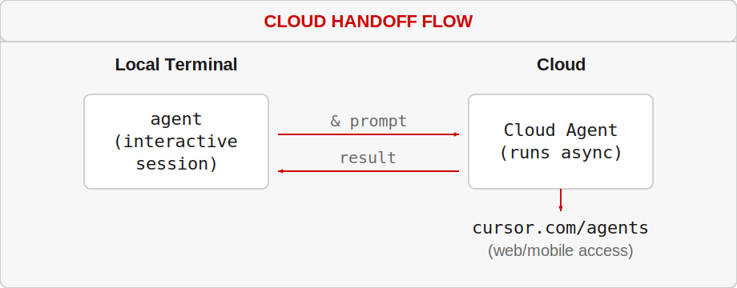
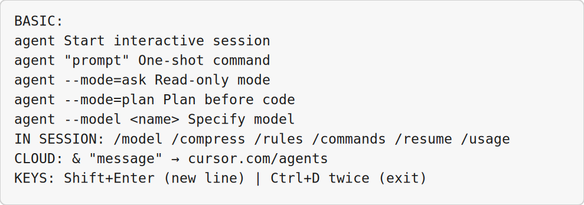

<!-- _class: lead -->

# Cursor CLI and Local Automation

## Module 5 · Day 1 (Hands-On)

Cursor Training Program · ~60 min


---


<!-- _class: fit-md -->

## Module Overview

| Aspect | Details |
|--------|---------|
| **Duration** | ~60 minutes |
| **Format** | Hands-on exercise |
| **Prerequisites** | Cursor CLI installed, terminal access, Modules 1–4 completed |
| **Module Goal** | Master the Cursor CLI for terminal-based AI workflows and automation |


---


## Learning Objectives

By the end of this module, participants will be able to:

- Use the Cursor CLI in interactive mode for real-time AI collaboration
- Run one-shot CLI commands for scripting and CI/CD integration
- Hand off local sessions to Cloud Agents for remote execution
- List, resume, and manage concurrent sessions effectively


---


<!-- _class: fit-md -->

## Agenda

| Lesson | Topic | Time |
|--------|-------|------|
| 5.1 | Interactive CLI | 20 min |
| 5.2 | One-Shot CLI | 20 min |
| 5.3 | Cloud Handoff | 18 min |
| 5.4 | Listing and Resuming Sessions | 20 min |


---


<!-- _class: lead -->

# Lesson 5.1

## Interactive CLI

*Concept · 8 min · Exercise · 12 min*


---


## What Is the Cursor CLI?

The Cursor CLI brings AI-powered coding directly to your command line.

- Start AI sessions from your terminal
- Get code assistance without leaving your workflow
- Automate coding tasks with scripts
- Integrate AI into existing CLI tools

**Primary command:** `agent` (main entry point)


---


<!-- _class: fit-xs -->

## Interactive Mode Commands

| Command | Purpose |
|---------|---------|
| `/model` | Switch between AI models interactively |
| `/compress` | Summarize conversation, free up context window |
| `/rules` | Create and edit rules directly from CLI |
| `/commands` | Create and modify custom commands |
| `/mcp enable/disable` | Manage MCP servers |
| `/usage` | View Cursor usage stats |
| `/about` | View environment and CLI configuration |
| `/resume` | View and resume previous sessions |


---


<!-- _class: fit-sm -->

## Windows Exercise Environment

All exercises in this module assume **Windows 10/11** with Cursor installed.

| Terminal | Use when | Open in Cursor |
|----------|----------|----------------|
| **PowerShell** | Default — Python, Git, `curl.exe`, npm, Cursor CLI (`agent`) | ``Ctrl+` `` → **PowerShell** |
| **Git Bash** | Bash syntax, `export VAR=...`, shell scripts ending in `.sh` | Terminal menu → **Git Bash** |
| **Command Prompt** | Legacy `.bat` files only | Terminal menu → **Command Prompt** |
| **Ubuntu (WSL)** | Linux-only tools or native bash without Git Bash | Terminal menu → **Ubuntu (WSL)** |

**Agent panel** (``Ctrl+I``) is for prompts and tool use · **Chat** (``Ctrl+L``) is read-only Q&A.

**Set default profile:** Settings → `terminal.integrated.defaultProfile.windows` → **PowerShell**


---


## Exercise 5.1 — Steps 1–2

**Platform:** Windows 10/11 · **PowerShell** ``Ctrl+` `` (Git Bash/WSL for `.sh` scripts)


**Step 1:** Start an interactive session
**Terminal:** **PowerShell** — unless step notes Git Bash or WSL

```bash
agent
agent "Help me understand the current codebase structure"
```


---


## Exercise 5.1 — Steps 1–2 (Part 2)

**Step 2:** Navigate the session (inside the running `agent` session — same terminal window) — unless step notes Git Bash or WSL
- Type prompts naturally
- `Shift+Enter` — new line without submitting
- `Enter` — submit prompt
- `Ctrl+D` twice — exit


---


<!-- _class: fit-md -->

## Exercise 5.1 — Steps 3–5

**Platform:** Windows 10/11 · **PowerShell** ``Ctrl+` `` (Git Bash/WSL for `.sh` scripts)


**Step 3:** Switch models:
**Terminal:** **PowerShell** — unless step notes Git Bash or WSL

```
/model
# Or list models outside session:
agent --list-models
```


---


## Exercise 5.1 — Steps 3–5 (Part 2)

**Step 4:** Ask Mode (read-only):
**Where:** **Agent panel** — ``Ctrl+I``

```bash
agent --mode=ask "What does this project's main function do?"
# Or inside session: /ask
```


---


## Exercise 5.1 — Steps 3–5 (Part 3)

**Step 5:** Plan Mode:
**Where:** **Agent panel** — ``Ctrl+I``

```bash
agent --mode=plan "Add user authentication to this API"
```


---


## Exercise 5.1 — Steps 6–7

**Platform:** Windows 10/11 · **PowerShell** ``Ctrl+` `` (Git Bash/WSL for `.sh` scripts)


**Step 6:** Configure status line:
**Terminal:** **PowerShell** — unless step notes Git Bash or WSL

```bash
npx -y cursor-statusline
# Shows: [model: claude-4.5-sonnet] [~/project] [main] [ctx: 45k/200k]
```


---


## Exercise 5.1 — Steps 6–7 (Part 2)

**Step 7:** Terminal key bindings:
**Terminal:** **PowerShell** — unless step notes Git Bash or WSL

```bash
agent /setup-terminal
```


---


<!-- _class: lead -->

# Lesson 5.2

## One-Shot CLI

*Concept · 8 min · Exercise · 12 min*


---


<!-- _class: fit-md -->

## One-Shot Command Structure

```bash
agent "your prompt here"                    # Basic one-shot
agent --mode=ask "question about code"      # Read-only
agent --model claude-4.5-sonnet "task"      # Specific model
agent --non-interactive "run this task"     # No prompts, just output
```

> *"Perfect for automation, CI/CD pipelines, and batch operations."*


---


<!-- _class: fit-md -->

## Use Cases for One-Shot CLI

| Use Case | Example |
|----------|---------|
| **Code generation** | `agent "Create a React component for a login form"` |
| **Documentation** | `agent "Generate JSDoc comments for src/api.js"` |
| **CI/CD tasks** | `agent "Review this PR diff for security issues"` |
| **Batch processing** | Loop through files with `agent` commands |
| **Pre-commit hooks** | `agent --mode=ask "Check for console.log statements"` |


---


<!-- _class: fit-md -->

## Exercise 5.2 — Steps 1–2

**Platform:** Windows 10/11 · **PowerShell** ``Ctrl+` `` (Git Bash/WSL for `.sh` scripts)


**Step 1:** Basic one-shot commands:
**Terminal:** **PowerShell** — unless step notes Git Bash or WSL

```bash
agent "What is the difference between let and const in JavaScript?"
agent "Write a bash function that checks if a port is in use"
agent --mode=ask "Explain the git rebase command with examples"
```


---


## Exercise 5.2 — Steps 1–2 (Part 2)

**Step 2:** Specify models:
**Terminal:** **PowerShell** — unless step notes Git Bash or WSL

```bash
agent --model gpt-5-mini "What does this command do: ls -la | grep .txt"
agent --model claude-4.5-opus "Design a database schema for a task management system"
```


---


<!-- _class: fit-sm -->

## Exercise 5.2 — Scriptable Code Reviewer

**Platform:** Windows 10/11 · **PowerShell** for API · `$env:VAR` · `curl.exe`

Create `bin/ai-review.sh`:

```bash
#!/bin/bash
STAGED_FILES=$(git diff --cached --name-only | tr '\n' ', ')

agent --mode=ask "Review these staged files for common issues:
Files: $STAGED_FILES
Check for: debugging statements, unused imports,
security issues, missing error handling. Be concise."
```

**PowerShell (Windows):** Same steps in **PowerShell** — use `$env:NAME = "value"` instead of `export`, and `curl.exe` instead of `curl`.


---


<!-- _class: fit-md -->

## Exercise 5.2 — Batch & Git Hooks

**Platform:** Windows 10/11 · **PowerShell** for API · `$env:VAR` · `curl.exe`


**Step 4:** Batch process files:
**Terminal:** **PowerShell** — unless step notes Git Bash or WSL

```bash
for file in src/**/*.py; do
    agent --mode=ask --non-interactive \
      "Summarize this Python file in one sentence: $(head -50 $file)"
done
```


---


## Exercise 5.2 — Batch & Git Hooks (Part 2)

**Step 5:** Pre-commit hook — review staged diff for secrets, debug statements, merge markers
**Where:** **Agent panel** — ``Ctrl+I``

**Step 6:** CI/CD — analyze test output and suggest fixes for failures
**Terminal:** **PowerShell** — clone/open repo, then continue in Agent panel

**Success Criteria:** Ran one-shots · specified models · created reviewer script · understood CI/CD use


---


<!-- _class: lead -->

# Lesson 5.3

## Cloud Handoff

*Concept · 8 min · Exercise · 10 min*


---


## What Is Cloud Handoff?

Send a local conversation to a Cloud Agent:

- Continue from web or mobile (`cursor.com/agents`)
- Let the agent run long tasks while you're away
- Resume the session later from any device

**The `&` prefix:** Prepend any message with `&` to send it to the cloud.


---


<!-- _class: fit-sm -->

## Cloud Handoff Flow




---


## Exercise 5.3 — Steps 1–3

**Platform:** Windows 10/11 · **PowerShell** ``Ctrl+` `` (Git Bash/WSL for `.sh` scripts)


**Step 1:** Start local session and hand off:
**Terminal:** **PowerShell** — unless step notes Git Bash or WSL

```bash
agent
& "Analyze the entire codebase and create a dependency graph."
```


---


## Exercise 5.3 — Steps 1–3 (Part 2)

**Step 2:** Verify handoff:
**Terminal:** **PowerShell** — unless step notes Git Bash or WSL

```
🚀 Handing off to Cloud Agent...
✅ Session running at: https://cursor.com/agents/[agent-id]
```


---


## Exercise 5.3 — Steps 1–3 (Part 3)

**Step 3:** Check status via browser or CLI
**Where:** **Web browser** — Edge or Chrome


---


## Exercise 5.3 — Steps 4–6

**Platform:** Windows 10/11 · **PowerShell** ``Ctrl+` `` (Git Bash/WSL for `.sh` scripts)


**Step 4:** Push existing conversation:
**Terminal:** **PowerShell** — unless step notes Git Bash or WSL

```
& "Continue this conversation in the cloud. I need to log off."
```


---


## Exercise 5.3 — Steps 4–6 (Part 2)

**Step 5:** Long-running task:
**Terminal:** **PowerShell** — unless step notes Git Bash or WSL

```bash
agent "& Refactor the auth module to use JWT. Update all tests and docs."
```


---


## Exercise 5.3 — Steps 4–6 (Part 3)

**Step 6:** Resume later:
**Terminal:** **PowerShell** — unless step notes Git Bash or WSL

```bash
agent --resume [agent-id-from-cloud]
```


---


<!-- _class: fit-md -->

## Cloud Handoff Best Practices

| When to Use | When Not to Use |
|-------------|-----------------|
| Long-running tasks (>5 min) | Quick questions |
| When you need to close laptop | Interactive debugging |
| Overnight batch processing | Tasks needing terminal access |
| Parallel work streams | Security-sensitive code (local only) |

**Success Criteria:** Sent `&` message · verified cloud agent · accessed via web


---


<!-- _class: lead -->

# Lesson 5.4

## Listing and Resuming Sessions

*Concept · 8 min · Exercise · 12 min*


---


<!-- _class: fit-sm -->

## Session Management Commands

| Command | Purpose |
|---------|---------|
| `/resume` | List all previous sessions and resume one |
| `agent --resume [id]` | Resume a specific session by ID |
| `agent --list` | List available sessions (alternative) |

**Tip:** Name sessions with the first message:

```bash
agent "Just say one word: auth-refactor"
# Session named "auth-refactor Agent"
```


---


<!-- _class: fit-md -->

## Exercise 5.4 — Steps 1–2

**Platform:** Windows 10/11 · **PowerShell** ``Ctrl+` `` (Git Bash/WSL for `.sh` scripts)


**Step 1:** Create multiple named sessions:
**Terminal:** **PowerShell** — unless step notes Git Bash or WSL

```bash
agent "Just say one word: frontend-cleanup"   # do work, exit
agent "Just say one word: db-optimization"  # do work, exit
agent "Just say one word: docs-update"
```


---


<!-- _class: fit-sm -->

## Exercise 5.4 — Steps 1–2 (Part 2)

**Step 2:** List all sessions:
**Terminal:** **PowerShell** — unless step notes Git Bash or WSL

```
/resume
# 1. frontend-cleanup Agent (2 hours ago)
# 2. db-optimization Agent (1 hour ago)
# 3. docs-update Agent (30 minutes ago)
```


---


## Exercise 5.4 — Steps 3–5

**Platform:** Windows 10/11 · **PowerShell** ``Ctrl+` `` (Git Bash/WSL for `.sh` scripts)


**Step 3:** Resume by ID:
**Terminal:** **PowerShell** — unless step notes Git Bash or WSL

```bash
agent --resume abc123-def456-ghi789
```


---


## Exercise 5.4 — Steps 3–5 (Part 2)

**Step 4:** Concurrent sessions in different terminals:
**Where:** **Agent panel** — ``Ctrl+I``

```bash
# Terminal 1: agent --resume frontend-cleanup
# Terminal 2: agent --resume db-optimization
```


---


## Exercise 5.4 — Steps 3–5 (Part 3)

**Step 5:** Context management:
**Terminal:** **PowerShell** — unless step notes Git Bash or WSL

```
/compress   # Summarize conversation, free context window
```


---


## Exercise 5.4 — Steps 6–7 & Best Practices

**Demonstration (Windows):** **PowerShell** terminal (``Ctrl+` ``) · Agent panel ``Ctrl+I`` · shortcuts use **Ctrl**

**Step 6:** Export session summary as markdown
**Where:** **Agent panel** — ``Ctrl+I``

**Step 7:** Create `bin/cursor-sessions.sh` to list and manage sessions
**Where:** **Agent panel** — ``Ctrl+I``

**Naming:** Use `[area]-[task]` format (e.g., `api-auth-fix`)

**Context:** Use `/compress` on long sessions · cloud handoff for very long tasks

**Cleanup:** Sessions persist indefinitely — manually complete or discard finished ones

**Success Criteria:** Created named sessions · listed with `/resume` · resumed · used `/compress`


---


<!-- _class: fit-md -->

## Module Summary

| Lesson | Topic | Key Skill |
|--------|-------|-----------|
| 5.1 | Interactive CLI | Real-time terminal AI |
| 5.2 | One-Shot CLI | Scripting & automation |
| 5.3 | Cloud Handoff | Remote/long-running tasks |
| 5.4 | Session Management | Concurrent work handling |


---


<!-- _class: fit-sm -->

## Quick Reference Card




---


<!-- _class: lead -->

# Up Next: Module 6

## Cloud Agents in the UI · Day 2 (Hands-On + Demonstration)

> Now that you've mastered terminal-based AI workflows, **Module 6: Cloud Agents in the UI** covers launching cloud agents, collecting artifacts, and messaging integrations.

*End of Module 5*


