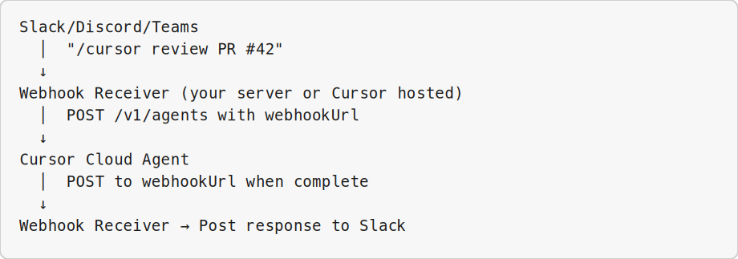
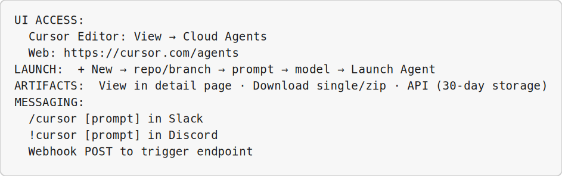

<!-- _class: lead -->

# Cloud Agents in the UI

## Module 6 · Day 2 (Hands-On + Demonstration)

Cursor Training Program · ~90 min

---

## Module Overview

| Aspect | Details |
|--------|---------|
| **Duration** | ~90 minutes |
| **Format** | Hands-on exercise + demonstration |
| **Prerequisites** | Cursor account, GitHub repository access, Modules 1–5 completed |
| **Module Goal** | Master Cloud Agents UI for remote execution, artifact collection, and messaging integrations |

---

## Learning Objectives

By the end of this module, participants will be able to:

- Launch and monitor Cloud Agents from the Cursor UI
- Collect and download artifacts from completed cloud runs
- Trigger Cloud Agents from messaging platforms (Slack, Discord)
- Manage cloud agent history and settings

---

## Agenda

| Lesson | Topic | Time |
|--------|-------|------|
| 6.1 | Launching a Cloud Agent | 25 min |
| 6.2 | Cloud Agent Artifacts | 23 min |
| 6.3 | Cloud Agents from Messaging Platforms | 20 min |

---

<!-- _class: lead -->

# Lesson 6.1

## Launching a Cloud Agent

*Concept · 10 min · Exercise · 15 min*

---

## Cloud Agents vs. Local Agent

| Aspect | Local Agent | Cloud Agent |
|--------|-------------|-------------|
| **Runs on** | Your machine | Cursor's infrastructure |
| **Persistence** | Ends when you quit | Continues indefinitely |
| **Access** | Local only | Web, mobile, API |
| **Terminal access** | Your terminal | Simulated/scripted |
| **File access** | Local files | GitHub repos only |
| **Best for** | Interactive work | Batch, scheduled, hands-off |

---

## When to Use Cloud Agents

**Good for:**
- Long-running tasks (>10 min) · Scheduled jobs
- Tasks while offline · Parallel execution
- Team-accessible results (share agent URL)

**Bad for:**
- Interactive debugging · Local-only files
- Security-sensitive code · Quick questions

---

## Accessing Cloud Agents UI

| Method | Steps |
|--------|-------|
| **From Cursor Editor** | View → Cloud Agents (or cloud icon in sidebar) |
| **From Web** | https://cursor.com/agents |
| **From Mobile** | cursor.com/agents (responsive web) |

---

## Cloud Agent Dashboard

```
Active (2)
  🔄 security-audit-2024    running • 12 min elapsed
  🔄 doc-generator           running • 3 min elapsed

Completed (4)
  ✅ pr-review-42            FINISHED • 2 artifacts
  ✅ test-suite              FINISHED • 1 artifact

Failed (1)
  ❌ deploy-staging          ERROR • Auth token expired
```

---

## Windows Exercise Environment

All exercises in this module assume **Windows 10/11** with Cursor installed.

| Terminal | Use when | Open in Cursor |
|----------|----------|----------------|
| **PowerShell** | Default — Python, Git, `curl.exe`, npm, Cursor CLI (`agent`) | ``Ctrl+` `` → **PowerShell** |
| **Git Bash** | Bash syntax, `export VAR=...`, shell scripts ending in `.sh` | Terminal menu → **Git Bash** |
| **Command Prompt** | Legacy `.bat` files only | Terminal menu → **Command Prompt** |
| **Ubuntu (WSL)** | Linux-only tools or native bash without Git Bash | Terminal menu → **Ubuntu (WSL)** |

**Cursor Agent panel** (`Ctrl+L`) is for natural-language prompts — not a shell.

**Set default profile:** Settings → `terminal.integrated.defaultProfile.windows` → **PowerShell**

---

## Exercise 6.1 — Steps 1–2

**Platform:** Windows 10/11 · **PowerShell** ``Ctrl+` `` (Git Bash/WSL for `.sh` scripts)


**Step 1:** Navigate to Cloud Agents
**Terminal:** **PowerShell** — ``Ctrl+` `` in Cursor

```bash
# Cursor Editor: cloud icon or View → Cloud Agents
open https://cursor.com/agents
```

---

## Exercise 6.1 — Steps 1–2 (Part 2)

**Step 2:** Click **"+ New"** and fill out:
**Terminal:** **PowerShell** — unless step notes Git Bash or WSL

```
Repository: https://github.com/YOUR_ORG/YOUR_REPO
Branch: main
Prompt: Read README and main source files. Summarize:
  - What this project does
  - Key dependencies · How to run locally · Common issues
Model: claude-4.6-sonnet
Auto-create PR: ☐
```

---

## Exercise 6.1 — Steps 3–4

**Platform:** Windows 10/11 · Prompts → **Agent panel** ``Ctrl+L`` · Diffs → **Editor**


**Step 3:** Monitor live log in real time:
**Where:** **Cursor Agent panel** — ``Ctrl+L``

```
[10:45:01] Agent starting...
[10:45:02] Cloning repository...
[10:45:15] Repository cloned
[10:45:16] Reading README.md
[10:45:40] Generating summary...
```

---

## Exercise 6.1 — Steps 3–4 (Part 2)

**Step 4:** Configure settings (gear icon):
**Where:** **Cursor Agent panel** — ``Ctrl+L``

| Setting | Purpose |
|---------|---------|
| Default Model | Preferred model for new agents |
| Auto-create PR | Create PRs on completion |
| Notification Email | Completion notifications |
| Webhook URL | POST completion events |
| Max Run Time | 5 min – 24 hrs |

---

## Exercise 6.1 — Steps 5–6

**Platform:** Windows 10/11 · Prompts → **Agent panel** ``Ctrl+L`` · Diffs → **Editor**


**Step 5:** Launch with PR creation:
**Where:** **Cursor Agent panel** — ``Ctrl+L``

```
Prompt: Add CONTRIBUTING.md with dev setup, tests, PR process, code style
Auto-create PR: ✅ Yes
Branch prefix: docs/contributing
```

---

## Exercise 6.1 — Steps 5–6 (Part 2)

**Step 6:** Share agent URL with team:
**Where:** **Cursor Agent panel** — ``Ctrl+L``

```
https://cursor.com/agents/agt_abc123def456
```

---

<!-- _class: lead -->

# Lesson 6.2

## Cloud Agent Artifacts

*Concept · 8 min · Exercise · 15 min*

---

## Types of Artifacts

| Artifact Type | Examples |
|---------------|----------|
| **Log files** | `agent.log`, `debug.log` |
| **Code files** | `*.py`, `*.js`, `*.html` |
| **Documents** | `*.md`, `*.txt`, `*.json` |
| **Images** | `*.png`, `*.jpg`, `*.svg` |
| **Archives** | `*.zip`, `*.tar.gz` |
| **Test results** | `junit.xml`, `coverage.json` |

> *"Files produced by the agent that you can download or view in the UI."*

---

## Artifact Storage

- Stored for **30 days**
- Multiple artifacts per agent
- Download URLs expire after **15 minutes**
- Max **100MB** per file · **1GB** total per agent

---

## Exercise 6.2 — Steps 1–2

**Platform:** Windows 10/11 · Prompts → **Agent panel** ``Ctrl+L`` · Diffs → **Editor**


**Step 1:** Launch agent that generates artifacts:
**Where:** **Cursor Agent panel** — ``Ctrl+L``

```
Generate:
1. api_documentation.md — OpenAPI-style docs for all endpoints
2. test_report.json — test suite summary
3. screenshot.png — main UI screenshot (if applicable)
4. dependencies.txt — all packages and versions

Place all in artifacts/ directory.
```

---

## Exercise 6.2 — Steps 1–2 (Part 2)

**Step 2:** After completion, view artifact list in UI with Download buttons and **Download All (zip)**
**Where:** **Cursor Agent panel** — ``Ctrl+L``

---

## Exercise 6.2 — Steps 3–5

**Platform:** Windows 10/11 · Agent → ``Ctrl+L`` · Shell → **PowerShell** · Browser for dashboards


**Step 3:** Download individual artifacts
**Where:** **Cursor Agent panel** — ``Ctrl+L``

**Step 4:** Download all as zip
**Where:** **Cursor Agent panel** — ``Ctrl+L``

---

## Exercise 6.2 — Steps 3–5 (Part 2)

**Step 5:** Preview in browser:
**Where:** **Web browser** — Edge or Chrome
- Markdown → rendered HTML
- Images → inline preview
- JSON → formatted tree view

---

## Exercise 6.2 — API Access

**Platform:** Windows 10/11 · **PowerShell** for API · `$env:VAR` · `curl.exe`

```bash
# List artifacts
curl -s -u "$CURSOR_USER_API_KEY:" \
  "https://api.cursor.com/v1/agents/$AGENT_ID/artifacts" | jq '.'

# Download specific artifact
DOWNLOAD_URL=$(curl -s -u "$CURSOR_USER_API_KEY:" \
  ".../artifacts/download?path=artifacts/report.md" | jq -r '.url')
curl -L -o report.md "$DOWNLOAD_URL"
```

**PowerShell (Windows):** Same steps in **PowerShell** — use `$env:NAME = "value"` instead of `export`, and `curl.exe` instead of `curl`.

Create `bin/process-artifacts.sh` to batch-download all artifacts for an agent ID.

---

## Exercise 6.2 — CI/CD Integration

**Platform:** Windows 10/11 · **PowerShell** for API · `$env:VAR` · `curl.exe`

```yaml
# GitHub Actions — download test results from completed agent
- name: Download Cloud Agent artifacts
  run: |
    curl -s -u "${{ secrets.CURSOR_API_KEY }}:" \
      ".../artifacts/download?path=test_results.xml" > test_results.xml
```

**Success Criteria:** Generated artifacts · downloaded single + zip · accessed via API

---

<!-- _class: lead -->

# Lesson 6.3

## Cloud Agents from Messaging Platforms

*Concept · 10 min · Demonstration*

---

## Supported Integrations

| Platform | Capabilities | Setup |
|----------|--------------|-------|
| **Slack** | Command triggering, notifications | Medium (Slack app) |
| **Discord** | Command triggering, webhook responses | Medium (Bot token) |
| **Teams** | Webhook integration | Medium (Webhook) |
| **Generic Webhook** | POST-triggered agents | Low (any platform) |

---

## Messaging Integration Architecture



---

## Demo: Slack Integration

**Step 1:** Create Slack App at api.slack.com

**Step 2:** Configure slash command:

```
Command: /cursor
Request URL: https://your-server.com/webhook/slack-cursor
Usage Hint: [prompt or command]
```

**Step 3:** Deploy webhook receiver (Flask/Python) that:
- Parses Slack command → launches Cloud Agent via API
- Acknowledges immediately with agent URL
- Posts completion summary when webhook fires

---

## Demo: Slack Usage

In Slack:

```
/cursor Review the recent commits and summarize what changed
```

**Response:**

```
🤖 Launching Cloud Agent `agt_abc123`
Watch progress: https://cursor.com/agents/agt_abc123

✅ Cloud Agent Complete!
Summary: 3 commits — fixed login bug, added tests, updated README.
PR: https://github.com/your-org/your-repo/pull/43
```

---

## Demo: Discord Integration

```python
@bot.command(name='cursor')
async def cursor_command(ctx, *, prompt):
    response = requests.post("https://api.cursor.com/v1/agents", ...)
    await ctx.send(f"✅ Agent launched: https://cursor.com/agents/{agent_id}")
```

Usage: `!cursor Add error handling to all API endpoints`

---

## Generic Webhook & Notifications

**Any HTTP POST can trigger agents:**

```bash
curl -X POST https://your-server.com/trigger-agent \
  -H "Content-Type: application/json" \
  -d '{"prompt": "Run the weekly security scan", "repo": "..."}'
```

**Use cases:** GitHub webhook on PR · Cron jobs · CI/CD post-deploy · Internal dashboard

**Status notifications:** configure `notifyOnStart`, `notifyOnComplete`, `notifyOnError`

**Success Criteria:** Understood architecture · saw Slack/Discord demos · webhook triggering

---

## Module Summary

| Lesson | Topic | Key Skill |
|--------|-------|-----------|
| 6.1 | Launching Cloud Agents | Remote execution |
| 6.2 | Cloud Agent Artifacts | Output collection |
| 6.3 | Messaging Integrations | Chat-triggered agents |

---

## Quick Reference Card



---

<!-- _class: lead -->

# Up Next: Module 7

## Cursor API Foundations · Day 2 (Concept + Hands-On)

> Now that you've mastered Cloud Agents in the UI, **Module 7: Cursor API Foundations** covers the API ecosystem, authentication, rate limits, and efficient request patterns.

*End of Module 6*
