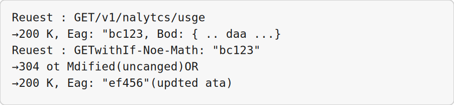
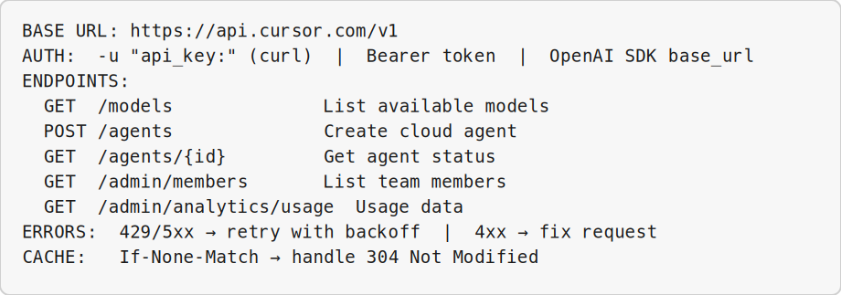

<!-- _class: lead -->

# Cursor API Foundations

## Module 7 · Day 2 (Concept + Hands-On)

Cursor Training Program · ~60 min


---


<!-- _class: fit-md -->

## Module Overview

| Aspect | Details |
|--------|---------|
| **Duration** | ~60 minutes |
| **Format** | Concept + hands-on exercise |
| **Prerequisites** | Cursor account, basic API familiarity, Python 3.8+ installed |
| **Module Goal** | Understand the Cursor API ecosystem, authenticate securely, handle errors, and optimize requests |


---


## Learning Objectives

By the end of this module, participants will be able to:

- Identify the five Cursor APIs and their use cases
- Generate and securely manage API keys
- Implement rate limit handling and error recovery
- Use ETag caching for efficient repeat queries
- Test authentication by listing available models


---


<!-- _class: fit-md -->

## Agenda

| Lesson | Topic | Time |
|--------|-------|------|
| 7.1 | The Cursor API Landscape | 10 min |
| 7.2 | Authentication | 20 min |
| 7.3 | Rate Limits and Error Handling | 20 min |
| 7.4 | ETag Caching | 18 min |
| 7.5 | Listing Available Models | 10 min |


---


<!-- _class: lead -->

# Lesson 7.1

## The Cursor API Landscape

*Concept · 10 min*


---


<!-- _class: fit-md -->

## The Five APIs

| API | Endpoint | Purpose |
|-----|----------|---------|
| **Chat Completions** | `/v1/chat/completions` | OpenAI-compatible chat interface |
| **Agents** | `/v1/agents` | Create and manage Cloud Agents |
| **Files** | `/v1/files` | Upload/download files for agents |
| **Admin** | `/v1/admin/*` | Team management, analytics, policies |
| **Webhooks** | `/v1/webhooks` | Register and manage webhook endpoints |


---


<!-- _class: fit-sm -->

## API Comparison Matrix

| API | Auth Type | Rate Limit | Cost | Primary Use |
|-----|-----------|------------|------|-------------|
| **Chat Completions** | User or API key | Per-minute token | Pay-per-token | Direct model access |
| **Agents** | User API key | Per-minute requests | Per-run | Long-running tasks |
| **Files** | User API key | Per-minute | Storage | Context upload |
| **Admin** | Admin API key | Higher limits | Included in plan | Team management |
| **Webhooks** | User API key | Per-minute | Free | Notifications |


---


## When to Use Which API

- **Call a model directly** → Chat Completions API (OpenAI-compatible)
- **Run a long task that writes code** → Agents API
- **Manage team usage and limits** → Admin API
- **Be notified when agents complete** → Webhooks API


---


<!-- _class: fit-xs -->

## OpenAI Compatibility

```python
from openai import OpenAI

client = OpenAI(
    base_url="https://api.cursor.com/v1",
    api_key="your-cursor-api-key"
)

response = client.chat.completions.create(
    model="claude-4.6-sonnet",
    messages=[{"role": "user", "content": "Hello!"}]
)
```

**Success Criteria:** Understand five APIs · select correct API · understand OpenAI compatibility


---


<!-- _class: lead -->

# Lesson 7.2

## Authentication

*Concept · 8 min · Exercise · 12 min*


---


<!-- _class: fit-md -->

## Authentication Methods

| Method | Format | When to Use |
|--------|--------|-------------|
| **HTTP Basic** | `-u "api_key:"` | CLI, curl, most SDKs |
| **Bearer Token** | `Authorization: Bearer <key>` | OAuth-style clients |
| **User API Key** | Regular key | Agents, Chat, Files APIs |
| **Admin API Key** | `admin_` prefixed | Admin API only |


---


<!-- _class: fit-md -->

## API Key Types

**User API Key**
- Generated in: Cursor Settings → API Keys
- Format: `cursor_xxxxxxxxxxxx`
- Can access: Agents, Chat, Files, Webhooks

**Admin API Key**
- Generated in: Organization Settings → API Keys
- Format: `cursor_admin_xxxxxxxxxxxx`
- Can access: Admin API + everything User can


---


<!-- _class: fit-md -->

## Security Best Practices

- Never commit API keys to git
- Use environment variables or secret managers
- Rotate keys periodically (every 90 days)
- Use different keys for dev and production
- Revoke unused keys immediately
- Use Admin API keys only when necessary
- Monitor key usage in dashboard


---


<!-- _class: fit-sm -->

## Windows Exercise Environment

All exercises in this module assume **Windows 10/11** with Cursor installed.

| Terminal | Use when | Open in Cursor |
|----------|----------|----------------|
| **PowerShell** | Default — Python, Git, `curl.exe`, npm, Cursor CLI (`agent`) | ``Ctrl+` `` → **PowerShell** |
| **Git Bash** | Bash syntax, `export VAR=...`, shell scripts ending in `.sh` | Terminal menu → **Git Bash** |
| **Command Prompt** | Legacy `.bat` files only | Terminal menu → **Command Prompt** |
| **Ubuntu (WSL)** | Linux-only tools or native bash without Git Bash | Terminal menu → **Ubuntu (WSL)** |

**Agent panel** (``Ctrl+I``) is for prompts and tool use · **Chat** (``Ctrl+L``) is read-only Q&A.

**Set default profile:** Settings → `terminal.integrated.defaultProfile.windows` → **PowerShell**


---


## Exercise 7.2 — Steps 1–3

**Platform:** Windows 10/11 · **PowerShell** for API · `$env:VAR` · `curl.exe`


**Step 1:** Generate User API Key — **Where:** **Cursor app** → **Settings** → **API Keys** → **Generate New Key** (copy the key; you will not see it again)


---


## Exercise 7.2 — Steps 1–3 (Part 2)

**Step 2:** Set environment variable — **Terminal:** **PowerShell** (``Ctrl+` ``)

```powershell
$env:CURSOR_USER_API_KEY = "cursor_xxxxxxxxxxxx"
$env:CURSOR_USER_API_KEY
```


---


## Exercise 7.2 — Steps 1–3 (Part 3)

**Step 3:** Test with curl — **Terminal:** **PowerShell**

```powershell
curl.exe -s -u "$($env:CURSOR_USER_API_KEY):" `
  https://api.cursor.com/v1/models | Select-Object -First 20
```


---


<!-- _class: fit-md -->

## Exercise 7.2 — Steps 4–5

**Platform:** Windows 10/11 · **PowerShell** for API · `$env:VAR` · `curl.exe`


**Step 4:** Test with Python requests:
**Terminal:** **PowerShell** — save as `test_models.py`, then `python test_models.py` — ``Ctrl+L``

```python
response = requests.get(
    "https://api.cursor.com/v1/models",
    auth=(API_KEY, "")  # Empty password
)
```


---


<!-- _class: fit-sm -->

## Exercise 7.2 — Steps 4–5 (Part 2)

**Step 5:** Test with OpenAI SDK:
**Terminal:** **PowerShell** — `python test_openai_sdk.py` — ``Ctrl+L``

```python
client = OpenAI(base_url="https://api.cursor.com/v1", api_key=API_KEY)
response = client.chat.completions.create(
    model="gpt-5-mini",
    messages=[{"role": "user", "content": "Say 'API works!'"}],
    max_tokens=10
)
```


---


<!-- _class: fit-md -->

## Exercise 7.2 — Steps 6–7

**Platform:** Windows 10/11 · **PowerShell** for API · `$env:VAR` · `curl.exe`


**Step 6:** Generate and test Admin API Key:
**Terminal:** **PowerShell** — unless step notes Git Bash or WSL

```bash
export CURSOR_ADMIN_API_KEY="cursor_admin_xxxxxxxxxxxx"
curl -s -u "$CURSOR_ADMIN_API_KEY:" \
  https://api.cursor.com/v1/admin/organization | jq '.'
```


---


## Exercise 7.2 — Steps 6–7 (Part 2)

**Step 7:** Revoke compromised keys via API or Settings → API Keys → Revoke
**Terminal:** **PowerShell** — unless step notes Git Bash or WSL

**Success Criteria:** Generated keys · tested curl, Python, OpenAI SDK · tested Admin key


---


<!-- _class: lead -->

# Lesson 7.3

## Rate Limits and Error Handling

*Concept · 10 min · Exercise · 10 min*


---


<!-- _class: fit-md -->

## Rate Limits by API

| API | Limit | Window |
|-----|-------|--------|
| Chat Completions | 1000 requests | per minute |
| Chat Completions (tokens) | 500k tokens | per minute |
| Agents (create) | 100 requests | per minute |
| Admin API | 500 requests | per minute |
| Webhooks | 2000 requests | per minute |


---


<!-- _class: fit-sm -->

## HTTP Status Codes to Handle

| Code | Meaning | Action |
|------|---------|--------|
| **200** | Success | Process response |
| **400** | Bad Request | Fix request parameters |
| **401** | Unauthorized | Check API key |
| **403** | Forbidden | Check permissions |
| **429** | Too Many Requests | Implement backoff |
| **500/503** | Server Error | Retry with backoff |


---


<!-- _class: fit-md -->

## Rate Limit Headers

| Header | Description | Example |
|--------|-------------|---------|
| `X-RateLimit-Limit` | Max requests per window | `1000` |
| `X-RateLimit-Remaining` | Requests left | `942` |
| `X-RateLimit-Reset` | Window reset (Unix timestamp) | `1700000000` |
| `Retry-After` | Seconds to wait (on 429) | `60` |


---


<!-- _class: fit-xs -->

## Exercise 7.3 — Exponential Backoff

**Platform:** Windows 10/11 · **PowerShell** for API · `$env:VAR` · `curl.exe`

```python
def call_with_retry(url, max_retries=5, base_delay=1.0):
    for attempt in range(max_retries):
        response = requests.get(url, auth=AUTH)
        if response.status_code == 200:
            return response.json()
        if 400 <= response.status_code < 500:
            return None  # Don't retry client errors
        if response.status_code in [429, 500, 502, 503, 504]:
            delay = int(response.headers.get('Retry-After',
                      min(base_delay * (2 ** attempt), 60)))
            time.sleep(delay)
    return None
```


---


## Exercise 7.3 — Rate Limiter & Client

**Demonstration (Windows):** **PowerShell** terminal (``Ctrl+` ``) · Agent panel ``Ctrl+I`` · shortcuts use **Ctrl**

**Monitor headers:** warn when `X-RateLimit-Remaining` < 10% of limit

**Token bucket rate limiter:** space requests evenly across the minute window

**CursorAPIClient:** combines rate limiting, retries on 429/5xx, timeout handling, and typed methods like `get_models()` and `create_agent()`

**Success Criteria:** Backoff · header monitoring · rate limiter · robust client class


---


<!-- _class: lead -->

# Lesson 7.4

## ETag Caching

*Concept · 8 min · Exercise · 10 min*


---


## What Are ETags?

ETags are unique identifiers for API response versions.

1. Send `If-None-Match` header with previous ETag
2. Server returns `304 Not Modified` if unchanged
3. No data transfer, no rate limit consumption


---


<!-- _class: fit-sm -->

## ETag Flow




---


<!-- _class: fit-md -->

## Endpoints Supporting ETags

| Endpoint | ETag Support | Cache Freshness |
|----------|--------------|-----------------|
| `/v1/models` | ✅ Yes | Changes rarely |
| `/v1/admin/members` | ✅ Yes | Changes occasionally |
| `/v1/agents/{id}` | ✅ Yes | Changes during run |
| `/v1/analytics/usage` | ✅ Yes | Daily changes |
| `/v1/agents` (list) | ⚠️ Partial | Changes frequently |


---


<!-- _class: fit-xs -->

## Exercise 7.4 — Basic ETag Usage

**Platform:** Windows 10/11 · **PowerShell** for API · `$env:VAR` · `curl.exe`

```python
def get_with_etag(url, previous_etag=None):
    headers = {'If-None-Match': previous_etag} if previous_etag else {}
    response = requests.get(url, auth=AUTH, headers=headers)

    if response.status_code == 304:
        return None, response.headers.get('ETag')  # Use cached data
    if response.status_code == 200:
        return response.json(), response.headers.get('ETag')
```


---


## Exercise 7.4 — ETagCache & CachedClient

**Demonstration (Windows):** **PowerShell** terminal (``Ctrl+` ``) · Agent panel ``Ctrl+I`` · shortcuts use **Ctrl**

**ETagCache:** persistent pickle-based cache keyed by URL hash

**CachedCursorClient:**
- Check local cache → send `If-None-Match`
- On 304 → return cached data (Cache HIT)
- On 200 → update cache (Cache MISS)

**Batch analytics:** fetch 30 days of usage — unchanged days return 304 instantly

**Success Criteria:** Basic ETag request · persistent cache · analytics workload caching


---


<!-- _class: lead -->

# Lesson 7.5

## Listing Available Models

*Concept · 4 min · Exercise · 6 min*


---


<!-- _class: fit-md -->

## The Models Endpoint

```bash
GET /v1/models
```

**Response includes:**
- Model ID · Display name · Context window size
- Pricing (input/output per 1M tokens)
- Capabilities (vision, tool calling, etc.)

> *"Simplest API call — perfect for verifying your API key works."*


---


## Exercise 7.5 — Steps 1–2

**Platform:** Windows 10/11 · **PowerShell** for API · `$env:VAR` · `curl.exe`


**Step 1:** List with curl:
**Terminal:** **PowerShell** — ``Ctrl+` `` in Cursor

```bash
curl -s -u "$CURSOR_USER_API_KEY:" \
  https://api.cursor.com/v1/models \
  | jq '.data[] | {id: .id, context: .context_window, input_price: .pricing.input}'
```


---


## Exercise 7.5 — Steps 1–2 (Part 2)

**Step 2:** Format with Python tabulate — Model ID, Context, Input/Output Price, Vision support
**Terminal:** **PowerShell** — `python script.py`


---


<!-- _class: fit-sm -->

## Exercise 7.5 — Steps 3–4

**Platform:** Windows 10/11 · **PowerShell** for API · `$env:VAR` · `curl.exe`


**Step 3:** Filter models:
**Terminal:** **PowerShell** — unless step notes Git Bash or WSL

```python
# Models with 100k+ context
large_context = [m for m in models if m.get('context_window', 0) >= 100000]

# Cheapest by input price
cheapest = sorted(models, key=lambda x: x['pricing']['input'])[:5]
```


---


## Exercise 7.5 — Steps 3–4 (Part 2)

**Step 4:** Model selection helper:
**Terminal:** **PowerShell** — unless step notes Git Bash or WSL

```python
select_model("code_review", "balanced")  # → claude-4.6-sonnet
select_model("simple_fix", "low")        # → gpt-5-mini
select_model("frontend_ui", "high")      # → gemini-3.1-pro
```


---


<!-- _class: fit-md -->

## Module Summary

| Lesson | Topic | Key Skill |
|--------|-------|-----------|
| 7.1 | API Landscape | API selection |
| 7.2 | Authentication | Key management |
| 7.3 | Rate Limits & Errors | Robust clients |
| 7.4 | ETag Caching | Efficient queries |
| 7.5 | Listing Models | Auth smoke-test |


---


<!-- _class: fit-sm -->

## Quick Reference Card




---


<!-- _class: lead -->

# Up Next: Module 8

## Cloud Agents API and Webhooks

> Now that you understand API foundations, **Module 8** covers programmatically creating agents, streaming responses, and setting up notifications.

*End of Module 7*


