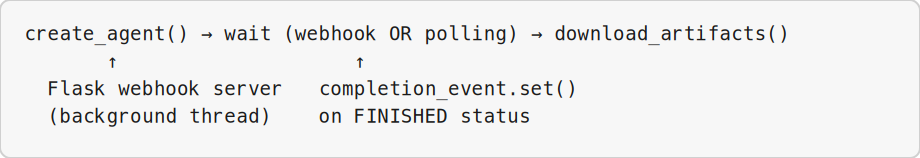
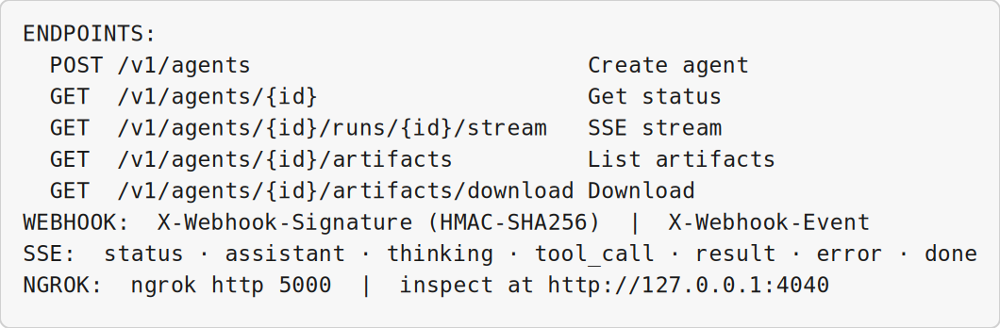

<!-- _class: lead -->

# Cloud Agents API and Webhooks

## Module 8 · Day 2 (Hands-On)

Cursor Training Program · ~60 min


---


<!-- _class: fit-md -->

## Module Overview

| Aspect | Details |
|--------|---------|
| **Duration** | ~60 minutes |
| **Format** | Hands-on exercise |
| **Prerequisites** | User API key (Module 7), Python 3.8+, ngrok installed, GitHub repository |
| **Module Goal** | Programmatically create, stream, and manage Cloud Agents, and set up webhook notifications |


---


## Learning Objectives

By the end of this module, participants will be able to:

- Create a Cloud Agent programmatically using the API
- Stream agent responses in real-time using SSE with resume support
- List and download artifacts from a completed agent
- Create a webhook endpoint with HMAC verification
- Test webhooks locally using ngrok
- Build an end-to-end automated agent workflow


---


<!-- _class: fit-sm -->

## Agenda

| Lesson | Topic | Time |
|--------|-------|------|
| 8.1 | Creating a Cloud Agent Programmatically | 15 min |
| 8.2 | Streaming Agent Responses (SSE) | 15 min |
| 8.3 | Listing and Downloading Artifacts | 15 min |
| 8.4 | Creating a Webhook Endpoint | 15 min |
| 8.5 | Testing Webhooks Locally with ngrok | 13 min |
| 8.6 | End-to-End Automated Agent Workflow | 17 min |


---


<!-- _class: lead -->

# Lesson 8.1

## Creating a Cloud Agent Programmatically

*Concept · 5 min · Exercise · 10 min*

**Lab guide:** [`Exercise 8.1](../slide-exercises/module-08/exercise-8.1-create-a-cloud-agent-via-api.md)


---


## Agent + Runs

| Concept | Description |
|---------|-------------|
| **Agent** | Durable entity with conversation history and workspace state |
| **Run** | Single execution (one prompt/response cycle) |

**Key endpoint:** `POST /v1/agents`


---


## Request Fields

**Required:**

| Field | Example |
|-------|---------|
| `prompt.text` | "Add a README.md file" |
| `repos[].url` | "https://github.com/org/repo" |

**Optional:** `autoCreatePR` · `model.id` · `webhookUrl` · `webhookSecret`


---


<!-- _class: fit-sm -->

## Windows Exercise Environment

All exercises in this module assume **Windows 10/11** with Cursor installed.

| Terminal | Use when | Open in Cursor |
|----------|----------|----------------|
| **PowerShell** | Default — Python, Git, `curl.exe`, npm, Cursor CLI (`agent`) | ``Ctrl+` `` → **PowerShell** |
| **Git Bash** | Bash syntax, `export VAR=...`, shell scripts ending in `.sh` | Terminal menu → **Git Bash** |
| **Command Prompt** | Legacy `.bat` files only | Terminal menu → **Command Prompt** |
| **Ubuntu (WSL)** | Linux-only tools or native bash without Git Bash | Terminal menu → **Ubuntu (WSL)** |

**Agent panel** (``Ctrl+I``) is for prompts and tool use · **Chat** (``Ctrl+L``) is read-only Q&A.

**Set default profile:** Settings → `terminal.integrated.defaultProfile.windows` → **PowerShell**


---


<!-- _class: fit-xs -->

## Exercise 8.1 — Create with curl

**Platform:** Windows 10/11 · **PowerShell** for API · `$env:VAR` · `curl.exe`

**Step 1 — set API key · Terminal:** **PowerShell**

```powershell
$env:CURSOR_USER_API_KEY = "cursor_xxxxxxxxxxxx"
```

**Step 2 — create agent · Terminal:** **PowerShell**

```powershell
curl.exe -X POST https://api.cursor.com/v1/agents `
  -u "$($env:CURSOR_USER_API_KEY):" `
  -H "Content-Type: application/json" `
  -d '{"prompt":{"text":"Add a README.md file with setup instructions"},"repos":[{"url":"https://github.com/YOUR_ORG/YOUR_REPO","startingRef":"main"}],"autoCreatePR":true}' `
  | ConvertFrom-Json
```

**Terminal (alternative):** **Git Bash** / **WSL** — bash block below.

```bash
export CURSOR_USER_API_KEY="cursor_xxxxxxxxxxxx"
curl -X POST https://api.cursor.com/v1/agents   -u "$CURSOR_USER_API_KEY:"   -H "Content-Type: application/json"   -d '{"prompt":{"text":"Add a README.md file with setup instructions"},"repos":[{"url":"https://github.com/YOUR_ORG/YOUR_REPO","startingRef":"main"}],"autoCreatePR":true}' | jq '.'
```


---


<!-- _class: fit-sm -->

## Exercise 8.1 — Capture IDs

**Platform:** Windows 10/11 · **PowerShell** for API · `$env:VAR` · `curl.exe`


**Step 1:** Save the JSON from the create-agent call — **Terminal:** **PowerShell**

```powershell
$response = curl.exe ... | ConvertFrom-Json   # reuse create-agent command
$env:AGENT_ID = $response.agent.id
$env:RUN_ID = $response.run.id
Write-Host "Agent ID: $($env:AGENT_ID)"
Write-Host "Dashboard: https://cursor.com/agents/$($env:AGENT_ID)"
```


---


## Exercise 8.1 — Capture IDs (Part 2)

**Step 2:** Optional model override in create payload — **Where:** edit JSON before POST (any terminal)

Create with specific model: `"model": {"id": "claude-4.7-opus"}`


---


<!-- _class: fit-xs -->

## Exercise 8.1 — Python Helper

**Platform:** Windows 10/11 · **PowerShell** for API · `$env:VAR` · `curl.exe`

```python
def create_agent(prompt, repo_url, auto_create_pr=False, model=None):
    payload = {
        "prompt": {"text": prompt},
        "repos": [{"url": repo_url}],
        "autoCreatePR": auto_create_pr
    }
    if model:
        payload["model"] = {"id": model}
    response = requests.post(f"{BASE_URL}/agents", auth=AUTH, json=payload)
    data = response.json()
    return data["agent"]["id"], data["run"]["id"]
```

**Success Criteria:** Agent created · IDs captured · appears in dashboard · Python function works


---


<!-- _class: lead -->

# Lesson 8.2

## Streaming Agent Responses (SSE)

*Concept · 5 min · Exercise · 10 min*

**Lab guide:** [`Exercise 8.2](../slide-exercises/module-08/exercise-8.2-stream-agent-responses-sse.md)


---


<!-- _class: fit-sm -->

## SSE Event Types

| Event | When It Happens | Data Example |
|-------|-----------------|--------------|
| `status` | Run status changes | `{"status":"RUNNING"}` |
| `assistant` | Agent speaks | `{"text":"I'll read the file..."}` |
| `thinking` | Agent is reasoning | `{"text":"Let me consider..."}` |
| `tool_call` | Agent uses a tool | `{"name":"read_file","status":"started"}` |
| `result` | Run completes | `{"status":"FINISHED"}` |
| `error` | Something went wrong | `{"message":"..."}` |
| `done` | Stream ends | `{}` |


---


## Resume Support

SSE streams support the **`Last-Event-ID`** header — if your connection drops, resume from the last received event.


---


<!-- _class: fit-md -->

## Exercise 8.2 — Stream with curl

**Platform:** Windows 10/11 · **PowerShell** for API · `$env:VAR` · `curl.exe`

**Terminal:** **PowerShell**

```powershell
curl.exe -N -u "$($env:CURSOR_USER_API_KEY):" `
  -H "Accept: text/event-stream" `
  "https://api.cursor.com/v1/agents/$env:AGENT_ID/runs/$env:RUN_ID/stream"
```

Set IDs first: `$env:AGENT_ID = "..."` · `$env:RUN_ID = "..."`

**Terminal (alternative):** **Git Bash** / **WSL** — bash `curl -N` block above.

Parse lines starting with `event:` and `data:` — print assistant text, tool calls, and result status.


---


<!-- _class: fit-xs -->

## Exercise 8.2 — Python SSE Client

**Platform:** Windows 10/11 · **PowerShell** for API · `$env:VAR` · `curl.exe`

```python
def stream_agent_response(agent_id, run_id, on_event=None):
    url = f"{BASE_URL}/agents/{agent_id}/runs/{run_id}/stream"
    response = requests.get(url, auth=AUTH, stream=True)
    for line in response.iter_lines():
        if line.startswith(b'event:'):
            current_event = line[6:].strip().decode()
        elif line.startswith(b'data:'):
            data = json.loads(line[5:].strip())
            if on_event:
                on_event(current_event, data)
```


---


## Exercise 8.2 — ResumableSSEClient

**Demonstration (Windows):** **PowerShell** terminal (``Ctrl+` ``) · Agent panel ``Ctrl+I`` · shortcuts use **Ctrl**

Track `last_event_id` from `id:` lines → send as `Last-Event-ID` header on reconnect

**Also:** `stream_to_file()` saves full SSE log for later review

**Success Criteria:** Stream connected · received events · Python client works · resume implemented


---


<!-- _class: lead -->

# Lesson 8.3

## Listing and Downloading Artifacts

*Concept · 5 min · Exercise · 10 min*

**Lab guide:** [`Exercise 8.3](../slide-exercises/module-08/exercise-8.3-list-and-download-artifacts.md)


---


## Key Endpoints

| Endpoint | Method | Purpose |
|----------|--------|---------|
| `/v1/agents/{id}/artifacts` | GET | List all artifacts |
| `/v1/agents/{id}/artifacts/download` | GET | Get presigned URL for download |

**Important:** Download URLs expire after **15 minutes**.


---


<!-- _class: fit-xs -->

## Exercise 8.3 — Wait & List

**Platform:** Windows 10/11 · **PowerShell** for API · `$env:VAR` · `curl.exe`

```python
def wait_for_completion(agent_id, timeout=300, poll_interval=5):
    while time.time() - start < timeout:
        status = get_agent_status(agent_id).get('status')
        if status == 'FINISHED': return True
        elif status == 'ERROR': return False
        time.sleep(poll_interval)

def list_artifacts(agent_id):
    response = requests.get(f"{BASE_URL}/agents/{agent_id}/artifacts", auth=AUTH)
    return response.json().get('items', [])
```


---


<!-- _class: fit-xs -->

## Exercise 8.3 — Download

**Platform:** Windows 10/11 · **PowerShell** for API · `$env:VAR` · `curl.exe`

**Single artifact:**

```python
response = requests.get(
    f"{BASE_URL}/agents/{agent_id}/artifacts/download",
    auth=AUTH, params={"path": artifact_path}
)
download_url = response.json().get('url')
# curl download_url → save to disk
```

**All artifacts:** loop items, create subdirs, download each via presigned URL


---


<!-- _class: fit-md -->

## Exercise 8.3 — CI Integration

**Platform:** Windows 10/11 · **PowerShell** for API · `$env:VAR` · `curl.exe`

```python
def process_test_results(agent_id):
    wait_for_completion(agent_id, timeout=600)
    download_artifact(agent_id, "artifacts/junit.xml", "test_results.xml")
    # Parse XML → exit 1 if failures/errors, else exit 0
```

**Success Criteria:** Listed artifacts · downloaded single + all · CI workflow integration


---


<!-- _class: lead -->

# Lesson 8.4

## Creating a Webhook Endpoint

*Concept · 5 min · Exercise · 10 min*

**Lab guide:** [`Exercise 8.4](../slide-exercises/module-08/exercise-8.4-webhooks-and-hmac-verification.md)


---


## Webhook Headers

| Header | Description |
|--------|-------------|
| `X-Webhook-Signature` | HMAC-SHA256 signature for verification |
| `X-Webhook-ID` | Unique delivery ID |
| `X-Webhook-Event` | Event type (`statusChange`) |


---


<!-- _class: fit-xs -->

## Webhook Payload

```json
{
  "event": "statusChange",
  "id": "agent_abc123",
  "status": "FINISHED",
  "source": {"repository": "https://github.com/your-org/your-repo"},
  "target": {"url": "...", "prUrl": "https://github.com/.../pull/123"},
  "summary": "Added README.md and fixed tests"
}
```


---


<!-- _class: fit-sm -->

## Exercise 8.4 — HMAC Verification

**Platform:** Windows 10/11 · **PowerShell** for API · `$env:VAR` · `curl.exe`

```python
def verify_signature(raw_body, signature_header):
    received = signature_header[7:]  # strip "sha256="
    expected = hmac.new(
        WEBHOOK_SECRET.encode(), raw_body, hashlib.sha256
    ).hexdigest()
    return hmac.compare_digest(expected, received)
```

Flask route: verify signature → parse payload → handle FINISHED/ERROR


---


<!-- _class: fit-xs -->

## Exercise 8.4 — Configure Agent

**Platform:** Windows 10/11 · **PowerShell** for API · `$env:VAR` · `curl.exe`

```bash
curl -X POST https://api.cursor.com/v1/agents \
  -u "$CURSOR_USER_API_KEY:" \
  -H "Content-Type: application/json" \
  -d '{
    "prompt": {"text": "Add a CONTRIBUTING.md file"},
    "repos": [{"url": "https://github.com/YOUR_ORG/YOUR_REPO"}],
    "webhookUrl": "https://your-domain.com/webhook/cursor",
    "webhookSecret": "your-secret-here",
    "autoCreatePR": true
  }'
```

**PowerShell (Windows):** Same steps in **PowerShell** — use `$env:NAME = "value"` instead of `export`, and `curl.exe` instead of `curl`.

**Success Criteria:** Server running · signature verified · payload parsed · agent configured


---


<!-- _class: lead -->

# Lesson 8.5

## Testing Webhooks Locally with ngrok

*Concept · 5 min · Exercise · 8 min*

**Lab guide:** [`Exercise 8.5](../slide-exercises/module-08/exercise-8.5-test-webhooks-with-ngrok.md)


---


## What Is ngrok?

Creates a secure tunnel from a public URL to your local server.

- Test webhooks without deploying
- Debug locally · Demo to stakeholders


---


## Exercise 8.5 — Steps 1–3

**Platform:** Windows 10/11 · **PowerShell** for API · `$env:VAR` · `curl.exe`


**Step 1:** Start tunnel:
**Terminal:** **PowerShell** — unless step notes Git Bash or WSL

```bash
ngrok http 5000
# Forwarding: https://abc123.ngrok.io -> http://localhost:5000
```


---


## Exercise 8.5 — Steps 1–3 (Part 2)

**Step 2:** Copy HTTPS URL
**Terminal:** **PowerShell** — unless step notes Git Bash or WSL


---


## Exercise 8.5 — Steps 1–3 (Part 3)

**Step 3:** Create agent with ngrok URL:
**Terminal:** **PowerShell** — ``Ctrl+` `` in Cursor

```bash
curl -X POST https://api.cursor.com/v1/agents ... \
  -d '{"webhookUrl": "https://abc123.ngrok.io/webhook/cursor", ...}'
```


---


## Exercise 8.5 — Inspect & Replay

**Demonstration (Windows):** Agent ``Ctrl+I`` · **PowerShell** · Browser for dashboards

**Step 4:** Inspect requests at `http://127.0.0.1:4040`
**Terminal:** **PowerShell** — unless step notes Git Bash or WSL

**Step 5:** Replay failed webhooks (ngrok premium) — inspect raw body and headers
**Terminal:** **Git Bash** or **Ubuntu (WSL)** — bash syntax required

**Success Criteria:** Tunnel established · webhook received · signature verified · inspected in ngrok UI


---


<!-- _class: lead -->

# Lesson 8.6

## End-to-End Automated Agent Workflow

*Concept · 5 min · Exercise · 12 min*


---


## The Capstone Integration

Combine everything into `automated_workflow.py`:

1. **Create agent** (with optional webhook URL)
2. **Wait for completion** (webhook or polling)
3. **Download artifacts**
4. **Process results** (CI exit codes, notifications)


---


<!-- _class: fit-sm -->

## Workflow Architecture




---


<!-- _class: fit-xs -->

## Run the Workflow

```bash
export CURSOR_USER_API_KEY="cursor_xxxxxxxxxxxx"

python automated_workflow.py \
  --repo "https://github.com/YOUR_ORG/YOUR_REPO" \
  --prompt "Add a comprehensive README.md with setup and API docs" \
  --output "./outputs"

# Polling only (no webhook):
python automated_workflow.py --repo "..." --prompt "..." --no-webhook
```


---


<!-- _class: fit-sm -->

## Workflow Output

```
🚀 CLOUD AGENT AUTOMATED WORKFLOW
📝 Creating agent... Agent ID: agt_abc123
⏳ Waiting for completion...
✅ Webhook received: Agent agt_abc123 completed
📎 Downloaded 3 artifacts to agent_outputs/
✅ WORKFLOW COMPLETE
```

**Success Criteria:** Creates agent · waits (webhook/polling) · downloads artifacts · end-to-end run


---


<!-- _class: fit-sm -->

## Module Summary

| Lesson | Topic | Key Skill |
|--------|-------|-----------|
| 8.1 | Creating a Cloud Agent | Programmatic agent launch |
| 8.2 | Streaming Agent Responses | SSE with resume support |
| 8.3 | Listing and Downloading Artifacts | CI pipeline integration |
| 8.4 | Creating a Webhook Endpoint | HMAC verification |
| 8.5 | Testing Webhooks with ngrok | Local tunnel debugging |
| 8.6 | End-to-End Workflow | Complete automation |


---


<!-- _class: fit-sm -->

## Quick Reference Card




---


<!-- _class: lead -->

# Up Next: Module 9

## Admin and Analytics APIs

> Now that you can programmatically launch and monitor agents, **Module 9** covers team management and usage insights.

*End of Module 8*


