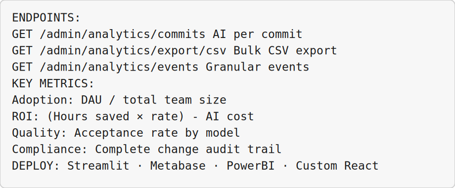

<!-- _class: lead -->

# AI Code Tracking and Reporting

## Module 10 · Day 2 (Hands-On + Take-Home Project)

Cursor Training Program · ~20 min + take-home


---


<!-- _class: fit-md -->

## Module Overview

| Aspect | Details |
|--------|---------|
| **Duration** | ~20 minutes (plus take-home project) |
| **Format** | Hands-on exercise + take-home project |
| **Prerequisites** | Admin API key, Git repository access, Modules 8–9 completed |
| **Module Goal** | Track AI vs. human contributions, export metrics to BI tools, build compliance dashboards |


---


## Learning Objectives

By the end of this module, participants will be able to:

- Attribute AI vs. human contributions per commit
- Stream metrics to BI tools via CSV export
- Access granular AI change events for compliance
- Build a complete reporting dashboard combining all data sources


---


<!-- _class: fit-md -->

## Agenda

| Lesson | Topic | Time |
|--------|-------|------|
| 10.1 | AI Commit Metrics | 8 min |
| 10.2 | Bulk Export via CSV Streaming | 7 min |
| 10.3 | Granular AI Change Events | 7 min |
| 10.4 | Reporting Dashboard Architecture | 4 min + take-home |


---


<!-- _class: lead -->

# Lesson 10.1

## AI Commit Metrics

*Concept · 3 min · Exercise · 5 min*

**Lab guide:** [`Exercise 10.1](../slide-exercises/module-10/exercise-10.1-ai-commit-metrics.md)


---


## Key Endpoint

`GET /v1/admin/analytics/commits`

**What this measures:**
- Lines added by AI vs. human
- Files modified by agent vs. manual
- Commit-level attribution · Per-developer breakdown

> *"The 'ROI of AI' metric — how much code was AI-generated vs. human-written."*


---


<!-- _class: fit-sm -->

## Windows Exercise Environment

All exercises in this module assume **Windows 10/11** with Cursor installed.

| Terminal | Use when | Open in Cursor |
|----------|----------|----------------|
| **PowerShell** | Default — Python, Git, `curl.exe`, npm, Cursor CLI (`agent`) | ``Ctrl+` `` → **PowerShell** |
| **Git Bash** | Bash syntax, `export VAR=...`, shell scripts ending in `.sh` | Terminal menu → **Git Bash** |
| **Command Prompt** | Legacy `.bat` files only | Terminal menu → **Command Prompt** |
| **Ubuntu (WSL)** | Linux-only tools or native bash without Git Bash | Terminal menu → **Ubuntu (WSL)** |

**Agent panel** (``Ctrl+I``) is for prompts and tool use · **Chat** (``Ctrl+L``) is read-only Q&A.

**Set default profile:** Settings → `terminal.integrated.defaultProfile.windows` → **PowerShell**


---


<!-- _class: fit-md -->

## Exercise 10.1 — Fetch Metrics

**Platform:** Windows 10/11 · **PowerShell** for API · `$env:VAR` · `curl.exe`

```bash
END=$(date +%Y-%m-%d)
START=$(date -d "30 days ago" +%Y-%m-%d)

curl -s -u "$CURSOR_ADMIN_API_KEY:" \
  ".../analytics/commits?startDate=$START&endDate=$END&repo=https://github.com/YOUR_ORG/YOUR_REPO" \
  | jq '.'
```

**PowerShell (Windows):** Same steps in **PowerShell** — use `$env:NAME = "value"` instead of `export`, and `curl.exe` instead of `curl`.


---


<!-- _class: fit-xs -->

## Exercise 10.1 — AI Contribution %

**Platform:** Windows 10/11 · **PowerShell** for API · `$env:VAR` · `curl.exe`

```bash
curl -s -u "$CURSOR_ADMIN_API_KEY:" \
  ".../analytics/commits?startDate=$START&endDate=$END" \
  | jq '{
      total_commits: .summary.totalCommits,
      ai_commits: .summary.aiAuthoredCommits,
      ai_percentage: (.summary.aiAuthoredCommits / .summary.totalCommits * 100),
      lines_saved: .summary.aiGeneratedLines
    }'
```

**PowerShell (Windows):** Same steps in **PowerShell** — use `$env:NAME = "value"` instead of `export`, and `curl.exe` instead of `curl`.


---


<!-- _class: fit-md -->

## Exercise 10.1 — ROI Analysis

**Demonstration (Windows):** **PowerShell** terminal (``Ctrl+` ``) · Agent panel ``Ctrl+I`` · shortcuts use **Ctrl**

Python `calculate_ai_roi()`:

```
AI-generated lines vs. human-written lines (%)
Estimated time saved (10 lines/min assumption)
Estimated cost saved ($100/hr developer cost)
AI usage cost → Net ROI
```

`contributor_breakdown()` — AI %, AI lines, commits per developer

**Success Criteria:** Retrieved metrics · calculated AI % · generated ROI analysis


---


<!-- _class: lead -->

# Lesson 10.2

## Bulk Export via CSV Streaming

*Concept · 3 min · Exercise · 4 min*

**Lab guide:** [`Exercise 10.2](../slide-exercises/module-10/exercise-10.2-bulk-export-via-csv-streaming.md)


---


## Key Endpoint

`GET /v1/admin/analytics/export/csv` (streaming)

> *"Wire metrics into BI tools (Tableau, PowerBI, Looker, Metabase) without timeouts."*

**Export types:** `commits` · `events` · `usage`


---


<!-- _class: fit-md -->

## Exercise 10.2 — Stream to File

**Platform:** Windows 10/11 · **PowerShell** for API · `$env:VAR` · `curl.exe`

```bash
curl -N -u "$CURSOR_ADMIN_API_KEY:" \
  ".../analytics/export/csv?startDate=$START&endDate=$END&type=commits" \
  -o cursor_commits_export.csv

head -10 cursor_commits_export.csv
```

**PowerShell (Windows):** Same steps in **PowerShell** — use `$env:NAME = "value"` instead of `export`, and `curl.exe` instead of `curl`.


---


<!-- _class: fit-md -->

## Exercise 10.2 — BI Integration

**Platform:** Windows 10/11 · **PowerShell** for API · `$env:VAR` · `curl.exe`

Python `stream_to_dataframe()` → pandas DataFrame:

```python
export_for_bi():
  bi_commits.csv   # commit data
  bi_events.csv    # event data
  bi_usage.csv     # usage data
```

Upload to Metabase, PowerBI, or Tableau via CSV import

**Success Criteria:** Streamed CSV · loaded into DataFrame · created BI-ready files


---


<!-- _class: lead -->

# Lesson 10.3

## Granular AI Change Events

*Concept · 3 min · Exercise · 4 min*

**Lab guide:** [`Exercise 10.3](../slide-exercises/module-10/exercise-10.3-granular-ai-change-events.md)


---


## Key Endpoint

`GET /v1/admin/analytics/events`

**Tracks per event:**
- File, line range, model used, timestamp
- User, accepted/rejected status

> *"Essential for SOC2, ISO, and internal audits."*


---


## Exercise 10.3 — Query Events

**Platform:** Windows 10/11 · **PowerShell** for API · `$env:VAR` · `curl.exe`

```bash
curl -s -u "$CURSOR_ADMIN_API_KEY:" \
  ".../analytics/events?startDate=$START&endDate=$END&limit=100" \
  | jq '.events[] | {user: .user.email, file: .filePath, model: .modelId, accepted: .accepted}'
```

**PowerShell (Windows):** Same steps in **PowerShell** — use `$env:NAME = "value"` instead of `export`, and `curl.exe` instead of `curl`.

Acceptance rate by model: group events → total vs. accepted per model


---


## Exercise 10.3 — Compliance Report

**Demonstration (Windows):** **PowerShell** terminal (``Ctrl+` ``) · Agent panel ``Ctrl+I`` · shortcuts use **Ctrl**

`generate_compliance_report()` for last 90 days:

- Acceptance rate by model (table)
- Top 10 files with most AI changes (needs review)
- Export `compliance_export.csv` for auditors:
  - timestamp, user_email, model_id, file_path, line_start, line_end, accepted

**Success Criteria:** Retrieved events · calculated acceptance rates · compliance export


---


<!-- _class: lead -->

# Lesson 10.4

## Reporting Dashboard Architecture

*Concept · 4 min · Take-Home Project*

**Lab guide:** [`Exercise 10.4](../slide-exercises/module-10/exercise-10.4-reporting-dashboard-architecture.md)

**Lab guide:** [`Exercise 10.4`](../slide-exercises/module-10/exercise-10.4-reporting-dashboard-architecture.md)


---


<!-- _class: fit-md -->

## Exercise 10.4 — Dashboard Components

| Component | Data Source | Purpose |
|-----------|-------------|---------|
| Usage Overview | Usage API | Cost, tokens, active users |
| AI Contribution | Commits API | ROI, adoption metrics |
| Model Performance | Events API | Acceptance rates, efficiency |
| Team Activity | Members API | Onboarding, licensing |
| Compliance | Events + Audit | Audit trail, security |


---


## Exercise 10.4 — Streamlit Dashboard

Run with: `streamlit run cursor_dashboard.py`

**5 panels:**
1. **Executive Summary** — cost, DAU, AI %, team size
2. **Usage Analytics** — daily cost trend (Plotly line chart)
3. **AI Code Impact** — AI vs human bar chart + acceptance by model
4. **Team Management** — member table
5. **Compliance Export** — download events CSV


---


<!-- _class: fit-md -->

## Exercise 10.4 — Deliverables

| Deliverable | Description |
|-------------|-------------|
| **Working dashboard** | Streamlit, Metabase, or custom frontend |
| **Documentation** | Setup instructions and data source descriptions |
| **One insight** | Key finding from your team's data |
| **Export script** | Automated CSV export for compliance |

**Bonus:** cost alerts · spend limit UI · model A/B comparison · cloud deployment


---


<!-- _class: fit-md -->

## Module Summary

| Lesson | Topic | Key Skill |
|--------|-------|-----------|
| 10.1 | AI Commit Metrics | ROI calculation |
| 10.2 | Bulk Export via CSV | BI integration |
| 10.3 | Granular Change Events | Compliance reporting |
| 10.4 | Dashboard Architecture | Complete dashboard |


---


<!-- _class: fit-sm -->

## Quick Reference Card




---


<!-- _class: lead fit-md -->

# Course Complete

## Cursor Training Program — Day 2

**You can now:**
- Create and manage Cloud Agents programmatically
- Stream agent responses with SSE · Webhooks with HMAC verification
- Administer teams and enforce spending policies
- Analyze usage, model adoption, and AI contribution
- Track AI vs. human code changes per commit
- Build reporting dashboards for leadership

**Next steps:** Complete take-home dashboard · set up scheduled exports · implement cost alerts

*End of Module 10 — End of Day 2 Training Program*


